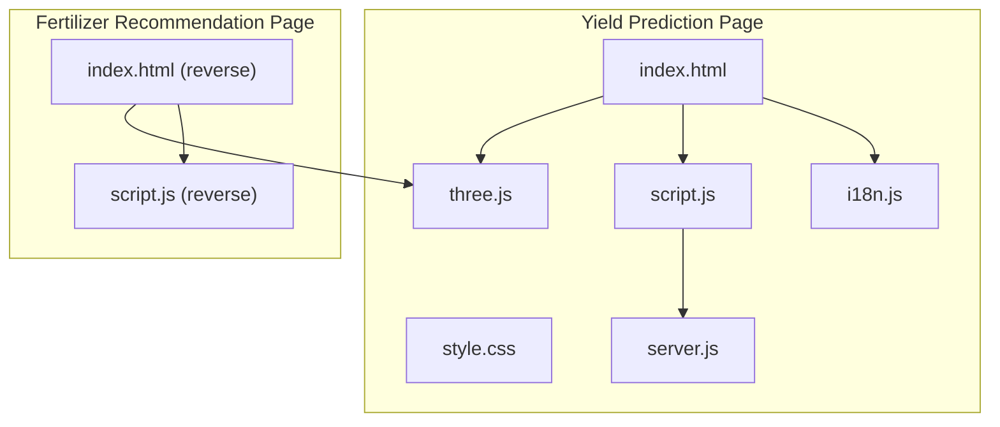
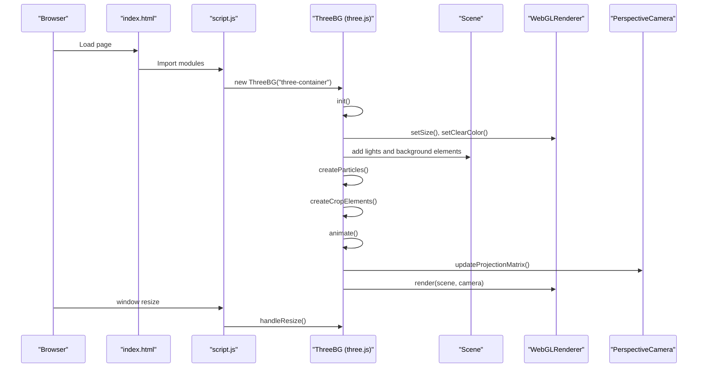
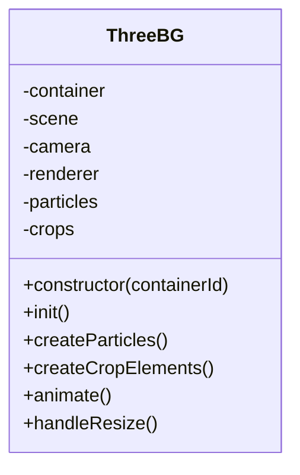
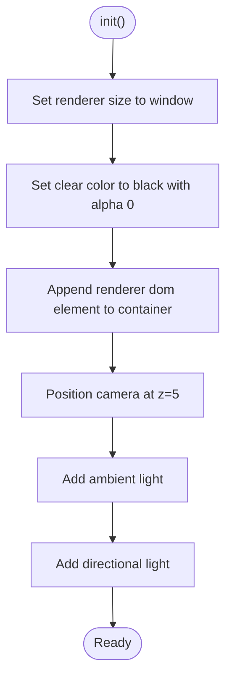
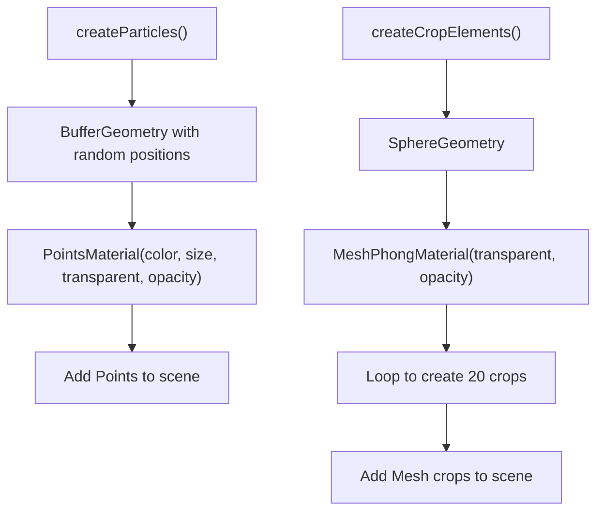
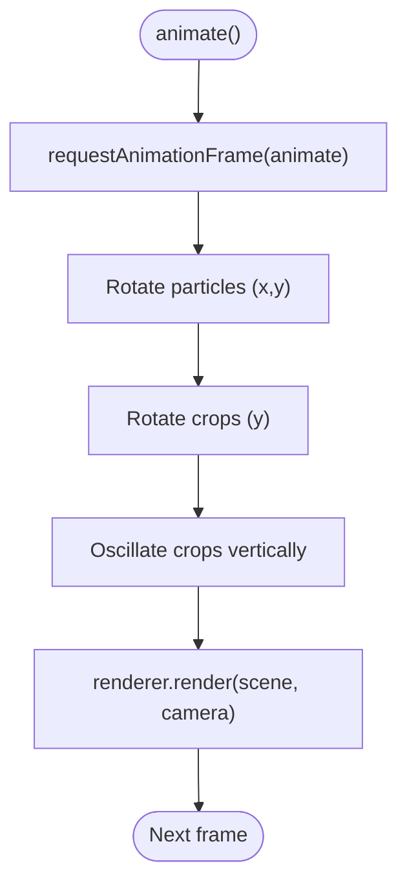
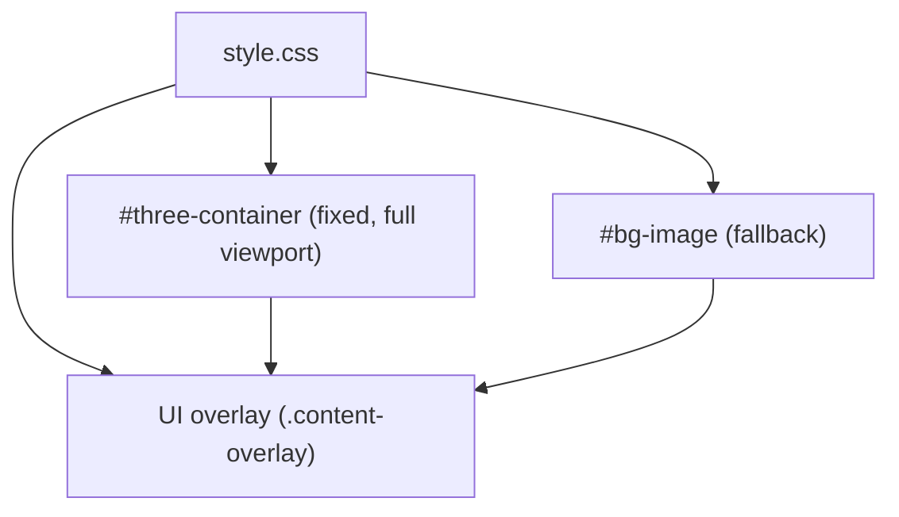
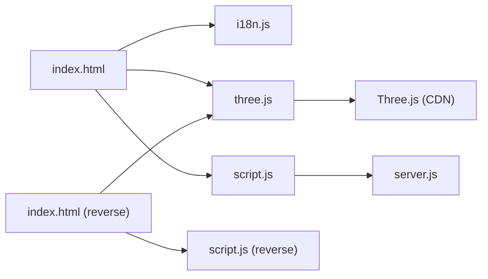

# 3D Visualization System

<cite>
**Referenced Files in This Document**
- [three.js](file://simple webpage/three.js)
- [index.html](file://simple webpage/index.html)
- [style.css](file://simple webpage/style.css)
- [script.js](file://simple webpage/script.js)
- [i18n.js](file://simple webpage/i18n.js)
- [server.js](file://simple webpage/server.js)
- [firebase.js](file://simple webpage/firebase.js)
- [index.html (reverse)](file://simple webpage reverse/index.html)
- [script.js (reverse)](file://simple webpage reverse/script.js)
</cite>

## Table of Contents
1. [Introduction](#introduction)
2. [Project Structure](#project-structure)
3. [Core Components](#core-components)
4. [Architecture Overview](#architecture-overview)
5. [Detailed Component Analysis](#detailed-component-analysis)
6. [Dependency Analysis](#dependency-analysis)
7. [Performance Considerations](#performance-considerations)
8. [Troubleshooting Guide](#troubleshooting-guide)
9. [Conclusion](#conclusion)
10. [Appendices](#appendices)

## Introduction
This document describes the Three.js integration and 3D visualization system used to enhance the user experience of the YieldSmart application. It focuses on the ThreeBG class implementation, scene setup and configuration, geometry and material management, animation loop implementation, and the particle system that creates dynamic background effects. It also covers performance optimization techniques, browser compatibility considerations, fallback mechanisms, customization examples, UI integration, debugging techniques, and the relationship between 3D visualization and user experience.

## Project Structure
The project consists of two primary pages:
- A crop yield prediction page that integrates Three.js for animated 3D backgrounds.
- A fertilizer recommendation page that mirrors the same 3D background system.

Key assets and scripts:
- HTML pages define containers for the 3D canvas and UI overlays.
- CSS ensures the 3D background sits behind the UI while maintaining readability.
- JavaScript initializes Three.js, sets up the scene, and manages animations.
- A shared Three.js module encapsulates the 3D rendering logic.
- Internationalization and UI logic are separated for maintainability.
- A Node.js server provides prediction APIs for the yield predictor.

**Diagram sources**
- [index.html:1-116](file://simple webpage/index.html#L1-L116)
- [style.css:1-173](file://simple webpage/style.css#L1-L173)
- [script.js:1-73](file://simple webpage/script.js#L1-L73)
- [i18n.js:1-122](file://simple webpage/i18n.js#L1-L122)
- [three.js:1-107](file://simple webpage/three.js#L1-L107)
- [server.js:1-68](file://simple webpage/server.js#L1-L68)
- [index.html (reverse):1-98](file://simple webpage reverse/index.html#L1-L98)
- [script.js (reverse):1-64](file://simple webpage reverse/script.js#L1-L64)

**Section sources**
- [index.html:1-116](file://simple webpage/index.html#L1-L116)
- [style.css:1-173](file://simple webpage/style.css#L1-L173)
- [script.js:1-73](file://simple webpage/script.js#L1-L73)
- [i18n.js:1-122](file://simple webpage/i18n.js#L1-L122)
- [three.js:1-107](file://simple webpage/three.js#L1-L107)
- [server.js:1-68](file://simple webpage/server.js#L1-L68)
- [index.html (reverse):1-98](file://simple webpage reverse/index.html#L1-L98)
- [script.js (reverse):1-64](file://simple webpage reverse/script.js#L1-L64)

## Core Components
- ThreeBG class: Encapsulates Three.js initialization, scene setup, lighting, geometry creation, material configuration, and animation loop.
- Scene and renderer: Sets up a perspective camera, WebGL renderer with transparency and antialiasing, and attaches the canvas to the DOM.
- Particle system: Creates a buffer geometry with random positions and renders it as points with a translucent green color.
- Floating crop elements: Adds small mesh spheres representing crops that float gently with synchronized rotation and vertical oscillation.
- Animation loop: Uses requestAnimationFrame to continuously update rotations and positions, then renders the scene.
- Resize handling: Updates camera aspect ratio and renderer size on window resize events.
- UI integration: Initializes ThreeBG on page load and binds resize events to the global window.

**Section sources**
- [three.js:3-18](file://simple webpage/three.js#L3-L18)
- [three.js:20-35](file://simple webpage/three.js#L20-L35)
- [three.js:37-60](file://simple webpage/three.js#L37-L60)
- [three.js:62-82](file://simple webpage/three.js#L62-L82)
- [three.js:84-100](file://simple webpage/three.js#L84-L100)
- [three.js:102-107](file://simple webpage/three.js#L102-L107)
- [index.html:101-113](file://simple webpage/index.html#L101-L113)

## Architecture Overview
The 3D visualization system is modular and reusable across pages. The ThreeBG class manages the lifecycle of the 3D scene, while the HTML pages provide containers and event hooks. The CSS layer ensures the 3D background remains behind the UI overlay for readability.

**Diagram sources**
- [index.html:101-113](file://simple webpage/index.html#L101-L113)
- [script.js:1-73](file://simple webpage/script.js#L1-L73)
- [three.js:3-18](file://simple webpage/three.js#L3-L18)
- [three.js:20-35](file://simple webpage/three.js#L20-L35)
- [three.js:37-60](file://simple webpage/three.js#L37-L60)
- [three.js:62-82](file://simple webpage/three.js#L62-L82)
- [three.js:84-100](file://simple webpage/three.js#L84-L100)
- [three.js:102-107](file://simple webpage/three.js#L102-L107)

## Detailed Component Analysis

### ThreeBG Class Implementation
The ThreeBG class encapsulates the entire 3D rendering pipeline:
- Constructor: Validates container existence, initializes scene, camera, and renderer, then triggers initialization, particle creation, and animation.
- init(): Configures renderer size and clear color, appends the canvas to the container, positions the camera, and adds ambient and directional lighting.
- createParticles(): Generates a buffer geometry with random positions and assigns a points material with transparency and opacity.
- createCropElements(): Creates small mesh spheres representing crops, assigns materials, randomizes positions, and stores per-object metadata for animation.
- animate(): Schedules the next frame, rotates particles around X/Y axes, animates crop meshes with synchronized rotation and vertical oscillation, and renders the scene.
- handleResize(): Recomputes camera aspect ratio and renderer size on window resize.

**Diagram sources**
- [three.js:3-18](file://simple webpage/three.js#L3-L18)
- [three.js:20-35](file://simple webpage/three.js#L20-L35)
- [three.js:37-60](file://simple webpage/three.js#L37-L60)
- [three.js:62-82](file://simple webpage/three.js#L62-L82)
- [three.js:84-100](file://simple webpage/three.js#L84-L100)
- [three.js:102-107](file://simple webpage/three.js#L102-L107)

**Section sources**
- [three.js:3-18](file://simple webpage/three.js#L3-L18)
- [three.js:20-35](file://simple webpage/three.js#L20-L35)
- [three.js:37-60](file://simple webpage/three.js#L37-L60)
- [three.js:62-82](file://simple webpage/three.js#L62-L82)
- [three.js:84-100](file://simple webpage/three.js#L84-L100)
- [three.js:102-107](file://simple webpage/three.js#L102-L107)

### Scene Setup and Configuration
- Scene: A basic Three.js scene holds all 3D objects.
- Camera: Perspective camera with a 75-degree field of view, dynamically adjusted aspect ratio on resize.
- Renderer: WebGL renderer configured with alpha blending and antialiasing; canvas appended to the DOM container.
- Lighting: Ambient light provides base illumination; directional light adds depth and highlights.

**Diagram sources**
- [three.js:20-35](file://simple webpage/three.js#L20-L35)

**Section sources**
- [three.js:20-35](file://simple webpage/three.js#L20-L35)

### Geometry and Material Management
- Particles: Buffer geometry with random positions stored in a Float32Array; rendered as points with a translucent green material.
- Crops: Mesh spheres with Phong material, semi-transparent and slightly translucent for depth perception.
- Materials: Transparent and opacity settings enable layered visual effects without blocking the UI overlay.

**Diagram sources**
- [three.js:37-60](file://simple webpage/three.js#L37-L60)
- [three.js:62-82](file://simple webpage/three.js#L62-L82)

**Section sources**
- [three.js:37-60](file://simple webpage/three.js#L37-L60)
- [three.js:62-82](file://simple webpage/three.js#L62-L82)

### Animation Loop Implementation
- Frame scheduling: requestAnimationFrame calls animate recursively to maintain smooth updates.
- Particle rotation: Slow rotation around X and Y axes for a gentle, organic motion.
- Crop animation: Synchronized rotation and sinusoidal vertical movement using per-crop speed and initial Y offset.
- Rendering: The scene is rendered with the current camera state.

**Diagram sources**
- [three.js:84-100](file://simple webpage/three.js#L84-L100)

**Section sources**
- [three.js:84-100](file://simple webpage/three.js#L84-L100)

### UI Integration and Container Layout
- Container placement: The 3D container is positioned fixed at the full viewport with a negative z-index to stay behind the UI.
- Background image fallback: A semi-transparent background image remains visible when Three.js is active.
- Content overlay: The main UI overlay uses backdrop blur and increased opacity to ensure readability over the 3D background.
- Event binding: On page load, ThreeBG is instantiated and resize events are bound to the window.

**Diagram sources**
- [style.css:5-48](file://simple webpage/style.css#L5-L48)
- [index.html:17-27](file://simple webpage/index.html#L17-L27)
- [index.html:101-113](file://simple webpage/index.html#L101-L113)

**Section sources**
- [style.css:5-48](file://simple webpage/style.css#L5-L48)
- [index.html:17-27](file://simple webpage/index.html#L17-L27)
- [index.html:101-113](file://simple webpage/index.html#L101-L113)

### Customization Examples
- Changing particle count: Adjust the particle count constant and regenerate positions in the particle geometry.
- Modifying particle color and size: Update the points material color and size properties.
- Adding new 3D elements: Create additional geometries and materials, assign userData for animation, and add them to the scene.
- Integrating with UI: Bind ThreeBG initialization to page load and ensure resize handlers are attached to the window.

**Section sources**
- [three.js:37-60](file://simple webpage/three.js#L37-L60)
- [three.js:62-82](file://simple webpage/three.js#L62-L82)
- [index.html:101-113](file://simple webpage/index.html#L101-L113)

## Dependency Analysis
- Module dependencies:
  - index.html imports i18n.js and three.js as ES modules.
  - script.js handles form submission and communicates with the Node.js server.
  - three.js depends on the Three.js library loaded via CDN.
  - server.js provides the prediction endpoint used by script.js.
  - firebase.js initializes Firebase for the reverse page (not used in the main flow).
- Coupling:
  - The ThreeBG class is decoupled from UI logic; it only requires a container ID and exposes lifecycle methods.
  - UI logic is separated into index.html, script.js, and i18n.js.

**Diagram sources**
- [index.html:101-113](file://simple webpage/index.html#L101-L113)
- [i18n.js:1-122](file://simple webpage/i18n.js#L1-L122)
- [three.js:1-1](file://simple webpage/three.js#L1-L1)
- [script.js:1-73](file://simple webpage/script.js#L1-L73)
- [server.js:1-68](file://simple webpage/server.js#L1-L68)
- [index.html (reverse):83-95](file://simple webpage reverse/index.html#L83-L95)
- [script.js (reverse):1-64](file://simple webpage reverse/script.js#L1-L64)

**Section sources**
- [index.html:101-113](file://simple webpage/index.html#L101-L113)
- [script.js:1-73](file://simple webpage/script.js#L1-L73)
- [three.js:1-1](file://simple webpage/three.js#L1-L1)
- [server.js:1-68](file://simple webpage/server.js#L1-L68)
- [index.html (reverse):83-95](file://simple webpage reverse/index.html#L83-L95)
- [script.js (reverse):1-64](file://simple webpage reverse/script.js#L1-L64)

## Performance Considerations
- Rendering optimization:
  - Use antialiasing for smoother edges; consider disabling for lower-end devices if needed.
  - Limit particle count and material complexity to reduce GPU load.
  - Prefer buffer geometries for large datasets to minimize memory overhead.
- Memory management:
  - Dispose of geometries and materials when removing objects from the scene.
  - Avoid frequent re-creation of materials; reuse instances where possible.
- Animation efficiency:
  - Use requestAnimationFrame for smooth, vsync-aligned updates.
  - Minimize per-frame calculations; cache computed values when safe.
- Device compatibility:
  - Test on various GPUs and browsers; adjust quality settings dynamically.
  - Provide fallback visuals (background image) when WebGL is unavailable.
- Resource loading:
  - Lazy-load Three.js and other heavy libraries if the 3D background is optional.
  - Preload textures and assets to avoid runtime stalls.

[No sources needed since this section provides general guidance]

## Troubleshooting Guide
- Canvas not appearing:
  - Verify the container element exists and is visible.
  - Ensure the renderer is appended to the DOM and sized appropriately.
- Poor performance:
  - Reduce particle count or simplify materials.
  - Disable antialiasing or lower resolution on demand.
- Lighting issues:
  - Confirm ambient and directional lights are added and positioned correctly.
- Animation glitches:
  - Check that requestAnimationFrame recursion is intact and camera/projection matrices are updated on resize.
- UI overlap problems:
  - Adjust z-index and overlay opacity/backdrop blur to improve readability.

**Section sources**
- [three.js:3-18](file://simple webpage/three.js#L3-L18)
- [three.js:20-35](file://simple webpage/three.js#L20-L35)
- [three.js:84-100](file://simple webpage/three.js#L84-L100)
- [style.css:5-48](file://simple webpage/style.css#L5-L48)

## Conclusion
The Three.js integration delivers an immersive, lightweight 3D background that enhances the user experience without compromising usability. The ThreeBG class cleanly separates concerns, enabling easy customization and maintenance. With thoughtful performance tuning and fallback strategies, the system provides a polished, accessible experience across devices and browsers.

[No sources needed since this section summarizes without analyzing specific files]

## Appendices

### API Definitions
- Prediction endpoint:
  - Method: POST
  - Path: /predict
  - Headers: Content-Type: application/json
  - Body fields: N, P, K, Temperature, Humidity, Wind_Speed
  - Response: { success: boolean, predicted_yield: number }

**Section sources**
- [server.js:44-64](file://simple webpage/server.js#L44-L64)

### Browser Compatibility and Graceful Degradation
- WebGL availability: If Three.js fails to initialize, rely on the background image fallback to maintain visual continuity.
- Feature detection: Optionally detect WebGL support and conditionally initialize the 3D background.
- Progressive enhancement: Start with a static background image and upgrade to the animated 3D scene when supported.

**Section sources**
- [style.css:16-27](file://simple webpage/style.css#L16-L27)
- [three.js:3-18](file://simple webpage/three.js#L3-L18)

### Debugging Techniques and Performance Profiling
- Console logging: Use warnings and errors for missing containers or initialization failures.
- Frame timing: Measure render time and adjust quality settings accordingly.
- DevTools: Use GPU profiling tools to identify bottlenecks in geometry or materials.
- Animation profiling: Monitor rotation and oscillation calculations for unnecessary recomputation.

**Section sources**
- [three.js:3-18](file://simple webpage/three.js#L3-L18)
- [three.js:84-100](file://simple webpage/three.js#L84-L100)