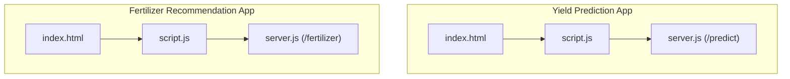
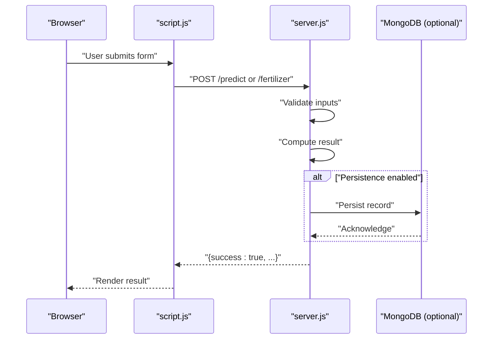
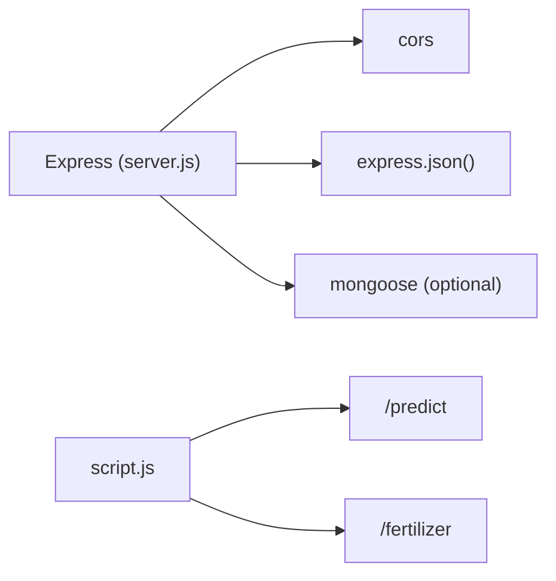

# API Reference

<cite>
**Referenced Files in This Document**
- [server.js](file://simple webpage/server.js)
- [server.js](file://simple webpage reverse/server.js)
- [package.json](file://simple webpage/package.json)
- [package.json](file://simple webpage reverse/package.json)
- [script.js](file://simple webpage/script.js)
- [script.js](file://simple webpage reverse/script.js)
- [index.html](file://simple webpage/index.html)
- [index.html](file://simple webpage reverse/index.html)
</cite>

## Table of Contents
1. [Introduction](#introduction)
2. [Project Structure](#project-structure)
3. [Core Components](#core-components)
4. [Architecture Overview](#architecture-overview)
5. [Detailed Component Analysis](#detailed-component-analysis)
6. [Dependency Analysis](#dependency-analysis)
7. [Performance Considerations](#performance-considerations)
8. [Troubleshooting Guide](#troubleshooting-guide)
9. [Conclusion](#conclusion)
10. [Appendices](#appendices)

## Introduction
This document provides a complete API reference for two RESTful microservices embedded in a dual-application setup:
- Crop Yield Prediction service exposing POST /predict
- Fertilizer Recommendation service exposing POST /fertilizer

It covers request/response schemas, validation rules, CORS configuration, error handling, response formatting, practical examples (curl and JavaScript fetch), common error scenarios, status codes, rate limiting considerations, and security best practices.

## Project Structure
Each application consists of:
- An Express server with CORS enabled and JSON body parsing
- A static frontend served from the same directory
- Optional MongoDB persistence for storing predictions/recommendations
- A small HTML form and a script that consumes the respective endpoints

**Diagram sources**
- [server.js:10-68](file://simple webpage/server.js#L10-L68)
- [server.js:10-65](file://simple webpage reverse/server.js#L10-L65)
- [script.js:1-73](file://simple webpage/script.js#L1-L73)
- [script.js:1-64](file://simple webpage reverse/script.js#L1-L64)
- [index.html:1-116](file://simple webpage/index.html#L1-L116)
- [index.html:1-98](file://simple webpage reverse/index.html#L1-L98)

**Section sources**
- [server.js:10-68](file://simple webpage/server.js#L10-L68)
- [server.js:10-65](file://simple webpage reverse/server.js#L10-L65)
- [package.json:1-15](file://simple webpage/package.json#L1-L15)
- [package.json:1-19](file://simple webpage reverse/package.json#L1-L19)

## Core Components
- Express server with CORS enabled globally
- JSON body parser middleware
- Static file serving for the frontend
- Optional MongoDB persistence for predictions/recommendations
- Two primary endpoints:
  - POST /predict (yield prediction)
  - POST /fertilizer (fertilizer recommendation)

Key behaviors:
- Both servers log endpoint hits
- On success, responses include a success flag and computed results
- Persistence attempts are wrapped in try/catch and logged as warnings on failure

**Section sources**
- [server.js:12-16](file://simple webpage/server.js#L12-L16)
- [server.js:12-16](file://simple webpage reverse/server.js#L12-L16)
- [server.js:44-64](file://simple webpage/server.js#L44-L64)
- [server.js:41-61](file://simple webpage reverse/server.js#L41-L61)

## Architecture Overview
High-level flow:
- Client browser loads the HTML and runs the associated script
- Script sends a POST request to the local server endpoint
- Server validates and computes the result
- Server optionally persists the record to MongoDB
- Server responds with a standardized JSON envelope

**Diagram sources**
- [script.js:13-73](file://simple webpage/script.js#L13-L73)
- [script.js:12-64](file://simple webpage reverse/script.js#L12-L64)
- [server.js:44-64](file://simple webpage/server.js#L44-L64)
- [server.js:41-61](file://simple webpage reverse/server.js#L41-L61)

## Detailed Component Analysis

### Crop Yield Prediction API: POST /predict
Purpose:
- Predict crop yield given crop type, soil type, nutrient levels, and weather conditions.

Endpoint:
- Method: POST
- Path: /predict
- Host: localhost:5000

Request Schema:
- Content-Type: application/json
- Body fields:
  - Crop_Type: string (required)
  - Soil_Type: string (required)
  - N: number (required)
  - P: number (required)
  - K: number (required)
  - Temperature: number (fixed default used by client)
  - Humidity: number (fixed default used by client)
  - Wind_Speed: number (fixed default used by client)

Validation rules:
- All numeric fields must parse to numbers
- Crop_Type and Soil_Type must be non-empty strings
- Temperature, Humidity, Wind_Speed are fixed defaults in the client; server does not enforce them as required fields in the endpoint

Response Schema:
- Success envelope:
  - success: boolean (true)
  - predicted_yield: number

Error handling:
- On persistence failure, a warning is logged and persistence is skipped
- No explicit HTTP error responses are returned; errors are handled internally

Response formatting:
- Always returns a JSON object with success flag and computed value
- No additional metadata fields are included

Example curl:
- curl -X POST http://localhost:5000/predict -H "Content-Type: application/json" -d '{"Crop_Type":"rice","Soil_Type":"Loamy","N":60,"P":40,"K":50,"Temperature":25,"Humidity":60,"Wind_Speed":2}'

Example JavaScript fetch:
- See [script.js:36-42](file://simple webpage/script.js#L36-L42)

Common error scenarios:
- Network connectivity issues to the server
- Server not running on port 5000
- Invalid JSON payload
- Persistence failures (logs a warning; endpoint still returns success)

Status codes:
- 200 OK on success
- 500 Internal Server Error if unhandled exceptions occur

Security considerations:
- CORS is enabled globally; consider scoping origins in production
- No authentication or rate limiting is implemented

**Section sources**
- [server.js:44-64](file://simple webpage/server.js#L44-L64)
- [script.js:20-42](file://simple webpage/script.js#L20-L42)
- [index.html:36-79](file://simple webpage/index.html#L36-L79)

### Fertilizer Recommendation API: POST /fertilizer
Purpose:
- Recommend NPK fertilizer amounts based on crop type, soil type, and target crop yield.

Endpoint:
- Method: POST
- Path: /fertilizer
- Host: localhost:5001

Request Schema:
- Content-Type: application/json
- Body fields:
  - Crop_Type: string (required)
  - Soil_Type: string (required)
  - Crop_Yield: number (required)

Validation rules:
- Crop_Yield must parse to a number
- Crop_Type and Soil_Type must be non-empty strings

Response Schema:
- Success envelope:
  - success: boolean (true)
  - recommended_NPK: object
    - N: number (rounded)
    - P: number (rounded)
    - K: number (rounded)

Error handling:
- On persistence failure, a warning is logged and persistence is skipped
- No explicit HTTP error responses are returned; errors are handled internally

Response formatting:
- Always returns a JSON object with success flag and recommended NPK values
- No additional metadata fields are included

Example curl:
- curl -X POST http://localhost:5001/fertilizer -H "Content-Type: application/json" -d '{"Crop_Type":"rice","Soil_Type":"Loamy","Crop_Yield":80}'

Example JavaScript fetch:
- See [script.js:27-34](file://simple webpage reverse/script.js#L27-L34)

Common error scenarios:
- Network connectivity issues to the server
- Server not running on port 5001
- Invalid JSON payload
- Persistence failures (logs a warning; endpoint still returns success)

Status codes:
- 200 OK on success
- 500 Internal Server Error if unhandled exceptions occur

Security considerations:
- CORS is enabled globally; consider scoping origins in production
- No authentication or rate limiting is implemented

**Section sources**
- [server.js:41-61](file://simple webpage reverse/server.js#L41-L61)
- [script.js:18-34](file://simple webpage reverse/script.js#L18-L34)
- [index.html:33-66](file://simple webpage reverse/index.html#L33-L66)

## Dependency Analysis
- Both servers depend on Express and CORS
- Optional MongoDB integration via Mongoose
- Frontend scripts consume the endpoints via fetch

**Diagram sources**
- [server.js:1-16](file://simple webpage/server.js#L1-L16)
- [server.js:1-16](file://simple webpage reverse/server.js#L1-L16)
- [package.json:10-14](file://simple webpage/package.json#L10-L14)
- [package.json:14-18](file://simple webpage reverse/package.json#L14-L18)

**Section sources**
- [package.json:10-14](file://simple webpage/package.json#L10-L14)
- [package.json:14-18](file://simple webpage reverse/package.json#L14-L18)

## Performance Considerations
- Endpoint computation is lightweight; CPU cost is minimal
- JSON parsing and basic arithmetic dominate runtime
- Persistence to MongoDB is optional and asynchronous; failures are logged and do not block responses
- Consider enabling compression and connection pooling for production deployments

[No sources needed since this section provides general guidance]

## Troubleshooting Guide
Common issues and resolutions:
- Server not reachable:
  - Verify the server is running on the expected port
  - Confirm firewall and network settings
- Invalid JSON payload:
  - Ensure Content-Type is application/json
  - Validate numeric fields and required strings
- Persistence failures:
  - MongoDB may be unavailable; logs indicate skipping persistence
  - Confirm MongoDB is running and accessible
- CORS errors:
  - Global CORS is enabled; restrict origins in production
- Rate limiting:
  - Not implemented; consider adding rate limiting middleware for production

**Section sources**
- [server.js:22-28](file://simple webpage/server.js#L22-L28)
- [server.js:22-28](file://simple webpage reverse/server.js#L22-L28)

## Conclusion
These endpoints provide straightforward prediction and recommendation capabilities with minimal server overhead. For production, add authentication, rate limiting, stricter CORS policies, and robust error responses to improve reliability and security.

[No sources needed since this section summarizes without analyzing specific files]

## Appendices

### CORS Configuration
- Enabled globally via cors() middleware
- Consider scoping allowed origins to specific frontend hosts in production

**Section sources**
- [server.js:12-12](file://simple webpage/server.js#L12-L12)
- [server.js:12-12](file://simple webpage reverse/server.js#L12-L12)

### Response Formatting Standards
- Always include success: boolean
- Include computed result fields (predicted_yield or recommended_NPK)
- No additional metadata fields are present

**Section sources**
- [server.js:63-63](file://simple webpage/server.js#L63-L63)
- [server.js:60-60](file://simple webpage reverse/server.js#L60-L60)

### Practical Examples

#### curl
- Predict yield:
  - curl -X POST http://localhost:5000/predict -H "Content-Type: application/json" -d '{"Crop_Type":"rice","Soil_Type":"Loamy","N":60,"P":40,"K":50,"Temperature":25,"Humidity":60,"Wind_Speed":2}'
- Fertilizer recommendation:
  - curl -X POST http://localhost:5001/fertilizer -H "Content-Type: application/json" -d '{"Crop_Type":"rice","Soil_Type":"Loamy","Crop_Yield":80}'

#### JavaScript fetch
- Predict yield:
  - See [script.js:36-42](file://simple webpage/script.js#L36-L42)
- Fertilizer recommendation:
  - See [script.js:27-34](file://simple webpage reverse/script.js#L27-L34)

**Section sources**
- [script.js:36-42](file://simple webpage/script.js#L36-L42)
- [script.js:27-34](file://simple webpage reverse/script.js#L27-L34)

### Security Best Practices
- Restrict CORS origins to known frontend domains
- Add authentication and authorization checks
- Implement rate limiting to prevent abuse
- Sanitize and validate all inputs rigorously
- Use HTTPS in production environments

[No sources needed since this section provides general guidance]