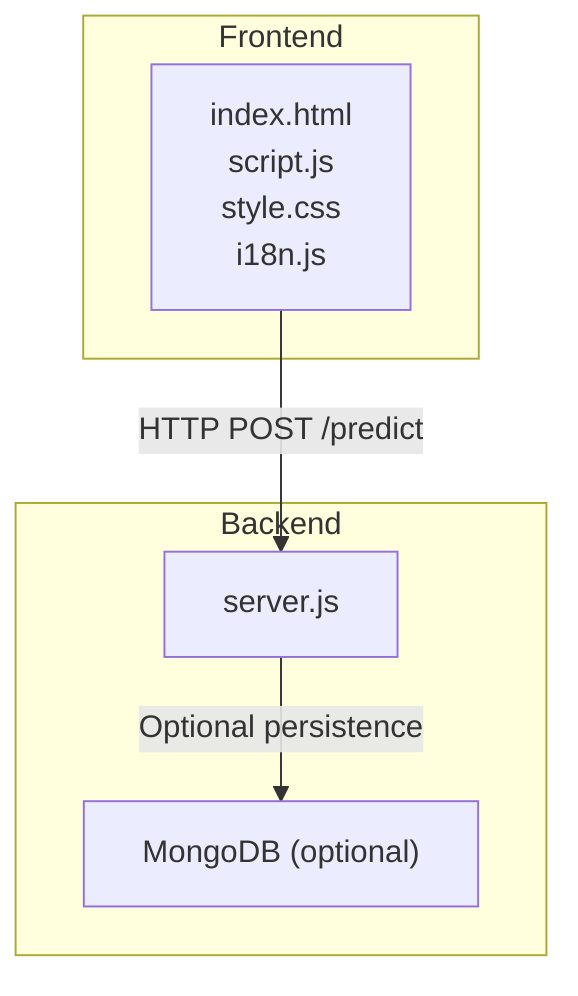
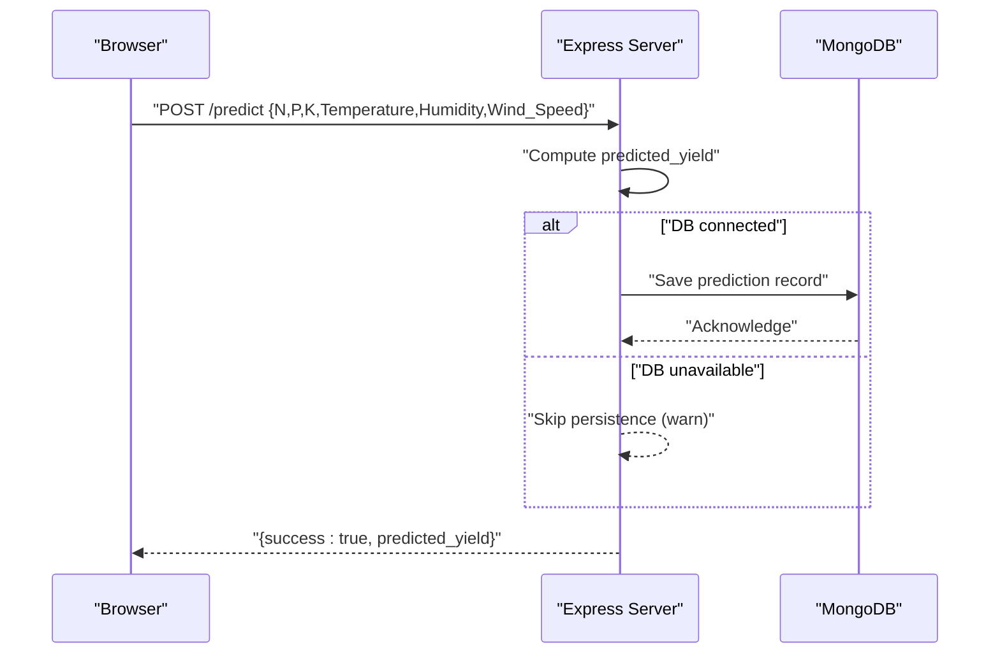
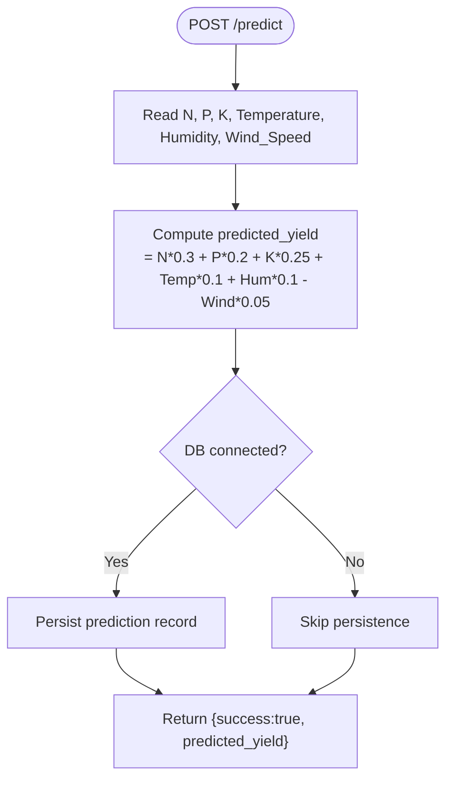
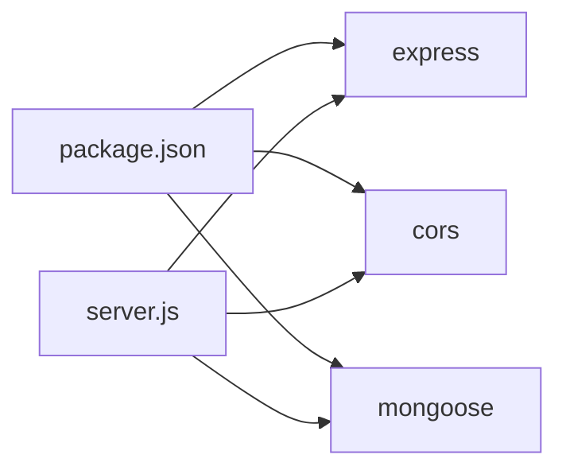

# Crop Yield Prediction API

<cite>
**Referenced Files in This Document**
- [server.js](file://simple webpage/server.js)
- [package.json](file://simple webpage/package.json)
- [script.js](file://simple webpage/script.js)
- [index.html](file://simple webpage/index.html)
- [style.css](file://simple webpage/style.css)
- [i18n.js](file://simple webpage/i18n.js)
</cite>

## Table of Contents
1. [Introduction](#introduction)
2. [Project Structure](#project-structure)
3. [Core Components](#core-components)
4. [Architecture Overview](#architecture-overview)
5. [Detailed Component Analysis](#detailed-component-analysis)
6. [Dependency Analysis](#dependency-analysis)
7. [Performance Considerations](#performance-considerations)
8. [Troubleshooting Guide](#troubleshooting-guide)
9. [Conclusion](#conclusion)
10. [Appendices](#appendices)

## Introduction
This document provides comprehensive API documentation for the crop yield prediction endpoint. It focuses on the POST /predict endpoint, detailing request/response schemas, validation rules, the underlying calculation algorithm, and operational guidance. It also covers CORS configuration, error handling, response formatting, and practical client usage examples using curl and JavaScript fetch.

## Project Structure
The project consists of a single-page web application with a Node.js/Express backend serving predictions and a static frontend. The backend exposes:
- POST /predict: Predicts crop yield based on input factors
- Static assets: HTML, CSS, and client-side scripts for the UI

**Diagram sources**
- [server.js:10-68](file://simple webpage/server.js#L10-L68)
- [script.js:13-73](file://simple webpage/script.js#L13-L73)

**Section sources**
- [server.js:10-68](file://simple webpage/server.js#L10-L68)
- [script.js:13-73](file://simple webpage/script.js#L13-L73)
- [index.html:1-116](file://simple webpage/index.html#L1-L116)
- [style.css:1-173](file://simple webpage/style.css#L1-L173)
- [i18n.js:1-122](file://simple webpage/i18n.js#L1-L122)

## Core Components
- Express server with CORS enabled globally and JSON body parsing
- Optional MongoDB persistence for prediction records
- Frontend form submission to /predict with automatic default weather values
- Response format standardized as a success envelope with predicted_yield

Key implementation references:
- Endpoint definition and handler: [server.js:45-64](file://simple webpage/server.js#L45-L64)
- CORS and JSON middleware: [server.js:12-13](file://simple webpage/server.js#L12-L13)
- MongoDB connection and model creation: [server.js:18-42](file://simple webpage/server.js#L18-L42)
- Frontend fetch call to /predict: [script.js:36-42](file://simple webpage/script.js#L36-L42)

**Section sources**
- [server.js:12-13](file://simple webpage/server.js#L12-L13)
- [server.js:18-42](file://simple webpage/server.js#L18-L42)
- [server.js:45-64](file://simple webpage/server.js#L45-L64)
- [script.js:36-42](file://simple webpage/script.js#L36-L42)

## Architecture Overview
The system follows a simple client-server pattern:
- The browser sends a POST request to /predict with JSON payload
- The server validates inputs implicitly via destructuring and numeric conversion
- The server computes predicted_yield using a weighted formula
- Optionally persists the prediction to MongoDB
- Returns a standardized JSON response

**Diagram sources**
- [server.js:45-64](file://simple webpage/server.js#L45-L64)
- [server.js:55-61](file://simple webpage/server.js#L55-L61)

## Detailed Component Analysis

### POST /predict Endpoint
- Method: POST
- Path: /predict
- Content-Type: application/json
- Purpose: Predict crop yield (kg/ha) based on provided inputs

Request Schema
- Required fields:
  - crop_type: string
  - soil_type: string
  - nitrogen (N): number (step 0.01)
  - phosphorus (P): number (step 0.01)
  - potassium (K): number (step 0.01)
  - temperature: number (default value embedded in frontend)
  - humidity: number (default value embedded in frontend)
  - wind_speed: number (default value embedded in frontend)

Response Schema
- success: boolean (true on success)
- predicted_yield: number (kg/ha)

Notes
- The endpoint expects numeric values for N, P, K and implicitly uses default weather values for temperature, humidity, and wind speed.
- The response is returned as a JSON object with a success flag and the computed predicted_yield.

Validation Rules
- All numeric fields must be parseable as numbers.
- Non-numeric inputs will cause computation to fail or produce invalid results.
- The server does not enforce explicit ranges for inputs; however, negative values or extremely large values may lead to unrealistic predictions.

Calculation Algorithm
- The predicted_yield is computed using a weighted sum:
  - predicted_yield = N * 0.3 + P * 0.2 + K * 0.25 + Temperature * 0.1 + Humidity * 0.1 - Wind_Speed * 0.05
- The frontend currently hardcodes default values for temperature, humidity, and wind speed.

Step-by-Step Calculation Example
- Inputs:
  - N = 80.0
  - P = 40.0
  - K = 50.0
  - Temperature = 25.0
  - Humidity = 60.0
  - Wind_Speed = 2.0
- Computation:
  - Contribution from N: 80.0 * 0.3 = 24.0
  - Contribution from P: 40.0 * 0.2 = 8.0
  - Contribution from K: 50.0 * 0.25 = 12.5
  - Contribution from Temperature: 25.0 * 0.1 = 2.5
  - Contribution from Humidity: 60.0 * 0.1 = 6.0
  - Contribution from Wind_Speed: 2.0 * 0.05 = 0.1
  - Sum: 24.0 + 8.0 + 12.5 + 2.5 + 6.0 - 0.1 = 52.9
- Result:
  - predicted_yield = 52.9 kg/ha

CORS Configuration
- Enabled globally via app.use(cors()) ensuring cross-origin requests from the frontend are permitted.

Error Handling and Responses
- On successful computation and optional persistence, returns:
  - {"success": true, "predicted_yield": <number>}
- On database save failure, the server logs a warning and continues returning success with predicted_yield.
- The frontend checks response.ok and handles non-OK responses by displaying an error message.

Practical Usage Examples

curl
- Example request:
  - curl -X POST http://localhost:5000/predict -H "Content-Type: application/json" -d '{"crop_type":"rice","soil_type":"Loamy","nitrogen":80.0,"phosphorus":40.0,"potassium":50.0,"temperature":25,"humidity":60,"wind_speed":2}'
- Expected response:
  - {"success":true,"predicted_yield":52.9}

JavaScript (fetch)
- Example request:
  - fetch("http://localhost:5000/predict", {
      method: "POST",
      headers: {"Content-Type": "application/json"},
      body: JSON.stringify({
        crop_type: "rice",
        soil_type: "Loamy",
        nitrogen: 80.0,
        phosphorus: 40.0,
        potassium: 50.0,
        temperature: 25,
        humidity: 60,
        wind_speed: 2
      })
    })

Frontend Integration
- The frontend collects user inputs, adds default weather values, and posts to /predict.
- It displays a success message and the predicted_yield value when the response indicates success.

**Section sources**
- [server.js:45-64](file://simple webpage/server.js#L45-L64)
- [server.js:55-61](file://simple webpage/server.js#L55-L61)
- [script.js:20-64](file://simple webpage/script.js#L20-L64)
- [index.html:36-79](file://simple webpage/index.html#L36-L79)

### Mathematical Algorithm Details
- Formula:
  - predicted_yield = N * 0.3 + P * 0.2 + K * 0.25 + Temperature * 0.1 + Humidity * 0.1 - Wind_Speed * 0.05
- Interpretation:
  - N, P, K contribute positively to yield with different weights.
  - Temperature and Humidity contribute positively with equal weights.
  - Wind_Speed contributes negatively, reflecting potential stress from high winds.

**Diagram sources**
- [server.js:45-64](file://simple webpage/server.js#L45-L64)
- [server.js:55-61](file://simple webpage/server.js#L55-L61)

## Dependency Analysis
- Express: Web framework for routing and middleware
- CORS: Enables cross-origin requests
- Mongoose: Optional ODM for MongoDB persistence

**Diagram sources**
- [package.json:10-14](file://simple webpage/package.json#L10-L14)
- [server.js:1-6](file://simple webpage/server.js#L1-L6)

**Section sources**
- [package.json:10-14](file://simple webpage/package.json#L10-L14)
- [server.js:1-6](file://simple webpage/server.js#L1-L6)

## Performance Considerations
- The endpoint performs lightweight arithmetic and optional database writes. No significant computational overhead is expected.
- Network latency dominates performance; ensure the backend is reachable at localhost:5000.
- If persistence is enabled, consider indexing frequently queried fields in MongoDB for improved write performance.

## Troubleshooting Guide
Common Issues and Resolutions
- Backend not reachable
  - Verify the server is running on port 5000.
  - Confirm firewall and network settings allow local connections.
- Database connection failures
  - The server attempts to connect to mongodb://127.0.0.1:27017/crop_yield.
  - If MongoDB is not installed or not running, the server logs a warning and continues without persistence.
  - To enable persistence, install and start MongoDB locally.
- Invalid input types
  - Ensure N, P, K, temperature, humidity, and wind_speed are numeric.
  - Non-numeric values will cause unexpected results or errors.
- CORS errors in the browser
  - CORS is enabled globally; ensure the frontend and backend origins are consistent with the browser’s CORS policy.
- Response format mismatch
  - The endpoint returns {"success": true, "predicted_yield": number}.
  - If the frontend reports an error, confirm the response was parsed successfully and that response.ok was true.

Operational Checks
- Confirm the server logs indicate successful startup and optional DB connection.
- Validate that the frontend form submits to the correct endpoint and includes all required fields.

**Section sources**
- [server.js:18-28](file://simple webpage/server.js#L18-L28)
- [server.js:45-64](file://simple webpage/server.js#L45-L64)
- [script.js:44-46](file://simple webpage/script.js#L44-L46)

## Conclusion
The POST /predict endpoint provides a straightforward interface for crop yield prediction using a simple weighted formula. It supports optional MongoDB persistence, global CORS, and a standardized JSON response format. By validating inputs and following the provided examples, clients can reliably integrate with the endpoint and receive accurate predictions.

## Appendices

### API Definition Summary
- Endpoint: POST /predict
- Headers: Content-Type: application/json
- Request Body Fields:
  - crop_type: string
  - soil_type: string
  - nitrogen (N): number
  - phosphorus (P): number
  - potassium (K): number
  - temperature: number (default embedded in frontend)
  - humidity: number (default embedded in frontend)
  - wind_speed: number (default embedded in frontend)
- Response Body Fields:
  - success: boolean
  - predicted_yield: number (kg/ha)

### Example Requests and Responses
- curl
  - Request: curl -X POST http://localhost:5000/predict -H "Content-Type: application/json" -d '{"crop_type":"rice","soil_type":"Loamy","nitrogen":80.0,"phosphorus":40.0,"potassium":50.0,"temperature":25,"humidity":60,"wind_speed":2}'
  - Response: {"success":true,"predicted_yield":52.9}
- JavaScript (fetch)
  - See [script.js:36-42](file://simple webpage/script.js#L36-L42) for the exact fetch call pattern used by the frontend.

### Frontend Integration Notes
- The frontend collects crop_type, soil_type, and N/P/K from the user.
- It injects default values for temperature, humidity, and wind speed.
- It posts to /predict and displays the predicted_yield upon success.

**Section sources**
- [script.js:20-64](file://simple webpage/script.js#L20-L64)
- [index.html:36-79](file://simple webpage/index.html#L36-L79)