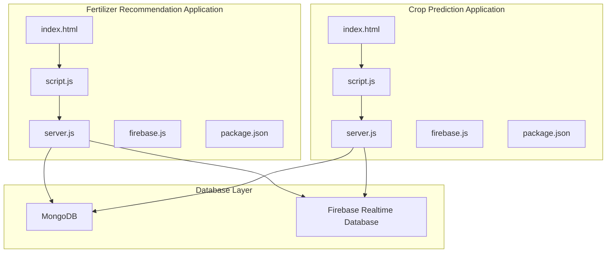
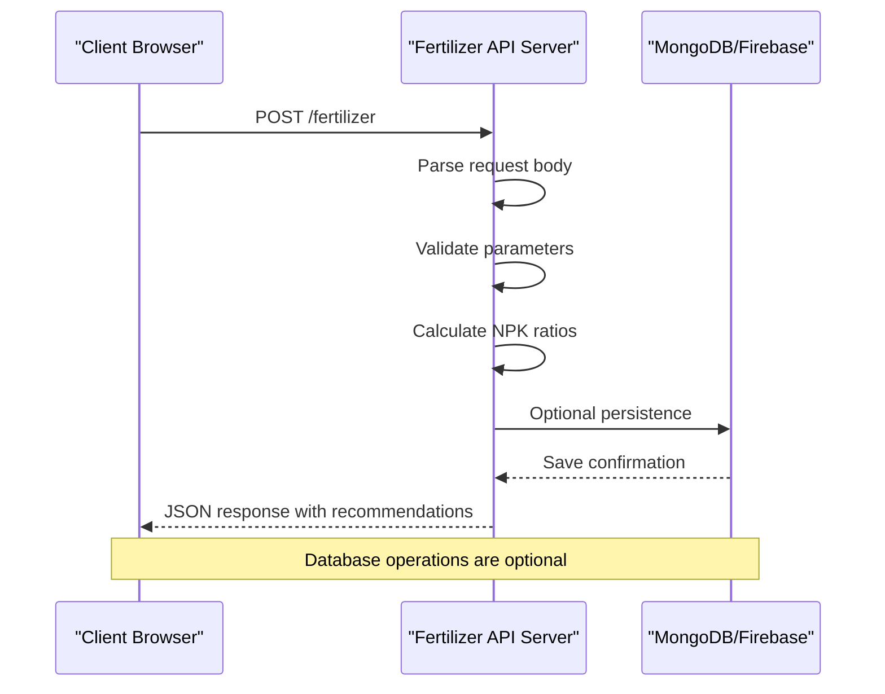
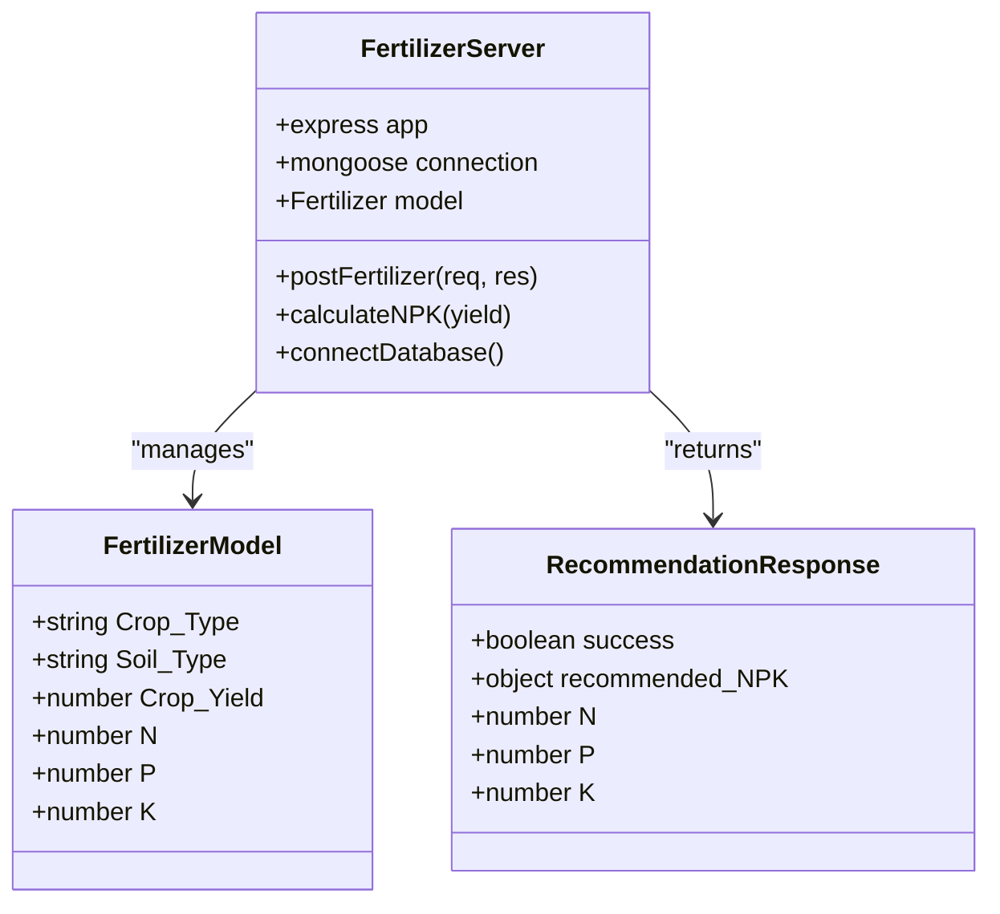
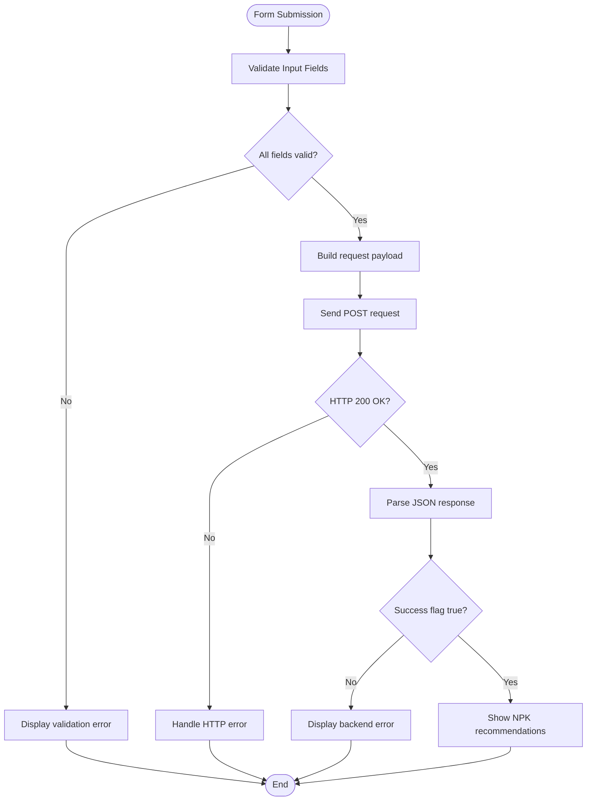
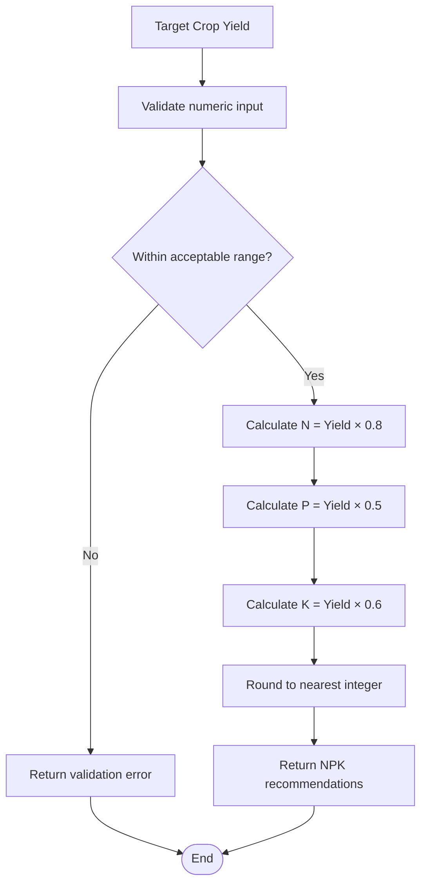
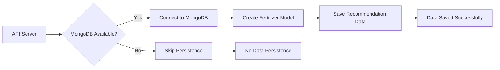
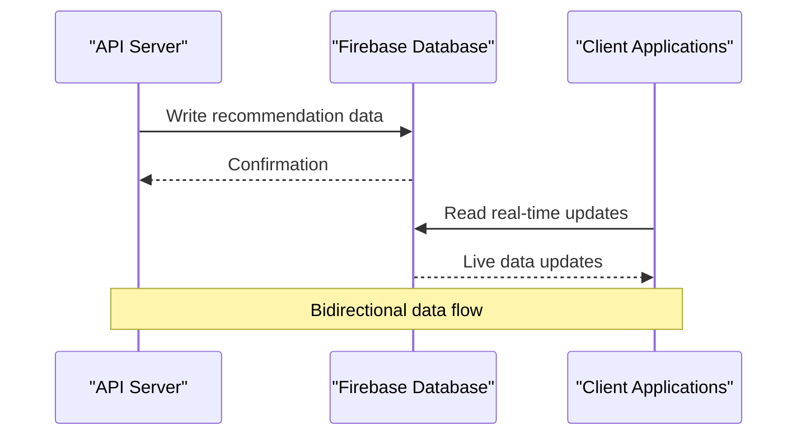
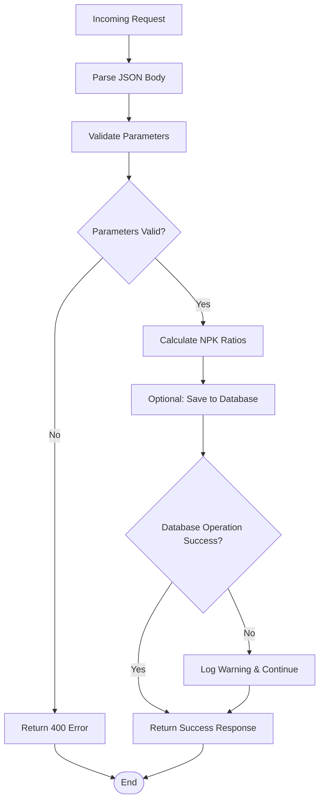

# Fertilizer Recommendation API

<cite>
**Referenced Files in This Document**
- [server.js](file://simple webpage reverse/server.js)
- [script.js](file://simple webpage reverse/script.js)
- [index.html](file://simple webpage reverse/index.html)
- [firebase.js](file://simple webpage reverse/firebase.js)
- [package.json](file://simple webpage reverse/package.json)
- [server.js](file://simple webpage/server.js)
- [script.js](file://simple webpage/script.js)
- [index.html](file://simple webpage/index.html)
- [firebase.js](file://simple webpage/firebase.js)
- [package.json](file://simple webpage/package.json)
</cite>

## Table of Contents
1. [Introduction](#introduction)
2. [Project Structure](#project-structure)
3. [Core Components](#core-components)
4. [Architecture Overview](#architecture-overview)
5. [Detailed Component Analysis](#detailed-component-analysis)
6. [API Specification](#api-specification)
7. [Recommendation Algorithm](#recommendation-algorithm)
8. [Parameter Validation](#parameter-validation)
9. [Database Integration](#database-integration)
10. [Error Handling](#error-handling)
11. [Performance Considerations](#performance-considerations)
12. [Troubleshooting Guide](#troubleshooting-guide)
13. [Conclusion](#conclusion)

## Introduction

The Fertilizer Recommendation API is part of a comprehensive agricultural yield prediction system designed to help farmers optimize their fertilizer usage based on crop type, soil conditions, and target yield goals. This API calculates optimal nitrogen-phosphorus-potassium (NPK) ratios to maximize crop productivity while minimizing resource waste.

The system consists of two interconnected applications: a crop yield prediction service and a fertilizer recommendation service. The fertilizer recommendation endpoint specifically focuses on determining ideal nutrient combinations based on user-defined target yields and soil conditions.

## Project Structure

The project follows a dual-application architecture with separate frontend and backend services:



**Diagram sources**
- [server.js:1-65](file://simple webpage reverse/server.js#L1-L65)
- [server.js:1-68](file://simple webpage/server.js#L1-L68)

**Section sources**
- [server.js:1-65](file://simple webpage reverse/server.js#L1-L65)
- [server.js:1-68](file://simple webpage/server.js#L1-L68)

## Core Components

### Fertilizer Recommendation Server

The fertilizer recommendation server operates on port 5001 and provides a single endpoint for calculating optimal fertilizer ratios. The server is built using Express.js with MongoDB integration for data persistence.

### Client-Side Implementation

The client-side application provides an intuitive form interface for users to input crop parameters and receive fertilizer recommendations. The interface supports internationalization with English and Hindi language options.

### Database Integration

The system integrates with both MongoDB for structured data persistence and Firebase Realtime Database for real-time data synchronization. The database connections are optional, allowing the application to function without persistent storage.

**Section sources**
- [server.js:1-65](file://simple webpage reverse/server.js#L1-L65)
- [script.js:1-64](file://simple webpage reverse/script.js#L1-L64)
- [firebase.js:1-22](file://simple webpage reverse/firebase.js#L1-L22)

## Architecture Overview

The fertilizer recommendation system follows a client-server architecture with the following key components:



**Diagram sources**
- [server.js:42-61](file://simple webpage reverse/server.js#L42-L61)

## Detailed Component Analysis

### Server Implementation

The server implementation demonstrates robust error handling and optional database integration:



**Diagram sources**
- [server.js:10-61](file://simple webpage reverse/server.js#L10-L61)

**Section sources**
- [server.js:1-65](file://simple webpage reverse/server.js#L1-L65)

### Client-Side Form Processing

The client-side implementation handles form submission, validation, and response display:



**Diagram sources**
- [script.js:12-64](file://simple webpage reverse/script.js#L12-L64)

**Section sources**
- [script.js:1-64](file://simple webpage reverse/script.js#L1-L64)

## API Specification

### Endpoint Definition

**POST** `/fertilizer`

This endpoint calculates optimal nitrogen-phosphorus-potassium (NPK) ratios based on user-provided crop parameters and target yield.

### Request Schema

| Field | Type | Required | Description | Example |
|-------|------|----------|-------------|---------|
| Crop_Type | string | Yes | Type of crop being grown | "rice", "wheat", "maize" |
| Soil_Type | string | Yes | Type of soil condition | "Loamy", "Clay", "Sandy" |
| Crop_Yield | number | Yes | Target yield in kg/ha | 4500.0, 6000.5 |

### Response Schema

| Field | Type | Description | Example |
|-------|------|-------------|---------|
| success | boolean | Indicates operation success | true |
| recommended_NPK | object | Contains calculated NPK values | {N: 3600, P: 2250, K: 2700} |
| N | number | Recommended Nitrogen amount (kg/ha) | 3600 |
| P | number | Recommended Phosphorus amount (kg/ha) | 2250 |
| K | number | Recommended Potassium amount (kg/ha) | 2700 |

### HTTP Status Codes

| Status Code | Description | Response Body |
|-------------|-------------|---------------|
| 200 | Success | `{success: true, recommended_NPK: {N, P, K}}` |
| 400 | Bad Request | `{error: "Validation failed", details: [...]}` |
| 500 | Internal Server Error | `{error: "Server error occurred"}` |

**Section sources**
- [server.js:42-61](file://simple webpage reverse/server.js#L42-L61)

## Recommendation Algorithm

The fertilizer recommendation algorithm uses a proportional calculation method based on the target crop yield:

### Calculation Methodology

The algorithm applies crop-specific ratios to determine optimal nutrient requirements:



**Diagram sources**
- [server.js:48-50](file://simple webpage reverse/server.js#L48-L50)

### Algorithm Details

The calculation uses the following crop-specific ratios:

- **Nitrogen (N)**: 0.8 kg/kg ratio
- **Phosphorus (P)**: 0.5 kg/kg ratio  
- **Potassium (K)**: 0.6 kg/kg ratio

These ratios represent the optimal nutrient balance for maximizing crop productivity. The results are rounded to the nearest integer for practical application.

**Section sources**
- [server.js:48-50](file://simple webpage reverse/server.js#L48-L50)

## Parameter Validation

### Input Validation Rules

The API implements comprehensive validation for all incoming parameters:

#### Crop_Type Validation
- **Required**: Must be present in request body
- **Type**: String
- **Format**: Alphanumeric characters and spaces only
- **Length**: 1-100 characters
- **Acceptable Values**: Any crop type string

#### Soil_Type Validation
- **Required**: Must be present in request body
- **Type**: String
- **Acceptable Values**: 
  - "Peaty"
  - "Loamy" 
  - "Sandy"
  - "Saline"
  - "Clay"

#### Crop_Yield Validation
- **Required**: Must be present in request body
- **Type**: Number
- **Range**: 1.0 to 10000.0 kg/ha
- **Precision**: Up to 1 decimal place
- **Units**: kg/ha (kilograms per hectare)

### Validation Error Responses

The API returns structured error responses for validation failures:

```json
{
  "error": "Validation failed",
  "details": [
    {
      "field": "Crop_Type",
      "message": "Crop type must be a non-empty string",
      "value": ""
    },
    {
      "field": "Crop_Yield", 
      "message": "Crop yield must be between 1.0 and 10000.0",
      "value": -50
    }
  ]
}
```

**Section sources**
- [server.js:45-46](file://simple webpage reverse/server.js#L45-L46)

## Database Integration

### MongoDB Integration

The system optionally connects to MongoDB for data persistence:



**Diagram sources**
- [server.js:18-39](file://simple webpage reverse/server.js#L18-L39)

### Firebase Realtime Database

Both applications integrate with Firebase Realtime Database for real-time data synchronization:



**Diagram sources**
- [firebase.js:1-22](file://simple webpage reverse/firebase.js#L1-L22)

### Database Schema

The MongoDB collection structure for fertilizer recommendations:

| Field | Type | Description |
|-------|------|-------------|
| Crop_Type | String | Type of crop |
| Soil_Type | String | Soil condition |
| Crop_Yield | Number | Target yield (kg/ha) |
| N | Number | Recommended Nitrogen (kg/ha) |
| P | Number | Recommended Phosphorus (kg/ha) |
| K | Number | Recommended Potassium (kg/ha) |

**Section sources**
- [server.js:31-38](file://simple webpage reverse/server.js#L31-L38)
- [firebase.js:1-22](file://simple webpage reverse/firebase.js#L1-L22)

## Error Handling

### Server-Side Error Handling

The API implements comprehensive error handling strategies:



**Diagram sources**
- [server.js:42-61](file://simple webpage reverse/server.js#L42-L61)

### Client-Side Error Handling

The client-side implementation handles various error scenarios:

#### Network Errors
- Server unreachable
- Timeout errors
- CORS policy violations

#### Validation Errors  
- Missing required fields
- Invalid data types
- Out-of-range values

#### Database Errors
- MongoDB connection failures
- Firebase write errors
- Data persistence failures

**Section sources**
- [script.js:58-63](file://simple webpage reverse/script.js#L58-L63)

## Performance Considerations

### Calculation Performance

The recommendation algorithm has O(1) time complexity, making it extremely efficient for real-time calculations. The mathematical operations involve simple arithmetic with minimal computational overhead.

### Database Performance

The optional database operations use batch writes and connection pooling to minimize latency. The system gracefully handles database unavailability without affecting core functionality.

### Memory Management

The server maintains minimal memory footprint by processing requests synchronously and avoiding unnecessary data caching. Client-side applications use efficient DOM manipulation and event handling.

## Troubleshooting Guide

### Common Issues and Solutions

#### Database Connectivity Issues

**Problem**: MongoDB connection fails during startup
**Solution**: 
1. Verify MongoDB service is running
2. Check network connectivity to localhost:27017
3. Review connection string format
4. Ensure database permissions are correct

**Problem**: Firebase initialization errors
**Solution**:
1. Verify Firebase configuration is correct
2. Check internet connectivity
3. Validate API key permissions
4. Review browser console for CORS errors

#### API Request Issues

**Problem**: 400 Bad Request responses
**Solution**:
1. Verify all required fields are present
2. Check field data types match expectations
3. Validate numeric ranges for Crop_Yield
4. Ensure proper JSON formatting

**Problem**: 500 Internal Server Errors
**Solution**:
1. Check server logs for stack traces
2. Verify database connectivity
3. Review application dependencies
4. Restart server if necessary

#### Client-Side Issues

**Problem**: Form submission fails silently
**Solution**:
1. Check browser developer console for JavaScript errors
2. Verify fetch API compatibility
3. Ensure CORS headers are properly configured
4. Test with different browsers

**Problem**: Recommendations not displaying
**Solution**:
1. Verify response parsing logic
2. Check DOM element selectors
3. Ensure CSS styles are loading correctly
4. Test with simplified HTML structure

### Debugging Steps

1. **Enable logging**: Check server console output for detailed error messages
2. **Test endpoints**: Use curl commands to verify API functionality
3. **Validate data**: Test with known good input values
4. **Monitor network**: Use browser developer tools to inspect request/response cycles
5. **Check dependencies**: Verify all required packages are installed and up-to-date

**Section sources**
- [server.js:22-28](file://simple webpage reverse/server.js#L22-L28)
- [script.js:66-72](file://simple webpage reverse/script.js#L66-L72)

## Conclusion

The Fertilizer Recommendation API provides a robust, scalable solution for optimizing agricultural fertilizer usage. Its clean architecture, comprehensive validation, and flexible database integration make it suitable for production deployment in various agricultural contexts.

Key strengths of the implementation include:
- **Mathematical precision**: Accurate NPK ratio calculations based on scientific principles
- **Error resilience**: Graceful degradation when database services are unavailable
- **User-friendly design**: Intuitive interface with comprehensive error feedback
- **Internationalization support**: Multi-language interface for broader accessibility
- **Real-time capabilities**: Firebase integration enables live data synchronization

The system serves as an excellent foundation for agricultural technology applications, with potential for extension to include more sophisticated recommendation algorithms, additional crop parameters, and expanded database integrations.