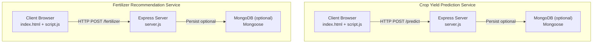
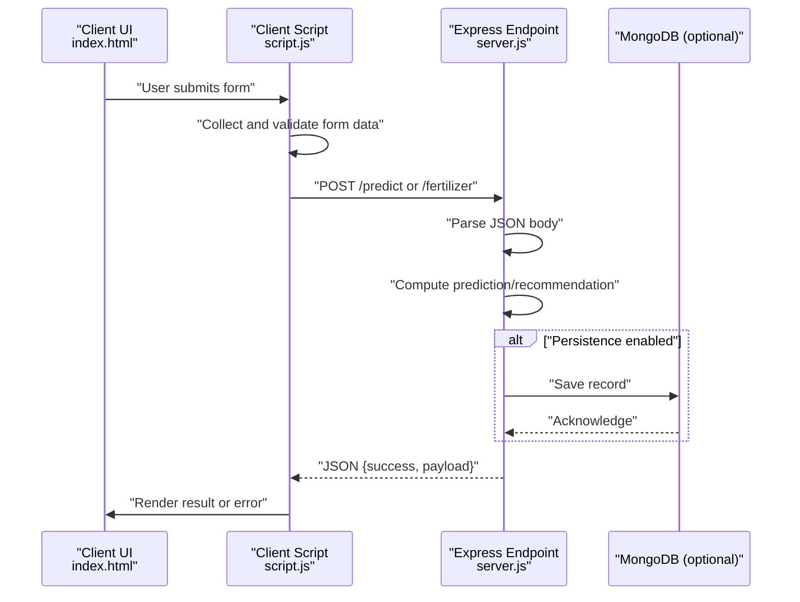
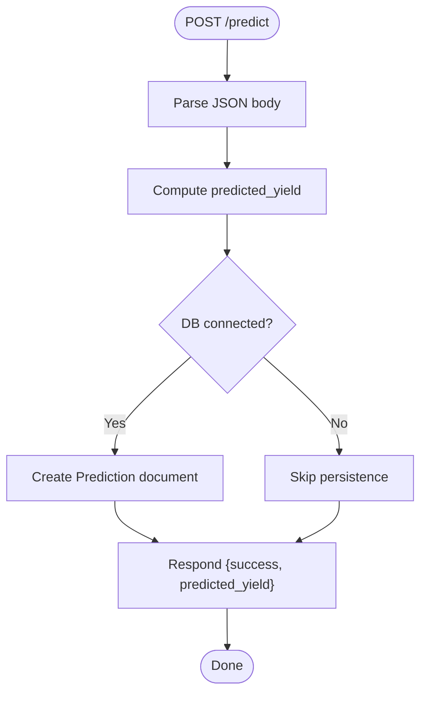
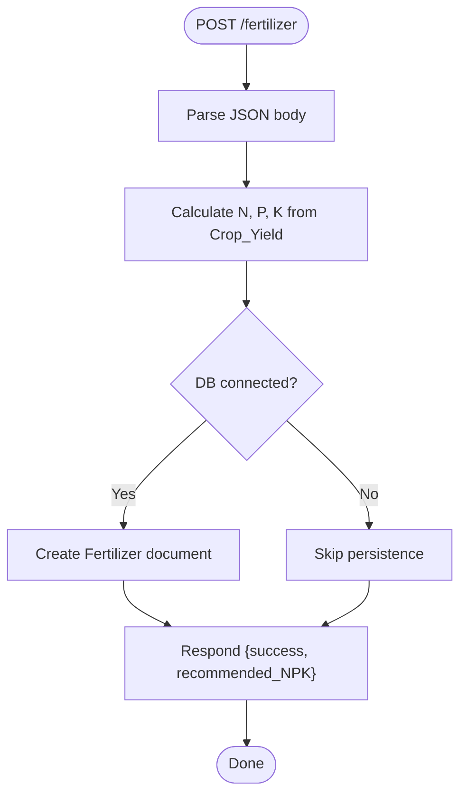
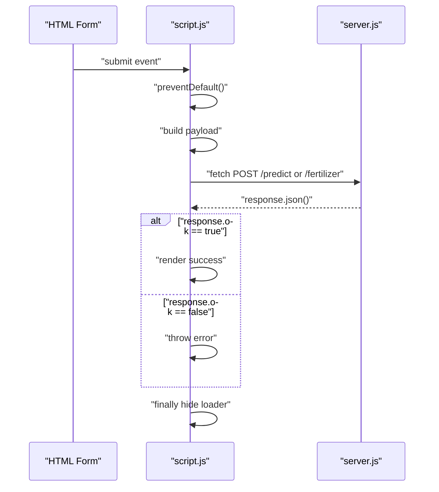
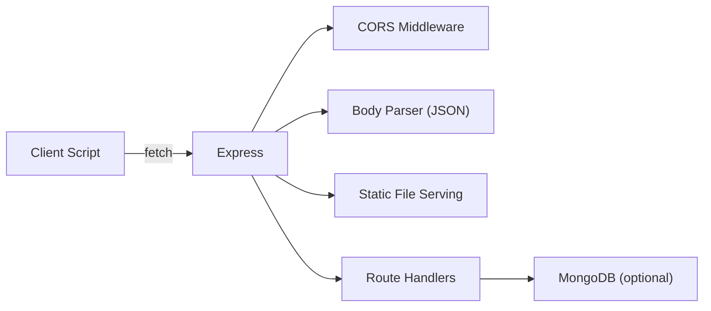

# API Communication Architecture

<cite>
**Referenced Files in This Document**
- [server.js](file://simple webpage/server.js)
- [script.js](file://simple webpage/script.js)
- [package.json](file://simple webpage/package.json)
- [index.html](file://simple webpage/index.html)
- [server.js](file://simple webpage reverse/server.js)
- [script.js](file://simple webpage reverse/script.js)
- [index.html](file://simple webpage reverse/index.html)
</cite>

## Table of Contents
1. [Introduction](#introduction)
2. [Project Structure](#project-structure)
3. [Core Components](#core-components)
4. [Architecture Overview](#architecture-overview)
5. [Detailed Component Analysis](#detailed-component-analysis)
6. [Dependency Analysis](#dependency-analysis)
7. [Performance Considerations](#performance-considerations)
8. [Troubleshooting Guide](#troubleshooting-guide)
9. [Conclusion](#conclusion)

## Introduction
This document describes the API communication architecture between the frontend and backend services in a dual-service web application. It focuses on RESTful API design principles, HTTP method usage, response formatting, request-response cycles, error handling, CORS configuration, security considerations, rate limiting approaches, API versioning strategies, backward compatibility, deprecation policies, client-side consumption patterns, error propagation, retry mechanisms, and separation of concerns between API logic and business operations.

## Project Structure
The project consists of two independent frontend-backend service pairs:
- Crop Yield Prediction Service (port 5000)
- Fertilizer Recommendation Service (port 5001)

Each pair comprises:
- An Express-based Node.js server exposing a single endpoint
- A static HTML page with embedded JavaScript for client-side interaction
- Optional MongoDB persistence via Mongoose

**Diagram sources**
- [server.js:1-68](file://simple webpage/server.js#L1-L68)
- [script.js:1-73](file://simple webpage/script.js#L1-L73)
- [server.js:1-65](file://simple webpage reverse/server.js#L1-L65)
- [script.js:1-64](file://simple webpage reverse/script.js#L1-L64)

**Section sources**
- [server.js:1-68](file://simple webpage/server.js#L1-L68)
- [script.js:1-73](file://simple webpage/script.js#L1-L73)
- [server.js:1-65](file://simple webpage reverse/server.js#L1-L65)
- [script.js:1-64](file://simple webpage reverse/script.js#L1-L64)

## Core Components
- Express servers configured with CORS middleware and JSON body parsing
- Static file serving for HTML/CSS/JS
- Single POST endpoints per service:
  - Crop Yield Prediction: POST /predict
  - Fertilizer Recommendation: POST /fertilizer
- Optional MongoDB persistence using Mongoose models
- Client-side fetch-based request orchestration with basic error handling

Key characteristics:
- Stateless endpoints
- JSON request/response payloads
- Minimal validation and error handling on the server side
- Optional database persistence with graceful degradation

**Section sources**
- [server.js:12-16](file://simple webpage/server.js#L12-L16)
- [server.js:45-64](file://simple webpage/server.js#L45-L64)
- [server.js:12-16](file://simple webpage reverse/server.js#L12-L16)
- [server.js:42-61](file://simple webpage reverse/server.js#L42-L61)
- [script.js:36-48](file://simple webpage/script.js#L36-L48)
- [script.js:28-40](file://simple webpage reverse/script.js#L28-L40)

## Architecture Overview
The system follows a classic client-server model with two independent microservice-like endpoints. The frontend interacts with the backend using HTTP POST requests with JSON payloads and expects JSON responses. CORS is enabled globally to allow cross-origin requests from localhost.

**Diagram sources**
- [script.js:13-73](file://simple webpage/script.js#L13-L73)
- [server.js:45-64](file://simple webpage/server.js#L45-L64)
- [script.js:12-64](file://simple webpage reverse/script.js#L12-L64)
- [server.js:42-61](file://simple webpage reverse/server.js#L42-L61)

## Detailed Component Analysis

### Crop Yield Prediction Service
- Endpoint: POST /predict
- Request payload: Includes crop attributes and fixed weather parameters
- Business logic: Computes predicted yield based on weighted factors
- Persistence: Optional; creates a Prediction document if connected
- Response: JSON object with success flag and predicted_yield

**Diagram sources**
- [server.js:45-64](file://simple webpage/server.js#L45-L64)

**Section sources**
- [server.js:45-64](file://simple webpage/server.js#L45-L64)
- [script.js:13-73](file://simple webpage/script.js#L13-L73)

### Fertilizer Recommendation Service
- Endpoint: POST /fertilizer
- Request payload: Crop type, soil type, and target crop yield
- Business logic: Calculates recommended NPK values based on yield
- Persistence: Optional; creates a Fertilizer document if connected
- Response: JSON object with success flag and recommended_NPK

**Diagram sources**
- [server.js:42-61](file://simple webpage reverse/server.js#L42-L61)

**Section sources**
- [server.js:42-61](file://simple webpage reverse/server.js#L42-L61)
- [script.js:12-64](file://simple webpage reverse/script.js#L12-L64)

### Client-Side Consumption Patterns
- Event-driven form submission
- Fetch-based HTTP POST with JSON serialization
- Basic response.ok check and JSON parsing
- UI updates for loading states, success, and errors
- Graceful fallback messaging when backend is unavailable

**Diagram sources**
- [script.js:13-73](file://simple webpage/script.js#L13-L73)
- [script.js:12-64](file://simple webpage reverse/script.js#L12-L64)

**Section sources**
- [script.js:13-73](file://simple webpage/script.js#L13-L73)
- [script.js:12-64](file://simple webpage reverse/script.js#L12-L64)

## Dependency Analysis
- Express: Web framework for routing and middleware
- CORS: Cross-origin allowance for local development
- Mongoose: Optional ODM for MongoDB persistence
- Frontend: Native fetch API for HTTP communication

**Diagram sources**
- [server.js:1-16](file://simple webpage/server.js#L1-L16)
- [server.js:1-16](file://simple webpage reverse/server.js#L1-L16)
- [package.json:10-14](file://simple webpage/package.json#L10-L14)

**Section sources**
- [package.json:10-14](file://simple webpage/package.json#L10-L14)
- [server.js:1-16](file://simple webpage/server.js#L1-L16)
- [server.js:1-16](file://simple webpage reverse/server.js#L1-L16)

## Performance Considerations
- Current implementation is lightweight and suitable for small-scale usage
- No built-in caching or rate limiting; consider adding:
  - In-memory or Redis-based rate limiting per IP
  - Response caching for identical inputs
  - Compression middleware for larger payloads
  - Connection pooling and keep-alive tuning
- Database operations are synchronous; consider batching writes or using async queues for high throughput

[No sources needed since this section provides general guidance]

## Troubleshooting Guide
Common issues and resolutions:
- CORS errors: Ensure CORS middleware is enabled and origin matches expectations
- JSON parse errors: Verify Content-Type header and body formatting
- Database connectivity: Check MongoDB availability and connection string
- Network failures: Implement retry logic and circuit breaker patterns
- Validation failures: Add input sanitization and schema validation

Error handling patterns observed:
- Client-side: response.ok check and catch blocks
- Server-side: try/catch around database writes with warnings

**Section sources**
- [server.js:22-28](file://simple webpage/server.js#L22-L28)
- [server.js:22-28](file://simple webpage reverse/server.js#L22-L28)
- [script.js:44-46](file://simple webpage/script.js#L44-L46)
- [script.js:36-38](file://simple webpage reverse/script.js#L36-L38)

## Conclusion
The system demonstrates a clean separation of concerns with straightforward RESTful endpoints, minimal middleware, and optional persistence. While functional for development and small-scale use, production readiness requires enhancements in error handling, rate limiting, validation, and observability. The architecture supports independent scaling of services and can be extended with standardized versioning and deprecation policies.