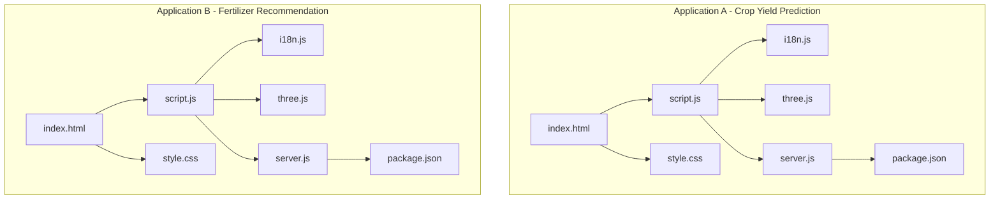
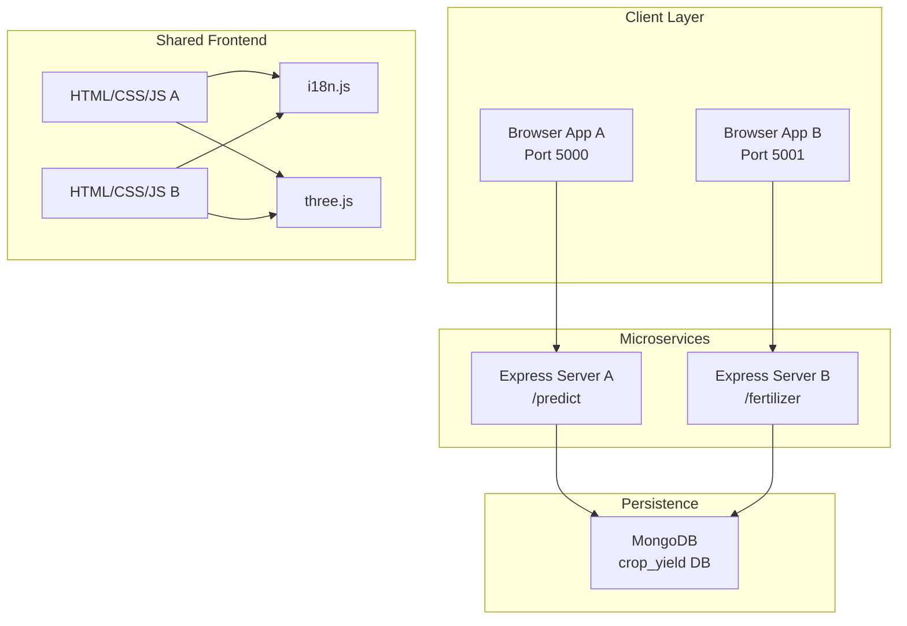
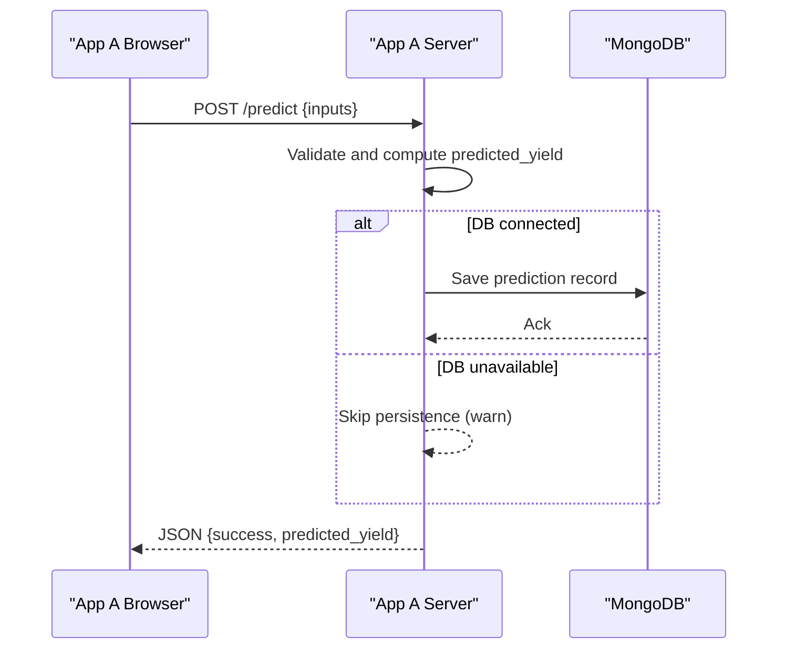
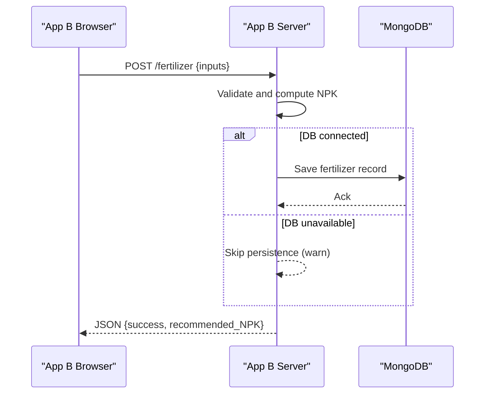
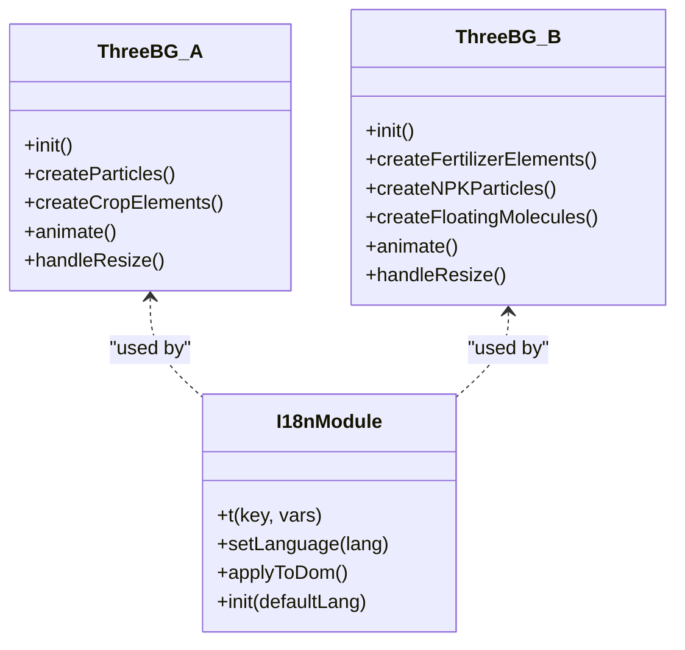
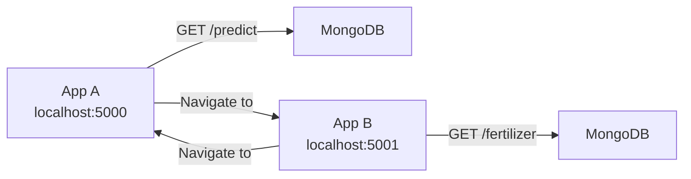
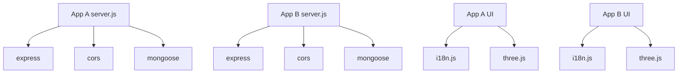

# Application Architecture

<cite>
**Referenced Files in This Document**
- [package.json](file://simple webpage/package.json)
- [server.js](file://simple webpage/server.js)
- [index.html](file://simple webpage/index.html)
- [script.js](file://simple webpage/script.js)
- [i18n.js](file://simple webpage/i18n.js)
- [three.js](file://simple webpage/three.js)
- [style.css](file://simple webpage/style.css)
- [package.json](file://simple webpage reverse/package.json)
- [server.js](file://simple webpage reverse/server.js)
- [index.html](file://simple webpage reverse/index.html)
- [script.js](file://simple webpage reverse/script.js)
- [i18n.js](file://simple webpage reverse/i18n.js)
- [three.js](file://simple webpage reverse/three.js)
- [style.css](file://simple webpage reverse/style.css)
</cite>

## Table of Contents
1. [Introduction](#introduction)
2. [Project Structure](#project-structure)
3. [Core Components](#core-components)
4. [Architecture Overview](#architecture-overview)
5. [Detailed Component Analysis](#detailed-component-analysis)
6. [Dependency Analysis](#dependency-analysis)
7. [Performance Considerations](#performance-considerations)
8. [Troubleshooting Guide](#troubleshooting-guide)
9. [Conclusion](#conclusion)
10. [Appendices](#appendices)

## Introduction
This document describes the dual application system architecture for a crop yield prediction and fertilizer recommendation platform. It presents a high-level design of two independent microservices (one per application), their shared frontend components, and separation of concerns. The system integrates Express.js-based backend servers, MongoDB persistence, Three.js-powered 3D visualization, and a lightweight internationalization pattern. It also documents infrastructure requirements, port configurations, deployment topology, cross-cutting concerns (CORS, error handling, performance), and the technology stack.

## Project Structure
The repository contains two identical application folders:
- simple webpage: Crop yield prediction service
- simple webpage reverse: Fertilizer recommendation service

Each folder includes:
- Frontend assets: HTML, CSS, modular JavaScript, and Three.js integration
- Backend server: Express.js with CORS and Mongoose
- Internationalization module for multi-language support
- Shared styling and 3D visualization components

**Diagram sources**
- [index.html](file://simple webpage/index.html)
- [script.js](file://simple webpage/script.js)
- [i18n.js](file://simple webpage/i18n.js)
- [three.js](file://simple webpage/three.js)
- [style.css](file://simple webpage/style.css)
- [server.js](file://simple webpage/server.js)
- [package.json](file://simple webpage/package.json)
- [index.html](file://simple webpage reverse/index.html)
- [script.js](file://simple webpage reverse/script.js)
- [i18n.js](file://simple webpage reverse/i18n.js)
- [three.js](file://simple webpage reverse/three.js)
- [style.css](file://simple webpage reverse/style.css)
- [server.js](file://simple webpage reverse/server.js)
- [package.json](file://simple webpage reverse/package.json)

**Section sources**
- [package.json](file://simple webpage/package.json)
- [server.js](file://simple webpage/server.js)
- [index.html](file://simple webpage/index.html)
- [script.js](file://simple webpage/script.js)
- [i18n.js](file://simple webpage/i18n.js)
- [three.js](file://simple webpage/three.js)
- [style.css](file://simple webpage/style.css)
- [package.json](file://simple webpage reverse/package.json)
- [server.js](file://simple webpage reverse/server.js)
- [index.html](file://simple webpage reverse/index.html)
- [script.js](file://simple webpage reverse/script.js)
- [i18n.js](file://simple webpage reverse/i18n.js)
- [three.js](file://simple webpage reverse/three.js)
- [style.css](file://simple webpage reverse/style.css)

## Core Components
- Frontend Controllers (per app):
  - HTML forms collect user inputs and render results.
  - Modular scripts handle form submission, loading states, and API calls.
  - Internationalization module initializes language selection and updates DOM text.
  - Three.js class renders animated 3D scenes layered behind UI overlays.
  - Shared CSS ensures consistent layout and overlay readability.

- Backend Servers (per app):
  - Express.js routes serve static assets and expose REST endpoints (/predict, /fertilizer).
  - CORS middleware enables cross-origin requests from local clients.
  - Optional MongoDB persistence via Mongoose with per-app models.

- Cross-cutting Services:
  - MongoDB connection attempts with graceful fallback when unavailable.
  - Shared styling and 3D rendering logic across both apps.

**Section sources**
- [index.html](file://simple webpage/index.html)
- [script.js](file://simple webpage/script.js)
- [i18n.js](file://simple webpage/i18n.js)
- [three.js](file://simple webpage/three.js)
- [style.css](file://simple webpage/style.css)
- [server.js](file://simple webpage/server.js)
- [index.html](file://simple webpage reverse/index.html)
- [script.js](file://simple webpage reverse/script.js)
- [i18n.js](file://simple webpage reverse/i18n.js)
- [three.js](file://simple webpage reverse/three.js)
- [style.css](file://simple webpage reverse/style.css)
- [server.js](file://simple webpage reverse/server.js)

## Architecture Overview
The system follows a dual microservice architecture:
- Each application runs its own Express server and exposes a single REST endpoint.
- Both share identical frontend components (HTML/CSS/JS/i18n/Three.js).
- Clients communicate via localhost ports 5000 and 5001 respectively.
- Optional MongoDB persistence is configured per service.

**Diagram sources**
- [server.js](file://simple webpage/server.js)
- [server.js](file://simple webpage reverse/server.js)
- [index.html](file://simple webpage/index.html)
- [index.html](file://simple webpage reverse/index.html)
- [i18n.js](file://simple webpage/i18n.js)
- [i18n.js](file://simple webpage reverse/i18n.js)
- [three.js](file://simple webpage/three.js)
- [three.js](file://simple webpage reverse/three.js)

## Detailed Component Analysis

### Microservice A: Crop Yield Prediction
- Endpoint: POST /predict
- Responsibilities:
  - Compute predicted yield from inputs (N, P, K, Temperature, Humidity, Wind_Speed).
  - Persist prediction record to MongoDB if connected.
  - Return structured JSON response.

**Diagram sources**
- [server.js](file://simple webpage/server.js)
- [script.js](file://simple webpage/script.js)

**Section sources**
- [server.js](file://simple webpage/server.js)
- [script.js](file://simple webpage/script.js)

### Microservice B: Fertilizer Recommendation
- Endpoint: POST /fertilizer
- Responsibilities:
  - Compute recommended NPK based on Crop_Yield.
  - Persist fertilizer recommendation to MongoDB if connected.
  - Return structured JSON response.

**Diagram sources**
- [server.js](file://simple webpage reverse/server.js)
- [script.js](file://simple webpage reverse/script.js)

**Section sources**
- [server.js](file://simple webpage reverse/server.js)
- [script.js](file://simple webpage reverse/script.js)

### Shared Frontend Components
- HTML:
  - Forms capture inputs and link to the other service.
  - Language selector triggers i18n updates.
- i18n.js:
  - Provides translation keys and DOM update utilities.
  - Initializes language on load and listens to selector changes.
- three.js:
  - Renders animated particle systems and crop/fertilizer-related visuals.
  - Handles resize events to maintain aspect ratio.
- CSS:
  - Z-layering ensures 3D background remains behind UI overlays.
  - Consistent button and form styling across both apps.

**Diagram sources**
- [three.js](file://simple webpage/three.js)
- [three.js](file://simple webpage reverse/three.js)
- [i18n.js](file://simple webpage/i18n.js)
- [i18n.js](file://simple webpage reverse/i18n.js)

**Section sources**
- [index.html](file://simple webpage/index.html)
- [i18n.js](file://simple webpage/i18n.js)
- [three.js](file://simple webpage/three.js)
- [style.css](file://simple webpage/style.css)
- [index.html](file://simple webpage reverse/index.html)
- [i18n.js](file://simple webpage reverse/i18n.js)
- [three.js](file://simple webpage reverse/three.js)
- [style.css](file://simple webpage reverse/style.css)

### Data Flow Between Applications
- App A links to App B via a navigation anchor to port 5001.
- App B links back to App A via a navigation anchor to port 5000.
- Both rely on CORS-enabled Express servers to accept cross-origin requests.

**Diagram sources**
- [server.js](file://simple webpage/server.js)
- [server.js](file://simple webpage reverse/server.js)
- [index.html](file://simple webpage/index.html)
- [index.html](file://simple webpage reverse/index.html)

**Section sources**
- [index.html](file://simple webpage/index.html)
- [index.html](file://simple webpage reverse/index.html)
- [server.js](file://simple webpage/server.js)
- [server.js](file://simple webpage reverse/server.js)

## Dependency Analysis
- Application A depends on:
  - Express.js for routing and middleware.
  - CORS for cross-origin allowance.
  - Mongoose for optional persistence.
  - Shared i18n and Three.js modules for UI.
- Application B mirrors the same dependencies with its own endpoint and model.
- Shared frontend modules are independent of backend logic and can be reused across apps.

**Diagram sources**
- [server.js](file://simple webpage/server.js)
- [server.js](file://simple webpage reverse/server.js)
- [package.json](file://simple webpage/package.json)
- [package.json](file://simple webpage reverse/package.json)
- [i18n.js](file://simple webpage/i18n.js)
- [i18n.js](file://simple webpage reverse/i18n.js)
- [three.js](file://simple webpage/three.js)
- [three.js](file://simple webpage reverse/three.js)

**Section sources**
- [package.json](file://simple webpage/package.json)
- [package.json](file://simple webpage reverse/package.json)
- [server.js](file://simple webpage/server.js)
- [server.js](file://simple webpage reverse/server.js)

## Performance Considerations
- Static asset delivery: Serving static files directly via Express reduces overhead.
- Optional persistence: Graceful degradation when MongoDB is unavailable avoids blocking the API.
- 3D rendering: Lightweight particle systems and controlled animation loops minimize CPU/GPU load.
- Network efficiency: Single-purpose endpoints reduce payload sizes and simplify caching strategies.
- Recommendations:
  - Enable compression middleware for production deployments.
  - Consider connection pooling and retry logic for MongoDB.
  - Debounce or throttle real-time 3D animations on low-power devices.

[No sources needed since this section provides general guidance]

## Troubleshooting Guide
- CORS errors:
  - Symptom: Cross-origin requests blocked.
  - Resolution: Confirm CORS middleware is enabled in both servers.
- MongoDB connectivity:
  - Symptom: Warning logs indicating DB unavailable; persistence skipped.
  - Resolution: Ensure MongoDB is running locally on the default port; otherwise, API continues without persistence.
- Port conflicts:
  - Symptom: Cannot start server on port 5000 or 5001.
  - Resolution: Stop conflicting processes or adjust port configuration in server files.
- Frontend localization:
  - Symptom: Language toggle not updating text.
  - Resolution: Verify i18n initialization and DOM attributes (data-i18n) are present.
- 3D background not rendering:
  - Symptom: Empty scene or warnings about missing container.
  - Resolution: Ensure the container element exists and Three.js is imported correctly.

**Section sources**
- [server.js](file://simple webpage/server.js)
- [server.js](file://simple webpage reverse/server.js)
- [i18n.js](file://simple webpage/i18n.js)
- [i18n.js](file://simple webpage reverse/i18n.js)
- [three.js](file://simple webpage/three.js)
- [three.js](file://simple webpage reverse/three.js)

## Conclusion
The dual application system cleanly separates concerns into two independent microservices while sharing a cohesive frontend. Express.js provides straightforward routing, MongoDB offers optional persistence, and Three.js delivers immersive 3D experiences. The design supports easy scaling, maintenance, and deployment, with clear boundaries between services and shared components.

[No sources needed since this section summarizes without analyzing specific files]

## Appendices

### Infrastructure Requirements and Deployment Topology
- Ports:
  - App A: localhost:5000
  - App B: localhost:5001
- Database:
  - MongoDB instance reachable at mongodb://127.0.0.1:27017/crop_yield
- Deployment:
  - Run both servers concurrently on the same host or separate hosts.
  - Ensure CORS is enabled for development; restrict origins in production.
  - Optionally deploy static assets behind a CDN or reverse proxy.

**Section sources**
- [server.js](file://simple webpage/server.js)
- [server.js](file://simple webpage reverse/server.js)

### Technology Stack
- Backend:
  - Express.js, CORS, Mongoose
- Frontend:
  - HTML5, CSS3, ES Modules
  - Three.js for 3D rendering
  - Custom i18n module for multi-language support
- Optional:
  - MongoDB for persistence

**Section sources**
- [package.json](file://simple webpage/package.json)
- [package.json](file://simple webpage reverse/package.json)
- [server.js](file://simple webpage/server.js)
- [server.js](file://simple webpage reverse/server.js)
- [i18n.js](file://simple webpage/i18n.js)
- [i18n.js](file://simple webpage reverse/i18n.js)
- [three.js](file://simple webpage/three.js)
- [three.js](file://simple webpage reverse/three.js)