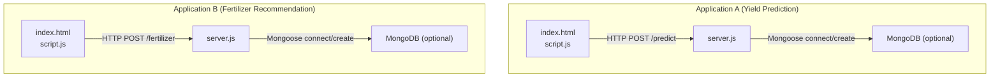
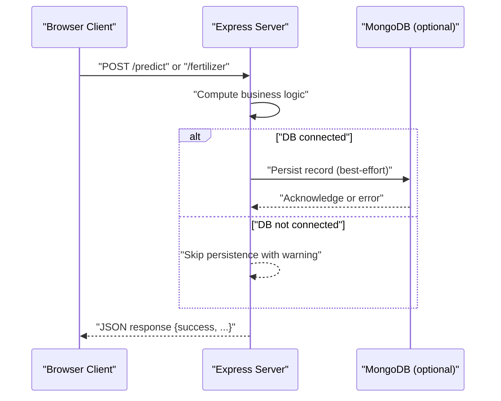
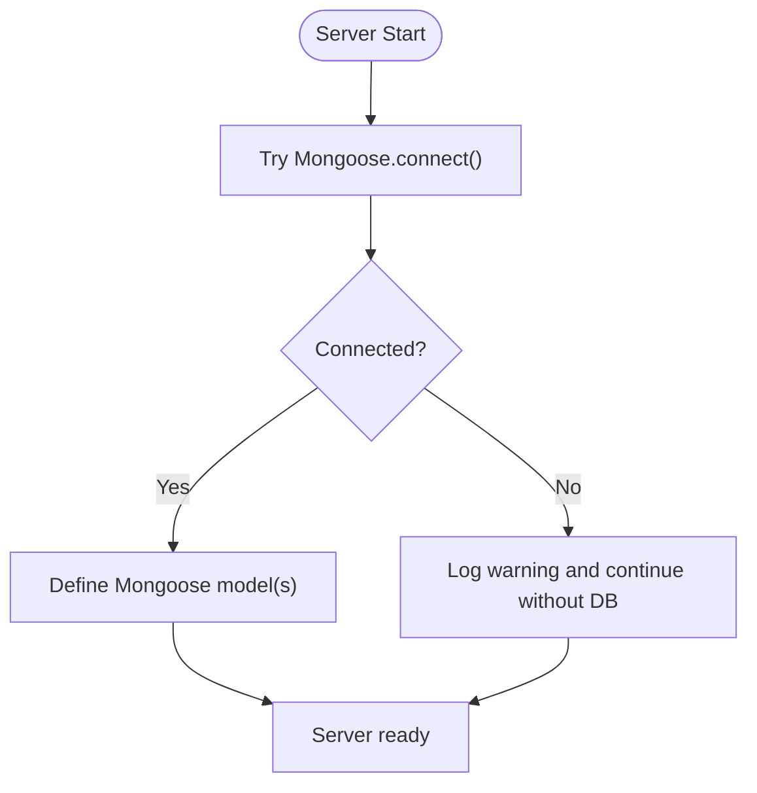
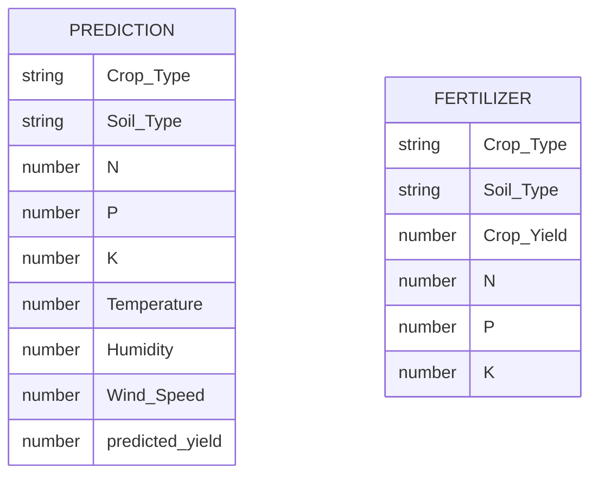
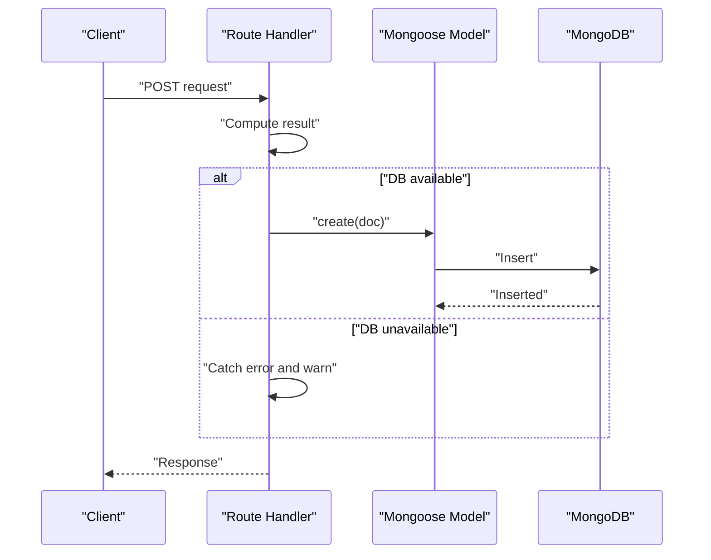
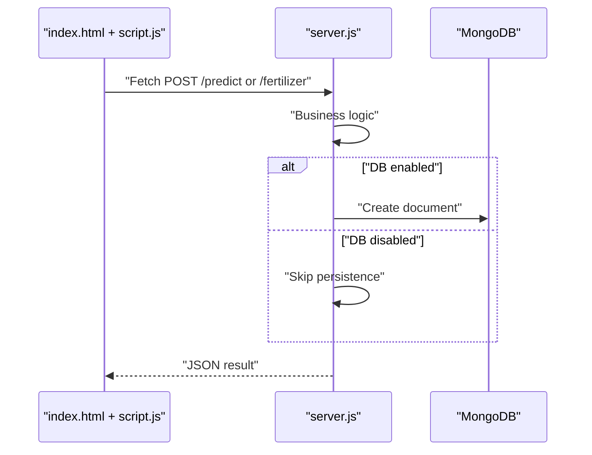
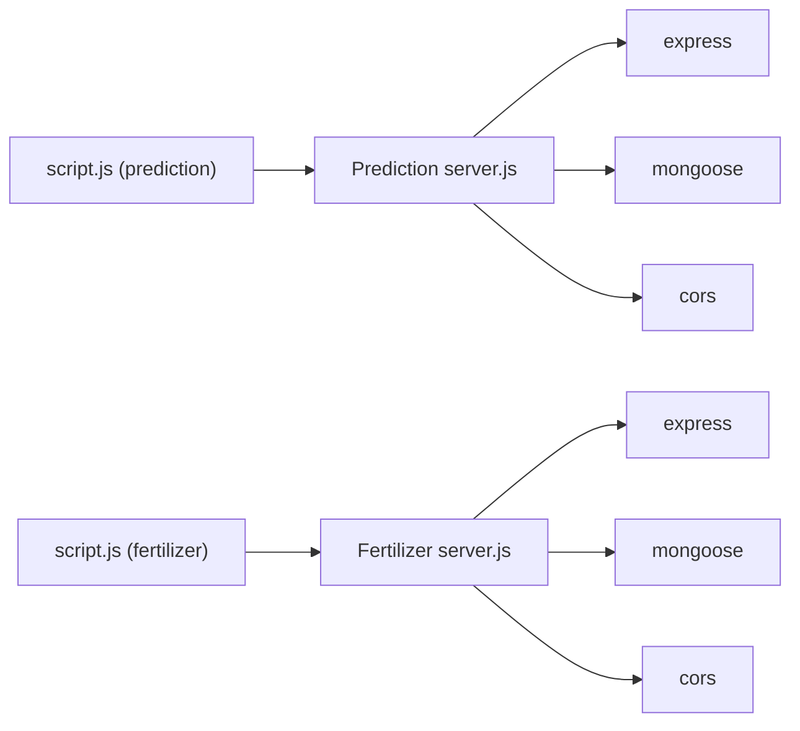

# Database Integration Patterns

<cite>
**Referenced Files in This Document**
- [server.js](file://simple webpage/server.js)
- [server.js](file://simple webpage reverse/server.js)
- [package.json](file://simple webpage/package.json)
- [package.json](file://simple webpage reverse/package.json)
- [script.js](file://simple webpage/script.js)
- [script.js](file://simple webpage reverse/script.js)
- [index.html](file://simple webpage/index.html)
- [index.html](file://simple webpage reverse/index.html)
- [firebase.js](file://simple webpage/firebase.js)
- [firebase.js](file://simple webpage reverse/firebase.js)
</cite>

## Table of Contents
1. [Introduction](#introduction)
2. [Project Structure](#project-structure)
3. [Core Components](#core-components)
4. [Architecture Overview](#architecture-overview)
5. [Detailed Component Analysis](#detailed-component-analysis)
6. [Dependency Analysis](#dependency-analysis)
7. [Performance Considerations](#performance-considerations)
8. [Troubleshooting Guide](#troubleshooting-guide)
9. [Conclusion](#conclusion)
10. [Appendices](#appendices)

## Introduction
This document describes the database integration patterns used across two applications in the repository. Both applications are Express servers that optionally integrate with MongoDB via Mongoose for persistence. They also demonstrate graceful degradation when the database is unavailable, maintaining core functionality for users. The document covers connection strategies, schema design patterns, data persistence approaches, Mongoose configuration, connection pooling, error handling, data flow, schema evolution, indexing, query optimization, backup and recovery, migrations, performance monitoring, and separation of concerns between database operations and business logic.

## Project Structure
Each application consists of:
- A Node.js Express server that serves static assets and exposes REST endpoints.
- A browser-based client that submits requests to the server.
- Optional MongoDB integration configured at startup.

**Diagram sources**
- [server.js:1-68](file://simple webpage/server.js#L1-L68)
- [server.js:1-65](file://simple webpage reverse/server.js#L1-L65)
- [script.js:1-73](file://simple webpage/script.js#L1-L73)
- [script.js:1-64](file://simple webpage reverse/script.js#L1-L64)
- [index.html:1-116](file://simple webpage/index.html#L1-L116)
- [index.html:1-98](file://simple webpage reverse/index.html#L1-L98)

**Section sources**
- [server.js:1-68](file://simple webpage/server.js#L1-L68)
- [server.js:1-65](file://simple webpage reverse/server.js#L1-L65)
- [package.json:1-15](file://simple webpage/package.json#L1-L15)
- [package.json:1-19](file://simple webpage reverse/package.json#L1-L19)
- [script.js:1-73](file://simple webpage/script.js#L1-L73)
- [script.js:1-64](file://simple webpage reverse/script.js#L1-L64)
- [index.html:1-116](file://simple webpage/index.html#L1-L116)
- [index.html:1-98](file://simple webpage reverse/index.html#L1-L98)

## Core Components
- Express server initialization and middleware setup for CORS and JSON parsing.
- Static asset serving for HTML/CSS/JS.
- Optional MongoDB connectivity using Mongoose with a fallback when unavailable.
- Business logic embedded in route handlers:
  - Prediction endpoint computes yield and optionally persists the result.
  - Fertilizer endpoint computes NPK recommendations and optionally persists the result.
- Frontend clients submit forms and consume JSON responses from the servers.

Key characteristics:
- Database availability is checked at startup; models are conditionally defined.
- Persistence is attempted inside request handlers but does not block response delivery.
- Errors during persistence are caught and logged without failing the HTTP response.

**Section sources**
- [server.js:10-28](file://simple webpage/server.js#L10-L28)
- [server.js:30-42](file://simple webpage/server.js#L30-L42)
- [server.js:44-64](file://simple webpage/server.js#L44-L64)
- [server.js:10-28](file://simple webpage reverse/server.js#L10-L28)
- [server.js:30-39](file://simple webpage reverse/server.js#L30-L39)
- [server.js:41-61](file://simple webpage reverse/server.js#L41-L61)

## Architecture Overview
The systems follow a thin-server pattern:
- Clients send HTTP requests to the server.
- Servers compute results and optionally persist them to MongoDB.
- If MongoDB is unavailable, servers continue operating and return successful responses.

**Diagram sources**
- [server.js:44-64](file://simple webpage/server.js#L44-L64)
- [server.js:42-61](file://simple webpage reverse/server.js#L42-L61)
- [script.js:35-48](file://simple webpage/script.js#L35-L48)
- [script.js:27-40](file://simple webpage reverse/script.js#L27-L40)

## Detailed Component Analysis

### MongoDB Connection Strategy
- Connection occurs at server startup using Mongoose.
- A boolean flag tracks whether the connection succeeded.
- Models are created only if the connection is established.
- If connection fails, the server continues running and logs a warning.

**Diagram sources**
- [server.js:22-28](file://simple webpage/server.js#L22-L28)
- [server.js:22-28](file://simple webpage reverse/server.js#L22-L28)

**Section sources**
- [server.js:18-28](file://simple webpage/server.js#L18-L28)
- [server.js:18-28](file://simple webpage reverse/server.js#L18-L28)

### Schema Design Patterns
- Inline schema definition per model with explicit field types.
- Application A schema includes identifiers and computed fields.
- Application B schema includes identifiers and computed fields.
- No shared schema library or centralized schema definitions are present.

**Diagram sources**
- [server.js:31-41](file://simple webpage/server.js#L31-L41)
- [server.js:31-38](file://simple webpage reverse/server.js#L31-L38)

**Section sources**
- [server.js:31-41](file://simple webpage/server.js#L31-L41)
- [server.js:31-38](file://simple webpage reverse/server.js#L31-L38)

### Data Persistence Approaches
- Persistence is performed inside request handlers after computation.
- Try/catch blocks surround persistence calls to avoid blocking responses.
- On failure, a warning is logged and the handler proceeds to respond.

**Diagram sources**
- [server.js:55-61](file://simple webpage/server.js#L55-L61)
- [server.js:52-58](file://simple webpage reverse/server.js#L52-L58)

**Section sources**
- [server.js:55-61](file://simple webpage/server.js#L55-L61)
- [server.js:52-58](file://simple webpage reverse/server.js#L52-L58)

### Mongoose ODM Configuration, Connection Pooling, and Error Handling
- Mongoose is imported and used for connection and model creation.
- Connection pooling defaults are used (no explicit pool configuration).
- Errors during connection or persistence are caught and logged; the server remains functional.

Operational notes:
- No retry/backoff logic is implemented around connection attempts.
- No explicit connection close or graceful shutdown hooks are present.
- No custom connection event listeners (connected/disconnected) are used.

**Section sources**
- [server.js:2-2](file://simple webpage/server.js#L2-L2)
- [server.js:2-2](file://simple webpage reverse/server.js#L2-L2)
- [server.js:22-28](file://simple webpage/server.js#L22-L28)
- [server.js:22-28](file://simple webpage reverse/server.js#L22-L28)

### Data Flow Between Applications and Databases
- Client-side scripts collect form data and POST to respective endpoints.
- Servers compute results and optionally persist records.
- Responses are returned regardless of DB availability.

**Diagram sources**
- [script.js:13-72](file://simple webpage/script.js#L13-L72)
- [script.js:12-63](file://simple webpage reverse/script.js#L12-L63)
- [server.js:44-64](file://simple webpage/server.js#L44-L64)
- [server.js:42-61](file://simple webpage reverse/server.js#L42-L61)

**Section sources**
- [script.js:13-72](file://simple webpage/script.js#L13-L72)
- [script.js:12-63](file://simple webpage reverse/script.js#L12-L63)
- [server.js:44-64](file://simple webpage/server.js#L44-L64)
- [server.js:42-61](file://simple webpage reverse/server.js#L42-L61)

### Graceful Degradation When MongoDB Is Unavailable
- Startup-time connection failure is handled with a warning; server continues.
- Runtime persistence failures are handled with warnings; response is still sent.
- UI displays success messages even when persistence is skipped.

**Section sources**
- [server.js:18-28](file://simple webpage/server.js#L18-L28)
- [server.js:18-28](file://simple webpage reverse/server.js#L18-L28)
- [server.js:55-61](file://simple webpage/server.js#L55-L61)
- [server.js:52-58](file://simple webpage reverse/server.js#L52-L58)

### Schema Evolution Strategies
- Current code defines schemas inline with models.
- No migration framework or versioned schema management is present.
- To evolve schemas safely:
  - Introduce new fields alongside old ones.
  - Keep backward compatibility in endpoints.
  - Add optional fields and default values where appropriate.
  - Use separate collections or versioned documents if major changes are needed.

[No sources needed since this section provides general guidance]

### Indexing Approaches and Query Optimization Patterns
- No explicit indexes are defined in the current code.
- Typical optimization strategies for these workloads:
  - Add indexes on frequently filtered fields (e.g., identifiers like Crop_Type, Soil_Type).
  - Consider compound indexes for common query patterns.
  - Use projection to limit returned fields.
  - Paginate long result lists if queries become heavy.

[No sources needed since this section provides general guidance]

### Backup and Recovery Procedures
- Recommended procedures:
  - Use MongoDB native tools for backups (e.g., logical exports).
  - Automate periodic snapshots of the database.
  - Test restoration procedures regularly.
  - Maintain offsite copies of backups.

[No sources needed since this section provides general guidance]

### Data Migration Strategies
- Strategies for schema changes:
  - Write one-time migration scripts to transform existing documents.
  - Use atomic updates with upserts to minimize downtime.
  - Back up before running migrations.
  - Validate migrated data with sampling tests.

[No sources needed since this section provides general guidance]

### Performance Monitoring Approaches
- Monitor:
  - Database latency and throughput.
  - Server response times and error rates.
  - Persistence success rate vs. failures.
- Tools:
  - Application metrics and logs.
  - Database profiling and slow query logs.
  - Health checks for MongoDB connectivity.

[No sources needed since this section provides general guidance]

### Separation of Concerns Between Database Operations and Business Logic
- Current implementation mixes computation and persistence in route handlers.
- Recommendations to improve separation:
  - Extract business logic into domain services.
  - Encapsulate persistence in repository/service layers.
  - Use dependency injection to pass persistence abstractions.
  - Keep routes thin and focused on HTTP concerns.

**Section sources**
- [server.js:44-64](file://simple webpage/server.js#L44-L64)
- [server.js:42-61](file://simple webpage reverse/server.js#L42-L61)

## Dependency Analysis
Both applications depend on Express and Mongoose. The prediction app also depends on CORS and path utilities. The fertilizer app mirrors these dependencies. The client-side scripts depend on the server endpoints.

**Diagram sources**
- [package.json:10-13](file://simple webpage/package.json#L10-L13)
- [package.json:14-17](file://simple webpage reverse/package.json#L14-L17)
- [server.js:1-13](file://simple webpage/server.js#L1-L13)
- [server.js:1-13](file://simple webpage reverse/server.js#L1-L13)
- [script.js:35-48](file://simple webpage/script.js#L35-L48)
- [script.js:27-40](file://simple webpage reverse/script.js#L27-L40)

**Section sources**
- [package.json:10-13](file://simple webpage/package.json#L10-L13)
- [package.json:14-17](file://simple webpage reverse/package.json#L14-L17)
- [server.js:1-13](file://simple webpage/server.js#L1-L13)
- [server.js:1-13](file://simple webpage reverse/server.js#L1-L13)
- [script.js:35-48](file://simple webpage/script.js#L35-L48)
- [script.js:27-40](file://simple webpage reverse/script.js#L27-L40)

## Performance Considerations
- Connection pooling defaults are used; consider tuning pool sizes for production workloads.
- Best-effort persistence avoids blocking responses but may increase risk of data loss under heavy failure conditions.
- For improved resilience, implement retries with exponential backoff and circuit breakers around DB calls.

[No sources needed since this section provides general guidance]

## Troubleshooting Guide
Common issues and remedies:
- MongoDB not running or unreachable:
  - Verify service status and network accessibility.
  - Confirm connection string correctness.
  - Check firewall and port availability.
- Persistence failures:
  - Review server logs for warnings.
  - Validate document shape against schema.
  - Ensure indexes exist for frequent filters.
- Frontend errors:
  - Confirm endpoints are reachable.
  - Inspect browser console for fetch errors.
  - Verify CORS configuration allows cross-origin requests.

**Section sources**
- [server.js:22-28](file://simple webpage/server.js#L22-L28)
- [server.js:22-28](file://simple webpage reverse/server.js#L22-L28)
- [script.js:44-46](file://simple webpage/script.js#L44-L46)
- [script.js:36-38](file://simple webpage reverse/script.js#L36-L38)

## Conclusion
The applications implement a pragmatic, resilient pattern for database integration:
- Optional MongoDB connectivity with graceful degradation.
- Inline schema definitions and best-effort persistence.
- Thin server routes that compute results and optionally persist them.
- Clear separation of concerns can be achieved by moving business logic and persistence into dedicated modules.

[No sources needed since this section summarizes without analyzing specific files]

## Appendices
- Client UI entry points:
  - Prediction app: [index.html:1-116](file://simple webpage/index.html#L1-L116)
  - Fertilizer app: [index.html:1-98](file://simple webpage reverse/index.html#L1-L98)
- Firebase configuration files (present but unused for MongoDB):
  - [firebase.js:1-22](file://simple webpage/firebase.js#L1-L22)
  - [firebase.js:1-22](file://simple webpage reverse/firebase.js#L1-L22)

[No sources needed since this section provides pointers without analysis]