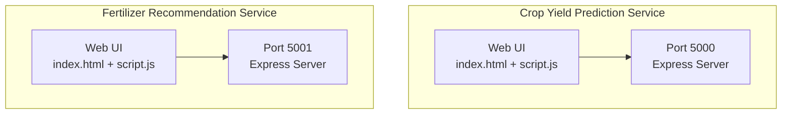
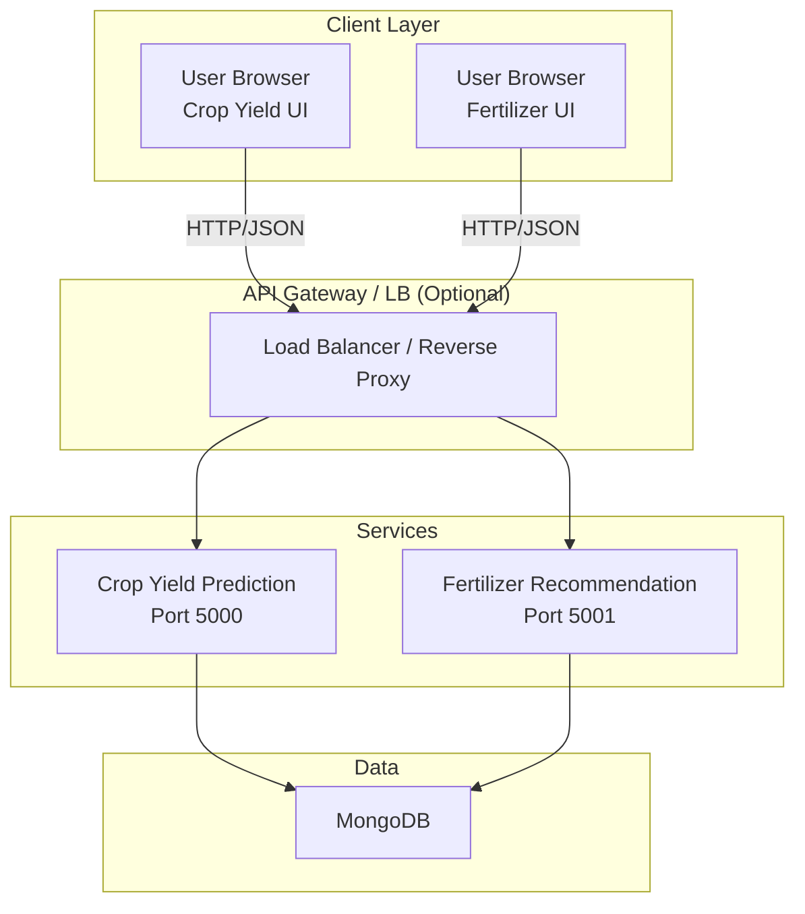
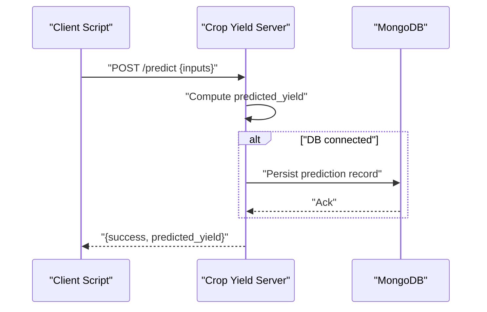
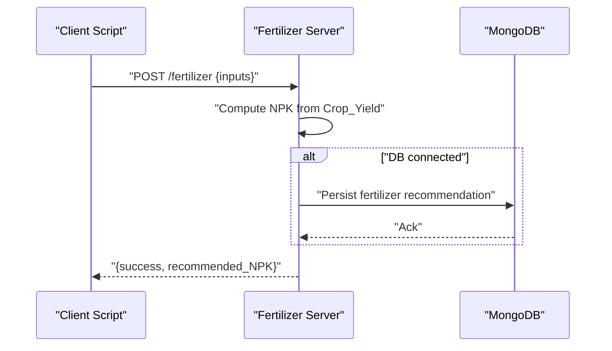
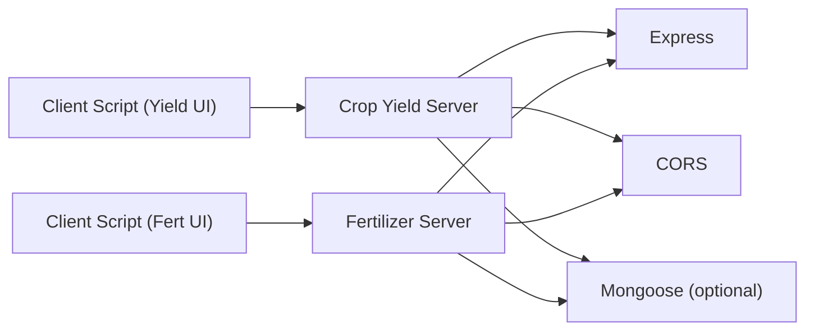

# Microservice Architecture

<cite>
**Referenced Files in This Document**
- [server.js](file://simple webpage/server.js)
- [server.js](file://simple webpage reverse/server.js)
- [package.json](file://simple webpage/package.json)
- [package.json](file://simple webpage reverse/package.json)
- [script.js](file://simple webpage/script.js)
- [script.js](file://simple webpage reverse/script.js)
- [index.html](file://simple webpage/index.html)
- [index.html](file://simple webpage reverse/index.html)
- [i18n.js](file://simple webpage/i18n.js)
- [i18n.js](file://simple webpage reverse/i18n.js)
- [three.js](file://simple webpage/three.js)
- [firebase.js](file://simple webpage/firebase.js)
</cite>

## Table of Contents
1. [Introduction](#introduction)
2. [Project Structure](#project-structure)
3. [Core Components](#core-components)
4. [Architecture Overview](#architecture-overview)
5. [Detailed Component Analysis](#detailed-component-analysis)
6. [Dependency Analysis](#dependency-analysis)
7. [Performance Considerations](#performance-considerations)
8. [Troubleshooting Guide](#troubleshooting-guide)
9. [Conclusion](#conclusion)
10. [Appendices](#appendices)

## Introduction
This document describes the dual microservice design pattern implemented by two independent applications:
- Crop Yield Prediction microservice (port 5000)
- Fertilizer Recommendation microservice (port 5001)

Each service encapsulates a single responsibility, exposes a focused API, and runs independently. The frontend clients in each service call their respective backend endpoints, enabling independent scaling, fault isolation, and streamlined feature development.

## Project Structure
The repository contains two separate frontend/backend service folders:
- simple webpage: Hosts the Crop Yield Prediction service and its web UI
- simple webpage reverse: Hosts the Fertilizer Recommendation service and its web UI

Both services share similar Express.js server configurations, optional MongoDB persistence, and identical middleware stacks (CORS and JSON parsing). They differ primarily in routes, business logic, and data models.

**Diagram sources**
- [server.js:1-68](file://simple webpage/server.js#L1-L68)
- [server.js:1-65](file://simple webpage reverse/server.js#L1-L65)
- [script.js:1-73](file://simple webpage/script.js#L1-L73)
- [script.js:1-64](file://simple webpage reverse/script.js#L1-L64)

**Section sources**
- [server.js:1-68](file://simple webpage/server.js#L1-L68)
- [server.js:1-65](file://simple webpage reverse/server.js#L1-L65)
- [package.json:1-15](file://simple webpage/package.json#L1-L15)
- [package.json:1-19](file://simple webpage reverse/package.json#L1-L19)

## Core Components
- Crop Yield Prediction Service
  - Route: POST /predict
  - Purpose: Accepts environmental and nutrient inputs and returns a predicted yield value
  - Persistence: Optional MongoDB model for storing prediction records
  - Port: 5000

- Fertilizer Recommendation Service
  - Route: POST /fertilizer
  - Purpose: Accepts crop type, soil type, and target yield to recommend NPK values
  - Persistence: Optional MongoDB model for storing fertilizer recommendations
  - Port: 5001

- Frontend Clients
  - Both services include a minimal HTML form and JavaScript client that submits requests to their respective backend ports
  - The Crop Yield Prediction UI links to the Fertilizer Recommendation UI and vice versa

- Shared Infrastructure
  - Both services use Express.js with CORS enabled and JSON body parsing
  - Optional MongoDB connection is attempted at startup; if unavailable, the services continue without persistence
  - Static file serving is configured to serve the local UI assets

**Section sources**
- [server.js:44-64](file://simple webpage/server.js#L44-L64)
- [server.js:41-61](file://simple webpage reverse/server.js#L41-L61)
- [script.js:13-73](file://simple webpage/script.js#L13-L73)
- [script.js:12-64](file://simple webpage reverse/script.js#L12-L64)
- [index.html:1-116](file://simple webpage/index.html#L1-L116)
- [index.html:1-98](file://simple webpage reverse/index.html#L1-L98)

## Architecture Overview
The system follows a classic microservice pattern:
- Two independent services, each with its own runtime process and port
- Clear separation of concerns: prediction vs. recommendation
- Independent scaling: scale each service based on demand
- Fault isolation: failure in one service does not cascade to the other
- Optional persistence: both services can operate without MongoDB

[No sources needed since this diagram shows conceptual workflow, not actual code structure]

## Detailed Component Analysis

### Crop Yield Prediction Service
- Express server configuration
  - Middleware chain: CORS, JSON body parser, static file serving
  - Optional MongoDB connection and model creation
  - Route: POST /predict computes predicted yield from inputs and optionally persists the record

- Request/Response contract
  - Endpoint: POST /predict
  - Request body keys: Crop_Type, Soil_Type, N, P, K, Temperature, Humidity, Wind_Speed
  - Response: success flag and predicted_yield

- Data model (when DB is available)
  - Collection: Prediction
  - Fields: Crop_Type, Soil_Type, N, P, K, Temperature, Humidity, Wind_Speed, predicted_yield

**Diagram sources**
- [server.js:44-64](file://simple webpage/server.js#L44-L64)
- [script.js:35-48](file://simple webpage/script.js#L35-L48)

**Section sources**
- [server.js:10-64](file://simple webpage/server.js#L10-L64)
- [script.js:13-73](file://simple webpage/script.js#L13-L73)
- [index.html:36-95](file://simple webpage/index.html#L36-L95)

### Fertilizer Recommendation Service
- Express server configuration
  - Middleware chain: CORS, JSON body parser, static file serving
  - Optional MongoDB connection and model creation
  - Route: POST /fertilizer computes NPK recommendation from inputs and optionally persists the record

- Request/Response contract
  - Endpoint: POST /fertilizer
  - Request body keys: Crop_Type, Soil_Type, Crop_Yield
  - Response: success flag and recommended_NPK { N, P, K }

- Data model (when DB is available)
  - Collection: Fertilizer
  - Fields: Crop_Type, Soil_Type, Crop_Yield, N, P, K

**Diagram sources**
- [server.js:41-61](file://simple webpage reverse/server.js#L41-L61)
- [script.js:18-40](file://simple webpage reverse/script.js#L18-L40)

**Section sources**
- [server.js:10-61](file://simple webpage reverse/server.js#L10-L61)
- [script.js:12-64](file://simple webpage reverse/script.js#L12-L64)
- [index.html:32-77](file://simple webpage reverse/index.html#L32-L77)

### Cross-Service Navigation
- The Crop Yield Prediction UI includes a link to the Fertilizer Recommendation UI (port 5001)
- The Fertilizer Recommendation UI includes a link to the Crop Yield Prediction UI (port 5000)
- These links enable seamless navigation between services without requiring shared backend coordination

**Section sources**
- [index.html:92-95](file://simple webpage/index.html#L92-L95)
- [index.html:73-77](file://simple webpage reverse/index.html#L73-L77)

## Dependency Analysis
- Internal dependencies
  - Express.js for HTTP server and routing
  - CORS for cross-origin allowance
  - Mongoose for optional MongoDB persistence
  - Static file serving for UI assets

- External dependencies
  - MongoDB (optional); if unavailable, services continue operating without persistence
  - Client-side libraries (Three.js, Firebase) are loaded via CDN in the UI

**Diagram sources**
- [server.js:1-16](file://simple webpage/server.js#L1-L16)
- [server.js:1-16](file://simple webpage reverse/server.js#L1-L16)
- [package.json:10-14](file://simple webpage/package.json#L10-L14)
- [package.json:14-18](file://simple webpage reverse/package.json#L14-L18)

**Section sources**
- [package.json:10-14](file://simple webpage/package.json#L10-L14)
- [package.json:14-18](file://simple webpage reverse/package.json#L14-L18)

## Performance Considerations
- Independent scaling
  - Scale each service based on observed traffic; for example, increase replicas for the service with higher request volume
- Resource allocation
  - Assign CPU/memory limits per service pod/process to prevent resource contention
- Caching
  - Consider adding lightweight caching for repeated predictions/recommendations if latency is critical
- Database optimization
  - If MongoDB is used, ensure appropriate indexing on frequently queried fields (e.g., Crop_Type, Soil_Type)
- Network efficiency
  - Keep payloads minimal; both services already send concise JSON bodies

[No sources needed since this section provides general guidance]

## Troubleshooting Guide
- Service startup
  - Verify that the MongoDB service is reachable if persistence is desired; otherwise, services will log warnings and continue without DB
- CORS errors
  - Confirm that the client requests originate from the expected origins and that the CORS middleware is active
- Route mismatches
  - Ensure client scripts call the correct endpoint (/predict vs /fertilizer) and port (5000 vs 5001)
- Database persistence failures
  - Inspect logs for DB save failures; the services continue operation even if persistence fails
- UI navigation
  - Confirm that internal links point to the correct ports and that both services are running

**Section sources**
- [server.js:22-28](file://simple webpage/server.js#L22-L28)
- [server.js:22-28](file://simple webpage reverse/server.js#L22-L28)
- [script.js:35-42](file://simple webpage/script.js#L35-L42)
- [script.js:27-34](file://simple webpage reverse/script.js#L27-L34)

## Conclusion
The dual microservice design cleanly separates Crop Yield Prediction and Fertilizer Recommendation into independent, scalable units. Each service maintains its own API, data model, and persistence strategy while sharing common Express.js infrastructure. This architecture supports independent feature development, targeted scaling, and robust fault isolation—ideal for agricultural decision support systems where reliability and modularity are paramount.

[No sources needed since this section summarizes without analyzing specific files]

## Appendices

### API Contracts Summary
- Crop Yield Prediction
  - Method: POST
  - Path: /predict
  - Body: Crop_Type, Soil_Type, N, P, K, Temperature, Humidity, Wind_Speed
  - Response: success, predicted_yield

- Fertilizer Recommendation
  - Method: POST
  - Path: /fertilizer
  - Body: Crop_Type, Soil_Type, Crop_Yield
  - Response: success, recommended_NPK { N, P, K }

**Section sources**
- [server.js:44-64](file://simple webpage/server.js#L44-L64)
- [server.js:41-61](file://simple webpage reverse/server.js#L41-L61)

### Deployment and Monitoring Recommendations
- Deployment
  - Run each service in its own container or process; expose port 5000 and 5001 respectively
  - Use a reverse proxy or load balancer to distribute traffic if needed
- Observability
  - Enable structured logging for both services
  - Add health checks for readiness/liveness
  - Monitor request latency, error rates, and DB connectivity status

[No sources needed since this section provides general guidance]