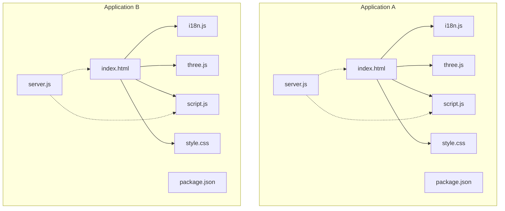
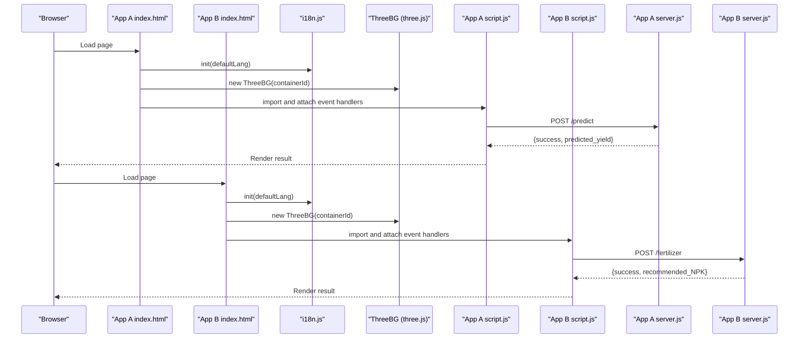
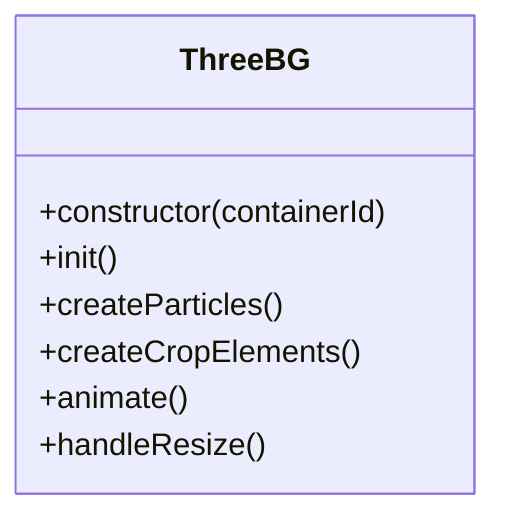
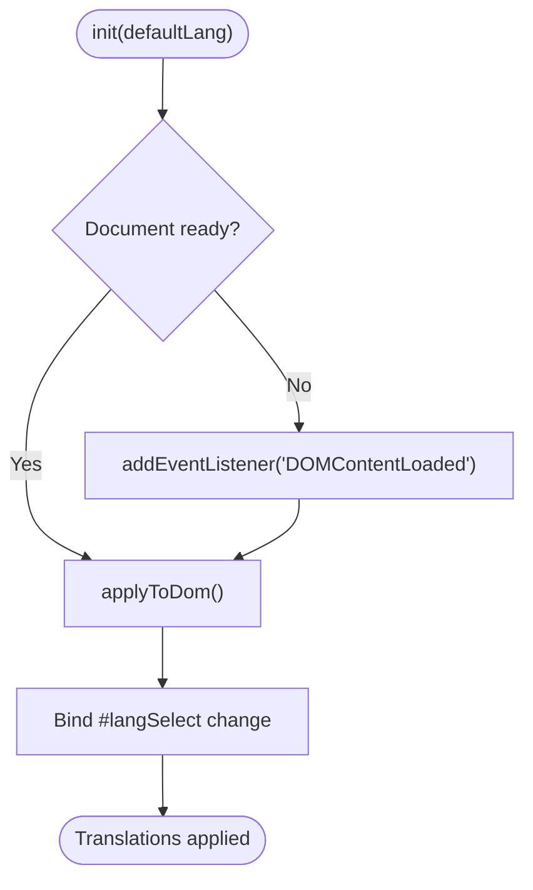
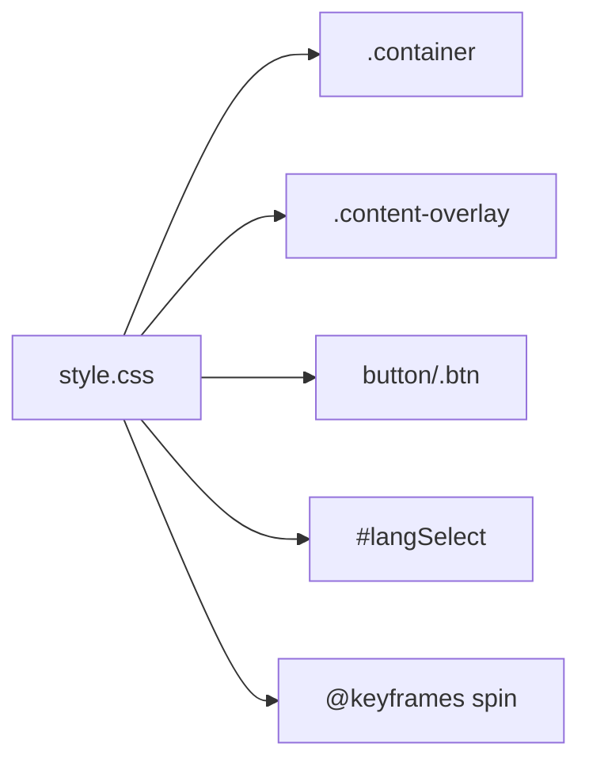
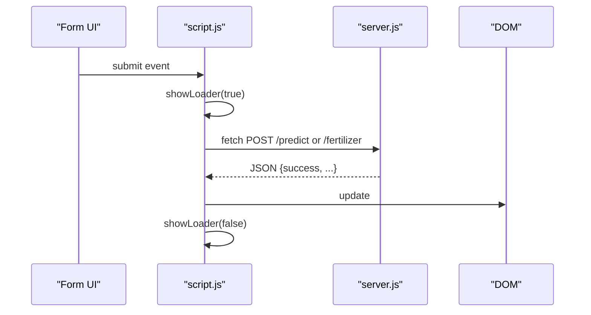
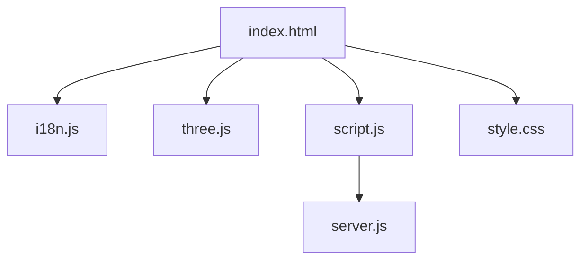

# Shared Frontend Components

<cite>
**Referenced Files in This Document**
- [index.html](file://simple webpage/index.html)
- [script.js](file://simple webpage/script.js)
- [i18n.js](file://simple webpage/i18n.js)
- [three.js](file://simple webpage/three.js)
- [style.css](file://simple webpage/style.css)
- [server.js](file://simple webpage/server.js)
- [package.json](file://simple webpage/package.json)
- [index.html](file://simple webpage reverse/index.html)
- [script.js](file://simple webpage reverse/script.js)
- [i18n.js](file://simple webpage reverse/i18n.js)
- [three.js](file://simple webpage reverse/three.js)
- [style.css](file://simple webpage reverse/style.css)
- [server.js](file://simple webpage reverse/server.js)
- [package.json](file://simple webpage reverse/package.json)
</cite>

## Table of Contents
1. [Introduction](#introduction)
2. [Project Structure](#project-structure)
3. [Core Components](#core-components)
4. [Architecture Overview](#architecture-overview)
5. [Detailed Component Analysis](#detailed-component-analysis)
6. [Dependency Analysis](#dependency-analysis)
7. [Performance Considerations](#performance-considerations)
8. [Troubleshooting Guide](#troubleshooting-guide)
9. [Conclusion](#conclusion)
10. [Appendices](#appendices)

## Introduction
This document describes the shared frontend component system used by two related web applications. Both applications share:
- A Three.js 3D visualization engine instantiated via a reusable ThreeBG class
- An internationalization system implemented by a shared i18n module
- A unified styling framework based on a shared CSS file
- Modular JavaScript design with separate concerns for UI logic, rendering, and translation
- Responsive design principles and cross-browser compatibility considerations

The goal is to explain how these shared components are structured, how they are reused across applications, and how the system supports maintainability, performance, and consistency.

## Project Structure
Each application follows a similar structure:
- A single HTML entry point that loads shared assets and initializes shared modules
- A shared Three.js background renderer encapsulated in a class
- A shared internationalization module for multi-language support
- A shared stylesheet for consistent visuals and responsive layout
- A small client-side script that handles form submission and UI updates
- A local Express server that serves static assets and exposes a simple API

**Diagram sources**
- [index.html](file://simple webpage/index.html)
- [script.js](file://simple webpage/script.js)
- [i18n.js](file://simple webpage/i18n.js)
- [three.js](file://simple webpage/three.js)
- [style.css](file://simple webpage/style.css)
- [server.js](file://simple webpage/server.js)
- [package.json](file://simple webpage/package.json)
- [index.html](file://simple webpage reverse/index.html)
- [script.js](file://simple webpage reverse/script.js)
- [i18n.js](file://simple webpage reverse/i18n.js)
- [three.js](file://simple webpage reverse/three.js)
- [style.css](file://simple webpage reverse/style.css)
- [server.js](file://simple webpage reverse/server.js)
- [package.json](file://simple webpage reverse/package.json)

**Section sources**
- [index.html](file://simple webpage/index.html)
- [index.html](file://simple webpage reverse/index.html)

## Core Components
- Three.js background renderer (ThreeBG class)
  - Initializes a scene, camera, and WebGL renderer
  - Creates animated particle systems and crop-related geometry
  - Handles resize events to maintain aspect ratio
  - Provides a singleton-like usage pattern via constructor injection
  - See [three.js](file://simple webpage/three.js) and [three.js](file://simple webpage reverse/three.js)

- Internationalization system (i18n module)
  - Centralized translation keys and language switching
  - DOM synchronization via data attributes
  - Initialization hook to apply translations on load
  - See [i18n.js](file://simple webpage/i18n.js) and [i18n.js](file://simple webpage reverse/i18n.js)

- Shared styling framework (style.css)
  - Responsive layout with a centered content overlay
  - Backdrop blur and transparency for readability over 3D background
  - Consistent typography and interactive elements
  - See [style.css](file://simple webpage/style.css) and [style.css](file://simple webpage reverse/style.css)

- Modular JavaScript design
  - UI logic separated into per-application scripts
  - Shared initialization and lifecycle hooks in HTML
  - See [script.js](file://simple webpage/script.js), [script.js](file://simple webpage reverse/script.js), [index.html](file://simple webpage/index.html), and [index.html](file://simple webpage reverse/index.html)

**Section sources**
- [three.js](file://simple webpage/three.js)
- [three.js](file://simple webpage reverse/three.js)
- [i18n.js](file://simple webpage/i18n.js)
- [i18n.js](file://simple webpage reverse/i18n.js)
- [style.css](file://simple webpage/style.css)
- [style.css](file://simple webpage reverse/style.css)
- [script.js](file://simple webpage/script.js)
- [script.js](file://simple webpage reverse/script.js)
- [index.html](file://simple webpage/index.html)
- [index.html](file://simple webpage reverse/index.html)

## Architecture Overview
Both applications initialize the Three.js background and internationalization system during page load, then attach application-specific logic to handle forms and API requests. The servers expose lightweight endpoints for predictions and fertilizer recommendations.

**Diagram sources**
- [index.html](file://simple webpage/index.html)
- [index.html](file://simple webpage reverse/index.html)
- [i18n.js](file://simple webpage/i18n.js)
- [i18n.js](file://simple webpage reverse/i18n.js)
- [three.js](file://simple webpage/three.js)
- [three.js](file://simple webpage reverse/three.js)
- [script.js](file://simple webpage/script.js)
- [script.js](file://simple webpage reverse/script.js)
- [server.js](file://simple webpage/server.js)
- [server.js](file://simple webpage reverse/server.js)

## Detailed Component Analysis

### Three.js Background Renderer (ThreeBG)
- Responsibilities
  - Scene setup, lighting, and camera configuration
  - Particle and geometry creation for visual effects
  - Animation loop and resize handling
- Singleton pattern
  - Instantiated once per page via constructor injection
  - Resize listener attached to window to update camera and renderer
- Differences between applications
  - Application A renders generic crop particles
  - Application B renders N-P-K particles and floating molecules
- Complexity
  - Animation loop runs continuously; performance depends on geometry count and materials
- Error handling
  - Gracefully warns if the container element is missing

**Diagram sources**
- [three.js](file://simple webpage/three.js)
- [three.js](file://simple webpage reverse/three.js)

**Section sources**
- [three.js](file://simple webpage/three.js)
- [three.js](file://simple webpage reverse/three.js)

### Internationalization System (I18nSystem)
- Responsibilities
  - Centralized translation dictionary keyed by language
  - Dynamic DOM updates via data attributes
  - Language selection binding to a dropdown
- Implementation
  - Exported helpers: t, setLanguage, getLanguage, applyToDom, init
  - Applies translations on DOMContentLoaded or immediately if ready
- Reuse pattern
  - Both applications import the same module and call init once

**Diagram sources**
- [i18n.js](file://simple webpage/i18n.js)
- [i18n.js](file://simple webpage reverse/i18n.js)

**Section sources**
- [i18n.js](file://simple webpage/i18n.js)
- [i18n.js](file://simple webpage reverse/i18n.js)

### Styling Framework and Responsive Design
- Shared styles
  - Fixed-position Three.js container and background image fallback
  - Centered content container with backdrop blur and readable overlay
  - Consistent typography using a Google Font
- Responsive behavior
  - Flexible widths, viewport meta tag, and percentage-based paddings
- Cross-browser considerations
  - Uses widely supported CSS features; animations rely on standard keyframes

**Diagram sources**
- [style.css](file://simple webpage/style.css)
- [style.css](file://simple webpage reverse/style.css)

**Section sources**
- [style.css](file://simple webpage/style.css)
- [style.css](file://simple webpage reverse/style.css)

### Modular JavaScript Design and Application Logic
- Application A
  - Submits crop prediction form to a backend endpoint
  - Displays loading state and results
- Application B
  - Submits fertilizer recommendation form to a backend endpoint
  - Displays N-P-K recommendation
- Both scripts:
  - Control loader visibility and button state
  - Handle errors and render user feedback

**Diagram sources**
- [script.js](file://simple webpage/script.js)
- [script.js](file://simple webpage reverse/script.js)
- [server.js](file://simple webpage/server.js)
- [server.js](file://simple webpage reverse/server.js)

**Section sources**
- [script.js](file://simple webpage/script.js)
- [script.js](file://simple webpage reverse/script.js)
- [server.js](file://simple webpage/server.js)
- [server.js](file://simple webpage reverse/server.js)

## Dependency Analysis
- Module dependencies
  - HTML imports shared modules via ES modules
  - Both apps depend on the same i18n and three.js modules
- Build and runtime
  - No bundling step; relies on native ES modules and CDN-hosted Three.js
  - Static asset serving via Express
- External libraries
  - Three.js loaded from CDN
  - Express and CORS for local development servers

**Diagram sources**
- [index.html](file://simple webpage/index.html)
- [index.html](file://simple webpage reverse/index.html)
- [i18n.js](file://simple webpage/i18n.js)
- [i18n.js](file://simple webpage reverse/i18n.js)
- [three.js](file://simple webpage/three.js)
- [three.js](file://simple webpage reverse/three.js)
- [script.js](file://simple webpage/script.js)
- [script.js](file://simple webpage reverse/script.js)
- [style.css](file://simple webpage/style.css)
- [style.css](file://simple webpage reverse/style.css)
- [server.js](file://simple webpage/server.js)
- [server.js](file://simple webpage reverse/server.js)

**Section sources**
- [package.json](file://simple webpage/package.json)
- [package.json](file://simple webpage reverse/package.json)

## Performance Considerations
- Three.js rendering
  - Use BufferGeometry and PointsMaterials for efficient particle rendering
  - Limit particle counts for lower-end devices
  - Disable antialiasing or reduce quality if needed
- Animation loop
  - requestAnimationFrame ensures smooth updates; avoid heavy computations per frame
- Network requests
  - Debounce or disable submit buttons while loading to prevent duplicate requests
- CSS and DOM
  - backdrop-filter and blur can be expensive; test on mobile devices
  - Minimize DOM queries inside loops
- Asset delivery
  - Prefer CDN-hosted Three.js to reduce bundle size
  - Serve static assets efficiently via Express

[No sources needed since this section provides general guidance]

## Troubleshooting Guide
- Three.js container not found
  - Ensure the container element exists and is correctly referenced
  - Verify the ThreeBG constructor receives the proper ID
  - Check for typos in the container ID
- Translations not applying
  - Confirm data-i18n attributes are present on target elements
  - Ensure init is called after DOMContentLoaded
  - Verify the selected language is supported
- Forms not submitting
  - Check that the correct form IDs are used in scripts
  - Inspect network tab for fetch errors and CORS configuration
- Server not responding
  - Confirm the server is running on the expected port
  - Validate route paths and request payloads
- Resize issues
  - Ensure handleResize is bound to the window resize event

**Section sources**
- [three.js](file://simple webpage/three.js)
- [i18n.js](file://simple webpage/i18n.js)
- [script.js](file://simple webpage/script.js)
- [server.js](file://simple webpage/server.js)

## Conclusion
By centralizing the Three.js background, internationalization, and styling into shared modules, both applications achieve:
- Consistency in visuals and behavior
- Reduced duplication and faster iteration
- Clear separation of concerns and maintainable code

Adopting these patterns accelerates development, improves reliability, and simplifies future enhancements.

[No sources needed since this section summarizes without analyzing specific files]

## Appendices

### File Structure Organization
- Application A
  - Entry: [index.html](file://simple webpage/index.html)
  - Logic: [script.js](file://simple webpage/script.js)
  - Translation: [i18n.js](file://simple webpage/i18n.js)
  - Rendering: [three.js](file://simple webpage/three.js)
  - Styles: [style.css](file://simple webpage/style.css)
  - Server: [server.js](file://simple webpage/server.js)
  - Config: [package.json](file://simple webpage/package.json)
- Application B
  - Entry: [index.html](file://simple webpage reverse/index.html)
  - Logic: [script.js](file://simple webpage reverse/script.js)
  - Translation: [i18n.js](file://simple webpage reverse/i18n.js)
  - Rendering: [three.js](file://simple webpage reverse/three.js)
  - Styles: [style.css](file://simple webpage reverse/style.css)
  - Server: [server.js](file://simple webpage reverse/server.js)
  - Config: [package.json](file://simple webpage reverse/package.json)

**Section sources**
- [index.html](file://simple webpage/index.html)
- [script.js](file://simple webpage/script.js)
- [i18n.js](file://simple webpage/i18n.js)
- [three.js](file://simple webpage/three.js)
- [style.css](file://simple webpage/style.css)
- [server.js](file://simple webpage/server.js)
- [package.json](file://simple webpage/package.json)
- [index.html](file://simple webpage reverse/index.html)
- [script.js](file://simple webpage reverse/script.js)
- [i18n.js](file://simple webpage reverse/i18n.js)
- [three.js](file://simple webpage reverse/three.js)
- [style.css](file://simple webpage reverse/style.css)
- [server.js](file://simple webpage reverse/server.js)
- [package.json](file://simple webpage reverse/package.json)

### Build Processes and Deployment Strategies
- Current setup
  - No build step; served statically via Express
  - Native ES modules with CDN-hosted Three.js
- Suggested improvements
  - Introduce a bundler (e.g., Vite, Rollup) to optimize assets and enable tree-shaking
  - Split bundles for i18n and Three.js to improve caching
  - Add a pre-deploy lint and test step
- Deployment
  - Serve static assets from a CDN or static hosting provider
  - Run servers behind a reverse proxy for HTTPS and load balancing
  - Use environment variables for API endpoints and feature flags

[No sources needed since this section provides general guidance]

### Maintenance Strategies for Shared Codebases
- Version control
  - Keep shared modules in a dedicated folder and version them independently
- Change management
  - Use feature flags for gradual rollouts of shared changes
- Testing
  - Add unit tests for i18n keys and Three.js initialization
- Documentation
  - Maintain a changelog for shared modules and update integration guides for each app

[No sources needed since this section provides general guidance]