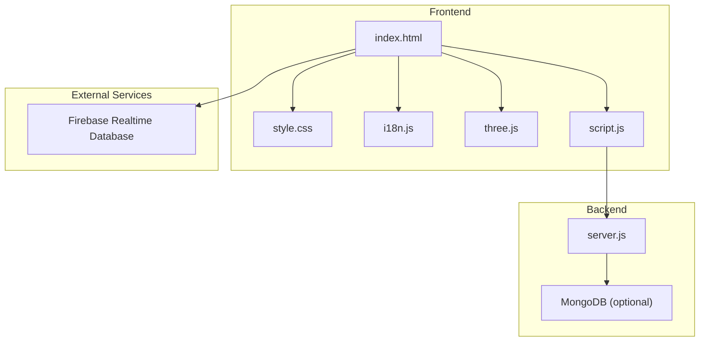
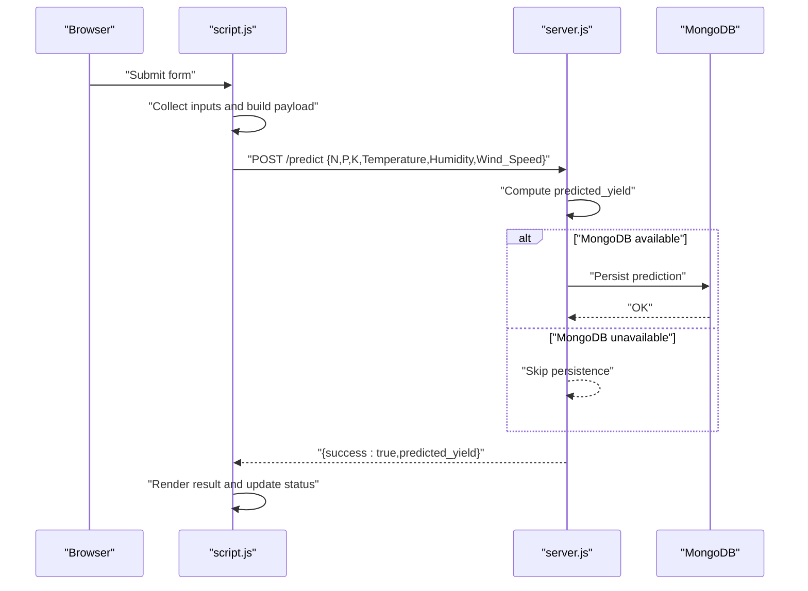
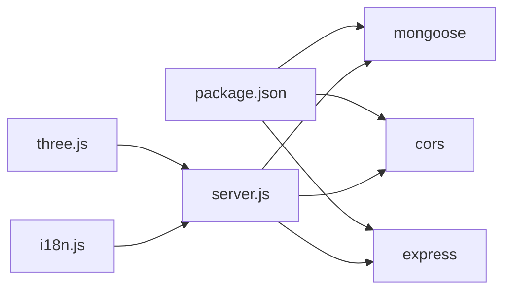
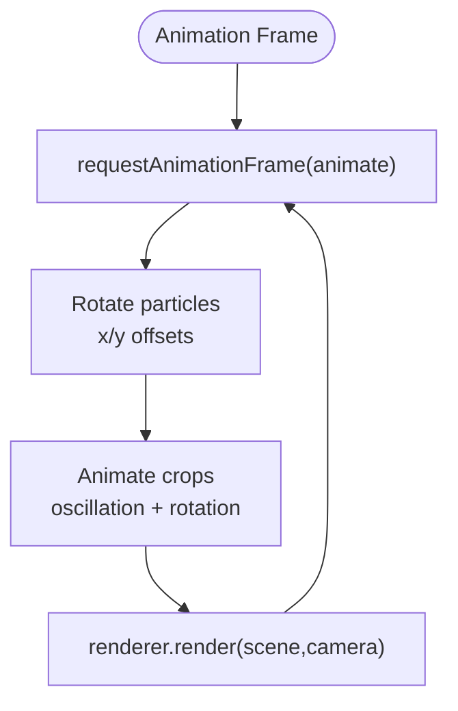

# Crop Yield Prediction Application

<cite>
**Referenced Files in This Document**
- [server.js](file://simple webpage/server.js)
- [script.js](file://simple webpage/script.js)
- [i18n.js](file://simple webpage/i18n.js)
- [three.js](file://simple webpage/three.js)
- [index.html](file://simple webpage/index.html)
- [style.css](file://simple webpage/style.css)
- [package.json](file://simple webpage/package.json)
- [firebase.js](file://simple webpage/firebase.js)
</cite>

## Table of Contents
1. [Introduction](#introduction)
2. [Project Structure](#project-structure)
3. [Core Components](#core-components)
4. [Architecture Overview](#architecture-overview)
5. [Detailed Component Analysis](#detailed-component-analysis)
6. [Dependency Analysis](#dependency-analysis)
7. [Performance Considerations](#performance-considerations)
8. [Troubleshooting Guide](#troubleshooting-guide)
9. [Conclusion](#conclusion)
10. [Appendices](#appendices)

## Introduction
This document explains the crop yield prediction application, focusing on:
- The prediction algorithm and mathematical model for crop yields based on NPK ratios and weather conditions
- The backend API endpoint (/predict) with request/response schemas, input validation, and error handling
- Frontend form processing, real-time feedback mechanisms, and result display patterns
- MongoDB integration for storing prediction history and query optimization strategies
- Three.js 3D visualization implementation, animation loops, and performance considerations
- Internationalization support for English/Hindi language switching
- Concrete examples from the actual codebase showing API usage, form handling, and database operations

## Project Structure
The application consists of a frontend web interface and a Node.js/Express backend with optional MongoDB persistence. It also integrates Firebase Realtime Database and Three.js for interactive 3D visuals.

**Diagram sources**
- [index.html:1-116](file://simple webpage/index.html#L1-L116)
- [script.js:1-73](file://simple webpage/script.js#L1-L73)
- [i18n.js:1-122](file://simple webpage/i18n.js#L1-L122)
- [three.js:1-107](file://simple webpage/three.js#L1-L107)
- [server.js:1-68](file://simple webpage/server.js#L1-L68)
- [firebase.js:1-22](file://simple webpage/firebase.js#L1-L22)

**Section sources**
- [index.html:1-116](file://simple webpage/index.html#L1-L116)
- [style.css:1-173](file://simple webpage/style.css#L1-L173)
- [i18n.js:1-122](file://simple webpage/i18n.js#L1-L122)
- [three.js:1-107](file://simple webpage/three.js#L1-L107)
- [script.js:1-73](file://simple webpage/script.js#L1-L73)
- [server.js:1-68](file://simple webpage/server.js#L1-L68)
- [package.json:1-15](file://simple webpage/package.json#L1-L15)
- [firebase.js:1-22](file://simple webpage/firebase.js#L1-L22)

## Core Components
- Backend API server with Express and CORS middleware
- MongoDB integration for persisting predictions (optional)
- Frontend form for collecting crop inputs and displaying results
- Three.js animated background with floating crop elements
- Internationalization (i18n) module supporting English and Hindi
- Firebase Realtime Database client initialization

**Section sources**
- [server.js:1-68](file://simple webpage/server.js#L1-L68)
- [script.js:1-73](file://simple webpage/script.js#L1-L73)
- [i18n.js:1-122](file://simple webpage/i18n.js#L1-L122)
- [three.js:1-107](file://simple webpage/three.js#L1-L107)
- [firebase.js:1-22](file://simple webpage/firebase.js#L1-L22)

## Architecture Overview
The application follows a client-server architecture:
- The browser renders the UI and handles user interactions
- The frontend sends a POST request to /predict with crop and environmental inputs
- The backend computes a predicted yield using a weighted sum model
- The backend optionally persists the prediction to MongoDB
- The frontend displays the result and updates status messages
- Three.js renders an animated 3D background
- Firebase is initialized for potential real-time data usage

**Diagram sources**
- [script.js:13-72](file://simple webpage/script.js#L13-L72)
- [server.js:45-64](file://simple webpage/server.js#L45-L64)

## Detailed Component Analysis

### Backend API: /predict Endpoint
- Purpose: Compute predicted crop yield from NPK and weather inputs
- Method: POST
- Path: /predict
- Request Body Schema:
  - Crop_Type: string
  - Soil_Type: string
  - N: number (nitrogen ratio)
  - P: number (phosphorus ratio)
  - K: number (potassium ratio)
  - Temperature: number (fixed default 25)
  - Humidity: number (fixed default 60)
  - Wind_Speed: number (fixed default 2)
- Response Schema:
  - success: boolean
  - predicted_yield: number
- Mathematical Model:
  - predicted_yield = N*0.3 + P*0.2 + K*0.25 + Temperature*0.1 + Humidity*0.1 - Wind_Speed*0.05
- Input Validation:
  - Frontend validates numeric inputs and required fields
  - Backend expects numeric N, P, K and fixed weather defaults
- Error Handling:
  - On server errors, returns HTTP error status
  - On DB save failures, logs warning and continues
- Persistence:
  - If MongoDB connects successfully, stores the prediction record
  - If connection fails, logs a warning and proceeds without persistence

Example usage from frontend:
- [script.js:36-42](file://simple webpage/script.js#L36-L42)

Backend implementation:
- [server.js:45-64](file://simple webpage/server.js#L45-L64)

MongoDB schema definition:
- [server.js:31-42](file://simple webpage/server.js#L31-L42)

**Section sources**
- [script.js:13-72](file://simple webpage/script.js#L13-L72)
- [server.js:45-64](file://simple webpage/server.js#L45-L64)
- [server.js:31-42](file://simple webpage/server.js#L31-L42)

### Frontend Form Processing and UI Feedback
- Form Elements:
  - Crop_Type: text input
  - Soil_Type: dropdown selection
  - N, P, K: numeric inputs with step 0.01
  - Location: text input (city)
- Submission Flow:
  - Prevent default form submission
  - Disable submit button and show loader
  - Build payload with fixed weather defaults
  - Send POST to /predict
  - Update status and result area on success
  - Handle errors gracefully and re-enable controls
- Result Display:
  - Shows predicted_yield in kg/ha with green emphasis
- Real-time Feedback:
  - Status messages reflect processing state
  - Loader animation indicates ongoing request

Example paths:
- [index.html:36-79](file://simple webpage/index.html#L36-L79)
- [script.js:13-72](file://simple webpage/script.js#L13-L72)
- [style.css:147-162](file://simple webpage/style.css#L147-L162)

**Section sources**
- [index.html:36-79](file://simple webpage/index.html#L36-L79)
- [script.js:13-72](file://simple webpage/script.js#L13-L72)
- [style.css:147-162](file://simple webpage/style.css#L147-L162)

### MongoDB Integration and Query Optimization
- Connection:
  - Attempts to connect to mongodb://127.0.0.1:27017/crop_yield
  - Proceeds without DB if connection fails
- Schema:
  - Fields: Crop_Type, Soil_Type, N, P, K, Temperature, Humidity, Wind_Speed, predicted_yield
- Persistence:
  - Creates a new prediction record on successful /predict requests
  - Skips persistence on DB errors with a warning
- Query Optimization Strategies:
  - Indexing recommendations:
    - Compound index on {Crop_Type, Soil_Type} for filtering
    - Single-field indexes on {Temperature, Humidity, Wind_Speed} for weather-based queries
    - TTL index on createdAt for automatic cleanup of old predictions
  - Projection:
    - Retrieve only required fields in queries to reduce payload size
  - Aggregation:
    - Use aggregation pipeline for computing averages or trends across multiple predictions
  - Pagination:
    - Limit and skip for listing recent predictions
  - Caching:
    - Cache frequent queries (e.g., recent predictions per crop type) in memory

Implementation references:
- [server.js:22-28](file://simple webpage/server.js#L22-L28)
- [server.js:31-42](file://simple webpage/server.js#L31-L42)
- [server.js:55-61](file://simple webpage/server.js#L55-L61)

**Section sources**
- [server.js:22-28](file://simple webpage/server.js#L22-L28)
- [server.js:31-42](file://simple webpage/server.js#L31-L42)
- [server.js:55-61](file://simple webpage/server.js#L55-L61)

### Three.js 3D Visualization Implementation
- Scene Setup:
  - Perspective camera with aspect ratio matching window
  - WebGL renderer with transparency and antialiasing
  - Ambient and directional lighting
- Particles:
  - 100 randomly positioned points forming a diffuse cloud
  - Slow rotation around x and y axes
- Floating Crop Elements:
  - 20 small spheres representing crops
  - Slight vertical oscillation synchronized with time
  - Continuous rotation around y-axis
- Animation Loop:
  - requestAnimationFrame recursion
  - Updates particle rotations and crop positions
  - Renders scene with camera
- Resize Handling:
  - Recomputes aspect ratio and renderer size on window resize

Example paths:
- [three.js:20-35](file://simple webpage/three.js#L20-L35)
- [three.js:37-82](file://simple webpage/three.js#L37-L82)
- [three.js:84-100](file://simple webpage/three.js#L84-L100)
- [index.html:107-110](file://simple webpage/index.html#L107-L110)

**Section sources**
- [three.js:1-107](file://simple webpage/three.js#L1-L107)
- [index.html:107-110](file://simple webpage/index.html#L107-L110)

### Internationalization (i18n) Support
- Supported Languages: English (en) and Hindi (hi)
- Translations:
  - Keys include UI labels, placeholders, buttons, and status messages
  - Values are localized strings for both languages
- Functions:
  - t(key, vars): resolves translation with variable substitution
  - setLanguage(lang): switches language and applies to DOM
  - applyToDom(): updates elements marked with data-i18n attributes
  - init(defaultLang): initializes i18n on DOMContentLoaded
- DOM Integration:
  - Elements with data-i18n, data-i18n-placeholder, data-i18n-value, data-i18n-html are updated
  - Language selector dropdown reflects current language and triggers updates

Example paths:
- [i18n.js:1-52](file://simple webpage/i18n.js#L1-L52)
- [i18n.js:75-98](file://simple webpage/i18n.js#L75-L98)
- [i18n.js:103-122](file://simple webpage/i18n.js#L103-L122)
- [index.html:29-33](file://simple webpage/index.html#L29-L33)

**Section sources**
- [i18n.js:1-122](file://simple webpage/i18n.js#L1-L122)
- [index.html:29-33](file://simple webpage/index.html#L29-L33)

### Firebase Realtime Database Client Initialization
- Purpose: Initialize Firebase app and database client for potential real-time features
- Configuration: Uses provided Firebase project credentials
- Export: Exports the database instance for reuse across modules

Example path:
- [firebase.js:1-22](file://simple webpage/firebase.js#L1-L22)

**Section sources**
- [firebase.js:1-22](file://simple webpage/firebase.js#L1-L22)

## Dependency Analysis
- Runtime Dependencies:
  - express: Web framework
  - cors: Cross-origin resource sharing
  - mongoose: MongoDB ODM
- Development/Build:
  - ES modules enabled via package.json type: module
- External Integrations:
  - MongoDB for persistence
  - Firebase Realtime Database for potential real-time features
  - Three.js CDN for 3D rendering

**Diagram sources**
- [package.json:1-15](file://simple webpage/package.json#L1-L15)
- [server.js:1-68](file://simple webpage/server.js#L1-L68)
- [three.js:1-107](file://simple webpage/three.js#L1-L107)
- [i18n.js:1-122](file://simple webpage/i18n.js#L1-L122)

**Section sources**
- [package.json:1-15](file://simple webpage/package.json#L1-L15)
- [server.js:1-68](file://simple webpage/server.js#L1-L68)

## Performance Considerations
- Backend
  - Minimize synchronous operations in request handlers
  - Use async/await consistently to avoid blocking
  - Validate inputs early to fail fast
  - Consider rate limiting for /predict endpoint
- Database
  - Ensure MongoDB is reachable; otherwise, degrade gracefully
  - Use indexing strategies for frequent queries
  - Batch writes if throughput increases
- Frontend
  - Debounce repeated submissions while a request is pending
  - Optimize Three.js rendering:
    - Keep particle count reasonable (currently 100)
    - Avoid unnecessary re-computation in animation loop
    - Use requestAnimationFrame efficiently
  - Lazy-load heavy assets if needed
- Internationalization
  - Apply translations once per language switch
  - Avoid excessive DOM queries during updates

[No sources needed since this section provides general guidance]

## Troubleshooting Guide
- Backend not reachable
  - Verify server is running on port 5000
  - Check CORS configuration if cross-origin requests fail
  - Confirm MongoDB connectivity; if unavailable, the app still serves the UI
- Prediction endpoint errors
  - Ensure numeric values for N, P, K
  - Confirm request body includes required fields
  - Inspect server logs for DB save warnings
- Database persistence issues
  - Confirm MongoDB service is running locally
  - Check network/firewall settings for 127.0.0.1:27017
- Frontend not updating
  - Verify DOM elements exist (result, status, loader)
  - Check browser console for JavaScript errors
- Three.js not rendering
  - Ensure container element exists
  - Confirm Three.js import URL is accessible
- Internationalization not applying
  - Verify data-i18n attributes on elements
  - Confirm language selector event listeners are attached

**Section sources**
- [server.js:22-28](file://simple webpage/server.js#L22-L28)
- [server.js:55-61](file://simple webpage/server.js#L55-L61)
- [script.js:66-72](file://simple webpage/script.js#L66-L72)
- [three.js:4-9](file://simple webpage/three.js#L4-L9)
- [i18n.js:103-122](file://simple webpage/i18n.js#L103-L122)

## Conclusion
The crop yield prediction application combines a lightweight Express backend with a responsive frontend, optional MongoDB persistence, and an engaging Three.js 3D background. The /predict endpoint implements a straightforward weighted-sum model for yield estimation, while the frontend provides immediate feedback and supports English/Hindi localization. The architecture is modular and extensible, enabling future enhancements such as advanced analytics, caching, and real-time data integration via Firebase.

[No sources needed since this section summarizes without analyzing specific files]

## Appendices

### API Definition: /predict
- Method: POST
- Path: /predict
- Request Body
  - Crop_Type: string
  - Soil_Type: string
  - N: number
  - P: number
  - K: number
  - Temperature: number (default 25)
  - Humidity: number (default 60)
  - Wind_Speed: number (default 2)
- Response
  - success: boolean
  - predicted_yield: number

Example usage:
- [script.js:36-42](file://simple webpage/script.js#L36-L42)

**Section sources**
- [script.js:36-42](file://simple webpage/script.js#L36-L42)

### Mathematical Model Details
- Formula: predicted_yield = N*0.3 + P*0.2 + K*0.25 + Temperature*0.1 + Humidity*0.1 - Wind_Speed*0.05
- Interpretation:
  - Nitrogen contributes positively with weight 0.3
  - Phosphorus contributes positively with weight 0.2
  - Potassium contributes positively with weight 0.25
  - Temperature and Humidity contribute positively with weights 0.1 each
  - Wind_Speed reduces yield with weight 0.05

Implementation reference:
- [server.js:50-53](file://simple webpage/server.js#L50-L53)

**Section sources**
- [server.js:50-53](file://simple webpage/server.js#L50-L53)

### Three.js Animation Loop Flow

**Diagram sources**
- [three.js:84-100](file://simple webpage/three.js#L84-L100)