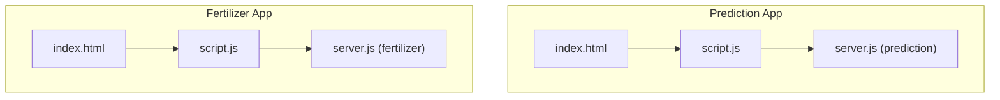
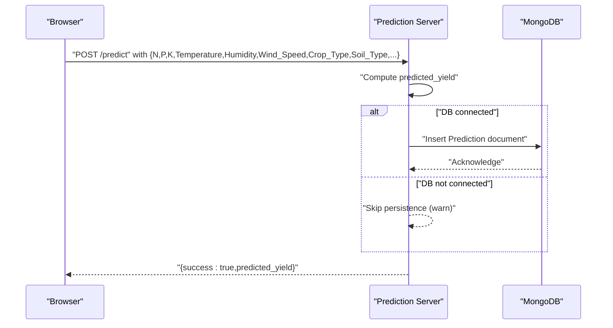
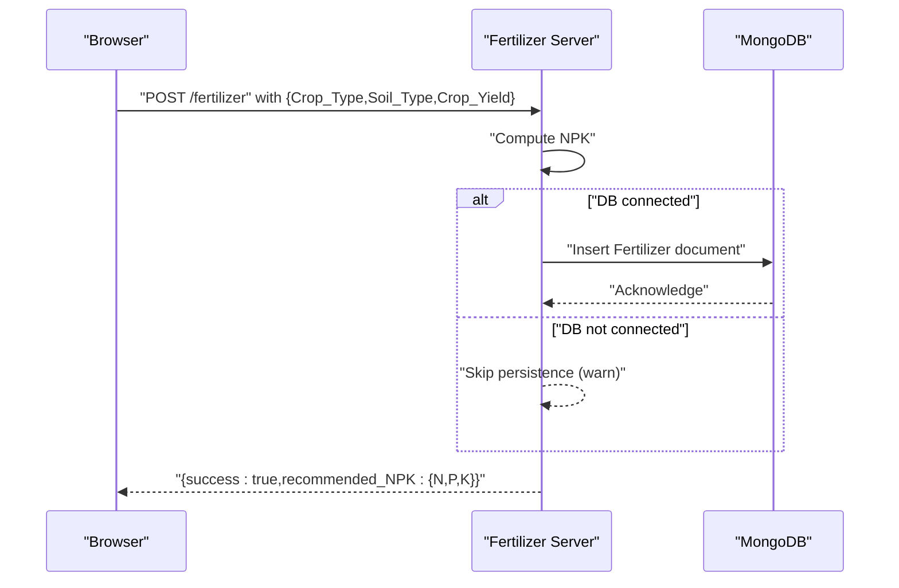
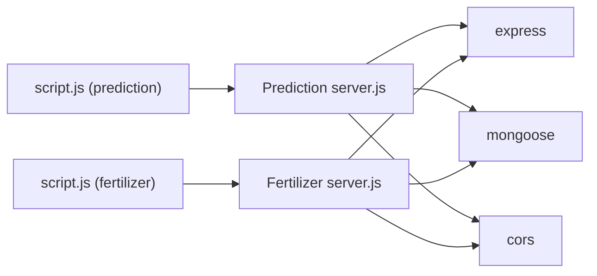

# MongoDB Integration and Data Persistence

<cite>
**Referenced Files in This Document**
- [server.js](file://simple webpage/server.js)
- [server.js](file://simple webpage reverse/server.js)
- [package.json](file://simple webpage/package.json)
- [package.json](file://simple webpage reverse/package.json)
- [index.html](file://simple webpage/index.html)
- [script.js](file://simple webpage/script.js)
- [index.html](file://simple webpage reverse/index.html)
- [script.js](file://simple webpage reverse/script.js)
- [firebase.js](file://simple webpage/firebase.js)
</cite>

## Table of Contents
1. [Introduction](#introduction)
2. [Project Structure](#project-structure)
3. [Core Components](#core-components)
4. [Architecture Overview](#architecture-overview)
5. [Detailed Component Analysis](#detailed-component-analysis)
6. [Dependency Analysis](#dependency-analysis)
7. [Performance Considerations](#performance-considerations)
8. [Troubleshooting Guide](#troubleshooting-guide)
9. [Conclusion](#conclusion)
10. [Appendices](#appendices)

## Introduction
This document explains the MongoDB integration and data persistence strategy for the crop yield prediction application. The system consists of two independent Node.js/Express servers:
- A prediction server that computes crop yield predictions and optionally persists them to MongoDB.
- A fertilizer recommendation server that computes NPK recommendations and optionally persists them to MongoDB.

Both servers use Mongoose to connect to a local MongoDB instance and gracefully continue operating without persistent storage if the database is unavailable. The document covers schema design, connection handling, CRUD operations, error management, and operational guidance for reliability and performance.

## Project Structure
The repository contains two separate web applications:
- simple webpage: prediction server and client UI
- simple webpage reverse: fertilizer recommendation server and client UI

Each server initializes Express, enables CORS, serves static assets, attempts to connect to MongoDB via Mongoose, defines a lightweight schema, and exposes a single POST endpoint. The client-side scripts send requests to the respective servers and render results.

**Section sources**
- [server.js:1-68](file://simple webpage/server.js#L1-L68)
- [server.js:1-65](file://simple webpage reverse/server.js#L1-L65)
- [index.html:1-116](file://simple webpage/index.html#L1-L116)
- [script.js:1-73](file://simple webpage/script.js#L1-L73)
- [index.html:1-98](file://simple webpage reverse/index.html#L1-L98)
- [script.js:1-64](file://simple webpage reverse/script.js#L1-L64)

## Core Components
- Prediction server
  - Connects to MongoDB using Mongoose.
  - Defines a Prediction model with fields for crop type, soil type, nutrients, weather-like inputs, and predicted yield.
  - On POST /predict, computes predicted yield and optionally persists the record.
- Fertilizer server
  - Connects to MongoDB using Mongoose.
  - Defines a Fertilizer model with fields for crop type, soil type, target yield, and recommended NPK.
  - On POST /fertilizer, computes NPK and optionally persists the recommendation.

Key characteristics:
- Optional MongoDB persistence: if the database connection fails, the servers log a warning and continue serving without persisting data.
- Lightweight schemas with minimal validation; data integrity relies on client-side constraints and request parsing.

**Section sources**
- [server.js:18-42](file://simple webpage/server.js#L18-L42)
- [server.js:18-39](file://simple webpage reverse/server.js#L18-L39)

## Architecture Overview
The runtime architecture combines client-side forms, server endpoints, and optional MongoDB persistence.

**Diagram sources**
- [server.js:45-64](file://simple webpage/server.js#L45-L64)
- [script.js:13-73](file://simple webpage/script.js#L13-L73)

**Diagram sources**
- [server.js:42-61](file://simple webpage reverse/server.js#L42-L61)
- [script.js:12-64](file://simple webpage reverse/script.js#L12-L64)

## Detailed Component Analysis

### Prediction Server: Schema, Model, and Endpoint
- Schema fields
  - Crop_Type: string
  - Soil_Type: string
  - N: number
  - P: number
  - K: number
  - Temperature: number
  - Humidity: number
  - Wind_Speed: number
  - predicted_yield: number
- Model creation and connection
  - Uses Mongoose to connect to mongodb://127.0.0.1:27017/crop_yield.
  - On success, creates the Prediction model; otherwise logs a warning and proceeds without persistence.
- Endpoint behavior
  - POST /predict computes predicted_yield from inputs and conditionally persists the record.
  - Returns a JSON response with success and predicted_yield.

Validation and constraints
- No explicit Mongoose validators are defined in the schema.
- Client-side constraints enforce presence of required numeric fields and selected soil type.

Operational notes
- The server continues running even if MongoDB is unavailable.
- Persistence failures are caught and logged as warnings; the endpoint still responds successfully.

**Section sources**
- [server.js:18-42](file://simple webpage/server.js#L18-L42)
- [server.js:45-64](file://simple webpage/server.js#L45-L64)
- [index.html:36-79](file://simple webpage/index.html#L36-L79)
- [script.js:13-42](file://simple webpage/script.js#L13-L42)

### Fertilizer Server: Schema, Model, and Endpoint
- Schema fields
  - Crop_Type: string
  - Soil_Type: string
  - Crop_Yield: number
  - N: number
  - P: number
  - K: number
- Model creation and connection
  - Uses Mongoose to connect to the same database URI.
  - On success, creates the Fertilizer model; otherwise logs a warning and proceeds without persistence.
- Endpoint behavior
  - POST /fertilizer computes NPK based on Crop_Yield and conditionally persists the recommendation.
  - Returns a JSON response with success and recommended_NPK.

Validation and constraints
- No explicit Mongoose validators are defined in the schema.
- Client-side constraints enforce presence of required fields and numeric conversion for Crop_Yield.

Operational notes
- The server continues running even if MongoDB is unavailable.
- Persistence failures are caught and logged as warnings; the endpoint still responds successfully.

**Section sources**
- [server.js:18-39](file://simple webpage reverse/server.js#L18-L39)
- [server.js:42-61](file://simple webpage reverse/server.js#L42-L61)
- [index.html:33-66](file://simple webpage reverse/index.html#L33-L66)
- [script.js:12-34](file://simple webpage reverse/script.js#L12-L34)

### Client-Side Integration
- Prediction app
  - Collects inputs from the form and sends a POST request to http://localhost:5000/predict.
  - Displays status messages and the computed predicted_yield.
- Fertilizer app
  - Collects inputs from the form and sends a POST request to http://localhost:5001/fertilizer.
  - Displays the computed NPK recommendation.

Error handling
- Both clients handle network errors and invalid responses by displaying user-friendly messages.

**Section sources**
- [script.js:13-73](file://simple webpage/script.js#L13-L73)
- [script.js:12-64](file://simple webpage reverse/script.js#L12-L64)

### Data Export and Aggregation (Conceptual Guidance)
Note: The current implementation does not expose retrieval endpoints or aggregation pipelines. To support exports and analytics:
- Add GET endpoints to fetch recent records filtered by date range, crop type, or soil type.
- Implement aggregation pipelines for statistics (average predicted yield per crop type, count of entries, etc.).
- Provide export endpoints that stream data as CSV or JSON.

[No sources needed since this section provides conceptual guidance]

## Dependency Analysis
- Runtime dependencies
  - Express: web framework for both servers.
  - Mongoose: ODM for MongoDB connectivity and model definition.
  - CORS: cross-origin allowance for local development.
- Package configuration
  - Both apps define type: module and use ES modules.
  - Scripts include start commands to run the servers.

**Diagram sources**
- [package.json:10-14](file://simple webpage/package.json#L10-L14)
- [package.json:14-18](file://simple webpage reverse/package.json#L14-L18)

**Section sources**
- [package.json:1-15](file://simple webpage/package.json#L1-L15)
- [package.json:1-19](file://simple webpage reverse/package.json#L1-L19)

## Performance Considerations
- Connection handling
  - Single connection per server to mongodb://127.0.0.1:27017/crop_yield.
  - No explicit connection pooling options configured; defaults apply.
- Indexing strategy
  - Current schema does not define indexes.
  - Recommended indexes for frequent filters:
    - Compound index on {Crop_Type, Soil_Type} for filtering by crop and soil.
    - Date-based index if timestamps are introduced later.
- Query optimization
  - Keep persisted documents minimal; current schemas are compact.
  - Avoid unnecessary projections; return only required fields in future retrieval endpoints.
- Throughput and latency
  - Persisting after computation adds synchronous write overhead; consider asynchronous writes or batching for high load.
  - Monitor average response times and adjust server resources accordingly.

[No sources needed since this section provides general guidance]

## Troubleshooting Guide
Common issues and resolutions
- MongoDB not available
  - Symptom: Warning logs indicating MongoDB not available; servers continue operating.
  - Resolution: Ensure MongoDB is installed and running locally on port 27017. Verify the connection URI matches your environment.
- Persistence failures during POST
  - Symptom: Warning logs about DB save failure; endpoint still returns success.
  - Resolution: Check database permissions, disk space, and connectivity. Consider retry logic or queueing writes for resilience.
- Client timeouts or errors
  - Symptom: Client displays “Backend not working properly”.
  - Resolution: Confirm server ports (5000/5001) are reachable and not blocked by firewall. Validate CORS configuration.

Operational checks
- Verify server logs for connection success or warnings.
- Test endpoints using curl or Postman to isolate client-side issues.

**Section sources**
- [server.js:18-28](file://simple webpage/server.js#L18-L28)
- [server.js:18-28](file://simple webpage reverse/server.js#L18-L28)
- [script.js:66-72](file://simple webpage/script.js#L66-L72)
- [script.js:58-63](file://simple webpage reverse/script.js#L58-L63)

## Conclusion
The application integrates MongoDB via Mongoose to optionally persist prediction and fertilizer recommendation records. The design emphasizes resilience: servers operate normally without persistent storage if MongoDB is unavailable. For production, consider adding retrieval endpoints, aggregation pipelines, indexes, and robust error handling around writes. The current lightweight schema supports fast iteration; future enhancements can introduce validation, timestamps, and export capabilities.

[No sources needed since this section summarizes without analyzing specific files]

## Appendices

### Database Initialization and Connection Pooling
- Initialization
  - Servers attempt to connect to mongodb://127.0.0.1:27017/crop_yield on startup.
  - On success, models are registered; on failure, a warning is logged and the app continues without persistence.
- Connection pooling
  - Default Mongoose connection pool settings are used; no explicit poolSize or other options are configured.
  - For higher concurrency, tune connection pool parameters and consider reusing connections.

**Section sources**
- [server.js:22-28](file://simple webpage/server.js#L22-L28)
- [server.js:22-28](file://simple webpage reverse/server.js#L22-L28)

### Graceful Degradation Mechanism
- Behavior
  - If MongoDB is unreachable, the servers remain fully functional for prediction and recommendation computations.
  - Writes are skipped with a warning; responses are still successful to maintain UX continuity.
- Recommendations
  - Optionally queue writes to a local store or external service and replay on reconnect.

**Section sources**
- [server.js:55-61](file://simple webpage/server.js#L55-L61)
- [server.js:52-58](file://simple webpage reverse/server.js#L52-L58)

### Data Migration and Backup Strategies
- Migration
  - For schema changes, implement a migration script that iterates existing documents and updates fields as needed.
  - Backward compatibility: keep old field names temporarily while transitioning to new ones.
- Backup
  - Use mongodump for periodic backups of the crop_yield database.
  - Automate backups with cron jobs or container-native scheduling.
- Restore
  - Use mongorestore to restore from backups; validate restored collections and indexes.

[No sources needed since this section provides general guidance]

### Monitoring and Observability
- Metrics
  - Track request rates, response latencies, and error counts for /predict and /fertilizer endpoints.
  - Monitor database connection health and write operation success rates.
- Logging
  - Centralize logs from both servers and MongoDB.
  - Tag logs with correlation IDs to trace requests across client, servers, and database.

[No sources needed since this section provides general guidance]