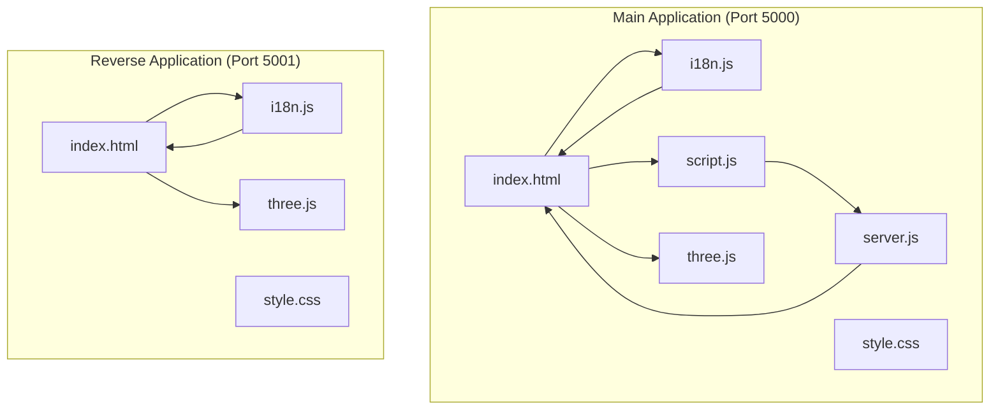
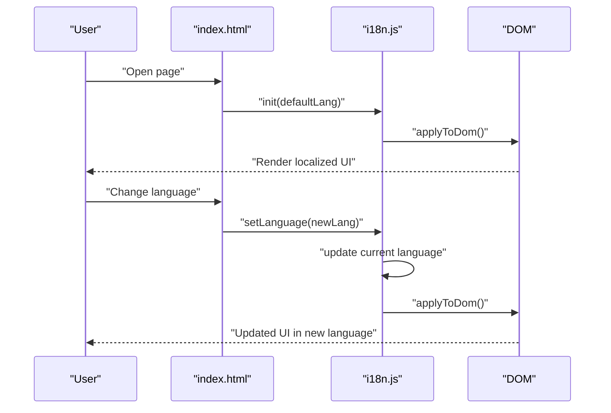
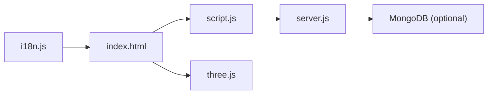
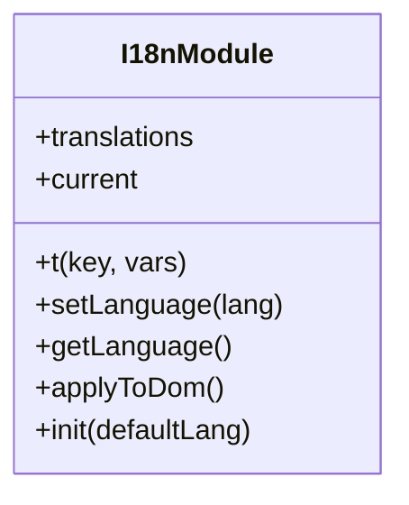
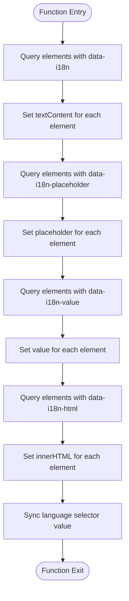
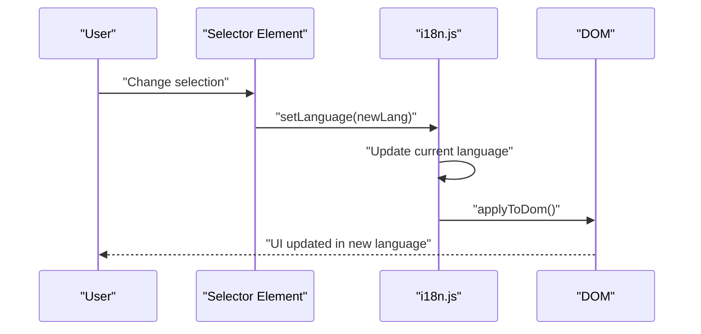

# Multi-language Support System

<cite>
**Referenced Files in This Document**
- [i18n.js](file://simple webpage/i18n.js)
- [index.html](file://simple webpage/index.html)
- [script.js](file://simple webpage/script.js)
- [server.js](file://simple webpage/server.js)
- [style.css](file://simple webpage/style.css)
- [three.js](file://simple webpage/three.js)
- [package.json](file://simple webpage/package.json)
- [i18n.js](file://simple webpage reverse/i18n.js)
- [index.html](file://simple webpage reverse/index.html)
- [package.json](file://simple webpage reverse/package.json)
</cite>

## Table of Contents
1. [Introduction](#introduction)
2. [Project Structure](#project-structure)
3. [Core Components](#core-components)
4. [Architecture Overview](#architecture-overview)
5. [Detailed Component Analysis](#detailed-component-analysis)
6. [Dependency Analysis](#dependency-analysis)
7. [Performance Considerations](#performance-considerations)
8. [Troubleshooting Guide](#troubleshooting-guide)
9. [Conclusion](#conclusion)
10. [Appendices](#appendices)

## Introduction
This document explains the internationalization (i18n) system used in the Crop Yield Prediction application. It covers the translation management architecture, language file structure, dynamic content loading mechanisms, and how the system integrates with the main application. It also documents language switching, DOM manipulation techniques, form field localization, fallback strategies, and performance implications of dynamic language switching. Guidance is included for adding new languages, managing translation keys, handling context-specific translations, and adapting to cultural preferences.

## Project Structure
The project consists of two related single-page applications:
- Main application: Crop Yield Prediction (port 5000)
- Reverse application: Fertilizer Recommendation (port 5001)

Both share the same i18n system implementation and HTML templates that embed translation keys via data attributes. The main application serves prediction requests and persists optional data to MongoDB. The reverse application provides fertilizer recommendations and links back to the main application.

**Diagram sources**
- [index.html:1-116](file://simple webpage/index.html#L1-L116)
- [i18n.js:1-122](file://simple webpage/i18n.js#L1-L122)
- [script.js:1-73](file://simple webpage/script.js#L1-L73)
- [server.js:1-68](file://simple webpage/server.js#L1-L68)
- [style.css:1-173](file://simple webpage/style.css#L1-L173)
- [three.js:1-107](file://simple webpage/three.js#L1-L107)
- [index.html:1-98](file://simple webpage reverse/index.html#L1-L98)
- [i18n.js:1-122](file://simple webpage reverse/i18n.js#L1-L122)

**Section sources**
- [index.html:1-116](file://simple webpage/index.html#L1-L116)
- [i18n.js:1-122](file://simple webpage/i18n.js#L1-L122)
- [script.js:1-73](file://simple webpage/script.js#L1-L73)
- [server.js:1-68](file://simple webpage/server.js#L1-L68)
- [style.css:1-173](file://simple webpage/style.css#L1-L173)
- [three.js:1-107](file://simple webpage/three.js#L1-L107)
- [index.html:1-98](file://simple webpage reverse/index.html#L1-L98)
- [i18n.js:1-122](file://simple webpage reverse/i18n.js#L1-L122)

## Core Components
- Translation registry: A centralized object containing translation keys for supported languages.
- Translator function: Resolves a translation key to the current language’s text, with a fallback to English and the key itself.
- DOM updater: Scans the page for elements with data attributes and updates their text, placeholders, values, and inner HTML according to translation keys.
- Language setter: Switches the active language and triggers DOM updates.
- Initialization routine: Sets up event listeners for language selection and applies translations on load.

Key responsibilities:
- Provide translation resolution with fallback.
- Apply translations to DOM nodes dynamically.
- Persist language preference via the selected option value.
- Enable language switching without reloading the page.

**Section sources**
- [i18n.js:1-122](file://simple webpage/i18n.js#L1-L122)

## Architecture Overview
The i18n system is implemented as a small ES module that exposes translation functions and a DOM updater. The HTML markup embeds translation keys using data attributes. On initialization, the system scans the DOM and applies translations. When the user selects a new language, the system switches the active language and re-applies translations.

**Diagram sources**
- [index.html:101-113](file://simple webpage/index.html#L101-L113)
- [i18n.js:103-122](file://simple webpage/i18n.js#L103-L122)
- [i18n.js:64-98](file://simple webpage/i18n.js#L64-L98)

## Detailed Component Analysis

### Translation Registry and Keys
- The translation registry organizes keys by language. Keys represent UI strings and messages.
- Example keys include page titles, labels, placeholders, buttons, and status messages.
- Keys are designed to be stable and context-specific to support future expansion.

Best practices:
- Keep keys descriptive and hierarchical if needed (e.g., page.section.label).
- Avoid embedding variables inside keys; pass variables via the translator function.

**Section sources**
- [i18n.js:1-52](file://simple webpage/i18n.js#L1-L52)
- [i18n.js:1-52](file://simple webpage reverse/i18n.js#L1-L52)

### Translator Function (t)
- Resolves a key to the current language’s translation.
- Falls back to English if the current language lacks the key.
- If neither current nor English has the key, returns the key itself.
- Supports variable substitution using placeholders in the form {varName}.

Complexity:
- Lookup is O(1) for accessing the current language object and key.
- Substitution is linear in the length of the translation string.

**Section sources**
- [i18n.js:56-62](file://simple webpage/i18n.js#L56-L62)

### DOM Updater (applyToDom)
- Scans the DOM for elements with data attributes:
  - data-i18n: sets textContent
  - data-i18n-placeholder: sets placeholder
  - data-i18n-value: sets value
  - data-i18n-html: sets innerHTML
- Updates the language selector’s value to reflect the current language.

Behavior:
- Safe to run multiple times; subsequent runs overwrite previous values.
- Ignores missing keys gracefully due to fallback behavior.

**Section sources**
- [i18n.js:75-98](file://simple webpage/i18n.js#L75-L98)

### Language Setter and Selector (setLanguage, init)
- setLanguage(lang): switches the active language if supported and re-applies translations.
- init(defaultLang): initializes the system, applies translations, and binds the language selector’s change event to switch languages.

Integration:
- The language selector element id is used to synchronize the UI and persist the selected language.

**Section sources**
- [i18n.js:64-73](file://simple webpage/i18n.js#L64-L73)
- [i18n.js:103-122](file://simple webpage/i18n.js#L103-L122)

### HTML Markup and Localization
- The main application’s index.html embeds translation keys using data-i18n and related attributes on headings, labels, inputs, buttons, and links.
- The reverse application’s index.html mirrors this approach for its own UI.

Localization coverage:
- Page titles
- Form labels and placeholders
- Buttons and links
- Status messages

**Section sources**
- [index.html:27-95](file://simple webpage/index.html#L27-L95)
- [index.html:24-77](file://simple webpage reverse/index.html#L24-L77)

### Dynamic Content Loading and Form Field Localization
- The main application’s script.js handles form submission and displays results.
- The i18n system localizes the form labels and button text; the script.js does not modify translation content directly.

Form field localization:
- Labels and placeholders are localized via data-i18n and data-i18n-placeholder.
- Values are not localized by the i18n system; numeric inputs are handled by the application logic.

**Section sources**
- [script.js:1-73](file://simple webpage/script.js#L1-L73)
- [index.html:36-77](file://simple webpage/index.html#L36-L77)

### Language Switching Mechanism
- The language selector triggers setLanguage on change.
- The system updates the current language and re-applies translations to the DOM.
- The selector’s value is synchronized with the current language.

Persistence:
- The current language is stored in memory and reflected in the selector’s value.
- No persistent storage (e.g., localStorage or cookies) is implemented in the current code.

**Section sources**
- [i18n.js:108-120](file://simple webpage/i18n.js#L108-L120)
- [index.html:29-32](file://simple webpage/index.html#L29-L32)

### Fallback Strategies
- If a key is missing in the current language, the system falls back to English.
- If the key is missing in English, the system falls back to the key itself.
- Variable substitution is performed even when falling back to English or the key.

**Section sources**
- [i18n.js:57-61](file://simple webpage/i18n.js#L57-L61)

### Adding New Languages
Steps:
1. Extend the translations object with a new language code and add all required keys.
2. Add an option for the new language in the language selector.
3. Initialize the system with the new language code if desired.

Example steps:
- Add a new language object in the translations registry.
- Add a new option element in the language selector.
- Optionally call init with the new language code.

**Section sources**
- [i18n.js:1-52](file://simple webpage/i18n.js#L1-L52)
- [index.html:29-32](file://simple webpage/index.html#L29-L32)

### Managing Translation Keys
- Keep keys stable and meaningful.
- Prefer short, descriptive keys that avoid duplication.
- Use consistent naming conventions across pages.

Context-specific translations:
- Use distinct keys for different contexts (e.g., “status_default” vs. “processing”) to avoid ambiguity.

**Section sources**
- [i18n.js:1-52](file://simple webpage/i18n.js#L1-L52)

### Pluralization, Date/Time Formatting, and Cultural Adaptation
- The current implementation does not include pluralization rules or locale-aware date/time formatting.
- Numeric formatting (e.g., decimal separators) is handled by the browser’s default rendering for numeric inputs.
- Recommendations:
  - Introduce pluralization helpers for languages with complex plural rules.
  - Use Intl.DateTimeFormat and Intl.NumberFormat for locale-aware formatting.
  - Consider right-to-left (RTL) layouts for languages that require RTL support.

[No sources needed since this section provides general guidance]

### Integration with the Main Application
- The main application initializes i18n during page load and integrates Three.js for background visuals.
- The prediction server responds to POST requests with predicted yield data.
- The client-side script.js handles form submission and displays results.

**Section sources**
- [index.html:101-113](file://simple webpage/index.html#L101-L113)
- [server.js:45-64](file://simple webpage/server.js#L45-L64)
- [script.js:13-73](file://simple webpage/script.js#L13-L73)

## Dependency Analysis
- i18n.js depends on:
  - DOM APIs for querying and updating elements.
  - The translations registry for resolving keys.
- index.html depends on:
  - i18n.js for localization.
  - Three.js for background visuals.
- script.js depends on:
  - DOM elements defined in index.html.
  - server.js for prediction API.

External dependencies:
- Express and CORS for the server.
- Mongoose for optional database persistence.

**Diagram sources**
- [i18n.js:1-122](file://simple webpage/i18n.js#L1-L122)
- [index.html:101-113](file://simple webpage/index.html#L101-L113)
- [script.js:1-73](file://simple webpage/script.js#L1-L73)
- [server.js:1-68](file://simple webpage/server.js#L1-L68)

**Section sources**
- [package.json:10-14](file://simple webpage/package.json#L10-L14)
- [package.json:14-18](file://simple webpage reverse/package.json#L14-L18)

## Performance Considerations
- DOM scanning cost: applyToDom iterates over elements with multiple data attributes. For large pages, consider batching updates or limiting the selector scope.
- Translation resolution cost: O(1) per key; negligible overhead.
- Event binding: Language selector change events are bound once during initialization.
- Network impact: Language switching does not trigger network requests; it only updates the UI.
- Recommendations:
  - Minimize DOM mutations by grouping updates.
  - Cache frequently accessed DOM nodes if needed.
  - Defer heavy computations until after translations are applied.

[No sources needed since this section provides general guidance]

## Troubleshooting Guide
Common issues and resolutions:
- Missing translation keys:
  - Symptom: Key displayed instead of translated text.
  - Resolution: Add the key to the current language and/or English.
- Language selector not updating:
  - Symptom: Changing language does not update the UI.
  - Resolution: Ensure the selector element exists and the change handler is bound.
- Placeholder/localized values not updating:
  - Symptom: Inputs retain original text.
  - Resolution: Verify data-i18n-placeholder and data-i18n-value attributes are present.
- Numeric inputs not localized:
  - Symptom: Numbers appear in default format.
  - Resolution: Use Intl.NumberFormat for locale-aware formatting if needed.

**Section sources**
- [i18n.js:75-98](file://simple webpage/i18n.js#L75-L98)
- [i18n.js:108-120](file://simple webpage/i18n.js#L108-L120)

## Conclusion
The i18n system provides a lightweight, efficient mechanism for dynamic localization. It centralizes translation keys, supports variable substitution, and updates the DOM declaratively via data attributes. While it currently lacks persistent language storage and advanced formatting features, it offers a solid foundation for expanding multilingual support. Future enhancements could include pluralization, locale-aware formatting, and persistent language preferences.

[No sources needed since this section summarizes without analyzing specific files]

## Appendices

### Class Diagram: i18n Module

**Diagram sources**
- [i18n.js:1-122](file://simple webpage/i18n.js#L1-L122)

### Flowchart: applyToDom

**Diagram sources**
- [i18n.js:75-98](file://simple webpage/i18n.js#L75-L98)

### Sequence Diagram: Language Switch

**Diagram sources**
- [i18n.js:64-98](file://simple webpage/i18n.js#L64-L98)
- [i18n.js:108-120](file://simple webpage/i18n.js#L108-L120)