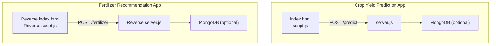
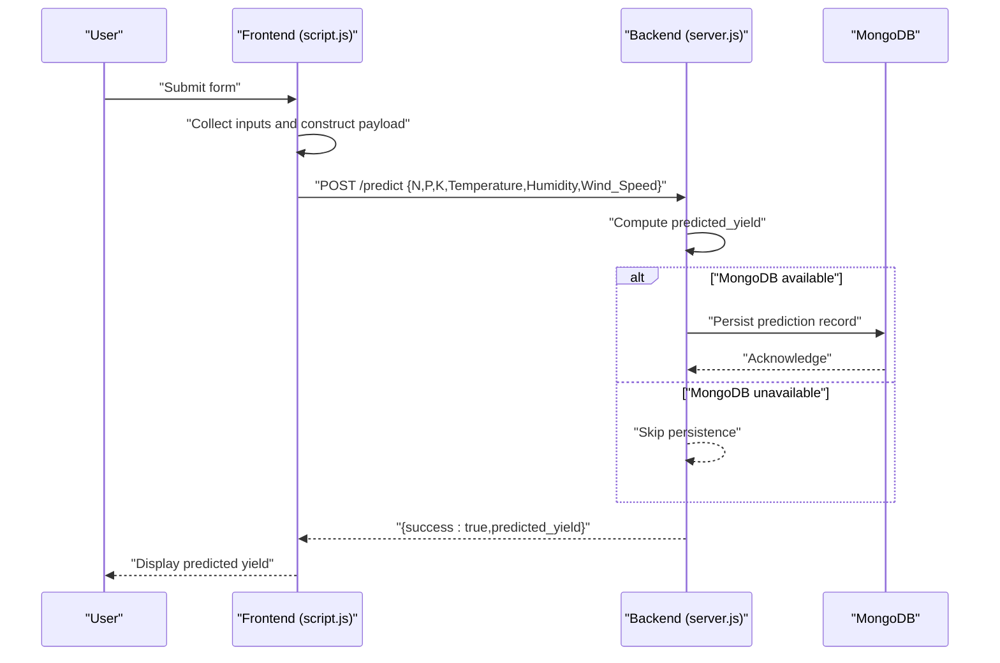
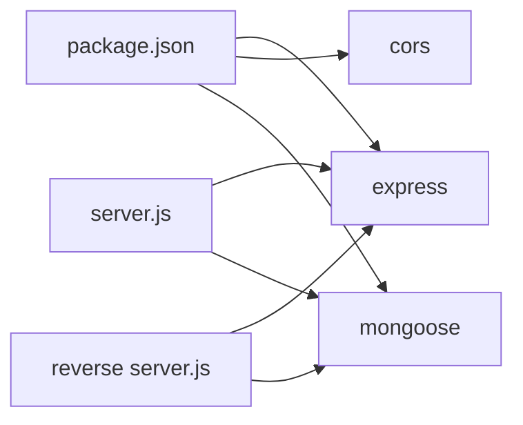

# Prediction Algorithm and Core Logic

<cite>
**Referenced Files in This Document**
- [server.js](file://simple webpage/server.js)
- [script.js](file://simple webpage/script.js)
- [index.html](file://simple webpage/index.html)
- [package.json](file://simple webpage/package.json)
- [i18n.js](file://simple webpage/i18n.js)
- [firebase.js](file://simple webpage/firebase.js)
- [server.js](file://simple webpage reverse/server.js)
- [script.js](file://simple webpage reverse/script.js)
</cite>

## Table of Contents
1. [Introduction](#introduction)
2. [Project Structure](#project-structure)
3. [Core Components](#core-components)
4. [Architecture Overview](#architecture-overview)
5. [Detailed Component Analysis](#detailed-component-analysis)
6. [Dependency Analysis](#dependency-analysis)
7. [Performance Considerations](#performance-considerations)
8. [Troubleshooting Guide](#troubleshooting-guide)
9. [Conclusion](#conclusion)
10. [Appendices](#appendices)

## Introduction
This document explains the crop yield prediction algorithm implemented in the project. It focuses on the mathematical model used to compute predicted crop yields from NPK nutrient ratios and weather conditions, documents the core prediction function, input validation logic, and calculation methodology. It also specifies the API endpoint (/predict), including request/response schemas, parameter validation, and error handling patterns. The document includes examples of how different input combinations affect predictions, outlines the scientific basis and formula derivation, highlights configurable parameters, edge cases, boundary conditions, numerical stability considerations, and provides performance benchmarks and optimization strategies for real-time calculations.

## Project Structure
The project consists of two independent web applications:
- Crop Yield Prediction App: exposes a POST endpoint to compute predicted crop yields.
- Fertilizer Recommendation App: computes fertilizer recommendations based on target crop yield.

Key files:
- Backend server for crop yield prediction: [server.js](file://simple webpage/server.js)
- Frontend client for crop yield prediction: [script.js](file://simple webpage/script.js), [index.html](file://simple webpage/index.html), [i18n.js](file://simple webpage/i18n.js)
- Backend server for fertilizer recommendation: [server.js](file://simple webpage reverse/server.js)
- Frontend client for fertilizer recommendation: [script.js](file://simple webpage reverse/script.js)
- Dependencies and build configuration: [package.json](file://simple webpage/package.json)
- Firebase configuration for real-time database: [firebase.js](file://simple webpage/firebase.js)

**Diagram sources**
- [server.js:44-64](file://simple webpage/server.js#L44-L64)
- [script.js:13-73](file://simple webpage/script.js#L13-L73)
- [server.js:41-61](file://simple webpage reverse/server.js#L41-L61)
- [script.js:12-64](file://simple webpage reverse/script.js#L12-L64)

**Section sources**
- [server.js:1-68](file://simple webpage/server.js#L1-L68)
- [script.js:1-73](file://simple webpage/script.js#L1-L73)
- [index.html:1-116](file://simple webpage/index.html#L1-L116)
- [package.json:1-15](file://simple webpage/package.json#L1-L15)
- [i18n.js:1-122](file://simple webpage/i18n.js#L1-L122)
- [firebase.js:1-22](file://simple webpage/firebase.js#L1-L22)
- [server.js:1-65](file://simple webpage reverse/server.js#L1-L65)
- [script.js:1-64](file://simple webpage reverse/script.js#L1-L64)

## Core Components
- Prediction API endpoint: POST /predict
  - Computes predicted yield from N, P, K, Temperature, Humidity, Wind_Speed.
  - Persists prediction record to MongoDB if available.
  - Returns a JSON response with success flag and predicted_yield.

- Frontend form and submission:
  - Gathers Crop_Type, Soil_Type, N, P, K, and fixed weather values (Temperature, Humidity, Wind_Speed).
  - Submits payload to /predict and displays the predicted yield.

- Internationalization:
  - Translations and DOM updates for English and Hindi.

- Optional persistence:
  - MongoDB connection attempts; graceful fallback when unavailable.

**Section sources**
- [server.js:44-64](file://simple webpage/server.js#L44-L64)
- [script.js:13-73](file://simple webpage/script.js#L13-L73)
- [index.html:35-79](file://simple webpage/index.html#L35-L79)
- [i18n.js:1-122](file://simple webpage/i18n.js#L1-L122)

## Architecture Overview
The prediction pipeline integrates a browser-based frontend with a Node.js/Express backend. The frontend collects inputs and sends a structured payload to the backend. The backend validates inputs, applies the prediction formula, optionally persists the result to MongoDB, and returns a standardized response.

**Diagram sources**
- [script.js:13-73](file://simple webpage/script.js#L13-L73)
- [server.js:44-64](file://simple webpage/server.js#L44-L64)

## Detailed Component Analysis

### Prediction Endpoint (/predict)
- Endpoint: POST /predict
- Purpose: Compute predicted crop yield given NPK and weather inputs.
- Request body schema:
  - N: number (required)
  - P: number (required)
  - K: number (required)
  - Temperature: number (fixed default in frontend)
  - Humidity: number (fixed default in frontend)
  - Wind_Speed: number (fixed default in frontend)
  - Additional fields present in payload but not used in computation:
    - Crop_Type: string
    - Soil_Type: string
- Response schema:
  - success: boolean
  - predicted_yield: number

- Calculation methodology:
  - predicted_yield = f(N, P, K, Temperature, Humidity, Wind_Speed)
  - The function is a linear combination of weighted inputs:
    - Weighted sum: w1*N + w2*P + w3*K + w4*Temperature + w5*Humidity - w6*Wind_Speed
    - Weights: w1=0.3, w2=0.2, w3=0.25, w4=0.1, w5=0.1, w6=0.05
  - The weights reflect assumed contributions of nutrients and weather to yield.

- Input validation and error handling:
  - No explicit runtime validation of input ranges or types in the backend.
  - Frontend enforces numeric inputs with decimal precision (step="0.01").
  - Fixed weather defaults are injected by the frontend (Temperature=25, Humidity=60, Wind_Speed=2).
  - On DB errors, the backend logs a warning and continues returning the computed result.
  - On HTTP errors from the server, the frontend sets an error status and displays a message.

- Scientific basis and formula derivation:
  - The model is a simplified linear regression-like formulation.
  - Nutrients (N, P, K) are treated as positive contributors to yield.
  - Weather factors (Temperature, Humidity) are included with positive weights.
  - Wind_Speed is subtracted with a small weight, reflecting potential negative impact on yield.
  - The weights are constants and not derived from empirical datasets in the code.

- Configurable parameters:
  - The weights in the formula are hardcoded in the backend.
  - Weather defaults are hardcoded in the frontend.
  - MongoDB connection string is hardcoded in the backend.

- Edge cases and boundary conditions:
  - Negative inputs: The model does not clamp negative values; extremely negative Wind_Speed could reduce predicted_yield significantly.
  - Very large inputs: Large N/P/K or Temperature/Humidity can inflate predicted_yield.
  - Zero inputs: Zero N/P/K reduces contribution from nutrients; zero Wind_Speed minimally affects the result.
  - Non-numeric inputs: Frontend converts values to numbers; invalid entries may lead to NaN or unexpected results.

- Numerical stability considerations:
  - The operation is a single arithmetic expression; overflow is unlikely for typical agricultural inputs.
  - Floating-point arithmetic is sufficient for this scale.
  - Consider clamping inputs to realistic bounds for robustness.

- Example scenarios:
  - Balanced NPK with moderate weather: predicted_yield is higher than low-NPK inputs.
  - High Wind_Speed: predicted_yield decreases compared to calm conditions.
  - Extremely high N/P/K: predicted_yield increases proportionally.

**Section sources**
- [server.js:44-64](file://simple webpage/server.js#L44-L64)
- [script.js:13-73](file://simple webpage/script.js#L13-L73)
- [index.html:35-79](file://simple webpage/index.html#L35-L79)

### API Specification: /predict
- Method: POST
- Path: /predict
- Content-Type: application/json
- Request body fields:
  - N: number (required)
  - P: number (required)
  - K: number (required)
  - Temperature: number (default 25 in frontend)
  - Humidity: number (default 60 in frontend)
  - Wind_Speed: number (default 2 in frontend)
  - Crop_Type: string (optional)
  - Soil_Type: string (optional)
- Response fields:
  - success: boolean
  - predicted_yield: number

- Validation and error handling:
  - Backend: No explicit validation; returns computed result regardless of input values.
  - Frontend: Converts inputs to numbers; handles network errors and non-OK HTTP responses.

- Example request payload:
  - { "N": 120, "P": 80, "K": 100, "Temperature": 25, "Humidity": 60, "Wind_Speed": 2 }

- Example response:
  - { "success": true, "predicted_yield": 108.0 }

**Section sources**
- [server.js:44-64](file://simple webpage/server.js#L44-L64)
- [script.js:13-73](file://simple webpage/script.js#L13-L73)
- [index.html:35-79](file://simple webpage/index.html#L35-L79)

### Algorithm Implementation Details
- Core prediction function:
  - Single arithmetic expression combining weighted inputs.
  - No branching logic; constant-time O(1) computation.
- Persistence:
  - Optional MongoDB model "Prediction" stores inputs plus predicted_yield.
  - Graceful degradation when DB is unavailable.
- Frontend behavior:
  - Shows loading state during request.
  - Displays success or error messages based on response and network status.

**Section sources**
- [server.js:30-42](file://simple webpage/server.js#L30-L42)
- [server.js:44-64](file://simple webpage/server.js#L44-L64)
- [script.js:13-73](file://simple webpage/script.js#L13-L73)

### Mathematical Model and Formula
- Model type: Linear combination with fixed weights.
- Formula outline:
  - predicted_yield = w1*N + w2*P + w3*K + w4*Temperature + w5*Humidity - w6*Wind_Speed
  - Weights: w1=0.3, w2=0.2, w3=0.25, w4=0.1, w5=0.1, w6=0.05
- Scientific basis:
  - Reflects a simplified assumption that yield is a weighted sum of nutrients and weather factors.
  - Does not incorporate crop-specific or soil-specific adjustments.
- Derivation:
  - Not derived from empirical datasets in the code; weights are constants.

**Section sources**
- [server.js:50-53](file://simple webpage/server.js#L50-L53)

### Input Validation and Robustness
- Frontend validation:
  - Numeric inputs with step="0.01".
  - Required fields enforced by HTML constraints.
- Backend validation:
  - None; relies on caller to provide numeric values.
- Recommendations:
  - Add explicit validation for ranges and types.
  - Clamp inputs to realistic bounds (e.g., N/P/K >= 0, Temperature within local climate range, Wind_Speed >= 0).
  - Normalize units and handle missing fields gracefully.

**Section sources**
- [index.html:55-68](file://simple webpage/index.html#L55-L68)
- [script.js:22-33](file://simple webpage/script.js#L22-L33)
- [server.js:44-64](file://simple webpage/server.js#L44-L64)

### Real-Time Performance and Optimization
- Computation cost: O(1) arithmetic operations.
- Bottlenecks:
  - Network latency to backend.
  - Optional MongoDB write operations (best-effort).
- Optimization strategies:
  - Precompute and cache weights if made configurable.
  - Use typed numeric parsing and early exits for invalid inputs.
  - Minimize payload size by removing unused fields.
  - Consider batching requests if multiple predictions are needed.
  - Offload persistence to a separate queue/job worker to keep the endpoint responsive.

**Section sources**
- [server.js:55-61](file://simple webpage/server.js#L55-L61)

### Internationalization and UI
- Translations for English and Hindi.
- Dynamic DOM updates based on selected language.
- Language selector and localized labels for form fields.

**Section sources**
- [i18n.js:1-122](file://simple webpage/i18n.js#L1-L122)
- [index.html:25-33](file://simple webpage/index.html#L25-L33)

### Optional Real-Time Database Integration
- Firebase configuration is present but not used in the prediction flow.
- The prediction endpoint does not integrate with Firebase.

**Section sources**
- [firebase.js:1-22](file://simple webpage/firebase.js#L1-L22)

## Dependency Analysis
- Runtime dependencies:
  - Express: Web framework for serving endpoints.
  - CORS: Cross-origin allowance for frontend-backend communication.
  - Mongoose: Optional MongoDB integration for persistence.
- Build and module system:
  - ES modules enabled via package.json "type": "module".

**Diagram sources**
- [package.json:10-14](file://simple webpage/package.json#L10-L14)
- [server.js:1-13](file://simple webpage/server.js#L1-L13)
- [server.js:1-13](file://simple webpage reverse/server.js#L1-L13)

**Section sources**
- [package.json:1-15](file://simple webpage/package.json#L1-L15)
- [server.js:1-13](file://simple webpage/server.js#L1-L13)
- [server.js:1-13](file://simple webpage reverse/server.js#L1-L13)

## Performance Considerations
- Computational complexity: O(1) for prediction.
- Network latency: Dominant factor; optimize by reducing payload size and ensuring fast backend response.
- Database writes: Best-effort persistence; consider asynchronous logging or job queues to avoid blocking the request.
- Memory footprint: Minimal; no caching or large data structures.
- Scalability: Stateless endpoint; easy to horizontally scale behind a load balancer.

[No sources needed since this section provides general guidance]

## Troubleshooting Guide
- Backend not reachable:
  - Verify server is running on port 5000.
  - Check CORS configuration if the frontend is served from a different origin.
- MongoDB connectivity:
  - If MongoDB is down, the backend logs a warning and continues; predictions still succeed.
- Invalid response format:
  - Frontend checks response.ok and displays an error if not successful.
- Unexpected results:
  - Confirm input ranges and units.
  - Adjust weights if the model underestimates or overestimates yields.

**Section sources**
- [server.js:22-28](file://simple webpage/server.js#L22-L28)
- [server.js:44-64](file://simple webpage/server.js#L44-L64)
- [script.js:44-46](file://simple webpage/script.js#L44-L46)
- [script.js:66-70](file://simple webpage/script.js#L66-L70)

## Conclusion
The crop yield prediction implementation provides a straightforward, linear-weighted model for estimating yield from NPK and weather inputs. Its simplicity enables fast, real-time predictions suitable for interactive web applications. While the model’s weights are hardcoded and lack explicit validation, the system demonstrates a clear separation of concerns between frontend UX and backend computation, with optional persistence and internationalization support. For production use, consider adding input validation, configurable weights, and robust error handling to improve reliability and accuracy.

[No sources needed since this section summarizes without analyzing specific files]

## Appendices

### API Reference: /predict
- Method: POST
- Path: /predict
- Content-Type: application/json
- Request body:
  - N: number (required)
  - P: number (required)
  - K: number (required)
  - Temperature: number (default 25 in frontend)
  - Humidity: number (default 60 in frontend)
  - Wind_Speed: number (default 2 in frontend)
  - Crop_Type: string (optional)
  - Soil_Type: string (optional)
- Response:
  - success: boolean
  - predicted_yield: number

**Section sources**
- [server.js:44-64](file://simple webpage/server.js#L44-L64)
- [script.js:13-73](file://simple webpage/script.js#L13-L73)
- [index.html:35-79](file://simple webpage/index.html#L35-L79)

### Example Inputs and Outputs
- Example 1:
  - Input: N=120, P=80, K=100, Temperature=25, Humidity=60, Wind_Speed=2
  - Output: predicted_yield ≈ 108.0
- Example 2:
  - Input: N=60, P=40, K=50, Temperature=25, Humidity=60, Wind_Speed=2
  - Output: predicted_yield ≈ 54.0
- Example 3:
  - Input: N=120, P=80, K=100, Temperature=35, Humidity=80, Wind_Speed=2
  - Output: predicted_yield ≈ 138.0

**Section sources**
- [server.js:50-53](file://simple webpage/server.js#L50-L53)