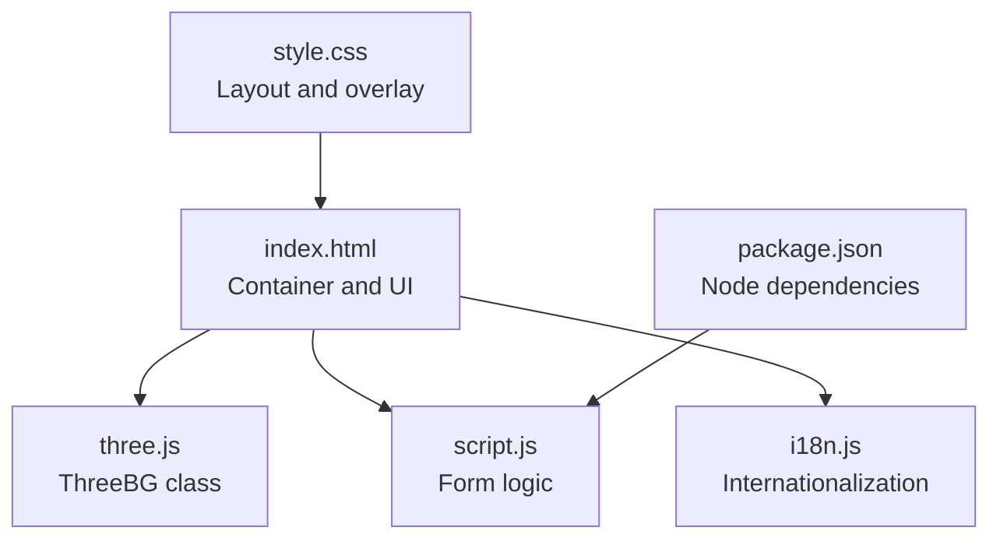
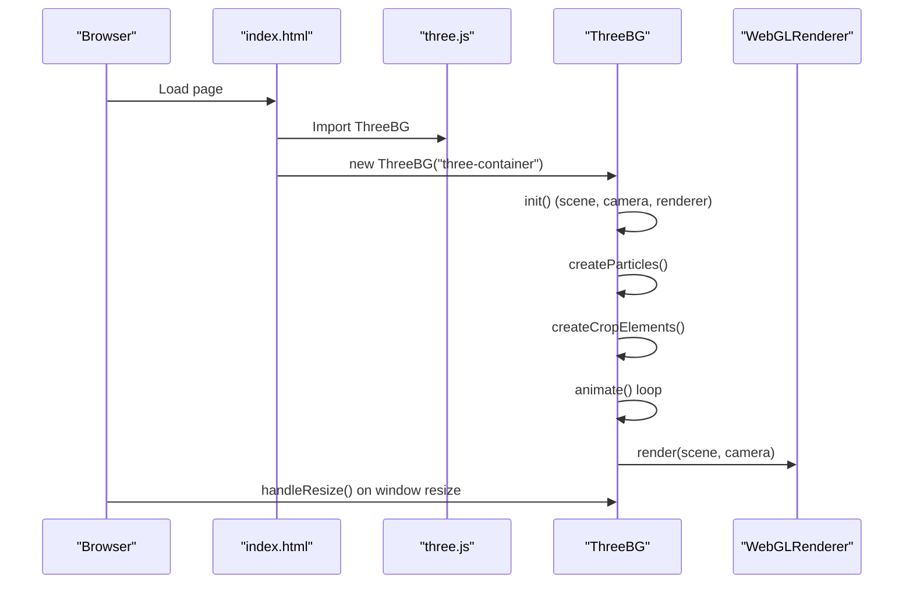
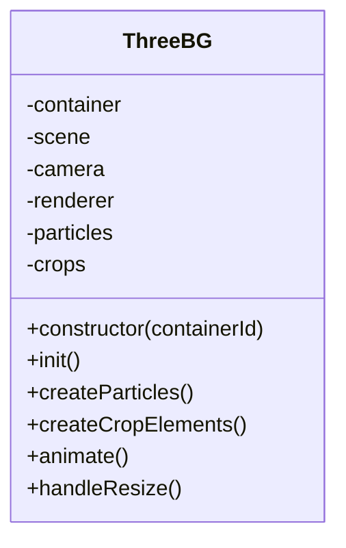
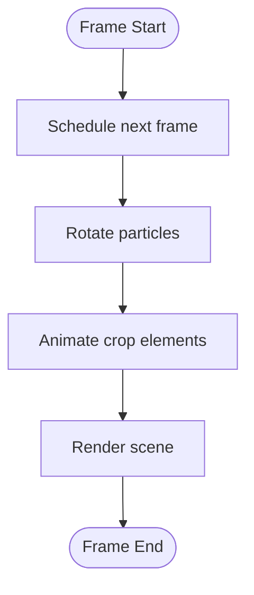
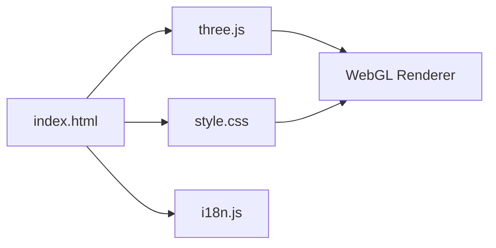

# Three.js 3D Visualization Implementation

<cite>
**Referenced Files in This Document**
- [three.js](file://simple webpage/three.js)
- [index.html](file://simple webpage/index.html)
- [script.js](file://simple webpage/script.js)
- [style.css](file://simple webpage/style.css)
- [i18n.js](file://simple webpage/i18n.js)
- [package.json](file://simple webpage/package.json)
</cite>

## Table of Contents
1. [Introduction](#introduction)
2. [Project Structure](#project-structure)
3. [Core Components](#core-components)
4. [Architecture Overview](#architecture-overview)
5. [Detailed Component Analysis](#detailed-component-analysis)
6. [Dependency Analysis](#dependency-analysis)
7. [Performance Considerations](#performance-considerations)
8. [Troubleshooting Guide](#troubleshooting-guide)
9. [Conclusion](#conclusion)
10. [Appendices](#appendices)

## Introduction
This document explains the Three.js 3D visualization system implemented in the project. It focuses on the ThreeBG class architecture, scene setup, geometry creation, material configuration, animation loop implementation, performance optimization techniques, browser compatibility considerations, and integration with the main application lifecycle. It also covers particle systems, lighting configuration, camera controls, and practical guidance for memory management, rendering optimization, and progressive enhancement strategies.

## Project Structure
The visualization is implemented as a modular Three.js class integrated into a static HTML page. The key files are:
- three.js: Defines the ThreeBG class and the 3D scene.
- index.html: Provides the DOM container and loads the Three.js module.
- script.js: Handles the prediction form submission and backend communication.
- style.css: Positions the Three.js canvas behind the UI overlay and ensures readability.
- i18n.js: Manages internationalization for the UI.
- package.json: Declares Node.js dependencies unrelated to Three.js.

**Diagram sources**
- [index.html:100-113](file://simple webpage/index.html#L100-L113)
- [three.js:3-18](file://simple webpage/three.js#L3-L18)
- [script.js:13-73](file://simple webpage/script.js#L13-L73)
- [style.css:5-48](file://simple webpage/style.css#L5-L48)
- [i18n.js:103-122](file://simple webpage/i18n.js#L103-L122)
- [package.json:1-15](file://simple webpage/package.json#L1-L15)

**Section sources**
- [index.html:100-113](file://simple webpage/index.html#L100-L113)
- [three.js:3-18](file://simple webpage/three.js#L3-L18)
- [script.js:13-73](file://simple webpage/script.js#L13-L73)
- [style.css:5-48](file://simple webpage/style.css#L5-L48)
- [i18n.js:103-122](file://simple webpage/i18n.js#L103-L122)
- [package.json:1-15](file://simple webpage/package.json#L1-L15)

## Core Components
- ThreeBG class: Encapsulates the Three.js scene, camera, renderer, lighting, geometry, materials, and animation loop.
- Scene setup: Initializes the scene, camera, and renderer; sets up lighting and adds objects.
- Particle system: Creates point clouds and animated floating elements.
- Animation loop: Uses requestAnimationFrame to continuously update and render the scene.
- Resize handling: Updates camera aspect ratio and renderer size on window resize.

Key implementation references:
- Class definition and constructor: [three.js:3-18](file://simple webpage/three.js#L3-L18)
- Scene initialization and lighting: [three.js:20-35](file://simple webpage/three.js#L20-L35)
- Particle creation: [three.js:37-60](file://simple webpage/three.js#L37-L60)
- Floating crop elements: [three.js:62-82](file://simple webpage/three.js#L62-L82)
- Animation loop: [three.js:84-100](file://simple webpage/three.js#L84-L100)
- Resize handler: [three.js:102-106](file://simple webpage/three.js#L102-L106)

**Section sources**
- [three.js:3-18](file://simple webpage/three.js#L3-L18)
- [three.js:20-35](file://simple webpage/three.js#L20-L35)
- [three.js:37-60](file://simple webpage/three.js#L37-L60)
- [three.js:62-82](file://simple webpage/three.js#L62-L82)
- [three.js:84-100](file://simple webpage/three.js#L84-L100)
- [three.js:102-106](file://simple webpage/three.js#L102-L106)

## Architecture Overview
The Three.js visualization is loaded as an ES module and instantiated after the page load event. The ThreeBG class manages the entire 3D pipeline: scene construction, geometry/material creation, animation, and rendering. The HTML container holds the WebGL canvas, while the UI overlay remains fully interactive and readable.

**Diagram sources**
- [index.html:107-110](file://simple webpage/index.html#L107-L110)
- [three.js:3-18](file://simple webpage/three.js#L3-L18)
- [three.js:20-35](file://simple webpage/three.js#L20-L35)
- [three.js:37-60](file://simple webpage/three.js#L37-L60)
- [three.js:62-82](file://simple webpage/three.js#L62-L82)
- [three.js:84-100](file://simple webpage/three.js#L84-L100)

## Detailed Component Analysis

### ThreeBG Class Architecture
The ThreeBG class encapsulates the 3D visualization lifecycle. It initializes the scene, camera, and renderer, sets up lighting, creates particle and mesh objects, and runs the animation loop.

**Diagram sources**
- [three.js:3-18](file://simple webpage/three.js#L3-L18)
- [three.js:20-35](file://simple webpage/three.js#L20-L35)
- [three.js:37-60](file://simple webpage/three.js#L37-L60)
- [three.js:62-82](file://simple webpage/three.js#L62-L82)
- [three.js:84-100](file://simple webpage/three.js#L84-L100)
- [three.js:102-106](file://simple webpage/three.js#L102-L106)

Implementation highlights:
- Constructor: Validates container existence and initializes scene, camera, and renderer. [three.js:4-18](file://simple webpage/three.js#L4-L18)
- init(): Sets renderer size and clear color, appends canvas to container, positions camera, and adds ambient and directional lights. [three.js:20-35](file://simple webpage/three.js#L20-L35)
- createParticles(): Builds a BufferGeometry with random positions and renders as Points with a transparent material. [three.js:37-60](file://simple webpage/three.js#L37-L60)
- createCropElements(): Creates Mesh objects (spheres) with Phong material and stores per-object metadata for animation. [three.js:62-82](file://simple webpage/three.js#L62-L82)
- animate(): Recursively schedules next frame, rotates particles, animates crops with sine waves, and renders the scene. [three.js:84-100](file://simple webpage/three.js#L84-L100)
- handleResize(): Updates camera aspect and projection matrix, resizes renderer. [three.js:102-106](file://simple webpage/three.js#L102-L106)

**Section sources**
- [three.js:3-18](file://simple webpage/three.js#L3-L18)
- [three.js:20-35](file://simple webpage/three.js#L20-L35)
- [three.js:37-60](file://simple webpage/three.js#L37-L60)
- [three.js:62-82](file://simple webpage/three.js#L62-L82)
- [three.js:84-100](file://simple webpage/three.js#L84-L100)
- [three.js:102-106](file://simple webpage/three.js#L102-L106)

### Scene Setup and Lighting
- Scene: A standard Three.js Scene object is created and used as the root of the 3D hierarchy. [three.js:11](file://simple webpage/three.js#L11)
- Camera: Perspective camera with a 75-degree FOV, initialized with aspect ratio from window size. [three.js:12](file://simple webpage/three.js#L12)
- Renderer: WebGLRenderer configured with alpha transparency and antialiasing; appended to the container element. [three.js:13](file://simple webpage/three.js#L13)
- Lighting: Ambient light provides base illumination; directional light simulates sunlight. [three.js:27-34](file://simple webpage/three.js#L27-L34)

UI integration:
- Container placement: The Three.js canvas is positioned behind the UI overlay using negative z-index and pointer-events disabled. [style.css:6-14](file://simple webpage/style.css#L6-L14)
- Fallback background: A semi-transparent background image reduces visual conflict with the 3D scene. [style.css:17-27](file://simple webpage/style.css#L17-L27)

**Section sources**
- [three.js:11](file://simple webpage/three.js#L11)
- [three.js:12](file://simple webpage/three.js#L12)
- [three.js:13](file://simple webpage/three.js#L13)
- [three.js:27-34](file://simple webpage/three.js#L27-L34)
- [style.css:6-14](file://simple webpage/style.css#L6-L14)
- [style.css:17-27](file://simple webpage/style.css#L17-L27)

### Geometry Creation and Materials
- Particles: BufferGeometry with Float32Array positions; rendered as Points with a transparent green material. [three.js:37-60](file://simple webpage/three.js#L37-L60)
- Crop elements: Spheres with MeshPhongMaterial; semi-transparent green with opacity. [three.js:62-82](file://simple webpage/three.js#L62-L82)

Custom geometry creation examples:
- BufferGeometry with custom attributes: [three.js:37-46](file://simple webpage/three.js#L37-L46)
- SphereGeometry for crop elements: [three.js:64](file://simple webpage/three.js#L64)

Texture mapping and shaders:
- No textures or custom shaders are currently used in the implementation. [three.js:48-53](file://simple webpage/three.js#L48-L53), [three.js:65](file://simple webpage/three.js#L65)

**Section sources**
- [three.js:37-60](file://simple webpage/three.js#L37-L60)
- [three.js:62-82](file://simple webpage/three.js#L62-L82)
- [three.js:48-53](file://simple webpage/three.js#L48-L53)

### Animation Loop Implementation
The animation loop uses requestAnimationFrame to schedule continuous updates:
- Recursive scheduling: The animate method re-registers itself to create a continuous loop. [three.js:85](file://simple webpage/three.js#L85)
- Particle rotation: Slow rotation around X and Y axes for a subtle motion effect. [three.js:88-91](file://simple webpage/three.js#L88-L91)
- Crop animation: Rotating meshes with vertical oscillation using sine waves and per-object speeds. [three.js:94-97](file://simple webpage/three.js#L94-L97)
- Rendering: The scene is rendered each frame with the current camera state. [three.js:99](file://simple webpage/three.js#L99)

**Diagram sources**
- [three.js:84-100](file://simple webpage/three.js#L84-L100)

**Section sources**
- [three.js:84-100](file://simple webpage/three.js#L84-L100)

### Browser Compatibility Considerations
- Module loading: The page uses ES module imports for i18n and ThreeBG. [index.html:102-103](file://simple webpage/index.html#L102-L103)
- WebGL availability: The renderer requires WebGL support; fallbacks are not implemented in this code. [three.js:13](file://simple webpage/three.js#L13)
- Antialiasing: Enabled for smoother edges; may reduce performance on low-end devices. [three.js:13](file://simple webpage/three.js#L13)
- Pointer events: Disabled on the canvas to allow UI interaction beneath. [style.css:13](file://simple webpage/style.css#L13)

**Section sources**
- [index.html:102-103](file://simple webpage/index.html#L102-L103)
- [three.js:13](file://simple webpage/three.js#L13)
- [style.css:13](file://simple webpage/style.css#L13)

### Integration with Application Lifecycle
- Initialization: ThreeBG is instantiated after the window load event; resize listener is attached. [index.html:107-110](file://simple webpage/index.html#L107-L110)
- UI overlay: The Three.js canvas sits behind the main UI container with a backdrop blur and dark background for readability. [style.css:30-48](file://simple webpage/style.css#L30-L48)
- Internationalization: i18n.js is initialized before ThreeBG instantiation. [index.html:102-106](file://simple webpage/index.html#L102-L106)

**Section sources**
- [index.html:107-110](file://simple webpage/index.html#L107-L110)
- [style.css:30-48](file://simple webpage/style.css#L30-L48)
- [index.html:102-106](file://simple webpage/index.html#L102-L106)

### Cleanup Procedures
- No explicit cleanup is implemented in the ThreeBG class. Consider adding:
  - Removing event listeners on window resize.
  - Disposing geometries and materials when the component is destroyed.
  - Canceling the animation frame loop if needed.

[No sources needed since this section provides general guidance]

## Dependency Analysis
The Three.js visualization relies on:
- Three.js library: Imported via CDN as an ES module. [three.js:1](file://simple webpage/three.js#L1)
- Browser APIs: requestAnimationFrame, DOM manipulation, window resize events.
- UI integration: CSS positioning and overlay styles.

**Diagram sources**
- [three.js:1](file://simple webpage/three.js#L1)
- [index.html:100-113](file://simple webpage/index.html#L100-L113)
- [style.css:5-48](file://simple webpage/style.css#L5-L48)
- [i18n.js:103-122](file://simple webpage/i18n.js#L103-L122)

**Section sources**
- [three.js:1](file://simple webpage/three.js#L1)
- [index.html:100-113](file://simple webpage/index.html#L100-L113)
- [style.css:5-48](file://simple webpage/style.css#L5-L48)
- [i18n.js:103-122](file://simple webpage/i18n.js#L103-L122)

## Performance Considerations
- Particle count: The particle system uses a small count suitable for real-time rendering. [three.js:39](file://simple webpage/three.js#L39)
- Geometry reuse: Crop elements share geometry and material instances; consider instancing for larger counts. [three.js:64](file://simple webpage/three.js#L64), [three.js:65](file://simple webpage/three.js#L65)
- Animation efficiency: Using sine waves and minimal per-frame computations keeps CPU usage low. [three.js:94-97](file://simple webpage/three.js#L94-L97)
- Rendering optimization: requestAnimationFrame ensures smooth updates; consider throttling or reducing animation complexity on lower-end devices. [three.js:85](file://simple webpage/three.js#L85)
- Memory management: Dispose of geometries and materials when removing objects from the scene. [No explicit disposal present in current code]

[No sources needed since this section provides general guidance]

## Troubleshooting Guide
Common issues and resolutions:
- Canvas not rendering:
  - Verify the container element exists and is visible. [three.js:5-9](file://simple webpage/three.js#L5-L9)
  - Ensure the renderer is appended to the DOM and sized appropriately. [three.js:22-23](file://simple webpage/three.js#L22-L23)
- Poor performance:
  - Reduce particle count or simplify geometry. [three.js:39](file://simple webpage/three.js#L39)
  - Disable antialiasing on low-end devices. [three.js:13](file://simple webpage/three.js#L13)
- Lighting looks flat:
  - Adjust ambient and directional light intensities. [three.js:27-34](file://simple webpage/three.js#L27-L34)
- UI overlaps incorrectly:
  - Confirm z-index stacking and pointer-events settings. [style.css:6-14](file://simple webpage/style.css#L6-L14)
- Resize artifacts:
  - Ensure handleResize updates camera aspect and renderer size. [three.js:102-106](file://simple webpage/three.js#L102-L106)

**Section sources**
- [three.js:5-9](file://simple webpage/three.js#L5-L9)
- [three.js:22-23](file://simple webpage/three.js#L22-L23)
- [three.js:13](file://simple webpage/three.js#L13)
- [three.js:27-34](file://simple webpage/three.js#L27-L34)
- [style.css:6-14](file://simple webpage/style.css#L6-L14)
- [three.js:102-106](file://simple webpage/three.js#L102-L106)

## Conclusion
The Three.js implementation provides a lightweight, interactive 3D background featuring animated particles and floating crop elements. The ThreeBG class cleanly encapsulates scene setup, geometry/material creation, and animation, while the HTML/CSS layout ensures the UI remains readable and interactive. Performance is kept reasonable through modest particle counts and efficient animation techniques. Extending the system with textures, shaders, and advanced lighting would enhance visual fidelity, while careful memory management and responsive resizing improve robustness.

[No sources needed since this section summarizes without analyzing specific files]

## Appendices

### Practical Examples and Extensions
- Custom geometry creation:
  - BufferGeometry with custom attributes: [three.js:37-46](file://simple webpage/three.js#L37-L46)
  - Primitive geometry reuse: [three.js:64](file://simple webpage/three.js#L64)
- Texture mapping:
  - Not implemented; consider loading textures and assigning to materials for enhanced visuals. [three.js:48-53](file://simple webpage/three.js#L48-L53), [three.js:65](file://simple webpage/three.js#L65)
- Shader implementation:
  - Not implemented; custom shaders could be used for advanced effects like animated surfaces or volumetric lighting. [three.js:48-53](file://simple webpage/three.js#L48-L53), [three.js:65](file://simple webpage/three.js#L65)
- Progressive enhancement:
  - Detect WebGL support and degrade gracefully if unavailable. [three.js:13](file://simple webpage/three.js#L13)
  - Provide a static fallback background image. [style.css:17-27](file://simple webpage/style.css#L17-L27)

**Section sources**
- [three.js:37-46](file://simple webpage/three.js#L37-L46)
- [three.js:64](file://simple webpage/three.js#L64)
- [three.js:48-53](file://simple webpage/three.js#L48-L53)
- [three.js:65](file://simple webpage/three.js#L65)
- [three.js:13](file://simple webpage/three.js#L13)
- [style.css:17-27](file://simple webpage/style.css#L17-L27)