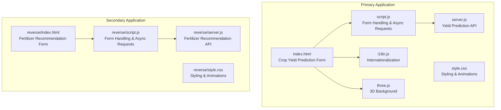
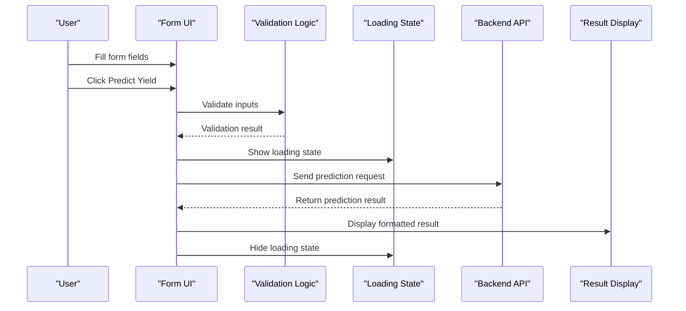
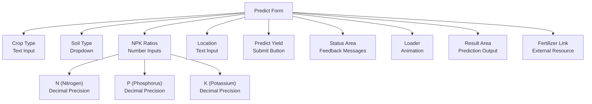
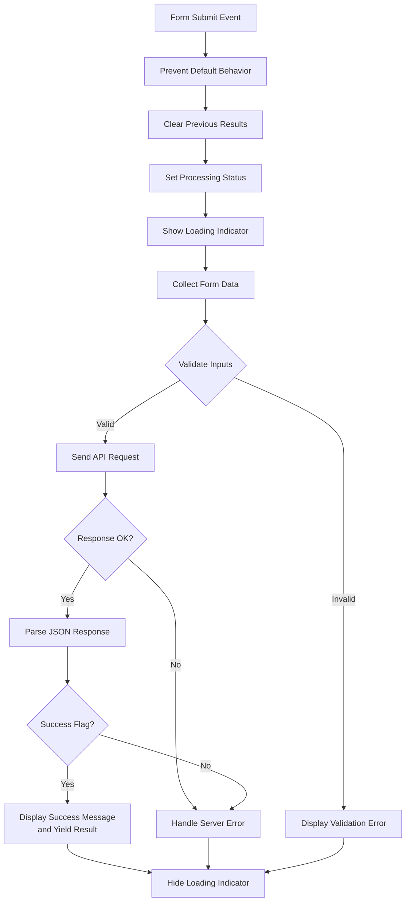
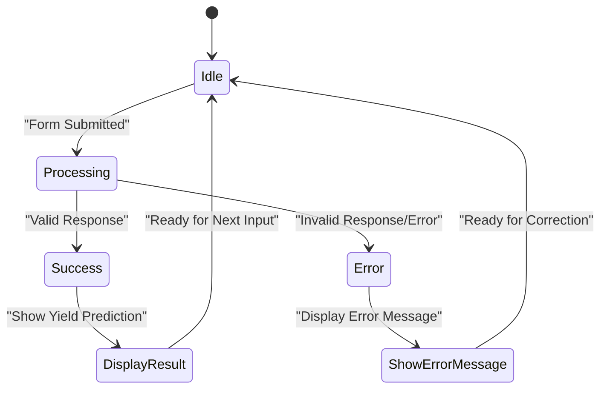
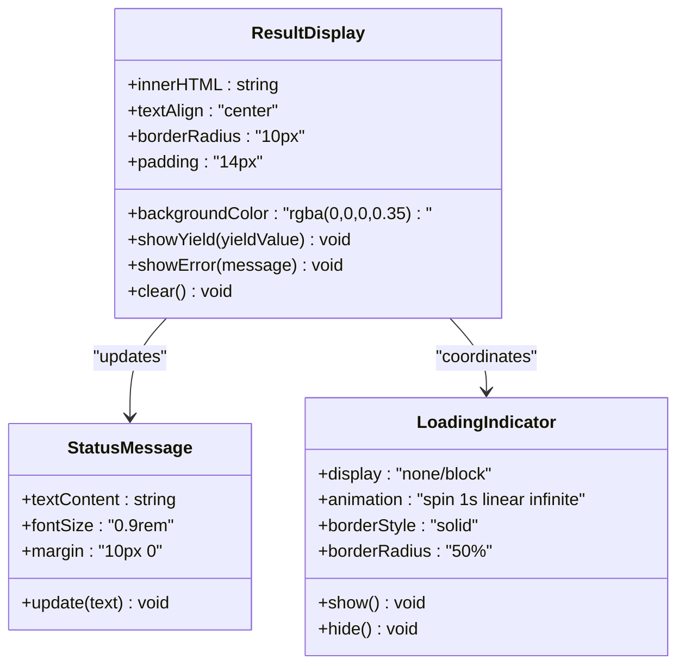
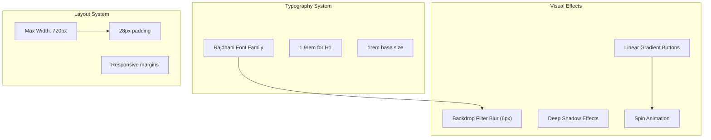
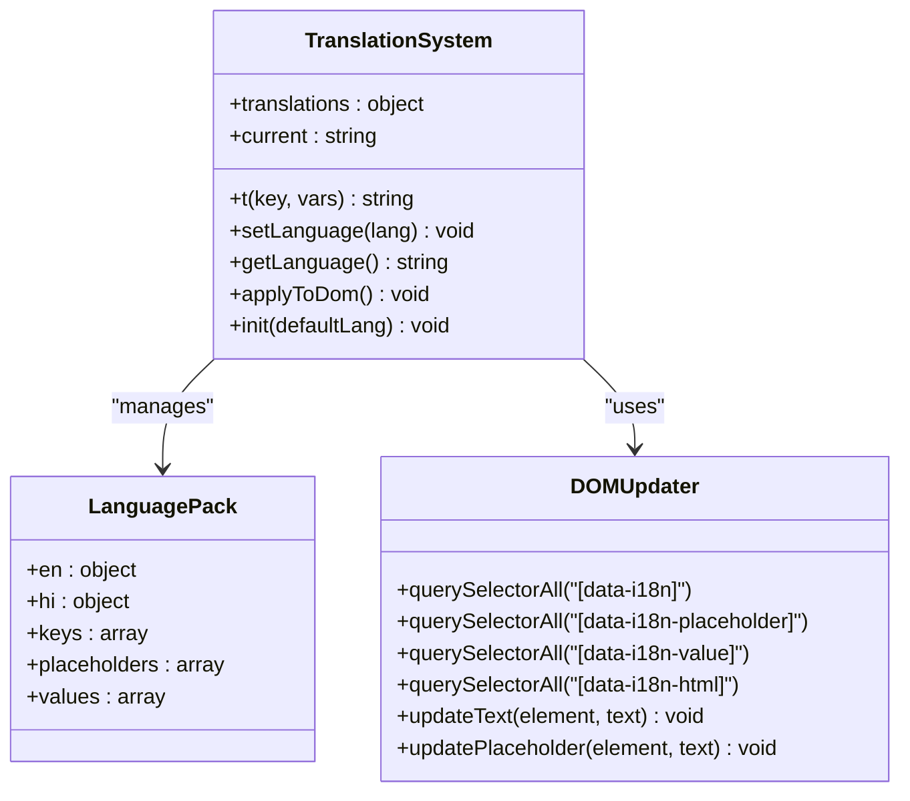
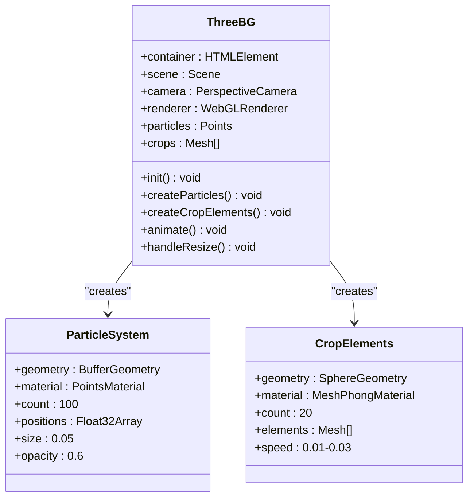
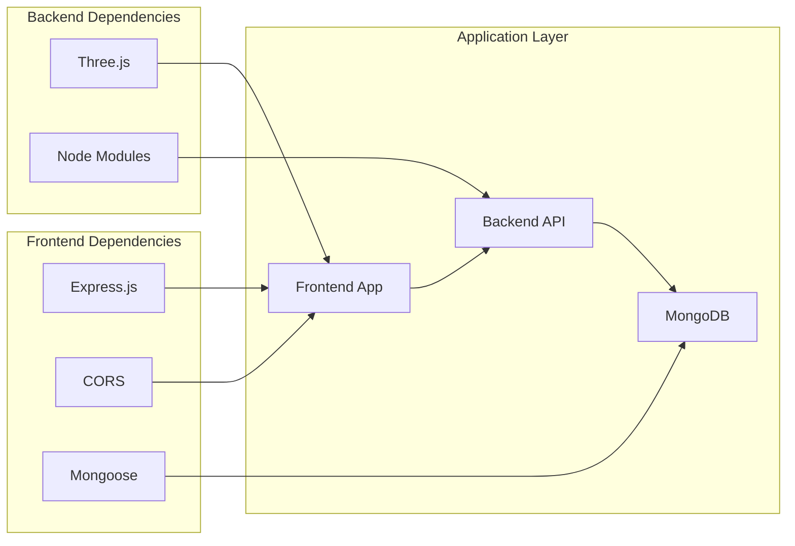

# User Interface and Form Handling

<cite>
**Referenced Files in This Document**
- [index.html](file://simple webpage/index.html)
- [script.js](file://simple webpage/script.js)
- [style.css](file://simple webpage/style.css)
- [server.js](file://simple webpage/server.js)
- [i18n.js](file://simple webpage/i18n.js)
- [three.js](file://simple webpage/three.js)
- [package.json](file://simple webpage/package.json)
- [reverse/index.html](file://simple webpage reverse/index.html)
- [reverse/script.js](file://simple webpage reverse/script.js)
- [reverse/style.css](file://simple webpage reverse/style.css)
- [reverse/server.js](file://simple webpage reverse/server.js)
</cite>

## Table of Contents
1. [Introduction](#introduction)
2. [Project Structure](#project-structure)
3. [Core Components](#core-components)
4. [Architecture Overview](#architecture-overview)
5. [Detailed Component Analysis](#detailed-component-analysis)
6. [Dependency Analysis](#dependency-analysis)
7. [Performance Considerations](#performance-considerations)
8. [Accessibility and Cross-Browser Compatibility](#accessibility-and-cross-browser-compatibility)
9. [Mobile Responsiveness](#mobile-responsiveness)
10. [Troubleshooting Guide](#troubleshooting-guide)
11. [Conclusion](#conclusion)

## Introduction
This document provides comprehensive documentation for the frontend user interface components and form handling system of the YieldSmart application. It covers the HTML form structure, JavaScript validation and submission logic, real-time feedback mechanisms, result display patterns, CSS styling architecture, and user experience enhancements. It also addresses accessibility, cross-browser compatibility, and mobile responsiveness.

## Project Structure
The project consists of two related web applications:
- Crop Yield Prediction (primary): Handles crop type, soil type, NPK ratios, and weather conditions to predict yield.
- Fertilizer Recommendation (secondary): Recommends NPK ratios based on crop yield and soil type.

Both applications share common UI patterns, internationalization, and 3D background effects.

**Diagram sources**
- [index.html:1-116](file://simple webpage/index.html#L1-L116)
- [script.js:1-73](file://simple webpage/script.js#L1-L73)
- [style.css:1-173](file://simple webpage/style.css#L1-L173)
- [server.js:1-68](file://simple webpage/server.js#L1-L68)
- [i18n.js:1-122](file://simple webpage/i18n.js#L1-L122)
- [three.js:1-107](file://simple webpage/three.js#L1-L107)
- [reverse/index.html:1-98](file://simple webpage reverse/index.html#L1-L98)
- [reverse/script.js:1-64](file://simple webpage reverse/script.js#L1-L64)
- [reverse/style.css:1-194](file://simple webpage reverse/style.css#L1-L194)
- [reverse/server.js:1-65](file://simple webpage reverse/server.js#L1-L65)

**Section sources**
- [index.html:1-116](file://simple webpage/index.html#L1-L116)
- [reverse/index.html:1-98](file://simple webpage reverse/index.html#L1-L98)

## Core Components
The system comprises four primary components:

### HTML Form Structure
The crop yield prediction form includes:
- Crop Type input (text field)
- Soil Type dropdown with predefined options
- NPK ratio inputs (number fields with decimal precision)
- Location input (text field)
- Predict Yield button
- Status message area
- Loading indicator
- Results display area
- Fertilizer recommendation link

### JavaScript Form Handling
The form submission logic handles:
- Preventing default form submission
- Collecting form data
- Real-time loading state management
- Asynchronous request processing
- Error handling and user feedback
- Dynamic content updates

### CSS Styling Architecture
The styling system provides:
- Responsive design patterns
- Animated loading indicators
- Interactive button states
- Backdrop filters for readability
- Consistent typography
- Gradient backgrounds

### Backend Integration
The system communicates with two separate APIs:
- Crop yield prediction endpoint
- Fertilizer recommendation endpoint

**Section sources**
- [index.html:36-79](file://simple webpage/index.html#L36-L79)
- [script.js:13-73](file://simple webpage/script.js#L13-L73)
- [style.css:1-173](file://simple webpage/style.css#L1-L173)
- [server.js:44-64](file://simple webpage/server.js#L44-L64)

## Architecture Overview
The application follows a client-server architecture with modular frontend components:

**Diagram sources**
- [script.js:13-73](file://simple webpage/script.js#L13-L73)
- [server.js:44-64](file://simple webpage/server.js#L44-L64)

## Detailed Component Analysis

### HTML Form Structure
The form is structured with semantic HTML and accessibility features:

**Diagram sources**
- [index.html:36-79](file://simple webpage/index.html#L36-L79)

Key form characteristics:
- Uses native HTML5 validation with required attributes
- Implements semantic labeling for accessibility
- Supports internationalization through data-i18n attributes
- Includes viewport meta tag for mobile optimization

**Section sources**
- [index.html:36-79](file://simple webpage/index.html#L36-L79)

### JavaScript Form Validation and Submission Logic
The form handling system implements robust validation and error management:

**Diagram sources**
- [script.js:13-73](file://simple webpage/script.js#L13-L73)

Implementation details:
- Asynchronous request handling with async/await
- Comprehensive error handling with try-catch-finally blocks
- Dynamic status message updates
- Loading state management for improved UX
- Weather condition defaults (Temperature: 25°C, Humidity: 60%, Wind_Speed: 2 m/s)

**Section sources**
- [script.js:13-73](file://simple webpage/script.js#L13-L73)

### Real-Time Feedback Mechanisms
The system provides immediate user feedback through multiple channels:

**Diagram sources**
- [script.js:16-72](file://simple webpage/script.js#L16-L72)

Feedback mechanisms include:
- Status messages for current operation state
- Visual loading spinner during requests
- Color-coded success/error indicators
- Disabled submit button during processing
- Immediate validation feedback

**Section sources**
- [script.js:8-11](file://simple webpage/script.js#L8-L11)
- [script.js:17-18](file://simple webpage/script.js#L17-L18)
- [script.js:66-72](file://simple webpage/script.js#L66-L72)

### Result Display Patterns
The result display system provides structured, user-friendly output:

**Diagram sources**
- [script.js:50-61](file://simple webpage/script.js#L50-L61)
- [style.css:139-145](file://simple webpage/style.css#L139-L145)
- [style.css:147-162](file://simple webpage/style.css#L147-L162)

Display patterns:
- Centered layout for emphasis
- Green color scheme for success indication
- Rounded corners and subtle shadows
- Responsive typography scaling
- Consistent spacing and alignment

**Section sources**
- [script.js:54-61](file://simple webpage/script.js#L54-L61)
- [style.css:139-145](file://simple webpage/style.css#L139-L145)

### CSS Styling Architecture
The styling system implements modern web design principles:

**Diagram sources**
- [style.css:1-173](file://simple webpage/style.css#L1-L173)

Key styling features:
- Modern glass-morphism effect with backdrop blur
- Consistent gradient button design
- Smooth animations and transitions
- Responsive container sizing
- Accessible color contrast ratios

**Section sources**
- [style.css:1-173](file://simple webpage/style.css#L1-L173)

### Internationalization System
The i18n.js module provides comprehensive multilingual support:

**Diagram sources**
- [i18n.js:1-122](file://simple webpage/i18n.js#L1-L122)

Supported languages:
- English (default)
- Hindi (devanagari script)
- Dynamic content updates
- Placeholder and value translation support

**Section sources**
- [i18n.js:1-122](file://simple webpage/i18n.js#L1-L122)

### 3D Background System
The three.js integration creates an immersive visual experience:

**Diagram sources**
- [three.js:3-107](file://simple webpage/three.js#L3-L107)

Background features:
- Floating particle system
- Animated crop elements
- Responsive resizing
- Optimized performance
- Transparent rendering

**Section sources**
- [three.js:1-107](file://simple webpage/three.js#L1-L107)

## Dependency Analysis
The system has minimal external dependencies with clear separation of concerns:

**Diagram sources**
- [package.json:10-14](file://simple webpage/package.json#L10-L14)
- [server.js:1-13](file://simple webpage/server.js#L1-L13)

Dependency relationships:
- Frontend depends on Express for serving static files
- Backend uses Three.js for 3D graphics
- Both applications connect to MongoDB for data persistence
- CORS enables cross-origin communication

**Section sources**
- [package.json:1-15](file://simple webpage/package.json#L1-L15)
- [server.js:1-13](file://simple webpage/server.js#L1-L13)

## Performance Considerations
The application implements several performance optimization strategies:

### Loading State Management
- Disables submit button during requests to prevent duplicate submissions
- Shows loading indicator to provide immediate feedback
- Uses CSS animations instead of heavy JavaScript animations

### Memory Management
- Three.js scene cleanup on resize events
- Efficient particle system with optimized geometry
- Minimal DOM manipulation during updates

### Network Optimization
- Single request per form submission
- JSON payload compression
- Error handling prevents unnecessary retries

### Rendering Performance
- CSS transforms for animations (hardware accelerated)
- Backdrop filters optimized for modern browsers
- Efficient event handling with delegated listeners

## Accessibility and Cross-Browser Compatibility
The application implements comprehensive accessibility features:

### Semantic HTML Structure
- Proper form labeling with `<label>` elements
- Accessible form controls with appropriate ARIA attributes
- Logical tab order for keyboard navigation

### Screen Reader Support
- Descriptive alt text for visual elements
- Clear status messages for assistive technologies
- Focus management during state changes

### Cross-Browser Compatibility
- Modern CSS features with fallbacks
- ES6+ JavaScript with transpilation support
- Progressive enhancement for older browsers

### Mobile Accessibility
- Touch-friendly form controls
- Responsive typography scaling
- Adequate touch target sizes

## Mobile Responsiveness
The application provides excellent mobile experience:

### Responsive Design Patterns
- Flexible grid system with max-width constraints
- Adaptive font sizing for different screen sizes
- Touch-optimized interactive elements

### Viewport Configuration
- Proper viewport meta tag for mobile scaling
- Responsive image handling
- Touch event optimization

### Mobile-Specific Features
- Landscape/portrait orientation support
- Safe area insets for modern devices
- Reduced motion preferences support

## Troubleshooting Guide

### Common Issues and Solutions

#### Form Submission Problems
- **Issue**: Form submits without validation
  - **Solution**: Verify required attributes are present on all inputs
  - **Check**: HTML structure in index.html

- **Issue**: Loading indicator not appearing
  - **Solution**: Ensure loader element exists and CSS is loaded
  - **Check**: style.css loader styles and DOM element ID

#### API Communication Issues
- **Issue**: Backend errors or timeouts
  - **Solution**: Verify server is running on localhost:5000
  - **Check**: server.js listening port and CORS configuration

- **Issue**: JSON parsing errors
  - **Solution**: Validate response format matches expected structure
  - **Check**: server.js response payload structure

#### Styling Problems
- **Issue**: 3D background not rendering
  - **Solution**: Check Three.js library loading and container availability
  - **Check**: three.js initialization and container element

- **Issue**: Internationalization not working
  - **Solution**: Verify i18n.js module is properly imported
  - **Check**: data-i18n attributes and translation keys

#### Performance Issues
- **Issue**: Slow loading times
  - **Solution**: Optimize image assets and reduce bundle size
  - **Check**: CSS and JavaScript file sizes

**Section sources**
- [script.js:66-72](file://simple webpage/script.js#L66-L72)
- [server.js:66-68](file://simple webpage/server.js#L66-L68)
- [style.css:147-162](file://simple webpage/style.css#L147-L162)
- [i18n.js:103-122](file://simple webpage/i18n.js#L103-L122)

## Conclusion
The YieldSmart application demonstrates a well-architected frontend system with robust form handling, comprehensive user feedback mechanisms, and modern styling techniques. The modular design allows for easy maintenance and extension, while the internationalization system supports global accessibility. The combination of practical functionality and visual appeal creates an engaging user experience across multiple platforms and devices.

The system successfully balances user experience considerations with technical implementation, providing a solid foundation for future enhancements and feature additions.