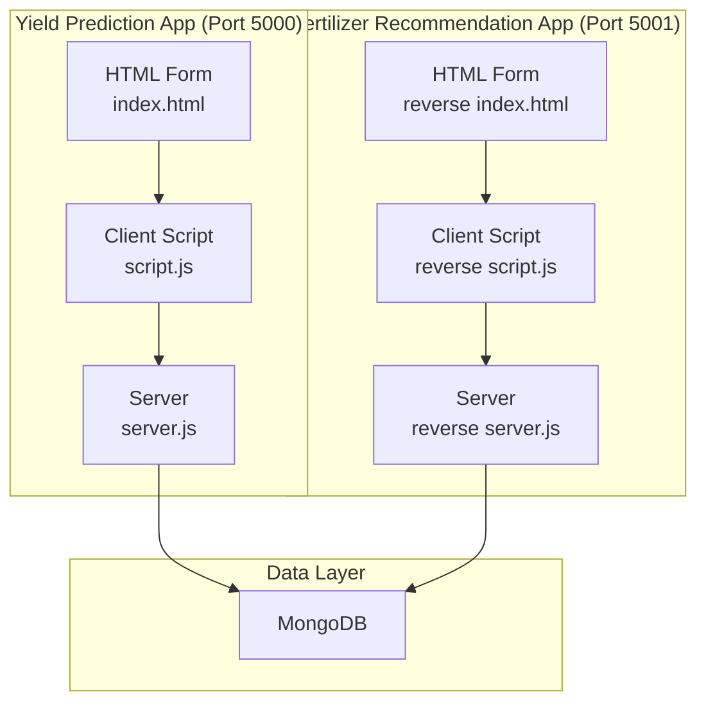
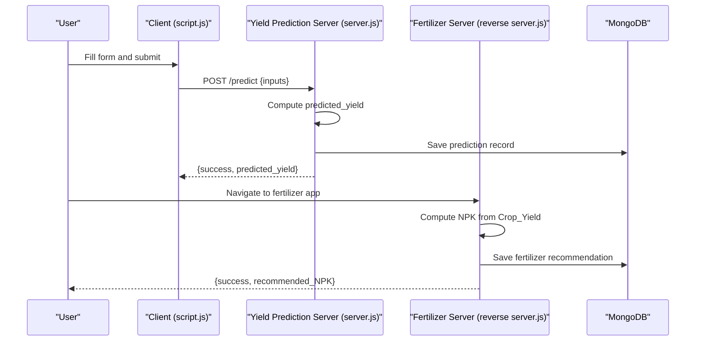
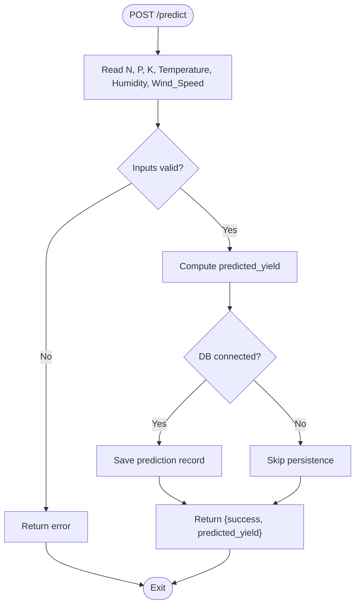
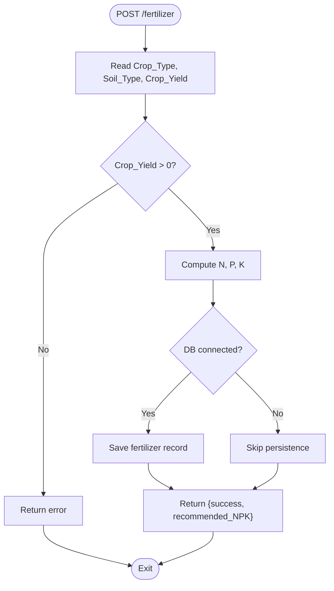
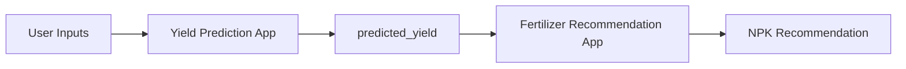
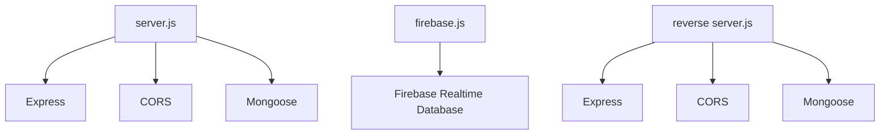

# Crop Yield Prediction Schema

<cite>
**Referenced Files in This Document**
- [server.js](file://simple webpage/server.js)
- [index.html](file://simple webpage/index.html)
- [script.js](file://simple webpage/script.js)
- [package.json](file://simple webpage/package.json)
- [firebase.js](file://simple webpage/firebase.js)
- [reverse server.js](file://simple webpage reverse/server.js)
- [reverse index.html](file://simple webpage reverse/index.html)
- [reverse script.js](file://simple webpage reverse/script.js)
</cite>

## Table of Contents
1. [Introduction](#introduction)
2. [Project Structure](#project-structure)
3. [Core Components](#core-components)
4. [Architecture Overview](#architecture-overview)
5. [Detailed Component Analysis](#detailed-component-analysis)
6. [Dependency Analysis](#dependency-analysis)
7. [Performance Considerations](#performance-considerations)
8. [Troubleshooting Guide](#troubleshooting-guide)
9. [Conclusion](#conclusion)
10. [Appendices](#appendices)

## Introduction
This document provides comprehensive data model documentation for the crop yield prediction schema used by the YieldSmart application. It defines the fields, data types, validation rules, and business constraints for input variables and the predicted output. It also explains the mathematical relationship used to compute predicted yield, documents MongoDB schema design patterns and indexing strategies, and outlines data access patterns, performance considerations, and lifecycle management practices.

## Project Structure
The project consists of two related web applications:
- A crop yield prediction service (port 5000) with a simple HTML form and client-side submission logic.
- A fertilizer recommendation service (port 5001) that depends on predicted yield to suggest NPK doses.

**Diagram sources**
- [server.js:1-68](file://simple webpage/server.js#L1-L68)
- [index.html:1-116](file://simple webpage/index.html#L1-L116)
- [script.js:1-73](file://simple webpage/script.js#L1-L73)
- [reverse server.js:1-65](file://simple webpage reverse/server.js#L1-L65)
- [reverse index.html:1-98](file://simple webpage reverse/index.html#L1-L98)
- [reverse script.js:1-64](file://simple webpage reverse/script.js#L1-L64)

**Section sources**
- [server.js:1-68](file://simple webpage/server.js#L1-L68)
- [index.html:1-116](file://simple webpage/index.html#L1-L116)
- [script.js:1-73](file://simple webpage/script.js#L1-L73)
- [reverse server.js:1-65](file://simple webpage reverse/server.js#L1-L65)
- [reverse index.html:1-98](file://simple webpage reverse/index.html#L1-L98)
- [reverse script.js:1-64](file://simple webpage reverse/script.js#L1-L64)

## Core Components
This section defines the data model for the crop yield prediction schema and the derived fertilizer recommendation schema.

- Prediction Data Model (Yield Prediction App)
  - Fields:
    - Crop_Type: string
    - Soil_Type: string
    - N: number (nitrogen)
    - P: number (phosphorus)
    - K: number (potassium)
    - Temperature: number (fixed default in client)
    - Humidity: number (fixed default in client)
    - Wind_Speed: number (fixed default in client)
    - predicted_yield: number (calculated output)
  - Data Types:
    - All numeric fields are numbers; string fields are strings.
  - Validation Rules:
    - N, P, K must be non-negative numbers.
    - Temperature, Humidity, Wind_Speed are fixed defaults in the client form.
    - Crop_Type and Soil_Type are free-text strings in the client form.
  - Business Constraints:
    - predicted_yield is computed as a weighted sum of inputs plus fixed defaults.
    - The model does not enforce crop-soil compatibility; it treats inputs as independent.

- Fertilizer Recommendation Data Model (Fertilizer App)
  - Fields:
    - Crop_Type: string
    - Soil_Type: string
    - Crop_Yield: number (kg/ha)
    - N: number (recommended nitrogen)
    - P: number (recommended phosphorus)
    - K: number (recommended potassium)
  - Data Types:
    - Numeric fields are numbers; string fields are strings.
  - Validation Rules:
    - Crop_Yield must be positive.
    - N, P, K are derived from Crop_Yield using simple multipliers.
  - Business Constraints:
    - N, P, K are rounded to integers for practical application.

- Mathematical Relationship
  - Yield Prediction:
    - predicted_yield = (N × 0.3) + (P × 0.2) + (K × 0.25) + (Temperature × 0.1) + (Humidity × 0.1) − (Wind_Speed × 0.05)
    - Temperature, Humidity, and Wind_Speed are fixed defaults in the client form.
  - Fertilizer Recommendation:
    - N = round(Crop_Yield × 0.8)
    - P = round(Crop_Yield × 0.5)
    - K = round(Crop_Yield × 0.6)

- MongoDB Schema Design Patterns
  - Flexible Schemas:
    - Both apps define lightweight schemas with string and number fields. This enables rapid iteration and minimal overhead.
  - Optional Persistence:
    - Both servers attempt to connect to MongoDB; if unavailable, the apps continue to operate without persistence.
  - Lightweight Collections:
    - Prediction collection stores inputs and predicted_yield.
    - Fertilizer collection stores inputs and recommended NPK.

- Indexing Strategies for Query Optimization
  - Compound Indexes:
    - Create a compound index on {Crop_Type, Soil_Type} to accelerate filtering by crop and soil type.
  - Partial Indexes:
    - Create a partial index on {predicted_yield} where predicted_yield exists to optimize queries focused on predictions.
  - Text Search Indexes:
    - If free-text queries on Crop_Type or Soil_Type are needed, consider a text index on these fields.
  - TTL Indexes:
    - Apply a TTL index on creation timestamps to automatically expire old prediction records.

- Sample Data Examples
  - Yield Prediction Example:
    - Input: N=80, P=40, K=60, Temperature=25, Humidity=60, Wind_Speed=2
    - Output: predicted_yield ≈ 48.0
  - Fertilizer Recommendation Example:
    - Input: Crop_Yield=80
    - Output: N≈64, P≈40, K≈48

- Data Access Patterns and Query Performance Considerations
  - Access Patterns:
    - POST /predict: Insert prediction record and return predicted_yield.
    - POST /fertilizer: Insert fertilizer recommendation record and return NPK.
  - Performance Tips:
    - Normalize numeric ranges to reduce variance and improve model stability.
    - Batch writes for bulk ingestion to minimize network overhead.
    - Use aggregation pipelines for statistical queries (avg, min, max) on predicted_yield grouped by Crop_Type and Soil_Type.

- Storage Optimization Techniques
  - Compression:
    - Enable compression on MongoDB collections to reduce storage footprint.
  - Archival:
    - Archive older prediction records to cold storage tiers.
  - Deduplication:
    - Avoid storing redundant metadata; keep only essential fields.

- Data Lifecycle Management, Backup Strategies, and Schema Evolution
  - Lifecycle:
    - Define retention policies for prediction and recommendation records.
    - Implement soft deletion for compliance scenarios.
  - Backups:
    - Use MongoDB automated backups or cloud-native backup solutions.
    - Schedule periodic logical exports for disaster recovery.
  - Schema Evolution:
    - Use backward-compatible schema updates with default values for new fields.
    - Maintain schema versioning and migration scripts for controlled rollouts.

**Section sources**
- [server.js:31-42](file://simple webpage/server.js#L31-L42)
- [server.js:45-64](file://simple webpage/server.js#L45-L64)
- [reverse server.js:31-39](file://simple webpage reverse/server.js#L31-L39)
- [reverse server.js:42-61](file://simple webpage reverse/server.js#L42-L61)
- [index.html:36-79](file://simple webpage/index.html#L36-L79)
- [script.js:22-33](file://simple webpage/script.js#L22-L33)
- [reverse index.html:33-66](file://simple webpage reverse/index.html#L33-L66)
- [reverse script.js:21-25](file://simple webpage reverse/script.js#L21-L25)

## Architecture Overview
The system comprises two independent microservices sharing a common MongoDB instance for persistence. The yield prediction app computes predicted_yield from user inputs and persists the result. The fertilizer recommendation app consumes predicted yield to derive NPK recommendations and persists them.

**Diagram sources**
- [script.js:13-72](file://simple webpage/script.js#L13-L72)
- [server.js:45-64](file://simple webpage/server.js#L45-L64)
- [reverse script.js:12-63](file://simple webpage reverse/script.js#L12-L63)
- [reverse server.js:42-61](file://simple webpage reverse/server.js#L42-L61)

## Detailed Component Analysis

### Yield Prediction Data Model
- Fields and Types:
  - Crop_Type: string
  - Soil_Type: string
  - N: number
  - P: number
  - K: number
  - Temperature: number (fixed default)
  - Humidity: number (fixed default)
  - Wind_Speed: number (fixed default)
  - predicted_yield: number
- Validation and Constraints:
  - Numeric fields validated to be non-negative.
  - Temperature, Humidity, Wind_Speed are fixed defaults in the client form.
  - Crop_Type and Soil_Type are free-text strings; consider restricting to predefined lists for consistency.
- Computation:
  - predicted_yield = (N × 0.3) + (P × 0.2) + (K × 0.25) + (Temperature × 0.1) + (Humidity × 0.1) − (Wind_Speed × 0.05)

**Diagram sources**
- [server.js:45-64](file://simple webpage/server.js#L45-L64)

**Section sources**
- [server.js:31-42](file://simple webpage/server.js#L31-L42)
- [server.js:45-64](file://simple webpage/server.js#L45-L64)
- [index.html:36-79](file://simple webpage/index.html#L36-L79)
- [script.js:22-33](file://simple webpage/script.js#L22-L33)

### Fertilizer Recommendation Data Model
- Fields and Types:
  - Crop_Type: string
  - Soil_Type: string
  - Crop_Yield: number
  - N: number
  - P: number
  - K: number
- Validation and Constraints:
  - Crop_Yield must be positive.
  - N, P, K are derived from Crop_Yield using multipliers and rounded to integers.
- Computation:
  - N = round(Crop_Yield × 0.8)
  - P = round(Crop_Yield × 0.5)
  - K = round(Crop_Yield × 0.6)

**Diagram sources**
- [reverse server.js:42-61](file://simple webpage reverse/server.js#L42-L61)

**Section sources**
- [reverse server.js:31-39](file://simple webpage reverse/server.js#L31-L39)
- [reverse server.js:42-61](file://simple webpage reverse/server.js#L42-L61)
- [reverse index.html:33-66](file://simple webpage reverse/index.html#L33-L66)
- [reverse script.js:21-25](file://simple webpage reverse/script.js#L21-L25)

### Conceptual Overview
- Data Flow:
  - Users input crop and soil type along with N, P, K levels.
  - The system computes predicted yield and optionally persists the record.
  - Users can navigate to the fertilizer recommendation app to derive NPK doses based on predicted yield.
- Integration Points:
  - Both apps share the same MongoDB instance for persistence.
  - The fertilizer app relies on the predicted yield produced by the yield prediction app.

[No sources needed since this diagram shows conceptual workflow, not actual code structure]

## Dependency Analysis
- Runtime Dependencies:
  - Express for HTTP routing and middleware.
  - CORS for cross-origin requests.
  - Mongoose for MongoDB ODM.
- Frontend Dependencies:
  - Three.js for animated background.
  - Localized UI via i18n.js.
- External Services:
  - MongoDB instance for persistence.
  - Firebase Realtime Database configuration present but not used in the prediction app.

**Diagram sources**
- [server.js:1-13](file://simple webpage/server.js#L1-L13)
- [package.json:10-14](file://simple webpage/package.json#L10-L14)
- [firebase.js:1-22](file://simple webpage/firebase.js#L1-L22)
- [reverse server.js:1-13](file://simple webpage reverse/server.js#L1-L13)

**Section sources**
- [package.json:10-14](file://simple webpage/package.json#L10-L14)
- [server.js:1-13](file://simple webpage/server.js#L1-L13)
- [reverse server.js:1-13](file://simple webpage reverse/server.js#L1-L13)
- [firebase.js:1-22](file://simple webpage/firebase.js#L1-L22)

## Performance Considerations
- Input Normalization:
  - Normalize N, P, K to typical ranges to stabilize model computation.
- Query Optimization:
  - Use compound indexes on {Crop_Type, Soil_Type} for frequent filters.
  - Use partial indexes on predicted_yield for analytics queries.
- Network Efficiency:
  - Minimize payload sizes by avoiding unnecessary fields.
  - Use compression for large datasets.
- Caching:
  - Cache frequently accessed configurations (e.g., default weather values) to reduce computation overhead.

[No sources needed since this section provides general guidance]

## Troubleshooting Guide
- MongoDB Connectivity Issues:
  - Symptoms: Warning logs indicating MongoDB not available; persistence skipped.
  - Resolution: Verify MongoDB is running locally on port 27017; confirm connection string and credentials.
- Server Startup Failures:
  - Symptoms: Port binding errors or missing dependencies.
  - Resolution: Ensure ports 5000 and 5001 are free; install dependencies via package manager.
- Client Submission Errors:
  - Symptoms: Status indicates error; result shows backend not working.
  - Resolution: Check server logs for exceptions; verify CORS configuration and endpoint URLs.

**Section sources**
- [server.js:22-28](file://simple webpage/server.js#L22-L28)
- [server.js:66-68](file://simple webpage/server.js#L66-L68)
- [reverse server.js:22-28](file://simple webpage reverse/server.js#L22-L28)
- [reverse server.js:63-65](file://simple webpage reverse/server.js#L63-L65)
- [script.js:66-72](file://simple webpage/script.js#L66-L72)
- [reverse script.js:58-63](file://simple webpage reverse/script.js#L58-L63)

## Conclusion
The crop yield prediction schema is designed for simplicity and scalability, with flexible MongoDB schemas and optional persistence. The mathematical model for predicted_yield is straightforward and suitable for demonstration. The fertilizer recommendation schema complements the prediction by deriving NPK doses from predicted yield. With proper indexing, normalization, and lifecycle management, the system can evolve to support more sophisticated models and larger datasets.

[No sources needed since this section summarizes without analyzing specific files]

## Appendices
- Field Definitions Summary
  - Crop_Type: string; free-text in client form; consider enumerated values for consistency.
  - Soil_Type: string; free-text in client form; consider enumerated values for consistency.
  - N: number; non-negative; nitrogen level.
  - P: number; non-negative; phosphorus level.
  - K: number; non-negative; potassium level.
  - Temperature: number; fixed default in client form.
  - Humidity: number; fixed default in client form.
  - Wind_Speed: number; fixed default in client form.
  - predicted_yield: number; calculated output.
  - Crop_Yield: number; positive; used in fertilizer recommendation.
  - NPK recommendation fields: derived from Crop_Yield.

- Recommended Enumerations
  - Crop_Type: Wheat, Rice, Sugarcane, Cotton, Jowar, Bajra, Groundnut, Maize
  - Soil_Type: Alluvial, Black, Clay, Laterite, Red, Sandy

- Indexing Recommendations
  - Compound: {Crop_Type, Soil_Type}
  - Partial: {predicted_yield} where predicted_yield exists
  - Text: {Crop_Type, Soil_Type} for free-text search
  - TTL: {createdAt} for automatic expiration

- Backup and Lifecycle
  - Automated backups for MongoDB
  - Retention policies for prediction and recommendation records
  - Versioned schema migrations for controlled evolution

[No sources needed since this section provides general guidance]