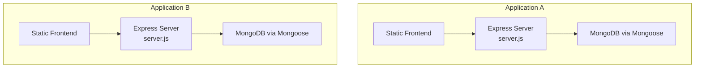
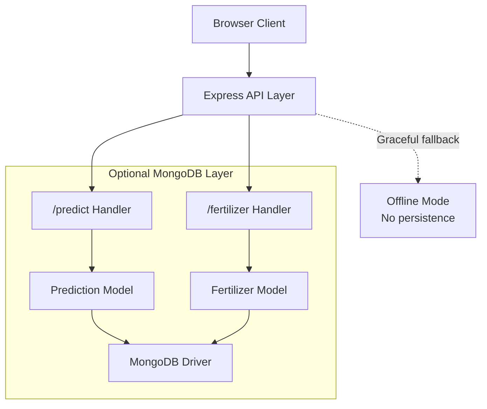
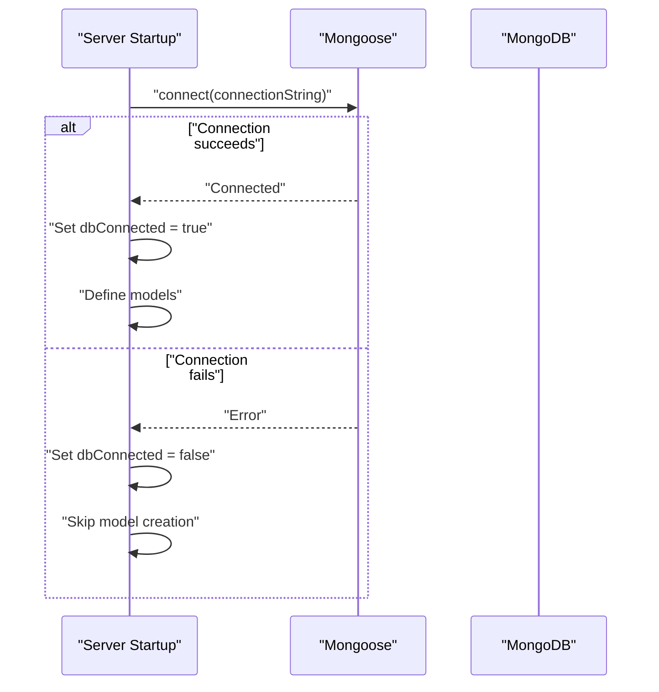
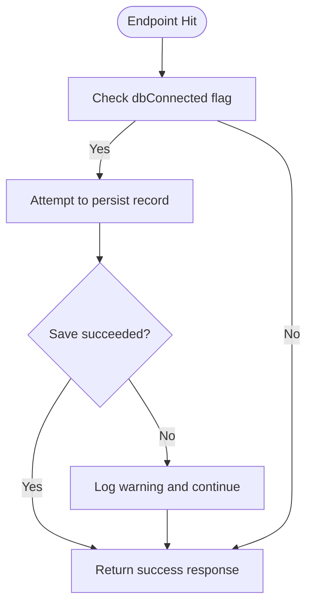
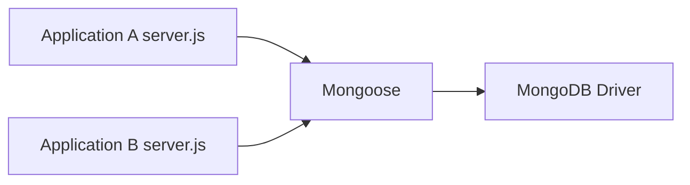

# Database Connection Management

<cite>
**Referenced Files in This Document**
- [server.js](file://simple webpage/server.js)
- [server.js](file://simple webpage reverse/server.js)
- [package.json](file://simple webpage/package.json)
- [connection.js](file://simple webpage/node_modules/mongoose/lib/connection.js)
- [connection.js](file://simple webpage reverse/node_modules/mongoose/lib/connection.js)
</cite>

## Table of Contents
1. [Introduction](#introduction)
2. [Project Structure](#project-structure)
3. [Core Components](#core-components)
4. [Architecture Overview](#architecture-overview)
5. [Detailed Component Analysis](#detailed-component-analysis)
6. [Dependency Analysis](#dependency-analysis)
7. [Performance Considerations](#performance-considerations)
8. [Security Considerations](#security-considerations)
9. [Troubleshooting Guide](#troubleshooting-guide)
10. [Conclusion](#conclusion)

## Introduction
This document provides comprehensive guidance for database connection management across two Node.js applications that integrate MongoDB via Mongoose. It covers connection handling patterns, connection string configuration, graceful fallback when the database is unavailable, error handling and retry strategies, timeouts, performance optimization, security considerations, and troubleshooting steps. Both applications demonstrate optional MongoDB connectivity with offline mode operation and local data persistence fallback.

## Project Structure
Each application consists of:
- An Express server that exposes prediction and fertilizer recommendation endpoints
- Optional MongoDB integration using Mongoose
- Static asset serving for frontend resources
- Minimal client-side JavaScript that posts requests to the backend

**Diagram sources**
- [server.js:1-68](file://simple webpage/server.js#L1-L68)
- [server.js:1-65](file://simple webpage reverse/server.js#L1-L65)

**Section sources**
- [server.js:1-68](file://simple webpage/server.js#L1-L68)
- [server.js:1-65](file://simple webpage reverse/server.js#L1-L65)
- [package.json:1-15](file://simple webpage/package.json#L1-L15)

## Core Components
- Express server initialization and middleware setup
- Optional MongoDB connection using Mongoose with a local connection string
- Model definition guarded by connection state
- Endpoint handlers that conditionally persist data when the database is available
- Graceful degradation to offline mode when MongoDB is unreachable

Key characteristics:
- Connection is attempted during server startup
- A boolean flag tracks connection state
- Models are dynamically created only when connected
- Persistence is attempted within endpoint handlers and gracefully skipped on failure

**Section sources**
- [server.js:18-42](file://simple webpage/server.js#L18-L42)
- [server.js:18-39](file://simple webpage reverse/server.js#L18-L39)

## Architecture Overview
The applications implement a layered pattern:
- Presentation layer: static HTML/CSS/JS served by Express
- API layer: HTTP endpoints for predictions and fertilizer recommendations
- Data access layer: Mongoose connection and models (optional)

**Diagram sources**
- [server.js:44-64](file://simple webpage/server.js#L44-L64)
- [server.js:41-61](file://simple webpage reverse/server.js#L41-L61)

## Detailed Component Analysis

### MongoDB Connection Handling Pattern
Both servers attempt to connect to a local MongoDB instance using Mongoose. The connection is established at startup, and a boolean flag determines whether models and persistence are enabled.

**Diagram sources**
- [server.js:22-28](file://simple webpage/server.js#L22-L28)
- [server.js:22-28](file://simple webpage reverse/server.js#L22-L28)

**Section sources**
- [server.js:18-42](file://simple webpage/server.js#L18-L42)
- [server.js:18-39](file://simple webpage reverse/server.js#L18-L39)

### Connection String Configuration
- Both servers use a local MongoDB connection string pointing to a default port and database name
- No credentials are included in the provided code, indicating either local access or environment-based configuration outside the shown code

Recommendations:
- Externalize the connection string to environment variables
- Support TLS/SSL for remote connections
- Include credentials securely when required

**Section sources**
- [server.js:23-23](file://simple webpage/server.js#L23-L23)
- [server.js:23-23](file://simple webpage reverse/server.js#L23-L23)

### Connection Pooling Strategies
- The applications rely on Mongoose defaults for connection pooling
- No explicit pool configuration is present in the code
- Consider tuning pool size, connection lifetime, and socket options for production workloads

**Section sources**
- [connection.js:1-200](file://simple webpage/node_modules/mongoose/lib/connection.js#L1-L200)
- [connection.js:1-200](file://simple webpage reverse/node_modules/mongoose/lib/connection.js#L1-L200)

### Graceful Fallback Mechanisms
When MongoDB is unavailable:
- The server continues operating without persistence
- Endpoint handlers check the connection state before attempting writes
- Write attempts are wrapped in try/catch blocks and logged as warnings when they fail

**Diagram sources**
- [server.js:55-61](file://simple webpage/server.js#L55-L61)
- [server.js:52-58](file://simple webpage reverse/server.js#L52-L58)

**Section sources**
- [server.js:55-61](file://simple webpage/server.js#L55-L61)
- [server.js:52-58](file://simple webpage reverse/server.js#L52-L58)

### Error Handling Patterns and Retry Logic
- Connection failures are caught and logged as warnings
- Endpoint write attempts are wrapped in try/catch and skipped on error
- No automatic retry mechanism is implemented in the current code

Recommendations:
- Implement exponential backoff for reconnect attempts
- Add circuit breaker logic to prevent cascading failures
- Consider queuing writes locally when persistence is unavailable

**Section sources**
- [server.js:26-28](file://simple webpage/server.js#L26-L28)
- [server.js:26-28](file://simple webpage reverse/server.js#L26-L28)
- [server.js:58-60](file://simple webpage/server.js#L58-L60)
- [server.js:55-57](file://simple webpage reverse/server.js#L55-L57)

### Connection Timeout Configurations
- No explicit timeout options are configured in the provided code
- Consider setting connection, server selection, and socket timeouts appropriate for deployment environments

**Section sources**
- [connection.js:174-192](file://simple webpage/node_modules/mongoose/lib/connection.js#L174-L192)

### Disconnection Procedures
- The applications do not explicitly close the Mongoose connection
- For long-running processes, ensure proper cleanup on shutdown signals

**Section sources**
- [connection.js:117-152](file://simple webpage/node_modules/mongoose/lib/connection.js#L117-L152)

## Dependency Analysis
Both applications depend on Express and Mongoose. The Mongoose connection module provides internal state management and event emission for connection lifecycle events.

**Diagram sources**
- [package.json:10-13](file://simple webpage/package.json#L10-L13)
- [connection.js:1-200](file://simple webpage/node_modules/mongoose/lib/connection.js#L1-L200)

**Section sources**
- [package.json:10-13](file://simple webpage/package.json#L10-L13)
- [connection.js:1-200](file://simple webpage/node_modules/mongoose/lib/connection.js#L1-L200)

## Performance Considerations
- Connection reuse: Keep a single persistent connection across requests
- Query optimization: Use appropriate indexes and limit projections for frequently accessed fields
- Memory management: Avoid retaining large result sets; stream or paginate when necessary
- Pool sizing: Tune poolMaxIdleTime, maxPoolSize, and waitQueueTimeout based on workload
- Heartbeat monitoring: Leverage built-in heartbeat checks to detect stale connections in containerized environments

[No sources needed since this section provides general guidance]

## Security Considerations
- Encryption: Enable TLS/SSL for MongoDB connections when communicating over networks
- Credential management: Store connection strings with credentials in environment variables or secret managers
- Access control: Configure MongoDB user roles and restrict permissions to least privilege
- Network isolation: Place MongoDB behind firewalls and VPCs; avoid exposing admin ports publicly

[No sources needed since this section provides general guidance]

## Troubleshooting Guide
Common issues and resolutions:
- MongoDB not reachable
  - Verify service status and firewall rules
  - Confirm the connection string matches the deployed MongoDB instance
  - Check for DNS resolution and network policies
- Authentication failures
  - Ensure credentials are correct and user has required roles
  - Validate authentication mechanisms supported by the MongoDB version
- Timeout errors
  - Increase connection and socket timeouts
  - Investigate network latency and server load
- Stale connections in containers
  - Monitor heartbeat intervals and refresh stale connections
- Graceful degradation
  - Confirm offline mode behavior by checking the connection flag and handler logic

**Section sources**
- [server.js:22-28](file://simple webpage/server.js#L22-L28)
- [server.js:22-28](file://simple webpage reverse/server.js#L22-L28)
- [connection.js:117-152](file://simple webpage/node_modules/mongoose/lib/connection.js#L117-L152)

## Conclusion
The applications implement a pragmatic, optional MongoDB integration pattern that prioritizes availability and resilience. By centralizing connection logic, guarding persistence behind a connection state flag, and logging failures, the systems remain functional even when the database is unavailable. For production deployments, extend the current implementation with explicit timeout configuration, connection pooling tuning, retry/backoff strategies, and robust security controls.