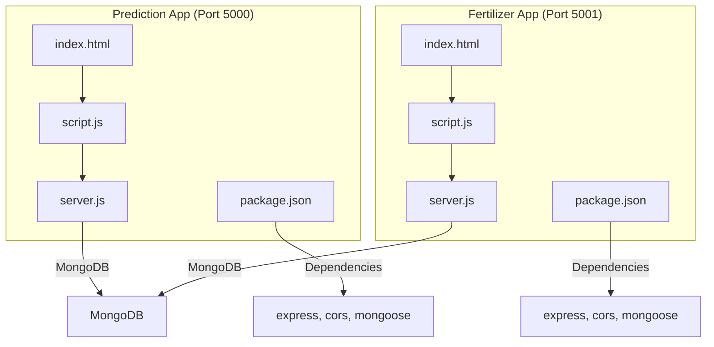
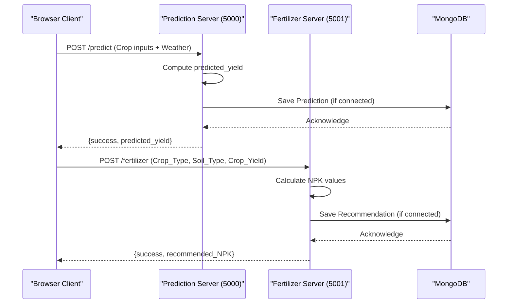
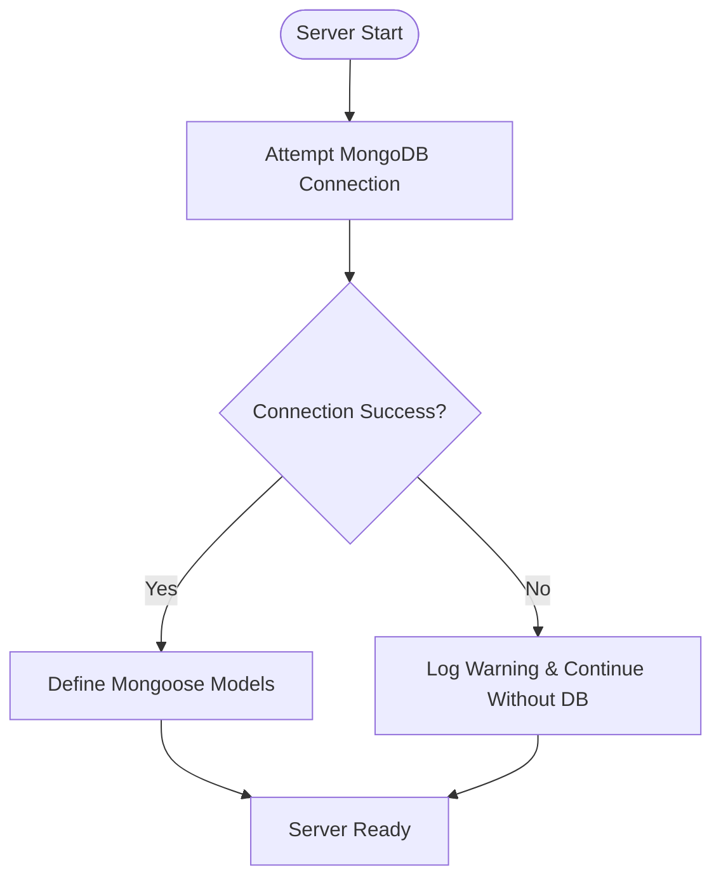
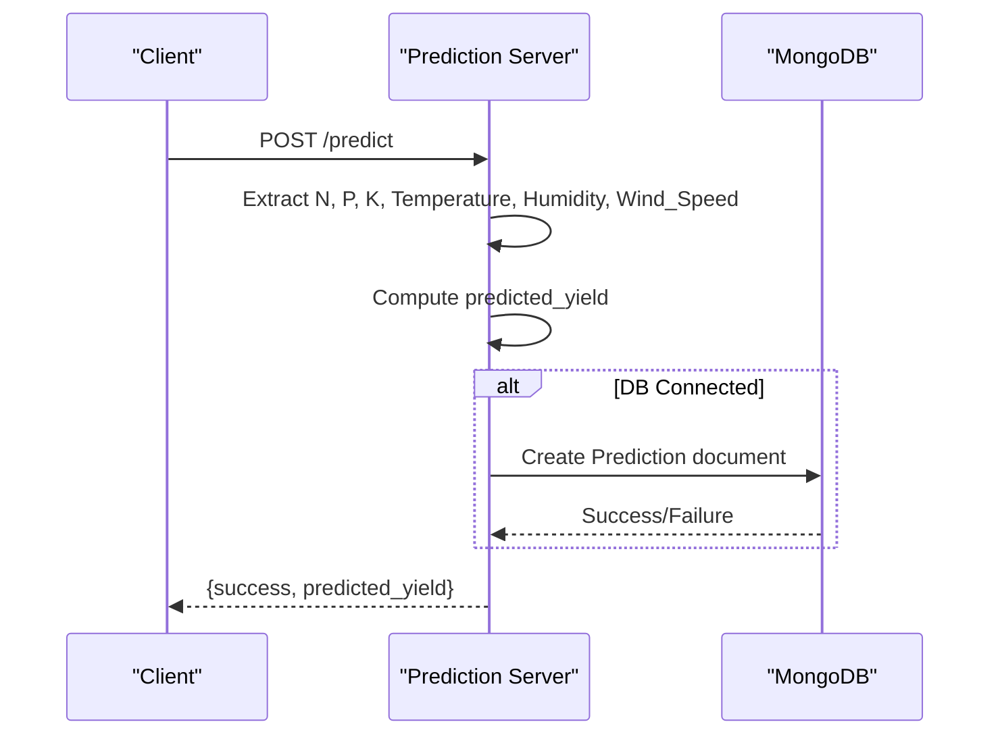
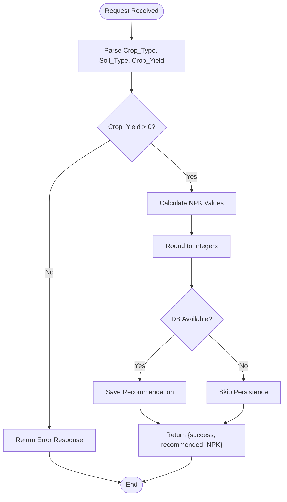
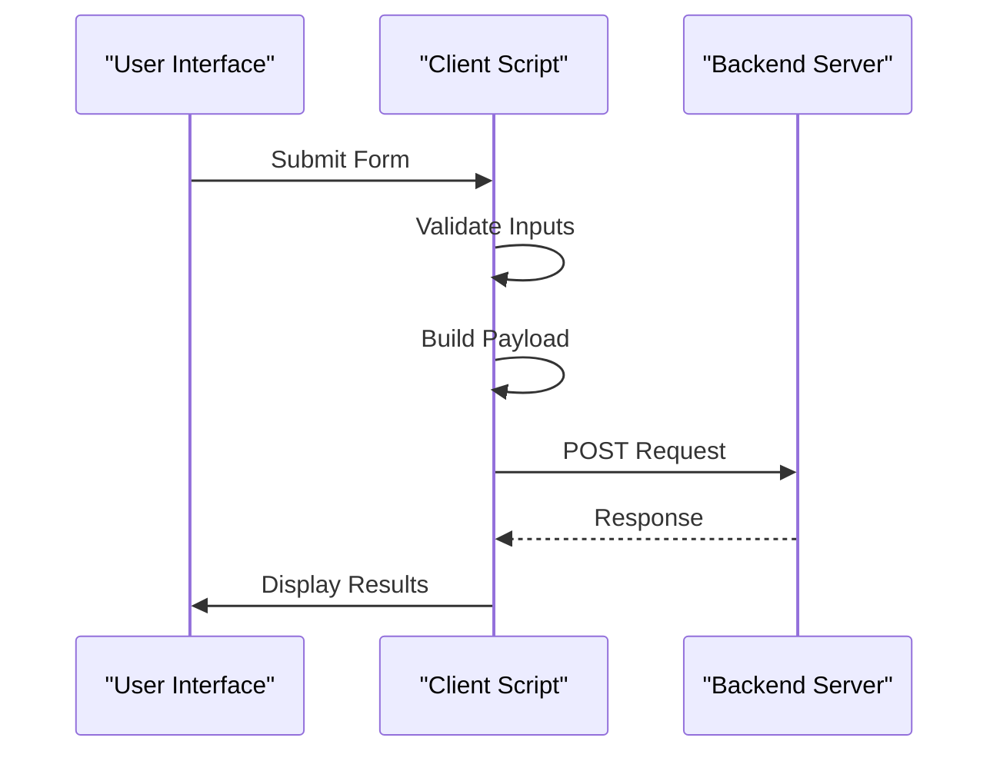
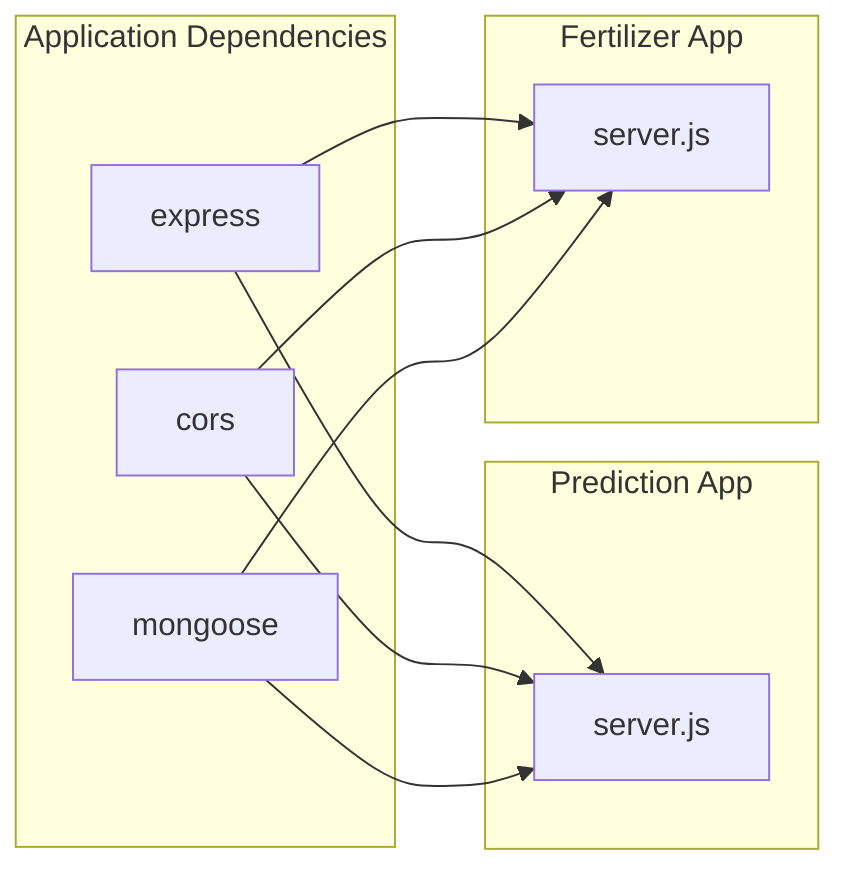

# Database Schema Design

<cite>
**Referenced Files in This Document**
- [server.js](file://simple webpage/server.js)
- [server.js](file://simple webpage_reverse/server.js)
- [package.json](file://simple webpage/package.json)
- [package.json](file://simple webpage_reverse/package.json)
- [index.html](file://simple webpage/index.html)
- [index.html](file://simple webpage_reverse/index.html)
- [script.js](file://simple webpage/script.js)
- [script.js](file://simple webpage_reverse/script.js)
- [i18n.js](file://simple webpage/i18n.js)
- [i18n.js](file://simple webpage_reverse/i18n.js)
</cite>

## Table of Contents
1. [Introduction](#introduction)
2. [Project Structure](#project-structure)
3. [Core Components](#core-components)
4. [Architecture Overview](#architecture-overview)
5. [Detailed Component Analysis](#detailed-component-analysis)
6. [Dependency Analysis](#dependency-analysis)
7. [Performance Considerations](#performance-considerations)
8. [Troubleshooting Guide](#troubleshooting-guide)
9. [Conclusion](#conclusion)
10. [Appendices](#appendices)

## Introduction
This document provides comprehensive database schema design documentation for two applications in the repository:
- Crop Yield Prediction application (runs on port 5000)
- Fertilizer Recommendation application (runs on port 5001)

Both applications use MongoDB via Mongoose for optional persistence. The document covers:
- Prediction schema and fertilizer recommendation schema definitions
- Field definitions, data types, validation rules, and indexing strategies
- MongoDB connection handling and graceful fallback mechanisms
- Query optimization patterns, caching strategies, and performance considerations
- Data lifecycle, backup strategies, and schema evolution approaches

## Project Structure
The repository contains two separate applications:
- simple webpage: Prediction application
- simple webpage reverse: Fertilizer recommendation application

Each application includes:
- Express server with CORS and JSON middleware
- Static file serving for HTML/CSS/JS
- MongoDB connection with optional fallback
- REST endpoints for predictions and recommendations
- Client-side forms and scripts for user interaction



**Diagram sources**
- [server.js:1-68](file://simple webpage/server.js#L1-L68)
- [server.js:1-65](file://simple webpage_reverse/server.js#L1-L65)
- [package.json:1-15](file://simple webpage/package.json#L1-L15)
- [package.json:1-15](file://simple webpage_reverse/package.json#L1-L15)

**Section sources**
- [server.js:1-68](file://simple webpage/server.js#L1-L68)
- [server.js:1-65](file://simple webpage_reverse/server.js#L1-L65)
- [package.json:1-15](file://simple webpage/package.json#L1-L15)
- [package.json:1-15](file://simple webpage_reverse/package.json#L1-L15)

## Core Components
This section documents the database schemas used by both applications, focusing on field definitions, data types, validation rules, and business logic.

### Prediction Schema (Crop Yield Prediction)
The prediction application stores user inputs and calculated yield for persistence when MongoDB is available.

Fields:
- Crop_Type: String (required)
- Soil_Type: String (required)
- N: Number (required)
- P: Number (required)
- K: Number (required)
- Temperature: Number (required)
- Humidity: Number (required)
- Wind_Speed: Number (required)
- predicted_yield: Number (calculated)

Validation rules:
- All numeric fields must be valid numbers
- Crop_Type and Soil_Type are required strings
- Temperature, Humidity, and Wind_Speed use fixed defaults in the client
- predicted_yield is computed server-side using the formula: (N * 0.3 + P * 0.2 + K * 0.25 + Temperature * 0.1 + Humidity * 0.1 - Wind_Speed * 0.05)

Business logic:
- The server computes predicted_yield from incoming parameters
- Persistence is attempted only when MongoDB is connected

Indexing strategy:
- No explicit indexes are defined in the schema
- Consider adding compound indexes on frequently queried combinations (e.g., Crop_Type + Soil_Type)

Sample data example:
- Crop_Type: "rice"
- Soil_Type: "Loamy"
- N: 80.0
- P: 40.0
- K: 60.0
- Temperature: 25.0
- Humidity: 60.0
- Wind_Speed: 2.0
- predicted_yield: computed value

### Fertilizer Recommendation Schema
The fertilizer recommendation application calculates NPK requirements based on crop yield and persists the recommendation.

Fields:
- Crop_Type: String (required)
- Soil_Type: String (required)
- Crop_Yield: Number (required)
- N: Number (calculated)
- P: Number (calculated)
- K: Number (calculated)

Business rule validations:
- Crop_Yield must be a positive number
- N = round(Crop_Yield * 0.8)
- P = round(Crop_Yield * 0.5)
- K = round(Crop_Yield * 0.6)
- All calculations are rounded to integers

Sample data example:
- Crop_Type: "rice"
- Soil_Type: "Loamy"
- Crop_Yield: 4500.0
- N: 3600
- P: 2250
- K: 2700

**Section sources**
- [server.js:31-42](file://simple webpage/server.js#L31-L42)
- [server.js:31-39](file://simple webpage_reverse/server.js#L31-L39)
- [script.js:22-33](file://simple webpage/script.js#L22-L33)
- [script.js:21-25](file://simple webpage_reverse/script.js#L21-L25)

## Architecture Overview
The applications follow a client-server architecture with optional MongoDB persistence:



**Diagram sources**
- [server.js:45-64](file://simple webpage/server.js#L45-L64)
- [server.js:42-61](file://simple webpage_reverse/server.js#L42-L61)
- [script.js:36-42](file://simple webpage/script.js#L36-L42)
- [script.js:28-34](file://simple webpage_reverse/script.js#L28-L34)

## Detailed Component Analysis

### MongoDB Connection Handling and Graceful Fallback
Both servers implement robust connection handling with fallback mechanisms:



Key behaviors:
- Connection attempts occur during server initialization
- On failure, servers continue operating without MongoDB persistence
- Models are conditionally defined only when connected
- All database operations are wrapped in try-catch blocks
- Failed saves log warnings and continue without affecting API responses

**Diagram sources**
- [server.js:22-28](file://simple webpage/server.js#L22-L28)
- [server.js:22-28](file://simple webpage_reverse/server.js#L22-L28)

**Section sources**
- [server.js:18-28](file://simple webpage/server.js#L18-L28)
- [server.js:18-28](file://simple webpage_reverse/server.js#L18-L28)

### Prediction API Processing
The prediction endpoint handles input validation, computation, and optional persistence:



Processing logic:
- Extracts numeric parameters from request body
- Computes predicted_yield using weighted formula
- Attempts to persist only when database is available
- Returns success regardless of persistence outcome

**Diagram sources**
- [server.js:45-64](file://simple webpage/server.js#L45-L64)
- [script.js:22-33](file://simple webpage/script.js#L22-L33)

**Section sources**
- [server.js:45-64](file://simple webpage/server.js#L45-L64)
- [script.js:22-33](file://simple webpage/script.js#L22-L33)

### Fertilizer Recommendation API Processing
The fertilizer endpoint performs business rule validation and calculation:



Business rules:
- Crop_Yield must be positive
- N = round(Crop_Yield * 0.8)
- P = round(Crop_Yield * 0.5)
- K = round(Crop_Yield * 0.6)

**Diagram sources**
- [server.js:42-61](file://simple webpage_reverse/server.js#L42-L61)

**Section sources**
- [server.js:42-61](file://simple webpage_reverse/server.js#L42-L61)

### Client-Side Data Access Patterns
Both applications implement similar client-side patterns:



Client-side behaviors:
- Form validation occurs before submission
- Payload construction includes all required fields
- Error handling displays user-friendly messages
- Loading states prevent concurrent submissions

**Diagram sources**
- [script.js:13-73](file://simple webpage/script.js#L13-L73)
- [script.js:12-64](file://simple webpage_reverse/script.js#L12-L64)

**Section sources**
- [script.js:13-73](file://simple webpage/script.js#L13-L73)
- [script.js:12-64](file://simple webpage_reverse/script.js#L12-L64)

## Dependency Analysis
The applications share common dependencies managed via npm:



**Diagram sources**
- [package.json:10-14](file://simple webpage/package.json#L10-L14)
- [package.json:10-14](file://simple webpage_reverse/package.json#L10-L14)

**Section sources**
- [package.json:10-14](file://simple webpage/package.json#L10-L14)
- [package.json:10-14](file://simple webpage_reverse/package.json#L10-L14)

## Performance Considerations
Current implementation characteristics:
- No explicit database indexes are defined
- Single collection per application (Prediction, Fertilizer)
- Basic CRUD operations with minimal query complexity
- Graceful degradation when database is unavailable

Recommended optimizations:
- Add compound indexes on frequently queried field combinations
- Implement connection pooling for MongoDB
- Add query result caching for repeated calculations
- Consider pagination for large result sets
- Monitor query performance and adjust indexes accordingly

[No sources needed since this section provides general guidance]

## Troubleshooting Guide
Common issues and resolutions:

### Database Connectivity Issues
- Symptom: Warning logs about MongoDB not available
- Resolution: Verify MongoDB service is running locally
- Impact: Application continues functioning without persistence

### API Response Failures
- Symptom: Client displays "Backend not working properly"
- Causes: Network issues, server downtime, invalid payloads
- Resolution: Check server logs, validate network connectivity

### Data Validation Errors
- Prediction app: Ensure N, P, K are valid numbers
- Fertilizer app: Ensure Crop_Yield is positive
- Resolution: Client-side validation prevents invalid submissions

**Section sources**
- [server.js:26-28](file://simple webpage/server.js#L26-L28)
- [server.js:26-28](file://simple webpage_reverse/server.js#L26-L28)
- [script.js:66-70](file://simple webpage/script.js#L66-L70)
- [script.js:58-61](file://simple webpage_reverse/script.js#L58-L61)

## Conclusion
The database schema design demonstrates a pragmatic approach to optional persistence with robust fallback mechanisms. Both applications implement:
- Clear schema definitions with explicit field types
- Business rule validation at the application level
- Graceful degradation when MongoDB is unavailable
- Simple, maintainable data access patterns

Future enhancements should focus on:
- Adding appropriate database indexes for query performance
- Implementing caching strategies for improved responsiveness
- Establishing backup and monitoring procedures
- Planning for schema evolution as requirements grow

[No sources needed since this section summarizes without analyzing specific files]

## Appendices

### Database Schema Definitions

#### Prediction Collection Schema
```javascript
// Fields and types
{
  Crop_Type: String,
  Soil_Type: String,
  N: Number,
  P: Number,
  K: Number,
  Temperature: Number,
  Humidity: Number,
  Wind_Speed: Number,
  predicted_yield: Number
}
```

#### Fertilizer Collection Schema
```javascript
// Fields and types
{
  Crop_Type: String,
  Soil_Type: String,
  Crop_Yield: Number,
  N: Number,
  P: Number,
  K: Number
}
```

### Sample Data Examples

#### Prediction Sample
```json
{
  "Crop_Type": "rice",
  "Soil_Type": "Loamy",
  "N": 80.0,
  "P": 40.0,
  "K": 60.0,
  "Temperature": 25.0,
  "Humidity": 60.0,
  "Wind_Speed": 2.0,
  "predicted_yield": 45.0
}
```

#### Fertilizer Recommendation Sample
```json
{
  "Crop_Type": "rice",
  "Soil_Type": "Loamy",
  "Crop_Yield": 4500.0,
  "N": 3600,
  "P": 2250,
  "K": 2700
}
```

### Internationalization Notes
Both applications support English and Hindi languages for user interface elements, including:
- Form labels and placeholders
- Status messages
- Error notifications
- Button text

**Section sources**
- [i18n.js:1-91](file://simple webpage/i18n.js#L1-L91)
- [i18n.js:1-91](file://simple webpage_reverse/i18n.js#L1-L91)