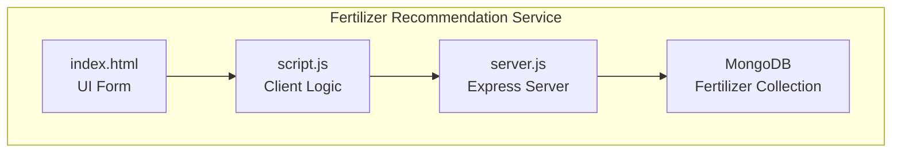
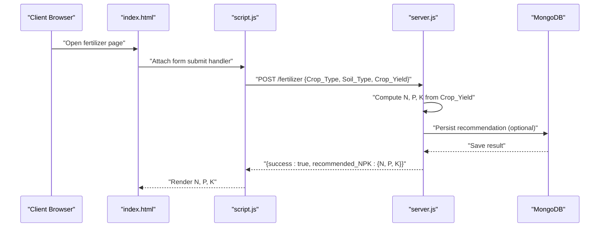
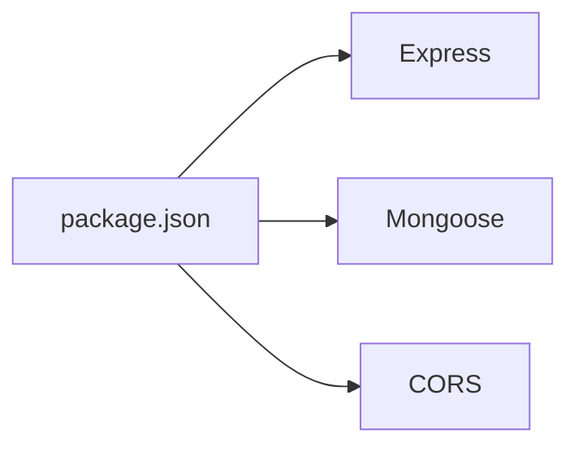

# Fertilizer Recommendation Schema

<cite>
**Referenced Files in This Document**
- [server.js](file://simple webpage/reverse/server.js)
- [index.html](file://simple webpage/reverse/index.html)
- [script.js](file://simple webpage/reverse/script.js)
- [i18n.js](file://simple webpage/reverse/i18n.js)
- [package.json](file://simple webpage/reverse/package.json)
</cite>

## Table of Contents
1. [Introduction](#introduction)
2. [Project Structure](#project-structure)
3. [Core Components](#core-components)
4. [Architecture Overview](#architecture-overview)
5. [Detailed Component Analysis](#detailed-component-analysis)
6. [Dependency Analysis](#dependency-analysis)
7. [Performance Considerations](#performance-considerations)
8. [Troubleshooting Guide](#troubleshooting-guide)
9. [Conclusion](#conclusion)
10. [Appendices](#appendices)

## Introduction
This document provides comprehensive data model documentation for the fertilizer recommendation schema used by the YieldSmart application. It defines all fields, their data types, validation rules, and business constraints. It explains the calculation of N, P, K nutrient requirements from target yield and documents MongoDB schema design patterns, indexing strategies, and query performance considerations. It also compares the fertilizer recommendation schema with the prediction schema and outlines data lifecycle, backup, and schema evolution strategies.

## Project Structure
The fertilizer recommendation feature is implemented as a separate microservice with its own Express server, HTML form, client-side script, and internationalization support. The service exposes a dedicated endpoint to compute and persist fertilizer recommendations.

**Diagram sources**
- [index.html:33-66](file://simple webpage/reverse/index.html#L33-L66)
- [script.js:12-64](file://simple webpage/reverse/script.js#L12-L64)
- [server.js:42-61](file://simple webpage/reverse/server.js#L42-L61)

**Section sources**
- [index.html:1-98](file://simple webpage/reverse/index.html#L1-L98)
- [script.js:1-64](file://simple webpage/reverse/script.js#L1-L64)
- [server.js:1-65](file://simple webpage/reverse/server.js#L1-L65)
- [package.json:1-19](file://simple webpage/reverse/package.json#L1-L19)

## Core Components
- Fertilizer Recommendation Endpoint: Computes N, P, K based on Crop_Yield and persists the record.
- Data Model: Defines the schema for storing fertilizer recommendations.
- Client UI: Provides a form to collect Crop_Type, Soil_Type, and Crop_Yield.
- Internationalization: Supports English and Hindi labels for the UI.

Key implementation references:
- Endpoint definition and calculation: [server.js:42-61](file://simple webpage/reverse/server.js#L42-L61)
- Data model definition: [server.js:31-38](file://simple webpage/reverse/server.js#L31-L38)
- Client form submission: [script.js:12-34](file://simple webpage/reverse/script.js#L12-L34)
- UI form fields: [index.html:33-66](file://simple webpage/reverse/index.html#L33-L66)
- Translations: [i18n.js:1-33](file://simple webpage/reverse/i18n.js#L1-L33)

**Section sources**
- [server.js:31-61](file://simple webpage/reverse/server.js#L31-L61)
- [index.html:33-66](file://simple webpage/reverse/index.html#L33-L66)
- [script.js:12-34](file://simple webpage/reverse/script.js#L12-L34)
- [i18n.js:1-33](file://simple webpage/reverse/i18n.js#L1-L33)

## Architecture Overview
The fertilizer recommendation service follows a simple request-response architecture:
- The client submits Crop_Type, Soil_Type, and Crop_Yield.
- The server computes N, P, K using a proportional formula.
- The server optionally persists the recommendation to MongoDB.
- The client displays the computed N, P, K values.

**Diagram sources**
- [index.html:33-66](file://simple webpage/reverse/index.html#L33-L66)
- [script.js:12-64](file://simple webpage/reverse/script.js#L12-L64)
- [server.js:42-61](file://simple webpage/reverse/server.js#L42-L61)

## Detailed Component Analysis

### Data Model Definition
The fertilizer recommendation data model captures the essential inputs and computed outputs for nutrient recommendations.

Fields:
- Crop_Type: String. Enumerated values include Wheat, Rice, Sugarcane, Cotton, Jowar, Bajra, Groundnut, Maize.
- Soil_Type: String. Enumerated values include Alluvial, Black, Clay, Laterite, Red, Sandy.
- Crop_Yield: Number. Target yield in kg/ha. Must be positive and numeric.
- N: Number. Calculated Nitrogen requirement derived from Crop_Yield.
- P: Number. Calculated Phosphorus requirement derived from Crop_Yield.
- K: Number. Calculated Potassium requirement derived from Crop_Yield.

Validation and constraints:
- Crop_Type and Soil_Type are free-text strings in the current UI; however, the schema expects enumerated values. Validation should enforce allowed values.
- Crop_Yield must be a positive number; negative or zero values are invalid.
- N, P, K are rounded integers computed from Crop_Yield.

Calculation logic:
- N = round(Crop_Yield × 0.8)
- P = round(Crop_Yield × 0.5)
- K = round(Crop_Yield × 0.6)

Storage and persistence:
- The model is persisted to MongoDB when the database connection is available.

**Section sources**
- [server.js:31-38](file://simple webpage/reverse/server.js#L31-L38)
- [server.js:42-61](file://simple webpage/reverse/server.js#L42-L61)
- [index.html:33-66](file://simple webpage/reverse/index.html#L33-L66)

### Client-Side Form and Submission
The client collects Crop_Type, Soil_Type, and Crop_Yield and submits them to the server endpoint. The form uses a select dropdown for Soil_Type and an input for Crop_Yield.

Submission flow:
- On submit, the client serializes the form data and sends a POST request to /fertilizer.
- The server responds with recommended N, P, K values.

UI references:
- Form fields: [index.html:33-66](file://simple webpage/reverse/index.html#L33-L66)
- Submission handler: [script.js:12-34](file://simple webpage/reverse/script.js#L12-L34)
- Result rendering: [script.js:42-56](file://simple webpage/reverse/script.js#L42-L56)

**Section sources**
- [index.html:33-66](file://simple webpage/reverse/index.html#L33-L66)
- [script.js:12-64](file://simple webpage/reverse/script.js#L12-L64)

### Server-Side Processing and Persistence
The server endpoint performs:
- Extracts Crop_Type, Soil_Type, and Crop_Yield from the request body.
- Converts Crop_Yield to a number.
- Computes N, P, K using the proportional formulas.
- Optionally persists the record to MongoDB if connected.

Persistence behavior:
- If MongoDB is unavailable, the server logs a warning and continues without saving.

Endpoint references:
- Endpoint definition: [server.js:42-61](file://simple webpage/reverse/server.js#L42-L61)
- Model definition: [server.js:31-38](file://simple webpage/reverse/server.js#L31-L38)

**Section sources**
- [server.js:18-28](file://simple webpage/reverse/server.js#L18-L28)
- [server.js:31-38](file://simple webpage/reverse/server.js#L31-L38)
- [server.js:42-61](file://simple webpage/reverse/server.js#L42-L61)

### Comparison with Prediction Schema
The prediction schema and fertilizer recommendation schema differ in scope and business logic:

- Fields:
  - Prediction schema includes Crop_Type, Soil_Type, N, P, K, Temperature, Humidity, Wind_Speed, and predicted_yield.
  - Fertilizer recommendation schema includes Crop_Type, Soil_Type, Crop_Yield, and computed N, P, K.

- Business logic:
  - Prediction schema computes predicted_yield from N, P, K, Temperature, Humidity, and Wind_Speed.
  - Fertilizer recommendation schema computes N, P, K from Crop_Yield.

- Persistence:
  - Both schemas optionally persist records to MongoDB when available.

- Endpoint:
  - Prediction endpoint: /predict
  - Fertilizer endpoint: /fertilizer

References:
- Prediction endpoint and model: [server.js:45-64](file://simple webpage/server.js#L45-L64)
- Prediction model: [server.js:31-42](file://simple webpage/server.js#L31-L42)
- Fertilizer endpoint and model: [server.js:42-61](file://simple webpage/reverse/server.js#L42-L61)

**Section sources**
- [server.js:31-64](file://simple webpage/server.js#L31-L64)
- [server.js:31-61](file://simple webpage/reverse/server.js#L31-L61)

## Dependency Analysis
The fertilizer recommendation service depends on:
- Express.js for the HTTP server.
- Mongoose for MongoDB integration.
- CORS for cross-origin requests.

Dependencies are declared in the package.json file.

**Diagram sources**
- [package.json:10-18](file://simple webpage/reverse/package.json#L10-L18)

**Section sources**
- [package.json:1-19](file://simple webpage/reverse/package.json#L1-L19)

## Performance Considerations
- Calculation cost: The computation of N, P, K is O(1) and lightweight.
- Network latency: Client-server communication is minimal; reduce latency by hosting both services close to each other.
- Database writes: Optional persistence adds overhead; consider batching or rate limiting if throughput increases.
- Indexing: For future growth, consider indexing fields frequently queried (e.g., Crop_Type, Soil_Type, Crop_Yield) to improve query performance.

## Troubleshooting Guide
Common issues and resolutions:
- MongoDB not available:
  - Symptom: Warning logs indicating MongoDB not available; persistence skipped.
  - Resolution: Ensure MongoDB is running locally or adjust connection settings.
  - Reference: [server.js:18-28](file://simple webpage/reverse/server.js#L18-L28)

- Invalid Crop_Yield:
  - Symptom: Unexpected N, P, K values or errors.
  - Resolution: Ensure Crop_Yield is a positive number; add client-side validation to prevent negative values.
  - Reference: [server.js:42-61](file://simple webpage/reverse/server.js#L42-L61)

- Field validation:
  - Symptom: Incorrect enumeration values for Crop_Type or Soil_Type.
  - Resolution: Enforce allowed values server-side and client-side; update UI options accordingly.
  - References: [index.html:33-66](file://simple webpage/reverse/index.html#L33-L66), [server.js:31-38](file://simple webpage/reverse/server.js#L31-L38)

**Section sources**
- [server.js:18-28](file://simple webpage/reverse/server.js#L18-L28)
- [server.js:42-61](file://simple webpage/reverse/server.js#L42-L61)
- [index.html:33-66](file://simple webpage/reverse/index.html#L33-L66)

## Conclusion
The fertilizer recommendation schema is a focused, efficient model that derives N, P, K requirements from target yield. It integrates seamlessly with the broader YieldSmart ecosystem, sharing UI and internationalization assets while maintaining a distinct endpoint and calculation logic. The schema supports optional persistence and can be extended with validation, indexing, and schema evolution strategies as requirements grow.

## Appendices

### Field Definitions and Constraints
- Crop_Type: String. Allowed values: Wheat, Rice, Sugarcane, Cotton, Jowar, Bajra, Groundnut, Maize.
- Soil_Type: String. Allowed values: Alluvial, Black, Clay, Laterite, Red, Sandy.
- Crop_Yield: Number. Must be > 0; computed to derive N, P, K.
- N: Number. Computed as round(Crop_Yield × 0.8).
- P: Number. Computed as round(Crop_Yield × 0.5).
- K: Number. Computed as round(Crop_Yield × 0.6).

Validation rules:
- Crop_Type and Soil_Type should be validated against allowed enumerations.
- Crop_Yield must be numeric and positive.
- N, P, K are rounded integers derived from Crop_Yield.

### Mathematical Relationship
N, P, K are calculated proportionally from Crop_Yield:
- N = round(Crop_Yield × 0.8)
- P = round(Crop_Yield × 0.5)
- K = round(Crop_Yield × 0.6)

This proportional relationship ensures that higher target yields require higher nutrient inputs, scaled appropriately for each macronutrient.

### MongoDB Schema Design Patterns
- Collection name: Fertilizer
- Fields: Crop_Type, Soil_Type, Crop_Yield, N, P, K
- Optional fields: Metadata such as timestamps or identifiers can be added later.

Indexing strategies (future enhancements):
- Compound index on {Crop_Type, Soil_Type} for filtering recommendations by crop and soil.
- Single-field index on {Crop_Yield} for sorting or range queries.
- Unique index on {Crop_Type, Soil_Type, Crop_Yield} if uniqueness across combinations is desired.

### Sample Data Examples
Example recommendation record:
- Crop_Type: "Wheat"
- Soil_Type: "Alluvial"
- Crop_Yield: 4500
- N: 3600
- P: 2250
- K: 2700

### Data Access Patterns and Query Performance
- Typical queries:
  - Retrieve recommendations by Crop_Type and Soil_Type.
  - Sort by Crop_Yield or N/P/K values.
- Performance tips:
  - Use indexes on frequently filtered fields.
  - Limit result sets and paginate for large datasets.
  - Denormalize fields if frequent joins become necessary.

### Storage Optimization Techniques
- Use integer rounding for N, P, K to reduce precision and storage overhead.
- Store only necessary fields; avoid redundant copies.
- Consider compression for large collections.

### Data Lifecycle Management, Backup, and Schema Evolution
- Lifecycle:
  - Archive old recommendations periodically.
  - Implement retention policies for compliance.
- Backup:
  - Use MongoDB native backup tools or cloud provider backups.
  - Schedule automated backups and test restoration regularly.
- Schema evolution:
  - Add optional fields for richer metadata.
  - Introduce versioning for backward compatibility.
  - Use migrations to update existing documents when evolving the schema.