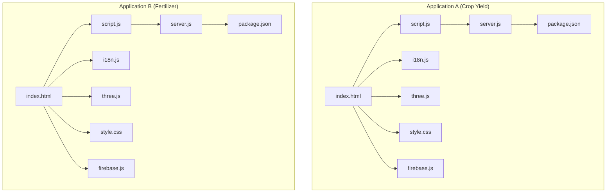
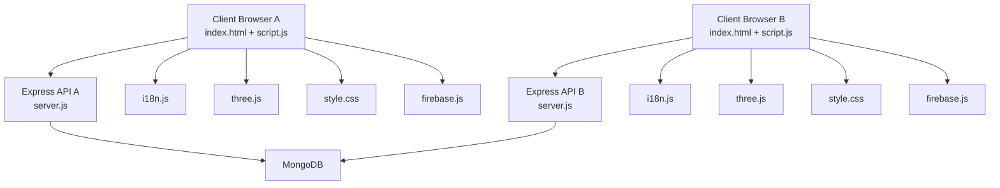
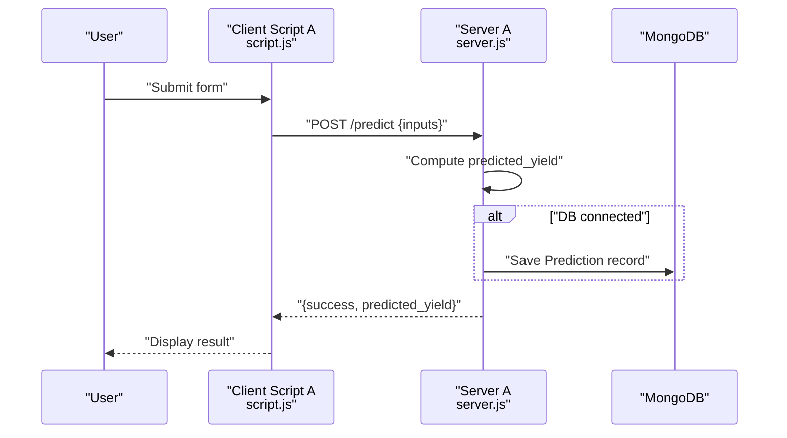
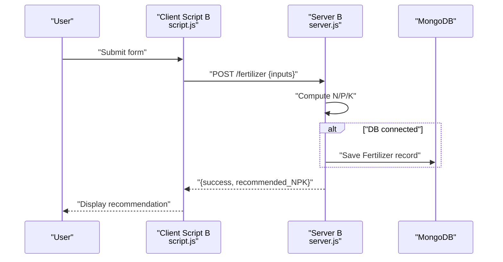
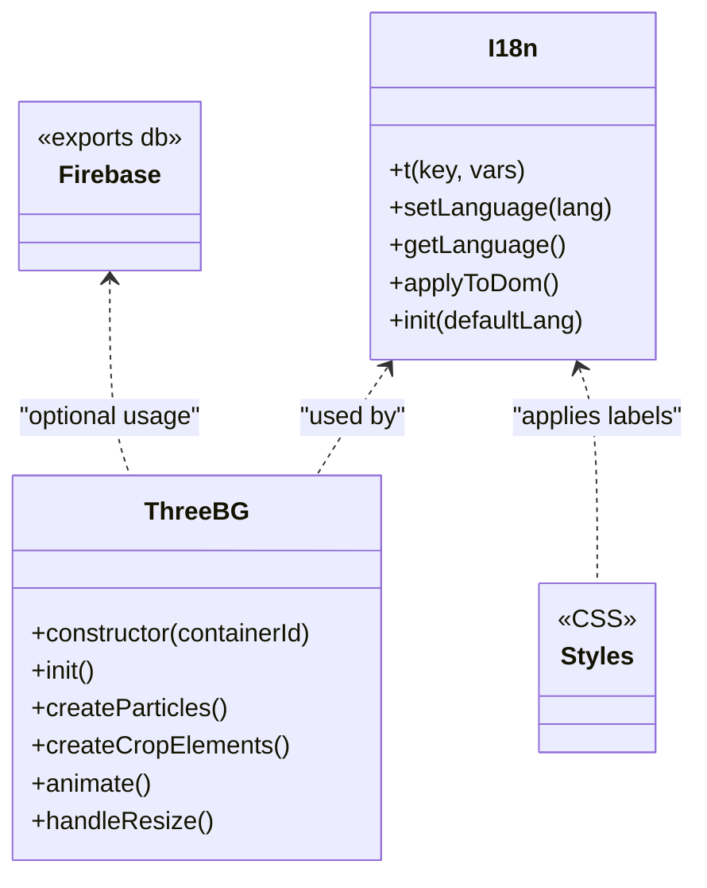
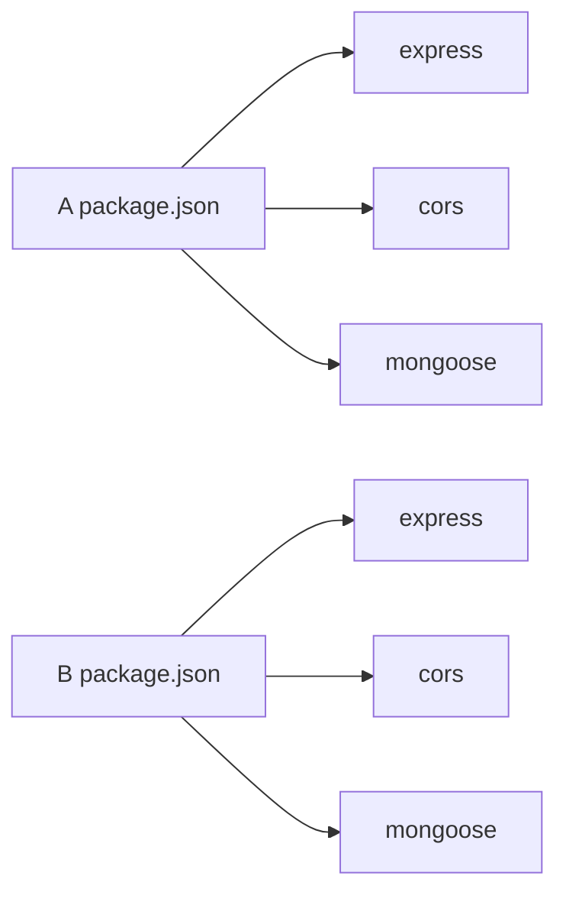

# Development Guidelines

<cite>
**Referenced Files in This Document**
- [package.json](file://simple webpage/package.json)
- [server.js](file://simple webpage/server.js)
- [script.js](file://simple webpage/script.js)
- [index.html](file://simple webpage/index.html)
- [style.css](file://simple webpage/style.css)
- [i18n.js](file://simple webpage/i18n.js)
- [three.js](file://simple webpage/three.js)
- [firebase.js](file://simple webpage/firebase.js)
- [package.json](file://simple webpage reverse/package.json)
- [server.js](file://simple webpage reverse/server.js)
- [script.js](file://simple webpage reverse/script.js)
- [index.html](file://simple webpage reverse/index.html)
- [style.css](file://simple webpage reverse/style.css)
- [i18n.js](file://simple webpage reverse/i18n.js)
- [three.js](file://simple webpage reverse/three.js)
- [firebase.js](file://simple webpage reverse/firebase.js)
</cite>

## Table of Contents
1. [Introduction](#introduction)
2. [Project Structure](#project-structure)
3. [Core Components](#core-components)
4. [Architecture Overview](#architecture-overview)
5. [Detailed Component Analysis](#detailed-component-analysis)
6. [Dependency Analysis](#dependency-analysis)
7. [Testing Strategy](#testing-strategy)
8. [Deployment Considerations](#deployment-considerations)
9. [Build Process and Version Compatibility](#build-process-and-version-compatibility)
10. [Code Review Guidelines and Contribution Workflow](#code-review-guidelines-and-contribution-workflow)
11. [Maintenance Procedures](#maintenance-procedures)
12. [Troubleshooting Guide](#troubleshooting-guide)
13. [Conclusion](#conclusion)

## Introduction
This document provides comprehensive development guidelines for contributing to and extending the dual application system. The system consists of two Express.js-powered web applications that share similar frontend assets but expose distinct APIs and UIs:
- Application A: Crop Yield Prediction service exposing a prediction endpoint and optional MongoDB persistence.
- Application B: Fertilizer Recommendation service exposing a fertilizer recommendation endpoint and optional MongoDB persistence.

Both applications serve static HTML/CSS/JS, integrate internationalization, and render animated backgrounds via Three.js. They communicate with a shared MongoDB instance and optionally with Firebase Realtime Database.

## Project Structure
The repository contains two identical application folders:
- simple webpage: Frontend-focused application serving the Crop Yield Prediction UI and API.
- simple webpage reverse: Frontend-focused application serving the Fertilizer Recommendation UI and API.

Each application folder includes:
- index.html: Entry HTML page with forms and UI scaffolding.
- script.js: Client-side logic for form submission and API communication.
- style.css: Shared styling for both applications.
- i18n.js: Internationalization utilities for dynamic text updates.
- three.js: Three.js scene initialization and animation logic.
- server.js: Express server with CORS, JSON parsing, static file serving, and API endpoints.
- package.json: Node.js dependencies and scripts.
- firebase.js: Firebase client initialization (shared across both apps).

**Diagram sources**
- [index.html](file://simple webpage/index.html)
- [script.js](file://simple webpage/script.js)
- [server.js](file://simple webpage/server.js)
- [package.json](file://simple webpage/package.json)
- [i18n.js](file://simple webpage/i18n.js)
- [three.js](file://simple webpage/three.js)
- [firebase.js](file://simple webpage/firebase.js)
- [index.html](file://simple webpage reverse/index.html)
- [script.js](file://simple webpage reverse/script.js)
- [server.js](file://simple webpage reverse/server.js)
- [package.json](file://simple webpage reverse/package.json)
- [i18n.js](file://simple webpage reverse/i18n.js)
- [three.js](file://simple webpage reverse/three.js)
- [firebase.js](file://simple webpage reverse/firebase.js)

**Section sources**
- [package.json](file://simple webpage/package.json)
- [server.js](file://simple webpage/server.js)
- [script.js](file://simple webpage/script.js)
- [index.html](file://simple webpage/index.html)
- [style.css](file://simple webpage/style.css)
- [i18n.js](file://simple webpage/i18n.js)
- [three.js](file://simple webpage/three.js)
- [firebase.js](file://simple webpage/firebase.js)
- [package.json](file://simple webpage reverse/package.json)
- [server.js](file://simple webpage reverse/server.js)
- [script.js](file://simple webpage reverse/script.js)
- [index.html](file://simple webpage reverse/index.html)
- [style.css](file://simple webpage reverse/style.css)
- [i18n.js](file://simple webpage reverse/i18n.js)
- [three.js](file://simple webpage reverse/three.js)
- [firebase.js](file://simple webpage reverse/firebase.js)

## Core Components
- Express Server
  - CORS enabled and JSON body parsing configured.
  - Static file serving from the application root.
  - Optional MongoDB connection with graceful fallback when unavailable.
  - API endpoints:
    - Application A: POST /predict returning predicted yield.
    - Application B: POST /fertilizer returning recommended NPK values.
- Frontend
  - HTML forms collecting user inputs.
  - JavaScript handlers sending requests to respective endpoints.
  - CSS styling for responsive UI.
  - Internationalization utilities for dynamic text.
  - Three.js background animations.
  - Optional Firebase client initialization.

Key implementation references:
- Application A server and routes: [server.js](file://simple webpage/server.js)
- Application B server and routes: [server.js](file://simple webpage reverse/server.js)
- Application A client logic: [script.js](file://simple webpage/script.js)
- Application B client logic: [script.js](file://simple webpage reverse/script.js)
- Shared assets: [index.html](file://simple webpage/index.html), [style.css](file://simple webpage/style.css), [i18n.js](file://simple webpage/i18n.js), [three.js](file://simple webpage/three.js), [firebase.js](file://simple webpage/firebase.js)

**Section sources**
- [server.js](file://simple webpage/server.js)
- [server.js](file://simple webpage reverse/server.js)
- [script.js](file://simple webpage/script.js)
- [script.js](file://simple webpage reverse/script.js)
- [index.html](file://simple webpage/index.html)
- [style.css](file://simple webpage/style.css)
- [i18n.js](file://simple webpage/i18n.js)
- [three.js](file://simple webpage/three.js)
- [firebase.js](file://simple webpage/firebase.js)

## Architecture Overview
The dual application system follows a client-server model:
- Each application runs its own Express server on separate ports.
- Clients send HTTP requests to their respective endpoints.
- Optional MongoDB persistence is supported with fallback behavior.
- Optional Firebase client initialization is present in both applications.

**Diagram sources**
- [server.js](file://simple webpage/server.js)
- [server.js](file://simple webpage reverse/server.js)
- [script.js](file://simple webpage/script.js)
- [script.js](file://simple webpage reverse/script.js)
- [index.html](file://simple webpage/index.html)
- [index.html](file://simple webpage reverse/index.html)
- [i18n.js](file://simple webpage/i18n.js)
- [i18n.js](file://simple webpage reverse/i18n.js)
- [three.js](file://simple webpage/three.js)
- [three.js](file://simple webpage reverse/three.js)
- [style.css](file://simple webpage/style.css)
- [style.css](file://simple webpage reverse/style.css)
- [firebase.js](file://simple webpage/firebase.js)
- [firebase.js](file://simple webpage reverse/firebase.js)

## Detailed Component Analysis

### Application A: Crop Yield Prediction
- Purpose: Accepts crop and environmental inputs and returns predicted yield.
- Endpoint: POST /predict
- Persistence: Optional MongoDB model "Prediction" created when DB is available.
- Client flow: Submits form, sends JSON payload, displays result or error.

**Diagram sources**
- [script.js](file://simple webpage/script.js)
- [server.js](file://simple webpage/server.js)

**Section sources**
- [server.js](file://simple webpage/server.js)
- [script.js](file://simple webpage/script.js)
- [index.html](file://simple webpage/index.html)

### Application B: Fertilizer Recommendation
- Purpose: Recommends NPK based on crop yield and soil conditions.
- Endpoint: POST /fertilizer
- Persistence: Optional MongoDB model "Fertilizer" created when DB is available.
- Client flow: Submits form, sends JSON payload, displays N/P/K values or error.

**Diagram sources**
- [script.js](file://simple webpage reverse/script.js)
- [server.js](file://simple webpage reverse/server.js)

**Section sources**
- [server.js](file://simple webpage reverse/server.js)
- [script.js](file://simple webpage reverse/script.js)
- [index.html](file://simple webpage reverse/index.html)

### Frontend Asset Modules
- Internationalization (i18n.js): Provides translation lookup, DOM application, and language switching.
- Three.js Background (three.js): Initializes WebGL renderer, creates animated particle systems, and handles resize events.
- Styles (style.css): Shared UI styling for forms, buttons, loaders, and overlays.
- Firebase (firebase.js): Initializes Firebase client with shared configuration.

**Diagram sources**
- [i18n.js](file://simple webpage/i18n.js)
- [three.js](file://simple webpage/three.js)
- [style.css](file://simple webpage/style.css)
- [firebase.js](file://simple webpage/firebase.js)

**Section sources**
- [i18n.js](file://simple webpage/i18n.js)
- [three.js](file://simple webpage/three.js)
- [style.css](file://simple webpage/style.css)
- [firebase.js](file://simple webpage/firebase.js)

## Dependency Analysis
- Application A and B share identical dependency sets:
  - express: Web framework.
  - cors: Cross-origin resource sharing support.
  - mongoose: MongoDB ODM.
- Both applications define "type": "module" and use ES modules.
- Application A defines "main": "server.js"; Application B defines "main": "firebase.js" but starts servers via "start" script.

**Diagram sources**
- [package.json](file://simple webpage/package.json)
- [package.json](file://simple webpage reverse/package.json)

**Section sources**
- [package.json](file://simple webpage/package.json)
- [package.json](file://simple webpage reverse/package.json)

## Testing Strategy
- Unit Testing
  - Frontend: Mock fetch responses and assert DOM updates for both applications. Validate translation keys and Three.js initialization.
  - Backend: Use a lightweight HTTP testing library to hit endpoints with synthetic payloads; stub MongoDB connections to test fallback behavior.
- Integration Testing
  - End-to-end flows: Submit forms and verify responses for both applications. Confirm cross-application navigation links.
  - Database integration: Start MongoDB locally and verify persistence of prediction and fertilizer records.
- Manual Testing
  - UI responsiveness: Test form submissions, loader visibility, and error messaging.
  - Localization: Switch languages and confirm text updates across both applications.
  - Animations: Resize browser windows and verify Three.js canvas updates.
- Test Scripts
  - Current scripts include placeholders; update "test" script to invoke a testing framework (e.g., Vitest, Jest) for frontend and backend tests.

[No sources needed since this section provides general guidance]

## Deployment Considerations
- Environment Configuration
  - Set NODE_ENV to production for optimized Express behavior.
  - Configure MongoDB connection strings via environment variables for both applications.
  - For Firebase usage, manage API keys securely via environment variables or secrets managers.
- Production Optimization
  - Enable gzip compression and static asset caching via a reverse proxy or CDN.
  - Use HTTPS termination at the edge or load balancer.
  - Monitor server logs and database connectivity health.
- Security Best Practices
  - Validate and sanitize all incoming request bodies.
  - Enforce rate limiting for prediction endpoints.
  - Restrict CORS origins to trusted domains.
  - Rotate secrets and monitor for unauthorized access attempts.

[No sources needed since this section provides general guidance]

## Build Process and Version Compatibility
- Build Process
  - No transpilation or bundling is required; applications run as-is with native ES modules.
  - Install dependencies using npm install and start servers with npm start.
- Dependency Management
  - Keep express, cors, and mongoose updated according to semantic versioning.
  - Pin versions in production deployments to ensure reproducibility.
- Version Compatibility
  - Applications use "type": "module". Ensure Node.js LTS supports ES modules.
  - Three.js is loaded from a CDN; verify compatibility with current browsers.

[No sources needed since this section provides general guidance]

## Code Review Guidelines and Contribution Workflow
- Code Organization Principles
  - File naming: Use descriptive lowercase names with hyphens (e.g., server.js, script.js).
  - Module boundaries: Keep server logic in server.js, UI logic in script.js, shared assets in common files.
  - Feature separation: Add new endpoints under existing server.js with clear route naming.
- Contribution Workflow
  - Fork and branch per feature.
  - Run local tests before opening a pull request.
  - Include screenshots or short videos for UI changes.
  - Update documentation and comments for new features.
- Review Checklist
  - Correctness: Verify endpoint correctness and error handling.
  - Security: Confirm input validation and CORS configuration.
  - Performance: Avoid heavy synchronous operations in request handlers.
  - Maintainability: Prefer small, focused commits with clear messages.

[No sources needed since this section provides general guidance]

## Maintenance Procedures
- Adding New Features
  - Extend server.js with new POST endpoints and ensure consistent response schemas.
  - Update script.js to consume new endpoints and reflect UI changes.
  - Add translation keys in i18n.js for multilingual support.
- Extending Functionality
  - Introduce new static assets (images, fonts) and update index.html accordingly.
  - Modify three.js to add new animated elements while preserving performance.
- Database Changes
  - Add new Mongoose models conditionally and ensure graceful fallback when DB is unavailable.
  - Backward-compatible migrations for existing collections.

[No sources needed since this section provides general guidance]

## Troubleshooting Guide
- MongoDB Not Available
  - Symptom: Warning logs indicating DB not available; persistence disabled.
  - Action: Start MongoDB locally or configure remote connection string; verify network access.
- CORS Errors
  - Symptom: Browser blocks cross-origin requests.
  - Action: Confirm CORS middleware is enabled and origins are permitted.
- API Response Issues
  - Symptom: Client receives errors or unexpected payloads.
  - Action: Inspect server logs, validate request body shape, and confirm endpoint paths.
- Frontend Not Responding
  - Symptom: Forms do not submit or loaders remain visible.
  - Action: Check browser console for errors, verify static file serving, and confirm endpoint URLs.

**Section sources**
- [server.js](file://simple webpage/server.js)
- [server.js](file://simple webpage reverse/server.js)
- [script.js](file://simple webpage/script.js)
- [script.js](file://simple webpage reverse/script.js)

## Conclusion
These guidelines establish a consistent approach to developing, testing, deploying, and maintaining the dual application system. By adhering to the outlined conventions, contributors can extend functionality reliably while preserving modularity, performance, and security across both applications.