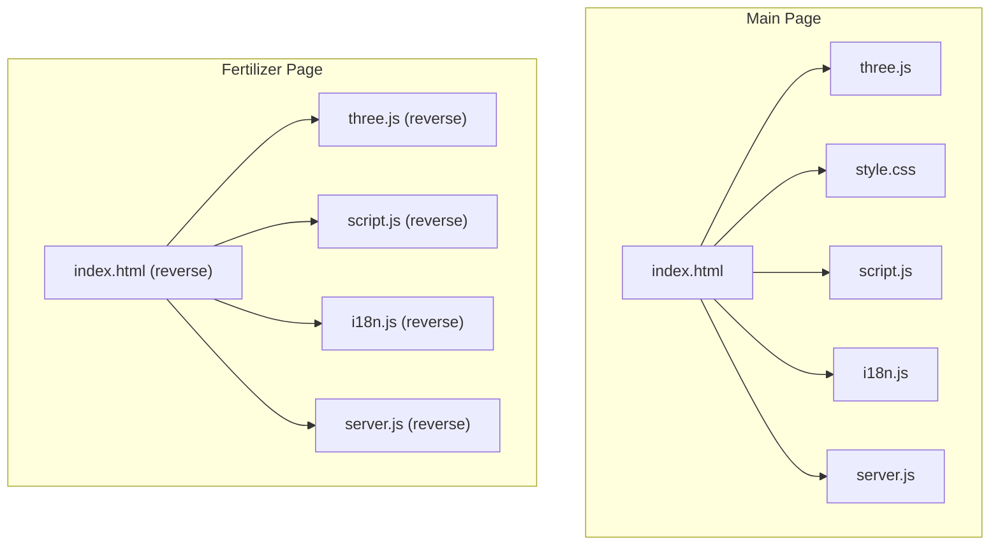
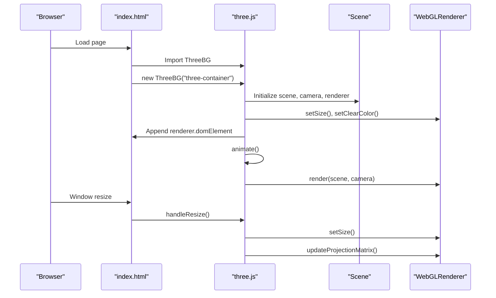
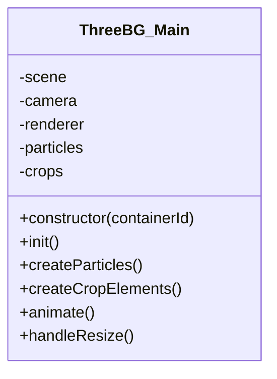
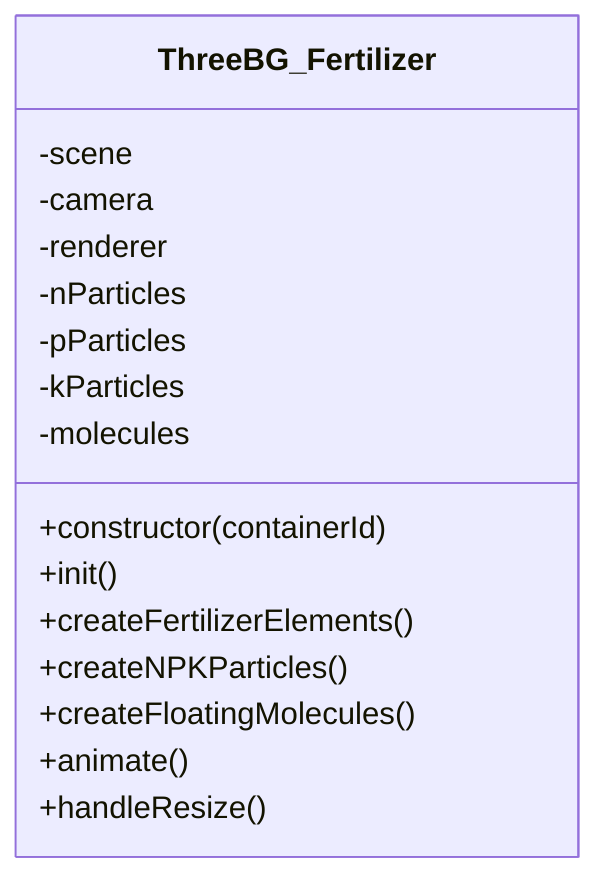
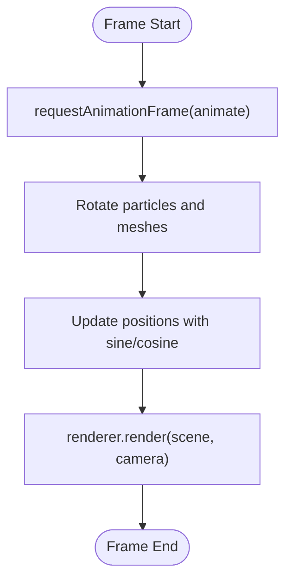
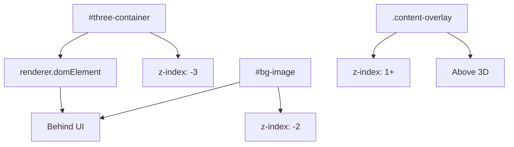
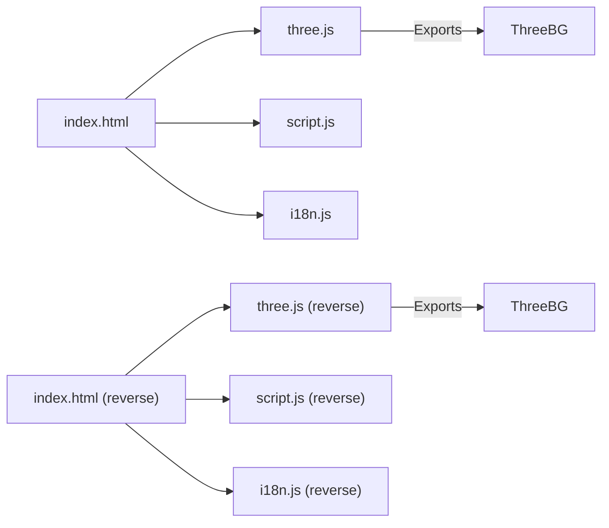

# 3D Visualization System

<cite>
**Referenced Files in This Document**
- [index.html](file://simple webpage/index.html)
- [three.js](file://simple webpage/three.js)
- [style.css](file://simple webpage/style.css)
- [script.js](file://simple webpage/script.js)
- [i18n.js](file://simple webpage/i18n.js)
- [server.js](file://simple webpage/server.js)
- [index.html (reverse)](file://simple webpage reverse/index.html)
- [three.js (reverse)](file://simple webpage reverse/three.js)
- [script.js (reverse)](file://simple webpage reverse/script.js)
- [i18n.js (reverse)](file://simple webpage reverse/i18n.js)
- [server.js (reverse)](file://simple webpage reverse/server.js)
</cite>

## Table of Contents
1. [Introduction](#introduction)
2. [Project Structure](#project-structure)
3. [Core Components](#core-components)
4. [Architecture Overview](#architecture-overview)
5. [Detailed Component Analysis](#detailed-component-analysis)
6. [Dependency Analysis](#dependency-analysis)
7. [Performance Considerations](#performance-considerations)
8. [Troubleshooting Guide](#troubleshooting-guide)
9. [Conclusion](#conclusion)
10. [Appendices](#appendices)

## Introduction
This document explains the Three.js 3D visualization system used in the fertilizer recommendation application background. It covers scene setup, geometry and material configuration, animation loops, camera controls, and how the 3D background integrates with the application layout. It also documents performance optimization techniques, browser compatibility considerations, and fallback strategies for environments with limited WebGL support.

## Project Structure
The application consists of two webpages:
- Main page (yield prediction): Uses a starry particle background with floating crop-like elements.
- Fertilizer recommendation page: Uses N-P-K particle elements and floating molecules to represent nutrients.

Both pages share similar integration patterns:
- A dedicated container for the Three.js canvas.
- A CSS overlay to ensure UI readability over the 3D background.
- A resize handler to maintain aspect ratio and renderer size.
- Internationalization and form submission logic separate from the 3D system.

**Diagram sources**
- [index.html:101-113](file://simple webpage/index.html#L101-L113)
- [three.js:3-18](file://simple webpage/three.js#L3-L18)
- [style.css:6-27](file://simple webpage/style.css#L6-L27)
- [script.js:13-73](file://simple webpage/script.js#L13-L73)
- [i18n.js:103-122](file://simple webpage/i18n.js#L103-L122)
- [server.js:10-68](file://simple webpage/server.js#L10-L68)
- [index.html (reverse):83-95](file://simple webpage reverse/index.html#L83-L95)
- [three.js (reverse):3-18](file://simple webpage reverse/three.js#L3-L18)
- [script.js (reverse):12-64](file://simple webpage reverse/script.js#L12-L64)
- [i18n.js (reverse):103-122](file://simple webpage reverse/i18n.js#L103-L122)
- [server.js (reverse):10-65](file://simple webpage reverse/server.js#L10-L65)

**Section sources**
- [index.html:101-113](file://simple webpage/index.html#L101-L113)
- [index.html (reverse):83-95](file://simple webpage reverse/index.html#L83-L95)

## Core Components
- Scene setup: Creates a scene, perspective camera, and WebGL renderer with transparency and antialiasing.
- Lighting: Adds ambient and directional lights for realistic shading.
- Geometry and materials:
  - Main page: Buffer geometry points for stars and sphere geometry meshes for crop-like elements.
  - Fertilizer page: Separate buffer geometry points for N/P/K particles and octahedron geometry meshes for floating molecules.
- Animation loop: Uses requestAnimationFrame to continuously update rotation and position, then renders the scene.
- Resize handling: Updates camera aspect and renderer size on window resize.

Key implementation references:
- Scene initialization and renderer setup: [three.js:11-35](file://simple webpage/three.js#L11-L35)
- Particle creation and crop elements: [three.js:37-82](file://simple webpage/three.js#L37-L82)
- Animation loop and render: [three.js:84-100](file://simple webpage/three.js#L84-L100)
- Resize handler: [three.js:102-107](file://simple webpage/three.js#L102-L107)
- Fertilizer-specific elements: [three.js (reverse):37-108](file://simple webpage reverse/three.js#L37-L108)
- Fertilizer animation: [three.js (reverse):110-129](file://simple webpage reverse/three.js#L110-L129)

**Section sources**
- [three.js:11-107](file://simple webpage/three.js#L11-L107)
- [three.js (reverse):37-136](file://simple webpage reverse/three.js#L37-L136)

## Architecture Overview
The 3D background is encapsulated in a class exported by the Three.js module. The HTML page instantiates the class on load and attaches a resize listener. The CSS ensures the 3D canvas sits behind the UI while maintaining readability.

**Diagram sources**
- [index.html:101-113](file://simple webpage/index.html#L101-L113)
- [three.js:3-18](file://simple webpage/three.js#L3-L18)
- [three.js:84-100](file://simple webpage/three.js#L84-L100)
- [three.js:102-107](file://simple webpage/three.js#L102-L107)

## Detailed Component Analysis

### Main Page 3D Background (Starry Particles + Floating Crops)
- Scene and camera: Perspective camera initialized with aspect ratio from window size.
- Renderer: Transparent background with antialiasing enabled.
- Lighting: Ambient and directional light for balanced illumination.
- Particles: Buffer geometry with random positions; point material with transparency and moderate opacity.
- Crop elements: Spheres with mesh phong material; animated with synchronized vertical oscillation and constant rotation.
- Animation: requestAnimationFrame drives continuous updates for both particles and crops.

**Diagram sources**
- [three.js:3-18](file://simple webpage/three.js#L3-L18)
- [three.js:20-35](file://simple webpage/three.js#L20-L35)
- [three.js:37-82](file://simple webpage/three.js#L37-L82)
- [three.js:84-107](file://simple webpage/three.js#L84-L107)

**Section sources**
- [three.js:3-107](file://simple webpage/three.js#L3-L107)

### Fertilizer Recommendation 3D Background (N-P-K Particles + Molecules)
- Scene and camera: Same setup as the main page.
- Lighting: Ambient and directional light included.
- NPK Particles: Three separate point clouds (blue for Nitrogen, orange for Phosphorus, purple for Potassium) with distinct sizes and colors.
- Floating Molecules: Octahedron meshes with randomized positions and materials; animated with combined rotation and sinusoidal movement along X/Y axes.
- Animation: Rotational and positional updates per element group.

**Diagram sources**
- [three.js (reverse):3-18](file://simple webpage reverse/three.js#L3-L18)
- [three.js (reverse):20-35](file://simple webpage reverse/three.js#L20-L35)
- [three.js (reverse):37-108](file://simple webpage reverse/three.js#L37-L108)
- [three.js (reverse):110-136](file://simple webpage reverse/three.js#L110-L136)

**Section sources**
- [three.js (reverse):3-136](file://simple webpage reverse/three.js#L3-L136)

### Animation Loop Implementation
- Continuous rendering via requestAnimationFrame.
- Rotation applied to particle systems and meshes.
- Vertical oscillation for crop/molecule elements using sine waves with per-element speeds.
- Render call at the end of each frame.

**Diagram sources**
- [three.js:84-100](file://simple webpage/three.js#L84-L100)
- [three.js (reverse):110-129](file://simple webpage reverse/three.js#L110-L129)

**Section sources**
- [three.js:84-100](file://simple webpage/three.js#L84-L100)
- [three.js (reverse):110-129](file://simple webpage reverse/three.js#L110-L129)

### Camera Controls and Interaction
- The current implementation does not include interactive camera controls (e.g., orbit controls). Camera remains fixed.
- To add interactivity, integrate an orbit controller library and attach it to the camera and renderer.

[No sources needed since this section provides general guidance]

### Integration with Application Layout
- The 3D canvas is placed inside a dedicated container and styled to cover the viewport with a lower z-index than UI elements.
- A background image container acts as a fallback and reduces opacity when Three.js is active.
- The content overlay uses backdrop blur and semi-transparent backgrounds to ensure readability over the 3D scene.

**Diagram sources**
- [index.html:17-20](file://simple webpage/index.html#L17-L20)
- [style.css:6-27](file://simple webpage/style.css#L6-L27)
- [style.css:41-48](file://simple webpage/style.css#L41-L48)

**Section sources**
- [index.html:17-20](file://simple webpage/index.html#L17-L20)
- [style.css:6-27](file://simple webpage/style.css#L6-L27)
- [style.css:41-48](file://simple webpage/style.css#L41-L48)

### Responsive Behavior and Resize Handling
- On window resize, the camera aspect is recalculated, the projection matrix is updated, and the renderer size matches the new window dimensions.
- This prevents distortion and maintains crisp visuals across devices.

**Section sources**
- [three.js:102-107](file://simple webpage/three.js#L102-L107)
- [three.js (reverse):131-136](file://simple webpage reverse/three.js#L131-L136)

## Dependency Analysis
- Three.js module is imported from a CDN and exported as a class.
- HTML pages import the ThreeBG class and instantiate it on load.
- Resize events trigger the handleResize method.
- Internationalization and form logic are separate modules, minimizing coupling with the 3D system.

**Diagram sources**
- [index.html:101-113](file://simple webpage/index.html#L101-L113)
- [three.js:1-18](file://simple webpage/three.js#L1-L18)
- [script.js:13-73](file://simple webpage/script.js#L13-L73)
- [i18n.js:103-122](file://simple webpage/i18n.js#L103-L122)
- [index.html (reverse):83-95](file://simple webpage reverse/index.html#L83-L95)
- [three.js (reverse):1-18](file://simple webpage reverse/three.js#L1-L18)
- [script.js (reverse):12-64](file://simple webpage reverse/script.js#L12-L64)
- [i18n.js (reverse):103-122](file://simple webpage reverse/i18n.js#L103-L122)

**Section sources**
- [index.html:101-113](file://simple webpage/index.html#L101-L113)
- [index.html (reverse):83-95](file://simple webpage reverse/index.html#L83-L95)

## Performance Considerations
- Rendering efficiency:
  - Use antialiased rendering for smoother edges; consider disabling antialiasing on low-end devices if needed.
  - Keep geometry counts reasonable; buffer geometry is efficient for large particle counts.
  - Minimize draw calls by grouping similar materials when possible.
- Memory management:
  - Dispose of geometries and materials when removing objects from the scene.
  - Avoid creating new objects in the animation loop; reuse arrays and attributes.
- Browser compatibility:
  - Ensure WebGL availability; fall back to a static background image if unavailable.
  - Test on older browsers and adjust Three.js version accordingly.
- Device responsiveness:
  - Throttle resize handlers to reduce layout thrashing.
  - Consider lowering particle counts on mobile devices.

[No sources needed since this section provides general guidance]

## Troubleshooting Guide
- Three.js container not found:
  - The class logs a warning when the container element is missing; ensure the container ID matches the HTML.
  - Reference: [three.js:4-9](file://simple webpage/three.js#L4-L9)
- WebGL not supported:
  - Add a feature detection check and display a fallback message or static image.
  - Reference: [index.html:17-20](file://simple webpage/index.html#L17-L20)
- Distorted or stretched visuals after resize:
  - Verify that handleResize updates both camera aspect and renderer size.
  - Reference: [three.js:102-107](file://simple webpage/three.js#L102-L107)
- UI readability issues:
  - Adjust overlay background opacity and backdrop blur; ensure z-index stacking is correct.
  - Reference: [style.css:41-48](file://simple webpage/style.css#L41-L48)

**Section sources**
- [three.js:4-9](file://simple webpage/three.js#L4-L9)
- [index.html:17-20](file://simple webpage/index.html#L17-L20)
- [three.js:102-107](file://simple webpage/three.js#L102-L107)
- [style.css:41-48](file://simple webpage/style.css#L41-L48)

## Conclusion
The Three.js 3D visualization system provides an engaging, performance-conscious background for the fertilizer recommendation application. It leverages buffer geometry for efficient particle rendering, separates concerns across modules, and integrates cleanly with the UI through CSS overlays. Extending the system with interactive camera controls and robust fallbacks would further improve user experience across diverse devices and browsers.

## Appendices

### Example Patterns
- Creating a Three.js component:
  - Instantiate the ThreeBG class with a container ID and attach a resize listener.
  - References: [index.html:107-110](file://simple webpage/index.html#L107-L110), [three.js:3-18](file://simple webpage/three.js#L3-L18)
- Scene management:
  - Initialize scene, camera, and renderer; append renderer DOM element to the container.
  - References: [three.js:11-25](file://simple webpage/three.js#L11-L25)
- Animation patterns:
  - Use requestAnimationFrame to drive continuous updates and render calls.
  - References: [three.js:84-100](file://simple webpage/three.js#L84-L100)

### Cross-Browser Compatibility and Fallback Strategies
- Feature detection for WebGL and graceful degradation to a static background image.
- Reference: [index.html:17-20](file://simple webpage/index.html#L17-L20)
- Adjust Three.js version and disable antialiasing on low-end devices if necessary.
- Reference: [three.js](file://simple webpage/three.js#L13)