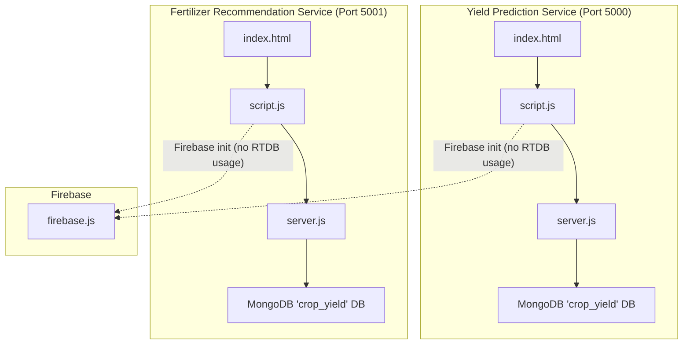
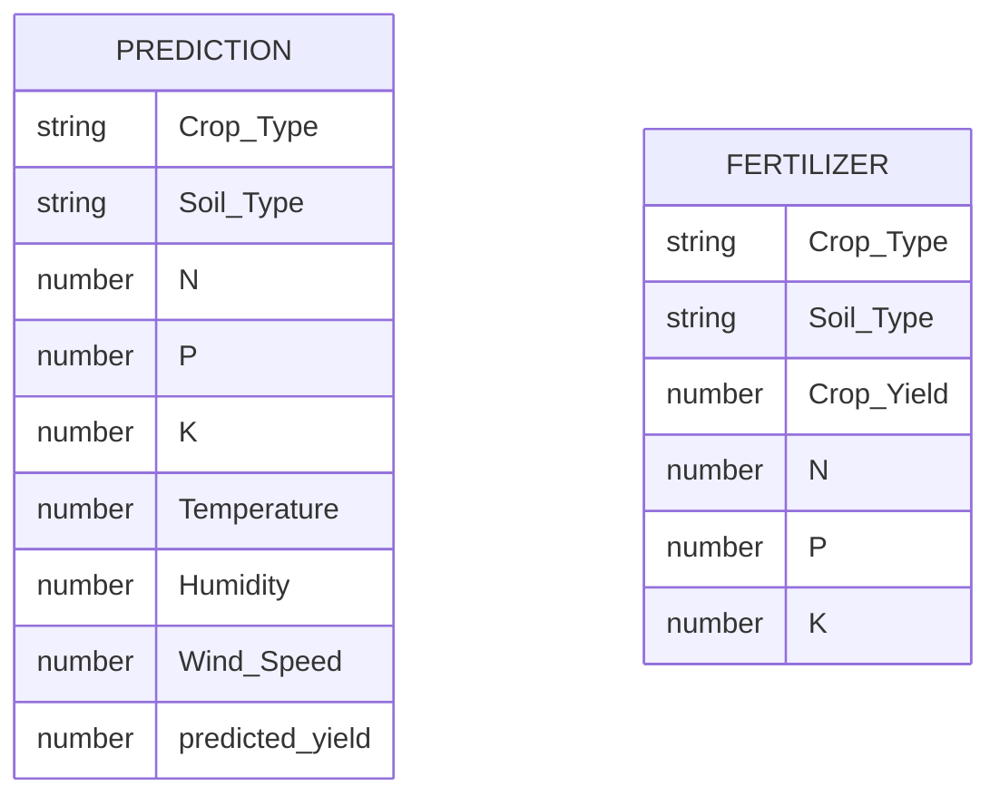
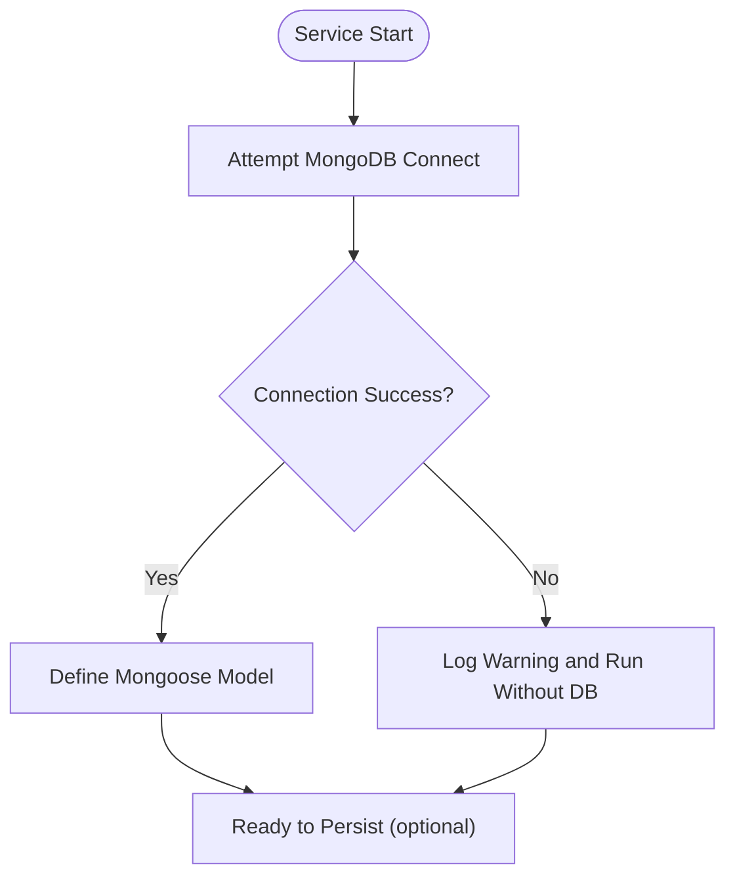
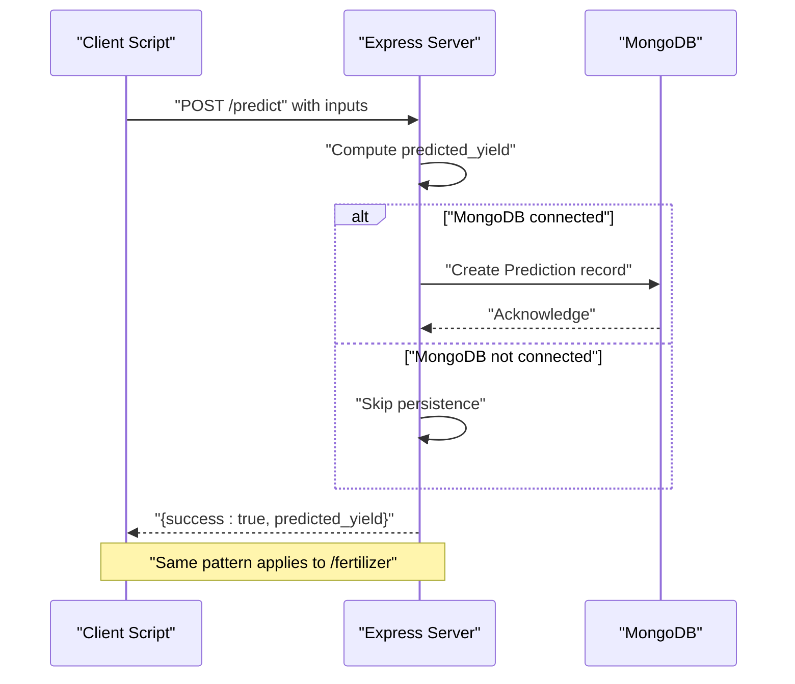
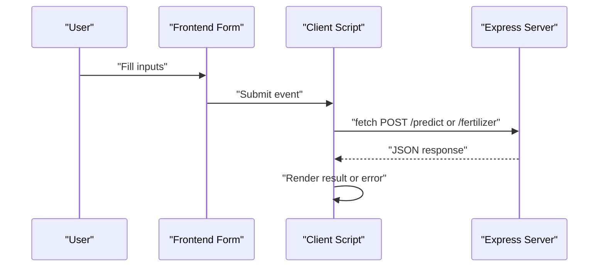
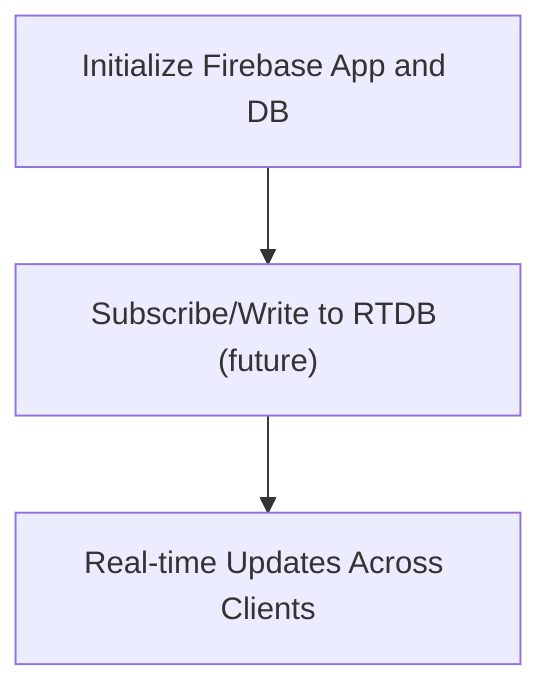
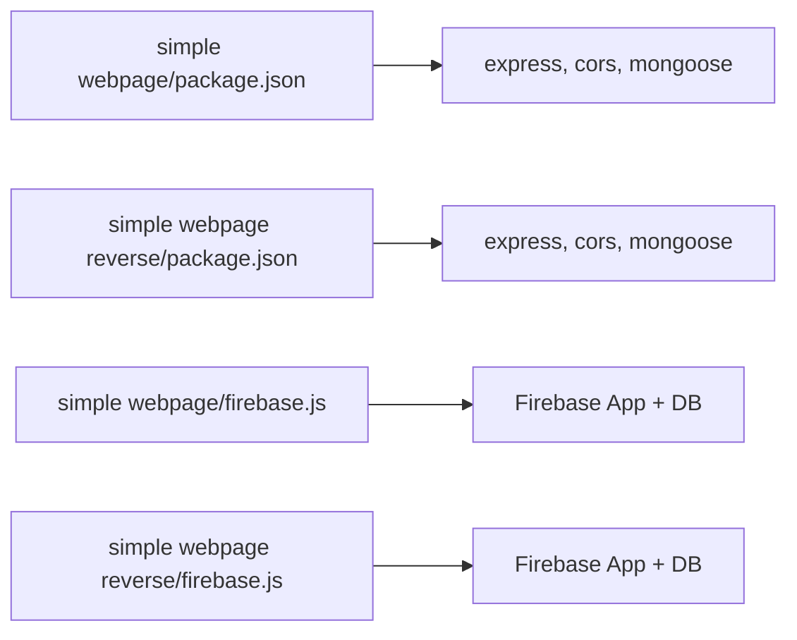

# Database Integration

<cite>
**Referenced Files in This Document**
- [server.js](file://simple webpage/server.js)
- [script.js](file://simple webpage/script.js)
- [index.html](file://simple webpage/index.html)
- [package.json](file://simple webpage/package.json)
- [server.js](file://simple webpage reverse/server.js)
- [script.js](file://simple webpage reverse/script.js)
- [index.html](file://simple webpage reverse/index.html)
- [package.json](file://simple webpage reverse/package.json)
- [firebase.js](file://simple webpage/firebase.js)
- [firebase.js](file://simple webpage reverse/firebase.js)
</cite>

## Table of Contents
1. [Introduction](#introduction)
2. [Project Structure](#project-structure)
3. [Core Components](#core-components)
4. [Architecture Overview](#architecture-overview)
5. [Detailed Component Analysis](#detailed-component-analysis)
6. [Dependency Analysis](#dependency-analysis)
7. [Performance Considerations](#performance-considerations)
8. [Troubleshooting Guide](#troubleshooting-guide)
9. [Conclusion](#conclusion)

## Introduction
This document explains the dual database integration system implemented in the project. It covers:
- MongoDB schema design for storing fertilizer recommendation records and prediction records
- Firebase Realtime Database initialization and usage
- Database connection setup, model definitions, and CRUD-like operations
- Example workflows for data persistence and client-side interactions
- Relationship between local MongoDB storage and Firebase usage
- Error handling for database operations and connection failures

Note: The current codebase initializes Firebase but does not implement real-time synchronization or persistence to Firebase within the frontend scripts. The focus here is on documenting the existing MongoDB-backed APIs and the Firebase initialization present in the codebase.

## Project Structure
The project consists of two independent web applications:
- Crop Yield Prediction service (port 5000)
- Fertilizer Recommendation service (port 5001)

Each service includes:
- An Express server exposing a single POST endpoint
- A MongoDB connection configured with optional fallback
- A simple HTML form and a script that submits data to the backend
- A Firebase initialization module for potential future real-time features



**Diagram sources**
- [server.js:1-68](file://simple webpage/server.js#L1-L68)
- [script.js:1-73](file://simple webpage/script.js#L1-L73)
- [index.html:1-116](file://simple webpage/index.html#L1-L116)
- [server.js:1-65](file://simple webpage reverse/server.js#L1-L65)
- [script.js:1-64](file://simple webpage reverse/script.js#L1-L64)
- [index.html:1-98](file://simple webpage reverse/index.html#L1-L98)
- [firebase.js:1-22](file://simple webpage/firebase.js#L1-L22)
- [firebase.js:1-22](file://simple webpage reverse/firebase.js#L1-L22)

**Section sources**
- [server.js:1-68](file://simple webpage/server.js#L1-L68)
- [server.js:1-65](file://simple webpage reverse/server.js#L1-L65)
- [script.js:1-73](file://simple webpage/script.js#L1-L73)
- [script.js:1-64](file://simple webpage reverse/script.js#L1-L64)
- [index.html:1-116](file://simple webpage/index.html#L1-L116)
- [index.html:1-98](file://simple webpage reverse/index.html#L1-L98)
- [firebase.js:1-22](file://simple webpage/firebase.js#L1-L22)
- [firebase.js:1-22](file://simple webpage reverse/firebase.js#L1-L22)

## Core Components
- MongoDB connection and models
  - Yield Prediction service defines a model for storing prediction records with fields for crop type, soil type, NPK values, weather metrics, and predicted yield.
  - Fertilizer Recommendation service defines a model for storing fertilizer recommendation records with crop type, soil type, target yield, and calculated NPK values.
- Express endpoints
  - Yield Prediction: POST /predict computes predicted yield and optionally persists the record to MongoDB.
  - Fertilizer Recommendation: POST /fertilizer computes NPK recommendation and optionally persists the record to MongoDB.
- Frontend forms and submission logic
  - Both services include a form collecting user inputs and a script that posts to the respective backend endpoint.
- Firebase initialization
  - Firebase app and database instance are initialized in both services. As currently implemented, the frontend scripts do not subscribe to or write to Firebase.

**Section sources**
- [server.js:18-42](file://simple webpage/server.js#L18-L42)
- [server.js:44-64](file://simple webpage/server.js#L44-L64)
- [server.js:18-39](file://simple webpage reverse/server.js#L18-L39)
- [server.js:41-61](file://simple webpage reverse/server.js#L41-L61)
- [script.js:13-73](file://simple webpage/script.js#L13-L73)
- [script.js:12-64](file://simple webpage reverse/script.js#L12-L64)
- [firebase.js:1-22](file://simple webpage/firebase.js#L1-L22)
- [firebase.js:1-22](file://simple webpage reverse/firebase.js#L1-L22)

## Architecture Overview
The system comprises two independent microservices:
- Each service runs its own Express server and connects to MongoDB.
- The frontend interacts with the backend via HTTP requests.
- Firebase is initialized but not used for real-time synchronization in the current code.

```mermaid
graph TB
subgraph "Client"
UI_P["Yield Prediction UI"]
UI_F["Fertilizer UI"]
end
subgraph "Backend Services"
S_P["Yield Prediction Server<br/>Port 5000"]
S_F["Fertilizer Server<br/>Port 5001"]
end
subgraph "Data Layer"
M_P["MongoDB Model: Prediction"]
M_F["MongoDB Model: Fertilizer"]
FB["Firebase DB Instance (initialized)"]
end
UI_P --> |HTTP POST /predict| S_P
UI_F --> |HTTP POST /fertilizer| S_F
S_P --> |Persist (optional)| M_P
S_F --> |Persist (optional)| M_F
UI_P -. "Firebase init" .-> FB
UI_F -. "Firebase init" .-> FB
```

**Diagram sources**
- [server.js:44-64](file://simple webpage/server.js#L44-L64)
- [server.js:41-61](file://simple webpage reverse/server.js#L41-L61)
- [script.js:35-42](file://simple webpage/script.js#L35-L42)
- [script.js:27-34](file://simple webpage reverse/script.js#L27-L34)
- [firebase.js:1-22](file://simple webpage/firebase.js#L1-L22)
- [firebase.js:1-22](file://simple webpage reverse/firebase.js#L1-L22)

## Detailed Component Analysis

### MongoDB Schema Design and Models
- Prediction model (Yield Prediction service)
  - Fields: Crop_Type, Soil_Type, N, P, K, Temperature, Humidity, Wind_Speed, predicted_yield
  - Purpose: Store inputs and computed predicted yield for later analysis or audit
- Fertilizer model (Fertilizer Recommendation service)
  - Fields: Crop_Type, Soil_Type, Crop_Yield, N, P, K
  - Purpose: Store target yield and calculated NPK values for fertilizer recommendations



**Diagram sources**
- [server.js:31-41](file://simple webpage/server.js#L31-L41)
- [server.js:31-38](file://simple webpage reverse/server.js#L31-L38)

**Section sources**
- [server.js:31-41](file://simple webpage/server.js#L31-L41)
- [server.js:31-38](file://simple webpage reverse/server.js#L31-L38)

### Database Connection Setup and Optional Persistence
- Both services attempt to connect to MongoDB at startup.
- On success, they define the corresponding Mongoose model.
- If the connection fails, the services continue operating without MongoDB persistence, logging a warning.



**Diagram sources**
- [server.js:22-28](file://simple webpage/server.js#L22-L28)
- [server.js:22-28](file://simple webpage reverse/server.js#L22-L28)

**Section sources**
- [server.js:18-28](file://simple webpage/server.js#L18-L28)
- [server.js:18-28](file://simple webpage reverse/server.js#L18-L28)

### CRUD Operations and Data Persistence Workflows
- POST /predict (Yield Prediction)
  - Computes predicted yield from inputs
  - Optionally persists the record to MongoDB if connected
  - Returns success and predicted yield
- POST /fertilizer (Fertilizer Recommendation)
  - Computes NPK values from target yield
  - Optionally persists the recommendation record to MongoDB if connected
  - Returns success and recommended NPK values



**Diagram sources**
- [server.js:44-64](file://simple webpage/server.js#L44-L64)
- [server.js:41-61](file://simple webpage reverse/server.js#L41-L61)

**Section sources**
- [server.js:44-64](file://simple webpage/server.js#L44-L64)
- [server.js:41-61](file://simple webpage reverse/server.js#L41-L61)

### Frontend Interaction and Submission Logic
- Forms collect user inputs and submit them to the backend via fetch.
- The scripts handle loading states, errors, and display results.
- The Yield Prediction UI links to the Fertilizer service and vice versa.



**Diagram sources**
- [script.js:13-73](file://simple webpage/script.js#L13-L73)
- [script.js:12-64](file://simple webpage reverse/script.js#L12-L64)
- [index.html:92-95](file://simple webpage/index.html#L92-L95)
- [index.html:74-77](file://simple webpage reverse/index.html#L74-L77)

**Section sources**
- [script.js:13-73](file://simple webpage/script.js#L13-L73)
- [script.js:12-64](file://simple webpage reverse/script.js#L12-L64)
- [index.html:92-95](file://simple webpage/index.html#L92-L95)
- [index.html:74-77](file://simple webpage reverse/index.html#L74-L77)

### Firebase Initialization and Real-Time Database Integration
- Firebase app and database instance are initialized in both services.
- Current frontend scripts do not subscribe to or write to Firebase.
- To enable real-time synchronization, the frontend would need to:
  - Subscribe to Firebase paths for recommendations
  - Write updates to Firebase upon successful backend responses
  - Handle offline scenarios and conflict resolution



**Diagram sources**
- [firebase.js:1-22](file://simple webpage/firebase.js#L1-L22)
- [firebase.js:1-22](file://simple webpage reverse/firebase.js#L1-L22)

**Section sources**
- [firebase.js:1-22](file://simple webpage/firebase.js#L1-L22)
- [firebase.js:1-22](file://simple webpage reverse/firebase.js#L1-L22)

### Relationship Between Local MongoDB Storage and Firebase
- Local persistence: Records are persisted to MongoDB when available.
- Firebase integration: Not implemented in the current frontend scripts.
- Potential synchronization strategy:
  - After successful MongoDB save, publish a change to a Firebase path
  - Frontends subscribe to Firebase paths to receive live updates
  - Conflict resolution: Last writer wins or merge with timestamps/version fields

[No sources needed since this section provides conceptual guidance]

## Dependency Analysis
- Dependencies are declared in package.json for both services.
- Both services depend on Express, CORS, and Mongoose.
- Firebase initialization modules are present but unused by the frontend scripts.



**Diagram sources**
- [package.json:10-14](file://simple webpage/package.json#L10-L14)
- [package.json:14-18](file://simple webpage reverse/package.json#L14-L18)
- [firebase.js:1-22](file://simple webpage/firebase.js#L1-L22)
- [firebase.js:1-22](file://simple webpage reverse/firebase.js#L1-L22)

**Section sources**
- [package.json:10-14](file://simple webpage/package.json#L10-L14)
- [package.json:14-18](file://simple webpage reverse/package.json#L14-L18)
- [firebase.js:1-22](file://simple webpage/firebase.js#L1-L22)
- [firebase.js:1-22](file://simple webpage reverse/firebase.js#L1-L22)

## Performance Considerations
- Optional MongoDB persistence avoids blocking the response when the database is unavailable.
- Computation is lightweight; performance is primarily constrained by network latency and database availability.
- Recommendations:
  - Add database connection health checks
  - Implement retry/backoff for transient failures
  - Consider batching writes if throughput increases

[No sources needed since this section provides general guidance]

## Troubleshooting Guide
- MongoDB connection failures
  - Symptom: Warning logged and services run without persistence
  - Action: Verify MongoDB is running locally on the expected port and database exists
- Endpoint errors
  - Symptom: Client displays “Backend not working properly”
  - Action: Check server logs for unhandled exceptions and ensure required fields are provided
- Firebase initialization
  - Symptom: No real-time updates
  - Action: Implement subscription/writes in frontend scripts; verify Firebase config correctness

**Section sources**
- [server.js:22-28](file://simple webpage/server.js#L22-L28)
- [server.js:22-28](file://simple webpage reverse/server.js#L22-L28)
- [script.js:66-70](file://simple webpage/script.js#L66-L70)
- [script.js:58-61](file://simple webpage reverse/script.js#L58-L61)
- [firebase.js:6-15](file://simple webpage/firebase.js#L6-L15)
- [firebase.js:6-15](file://simple webpage reverse/firebase.js#L6-L15)

## Conclusion
The project implements a robust dual-service architecture with optional MongoDB persistence for both prediction and fertilizer recommendation workflows. While Firebase is initialized, real-time synchronization is not yet implemented. The system is designed to remain functional even when MongoDB is unavailable. Future enhancements could integrate Firebase for real-time updates and implement conflict resolution strategies for synchronized data across clients.