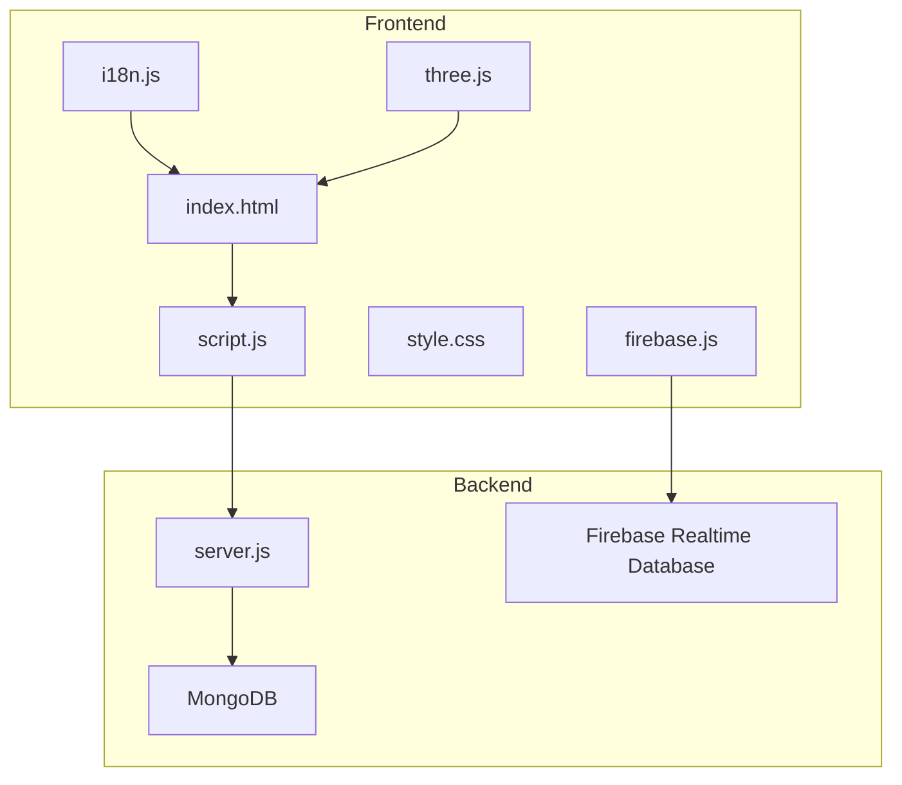
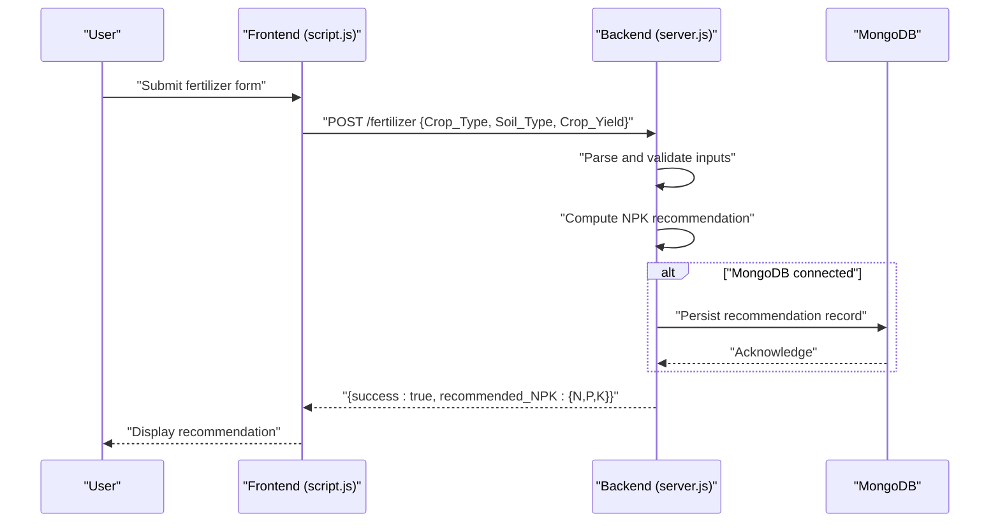
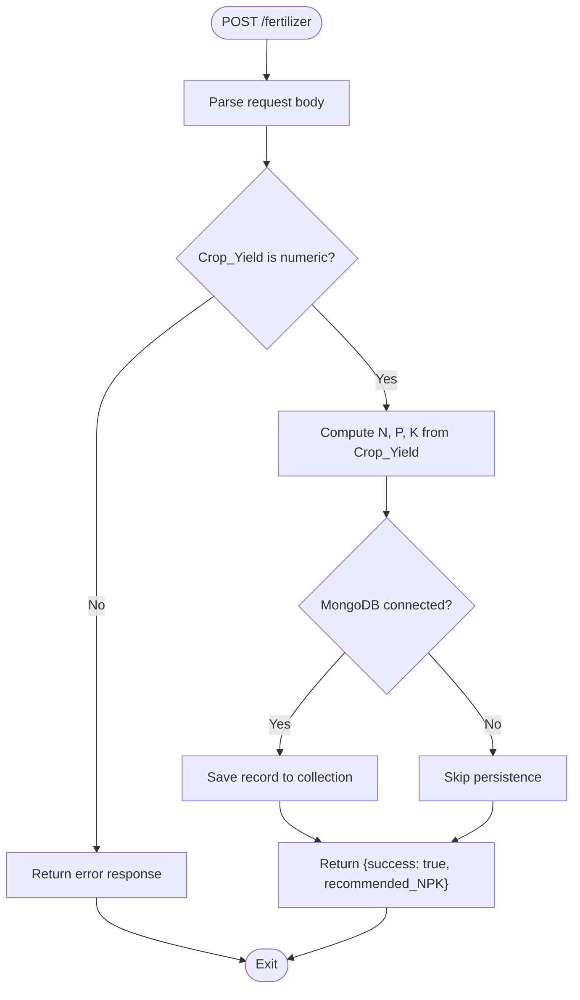
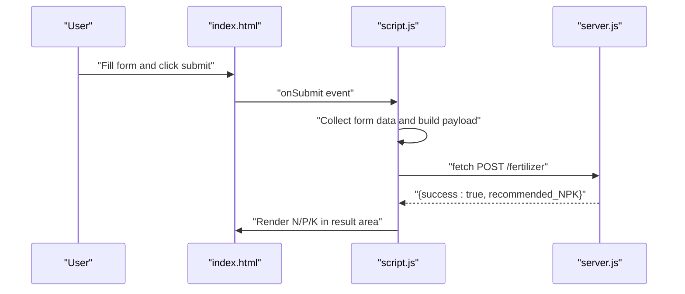
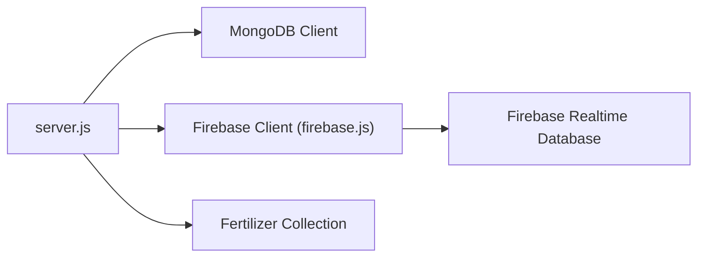
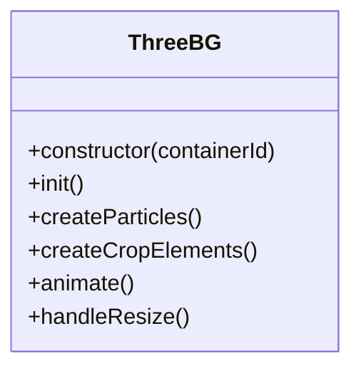
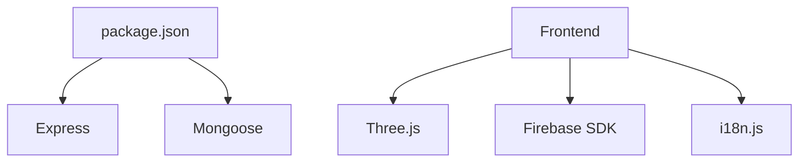

# Fertilizer Recommendation Application

<cite>
**Referenced Files in This Document**
- [server.js](file://simple webpage reverse/server.js)
- [script.js](file://simple webpage reverse/script.js)
- [index.html](file://simple webpage reverse/index.html)
- [style.css](file://simple webpage reverse/style.css)
- [i18n.js](file://simple webpage reverse/i18n.js)
- [three.js](file://simple webpage reverse/three.js)
- [firebase.js](file://simple webpage reverse/firebase.js)
- [package.json](file://simple webpage reverse/package.json)
</cite>

## Table of Contents
1. [Introduction](#introduction)
2. [Project Structure](#project-structure)
3. [Core Components](#core-components)
4. [Architecture Overview](#architecture-overview)
5. [Detailed Component Analysis](#detailed-component-analysis)
6. [Dependency Analysis](#dependency-analysis)
7. [Performance Considerations](#performance-considerations)
8. [Troubleshooting Guide](#troubleshooting-guide)
9. [Conclusion](#conclusion)

## Introduction
This document describes the fertilizer recommendation application component of the YieldSmart platform. It explains how the backend calculates optimal NPK (Nitrogen-Phosphorus-Potassium) ratios based on target crop yield and soil type, documents the /fertilizer API endpoint, and details the frontend form design, processing indicators, and recommendation display. It also covers the dual database integration with MongoDB for persistent storage and Firebase Realtime Database for real-time updates, along with the Three.js 3D visualization and internationalization system.

## Project Structure
The fertilizer recommendation application consists of:
- Frontend: HTML form, JavaScript logic, CSS styling, Three.js background, and internationalization utilities
- Backend: Express server exposing the /fertilizer endpoint with optional MongoDB persistence
- Optional integrations: Firebase Realtime Database and a shared internationalization system

**Diagram sources**
- [server.js:1-65](file://simple webpage reverse/server.js#L1-L65)
- [script.js:1-64](file://simple webpage reverse/script.js#L1-L64)
- [index.html:1-98](file://simple webpage reverse/index.html#L1-L98)
- [style.css:1-194](file://simple webpage reverse/style.css#L1-L194)
- [i18n.js:1-122](file://simple webpage reverse/i18n.js#L1-L122)
- [three.js:1-107](file://simple webpage reverse/three.js#L1-L107)
- [firebase.js:1-22](file://simple webpage reverse/firebase.js#L1-L22)

**Section sources**
- [server.js:1-65](file://simple webpage reverse/server.js#L1-L65)
- [script.js:1-64](file://simple webpage reverse/script.js#L1-L64)
- [index.html:1-98](file://simple webpage reverse/index.html#L1-L98)
- [style.css:1-194](file://simple webpage reverse/style.css#L1-L194)
- [i18n.js:1-122](file://simple webpage reverse/i18n.js#L1-L122)
- [three.js:1-107](file://simple webpage reverse/three.js#L1-L107)
- [firebase.js:1-22](file://simple webpage reverse/firebase.js#L1-L22)
- [package.json:1-19](file://simple webpage reverse/package.json#L1-L19)

## Core Components
- Backend API server: Implements the /fertilizer endpoint that accepts Crop_Type, Soil_Type, and Crop_Yield, computes NPK recommendations, optionally persists the record to MongoDB, and returns the recommendation.
- Frontend form: Collects Location, Crop_Type, Soil_Type, and Crop_Yield; displays processing status and recommendation results.
- Internationalization: Provides English and Hindi translations for UI labels and messages.
- Three.js background: Renders an animated 3D scene with floating crop-like elements and rotating particles.
- Optional Firebase integration: Initializes Firebase Realtime Database client for real-time updates.

**Section sources**
- [server.js:41-61](file://simple webpage reverse/server.js#L41-L61)
- [script.js:12-64](file://simple webpage reverse/script.js#L12-L64)
- [index.html:32-78](file://simple webpage reverse/index.html#L32-L78)
- [i18n.js:1-122](file://simple webpage reverse/i18n.js#L1-L122)
- [three.js:1-107](file://simple webpage reverse/three.js#L1-L107)
- [firebase.js:1-22](file://simple webpage reverse/firebase.js#L1-L22)

## Architecture Overview
The application follows a client-server model:
- The frontend sends a POST request to /fertilizer with crop and yield data.
- The backend validates inputs, computes NPK values, optionally stores the record in MongoDB, and responds with the recommendation.
- The frontend displays the recommendation and handles errors gracefully.

**Diagram sources**
- [script.js:12-64](file://simple webpage reverse/script.js#L12-L64)
- [server.js:41-61](file://simple webpage reverse/server.js#L41-L61)

## Detailed Component Analysis

### Backend API: /fertilizer Endpoint
- Purpose: Calculate and return NPK recommendations based on target crop yield and soil type.
- Method: POST
- Request Body Schema:
  - Crop_Type: string (required)
  - Soil_Type: string (required)
  - Crop_Yield: number (required)
- Response Schema:
  - success: boolean
  - recommended_NPK: object
    - N: number
    - P: number
    - K: number
- Business Logic:
  - Parse and validate Crop_Yield.
  - Compute N, P, K using rounded formulas proportional to Crop_Yield.
  - Optionally persist the record to MongoDB if connection is available.
  - Return success flag and computed NPK values.

**Diagram sources**
- [server.js:41-61](file://simple webpage reverse/server.js#L41-L61)

**Section sources**
- [server.js:41-61](file://simple webpage reverse/server.js#L41-L61)

### Frontend Form and Processing
- Form Fields:
  - Location (text)
  - Crop Type (text)
  - Soil Type (select: Peaty, Loamy, Sandy, Saline, Clay)
  - Crop Yield (number)
- Processing Indicators:
  - Loader animation during request.
  - Disabled submit button while processing.
- Recommendation Display:
  - Centered layout showing N, P, K values after successful computation.

**Diagram sources**
- [index.html:32-78](file://simple webpage reverse/index.html#L32-L78)
- [script.js:12-64](file://simple webpage reverse/script.js#L12-L64)
- [server.js:41-61](file://simple webpage reverse/server.js#L41-L61)

**Section sources**
- [index.html:32-78](file://simple webpage reverse/index.html#L32-L78)
- [script.js:12-64](file://simple webpage reverse/script.js#L12-L64)
- [style.css:156-166](file://simple webpage reverse/style.css#L156-L166)

### NPK Ratio Calculation Methodology
- Inputs:
  - Crop_Yield (kg/ha)
- Computation:
  - N = round(Crop_Yield × 0.8)
  - P = round(Crop_Yield × 0.5)
  - K = round(Crop_Yield × 0.6)
- Rationale:
  - Proportional to yield to ensure adequate nutrient supply per hectare.
  - Rounded to whole numbers for practical application.

**Section sources**
- [server.js:48-50](file://simple webpage reverse/server.js#L48-L50)

### Dual Database Integration
- MongoDB:
  - Optional connection at startup.
  - If connected, records are persisted to a collection with fields: Crop_Type, Soil_Type, Crop_Yield, N, P, K.
  - Graceful fallback if connection fails.
- Firebase Realtime Database:
  - Firebase client initialized with configuration constants.
  - Exported for potential use in real-time synchronization flows.

**Diagram sources**
- [server.js:18-39](file://simple webpage reverse/server.js#L18-L39)
- [firebase.js:1-22](file://simple webpage reverse/firebase.js#L1-L22)

**Section sources**
- [server.js:18-39](file://simple webpage reverse/server.js#L18-L39)
- [firebase.js:1-22](file://simple webpage reverse/firebase.js#L1-L22)

### Three.js 3D Visualization
- Scene Setup:
  - Perspective camera, WebGL renderer with transparency, ambient and directional lighting.
- Particles:
  - Randomly positioned points forming a subtle background effect.
- Animated Elements:
  - Floating crop-like spheres with synchronized rotation and vertical oscillation.
- Responsive Behavior:
  - Resize handler updates camera aspect ratio and renderer size.

**Diagram sources**
- [three.js:3-107](file://simple webpage reverse/three.js#L3-L107)

**Section sources**
- [three.js:1-107](file://simple webpage reverse/three.js#L1-L107)

### Internationalization System
- Translations:
  - Keys for fertilizer recommendation page: title, labels, placeholders, buttons, and status messages.
  - Languages: English and Hindi.
- Utilities:
  - Translation lookup with fallback to English.
  - DOM application via data-i18n attributes on load and language change.
  - Initialization with default language selection and event binding.

**Section sources**
- [i18n.js:1-122](file://simple webpage reverse/i18n.js#L1-L122)
- [index.html:23-30](file://simple webpage reverse/index.html#L23-L30)

## Dependency Analysis
- Runtime Dependencies:
  - Express for HTTP server and CORS support.
  - Mongoose for MongoDB ODM.
- Frontend Dependencies:
  - Three.js for 3D rendering.
  - Firebase SDK for Realtime Database client initialization.
- Internal Modules:
  - i18n.js for localization.
  - three.js for background visualization.
  - firebase.js for Firebase client.

**Diagram sources**
- [package.json:1-19](file://simple webpage reverse/package.json#L1-L19)

**Section sources**
- [package.json:1-19](file://simple webpage reverse/package.json#L1-L19)

## Performance Considerations
- Network Requests:
  - Minimize payload size by sending only required fields.
  - Debounce repeated submissions using disabled state and loader.
- Rendering:
  - Keep particle count moderate to maintain smooth animation.
  - Use requestAnimationFrame for efficient animation loops.
- Persistence:
  - Batch writes if scaling to high throughput.
  - Ensure connection retry strategies for MongoDB.

## Troubleshooting Guide
- Backend Not Reachable:
  - Verify server is running on port 5001.
  - Check CORS configuration and firewall rules.
- MongoDB Issues:
  - Confirm MongoDB service is running locally.
  - Review connection logs and fallback behavior.
- Input Validation Errors:
  - Ensure Crop_Yield is a positive number.
  - Confirm Soil_Type is one of the supported values.
- Frontend Display Problems:
  - Confirm data-i18n attributes are present and applied.
  - Check CSS selectors for loader and result areas.

**Section sources**
- [server.js:18-28](file://simple webpage reverse/server.js#L18-L28)
- [script.js:36-40](file://simple webpage reverse/script.js#L36-L40)
- [index.html:47-54](file://simple webpage reverse/index.html#L47-L54)

## Conclusion
The fertilizer recommendation component provides a streamlined workflow for deriving NPK ratios from target yield and soil type. Its backend API is robust, with optional MongoDB persistence and clear error handling. The frontend offers a responsive form with processing feedback and localized messaging, complemented by an engaging Three.js background. Firebase integration is established for future real-time capabilities. Together, these elements deliver a practical, scalable solution for agricultural decision support.