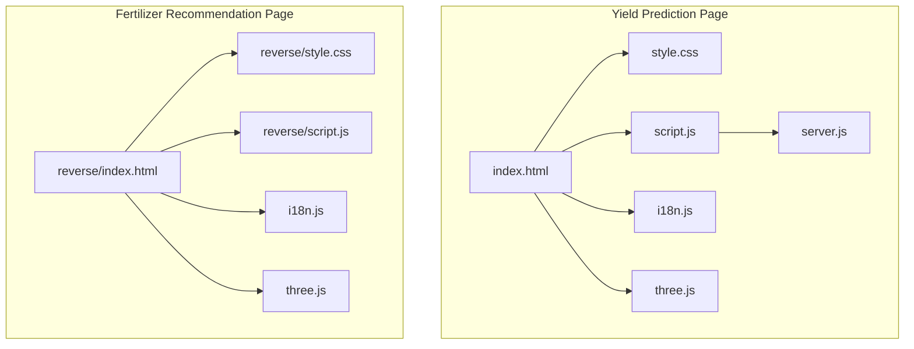
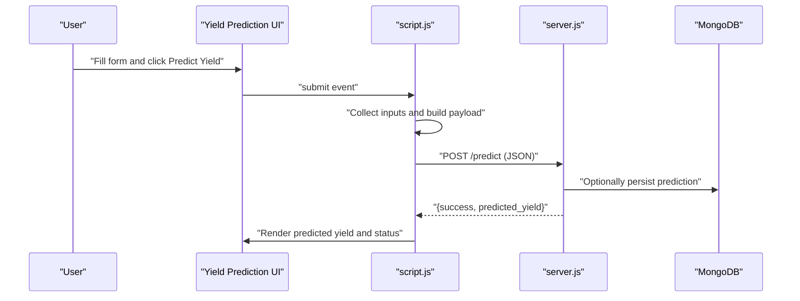
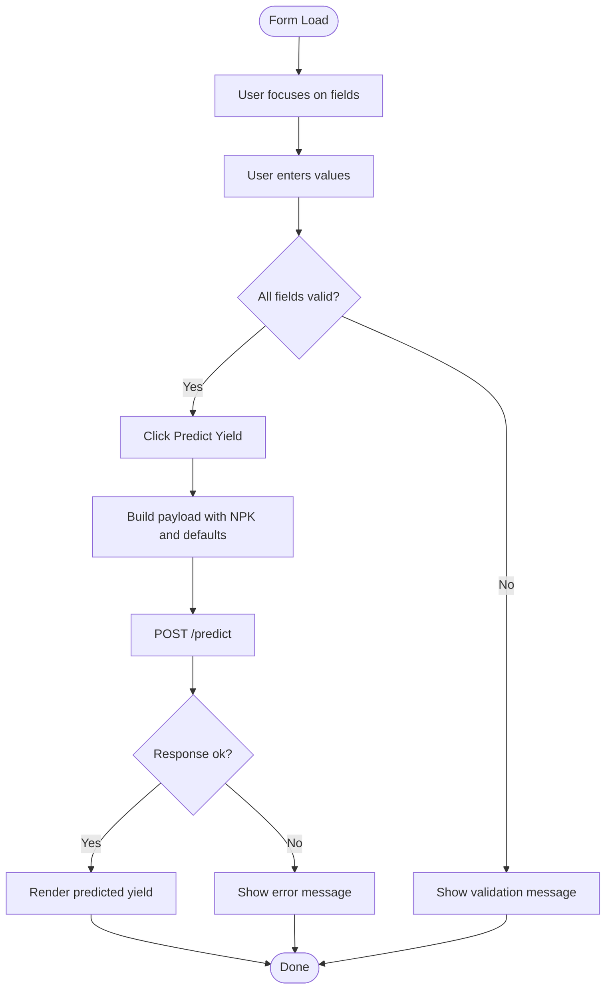
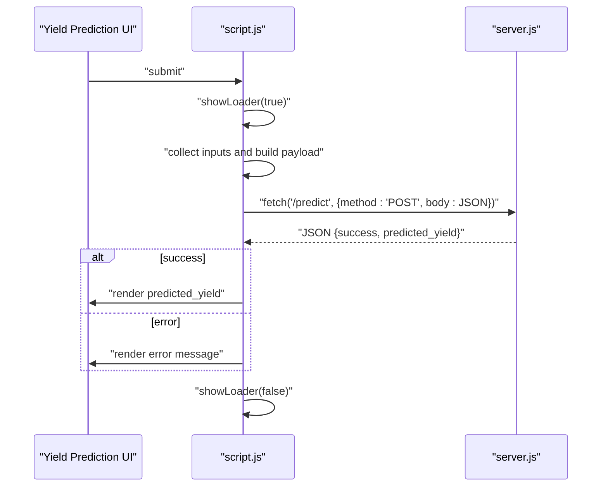
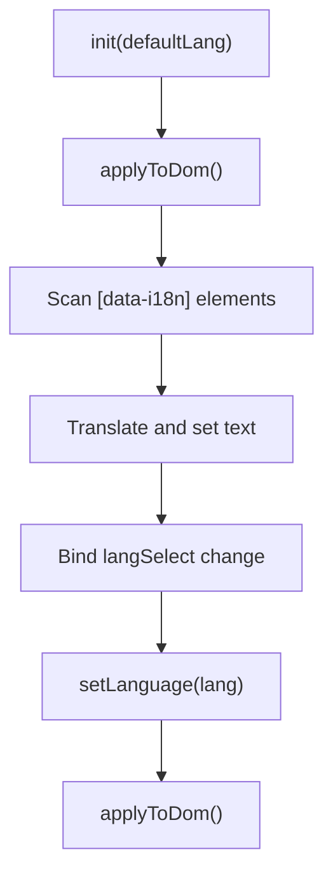
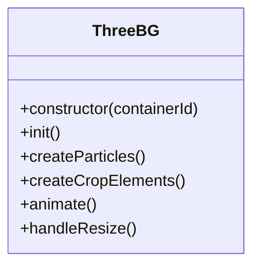
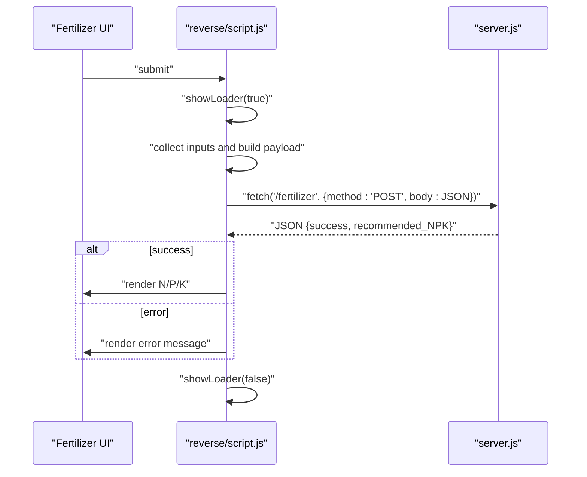
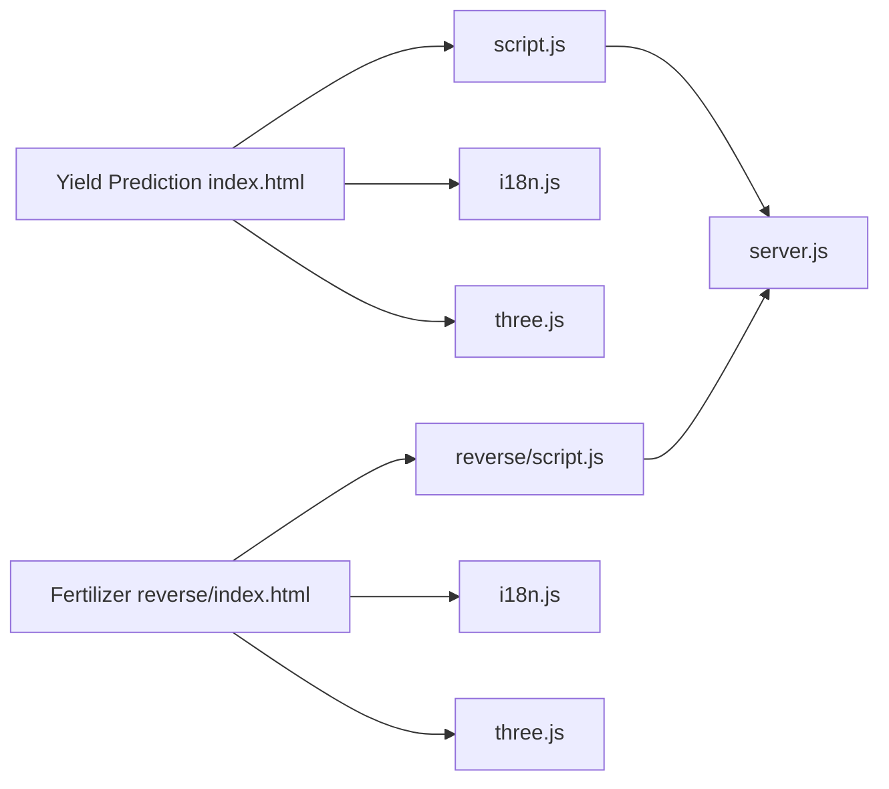

# Frontend Interface

<cite>
**Referenced Files in This Document**
- [index.html](file://simple webpage/index.html)
- [style.css](file://simple webpage/style.css)
- [script.js](file://simple webpage/script.js)
- [server.js](file://simple webpage/server.js)
- [i18n.js](file://simple webpage/i18n.js)
- [three.js](file://simple webpage/three.js)
- [reverse/index.html](file://simple webpage reverse/index.html)
- [reverse/style.css](file://simple webpage reverse/style.css)
- [reverse/script.js](file://simple webpage reverse/script.js)
</cite>

## Table of Contents
1. [Introduction](#introduction)
2. [Project Structure](#project-structure)
3. [Core Components](#core-components)
4. [Architecture Overview](#architecture-overview)
5. [Detailed Component Analysis](#detailed-component-analysis)
6. [Dependency Analysis](#dependency-analysis)
7. [Performance Considerations](#performance-considerations)
8. [Troubleshooting Guide](#troubleshooting-guide)
9. [Conclusion](#conclusion)

## Introduction
This document describes the frontend interface of the fertilizer recommendation application. It focuses on the HTML form structure for collecting target yield and soil condition inputs, CSS styling with responsive design and visual feedback, JavaScript logic for user interactions and real-time result updates, and the integration with backend API endpoints. It also covers internationalization and interactive 3D background enhancements.

## Project Structure
The application consists of two primary pages:
- Crop Yield Prediction page: collects crop type, soil type, NPK levels, and location; displays predicted yield.
- Fertilizer Recommendation page: collects location, crop type, soil type, and predicted yield; displays fertilizer NPK recommendations.

Both pages share common assets: internationalization, 3D background, and styling.

**Diagram sources**
- [index.html:1-116](file://simple webpage/index.html#L1-L116)
- [style.css:1-173](file://simple webpage/style.css#L1-L173)
- [script.js:1-73](file://simple webpage/script.js#L1-L73)
- [server.js:1-68](file://simple webpage/server.js#L1-L68)
- [i18n.js:1-122](file://simple webpage/i18n.js#L1-L122)
- [three.js:1-107](file://simple webpage/three.js#L1-L107)
- [reverse/index.html:1-98](file://simple webpage reverse/index.html#L1-L98)
- [reverse/style.css:1-194](file://simple webpage reverse/style.css#L1-L194)
- [reverse/script.js:1-64](file://simple webpage reverse/script.js#L1-L64)

**Section sources**
- [index.html:1-116](file://simple webpage/index.html#L1-L116)
- [reverse/index.html:1-98](file://simple webpage reverse/index.html#L1-L98)

## Core Components
- HTML forms:
  - Yield Prediction form: collects crop type, soil type, NPK values, and city location; submits to backend prediction endpoint.
  - Fertilizer Recommendation form: collects location, crop type, soil type, and predicted yield; submits to backend fertilizer endpoint.
- CSS styling:
  - Responsive layout with centered containers, backdrop blur overlay, gradient buttons, and loader animations.
  - Consistent typography and spacing across both pages.
- JavaScript logic:
  - Event handling for form submission, loader toggling, and result rendering.
  - Fetch requests to backend endpoints with JSON payload formatting and response parsing.
- Internationalization:
  - Dynamic text updates via data attributes and language selector.
- 3D background:
  - Animated particle system and crop-like elements rendered with Three.js.

**Section sources**
- [index.html:36-95](file://simple webpage/index.html#L36-L95)
- [reverse/index.html:33-77](file://simple webpage reverse/index.html#L33-L77)
- [style.css:1-173](file://simple webpage/style.css#L1-L173)
- [reverse/style.css:1-194](file://simple webpage reverse/style.css#L1-L194)
- [script.js:1-73](file://simple webpage/script.js#L1-L73)
- [reverse/script.js:1-64](file://simple webpage reverse/script.js#L1-L64)
- [i18n.js:1-122](file://simple webpage/i18n.js#L1-L122)
- [three.js:1-107](file://simple webpage/three.js#L1-L107)

## Architecture Overview
The frontend integrates with a Node.js/Express backend. The Yield Prediction page posts NPK and weather inputs to the prediction endpoint and receives a predicted yield. The Fertilizer Recommendation page posts location, crop type, soil type, and predicted yield to the fertilizer endpoint and receives NPK recommendations.

**Diagram sources**
- [script.js:13-73](file://simple webpage/script.js#L13-L73)
- [server.js:45-64](file://simple webpage/server.js#L45-L64)

## Detailed Component Analysis

### HTML Form Structure (Yield Prediction)
- Purpose: Collect crop type, soil type, NPK levels, and city location; trigger prediction.
- Fields:
  - Crop Type: text input.
  - Soil Type: select with predefined options.
  - N, P, K: numeric inputs with decimal precision.
  - Location: text input for city.
  - Predict Yield button: triggers submission.
- Accessibility and UX:
  - Required attributes enforce mandatory fields.
  - Placeholder hints guide input.
  - Status and result areas provide immediate feedback.
- Internationalization:
  - Labels and placeholders use data-i18n keys for dynamic translation.

**Diagram sources**
- [index.html:36-78](file://simple webpage/index.html#L36-L78)
- [script.js:13-73](file://simple webpage/script.js#L13-L73)

**Section sources**
- [index.html:36-78](file://simple webpage/index.html#L36-L78)

### HTML Form Structure (Fertilizer Recommendation)
- Purpose: Collect location, crop type, soil type, and predicted yield; request fertilizer recommendations.
- Fields:
  - Location, Crop Type, Soil Type, Crop Yield (numeric).
  - Get Recommendation button.
- Behavior mirrors the prediction page with distinct endpoint and response structure.

**Section sources**
- [reverse/index.html:33-66](file://simple webpage reverse/index.html#L33-L66)

### CSS Styling and Responsive Design
- Layout:
  - Centered container with rounded corners and strong shadow.
  - Backdrop blur overlay for readability over animated background.
- Typography:
  - Rajdhani font for headings and labels.
- Interactive elements:
  - Gradient buttons with hover glow and subtle scaling.
  - Loader spinner with consistent animation.
- Responsive patterns:
  - Full-width inputs and buttons on mobile.
  - Container constrained to a readable max-width.
- Visual feedback:
  - Status area for progress and errors.
  - Result area with background tint for emphasis.

**Section sources**
- [style.css:29-173](file://simple webpage/style.css#L29-L173)
- [reverse/style.css:31-194](file://simple webpage reverse/style.css#L31-L194)

### JavaScript Logic: Event Handling and Real-Time Updates
- Event handling:
  - Form submit listener prevents default navigation and orchestrates request lifecycle.
- Loader control:
  - Toggle visibility and disable submit button while processing.
- DOM manipulation:
  - Clear result area, update status text, render predicted yield or error messages.
- Request formatting:
  - Build payload from form inputs and fixed weather defaults.
  - Send JSON to backend endpoint.
- Response handling:
  - Parse JSON and render success or error state.
- Error handling:
  - Catch network/server errors and display user-friendly messages.

**Diagram sources**
- [script.js:13-73](file://simple webpage/script.js#L13-L73)
- [server.js:45-64](file://simple webpage/server.js#L45-L64)

**Section sources**
- [script.js:1-73](file://simple webpage/script.js#L1-L73)

### JavaScript Logic: Fertilizer Recommendation Page
- Similar event handling and loader control.
- Builds payload from form fields and sends to fertilizer endpoint.
- Renders NPK recommendation values upon success.

**Section sources**
- [reverse/script.js:1-64](file://simple webpage reverse/script.js#L1-L64)

### Internationalization (i18n)
- Translations:
  - English and Hindi keys for labels, placeholders, and UI text.
- Dynamic updates:
  - applyToDom scans elements with data-i18n and sets text/content.
  - Language selector updates current locale and re-applies translations.
- Initialization:
  - init sets default language and binds change handler to selector.

**Diagram sources**
- [i18n.js:103-122](file://simple webpage/i18n.js#L103-L122)

**Section sources**
- [i18n.js:1-122](file://simple webpage/i18n.js#L1-L122)

### 3D Background (Three.js)
- Scene setup:
  - Perspective camera, WebGL renderer with transparency, ambient and directional lights.
- Particles:
  - Randomly positioned points with subtle opacity and rotation animation.
- Crop elements:
  - Spheres representing crops with floating animation synchronized to time.
- Resize handling:
  - Recompute aspect ratio and renderer size on window resize.

**Diagram sources**
- [three.js:3-107](file://simple webpage/three.js#L3-L107)

**Section sources**
- [three.js:1-107](file://simple webpage/three.js#L1-L107)

### Backend Integration Details
- Yield Prediction endpoint:
  - Endpoint: POST /predict
  - Request body: N, P, K, Temperature, Humidity, Wind_Speed
  - Response: { success: true, predicted_yield }
- Fertilizer Recommendation endpoint:
  - Endpoint: POST /fertilizer
  - Request body: Crop_Type, Soil_Type, Crop_Yield
  - Response: { success: true, recommended_NPK: { N, P, K } }

**Diagram sources**
- [reverse/script.js:12-64](file://simple webpage reverse/script.js#L12-L64)

**Section sources**
- [server.js:45-64](file://simple webpage/server.js#L45-L64)
- [reverse/script.js:12-64](file://simple webpage reverse/script.js#L12-L64)

## Dependency Analysis
- Frontend-to-backend:
  - Yield Prediction page depends on server.js /predict endpoint.
  - Fertilizer Recommendation page depends on server.js /fertilizer endpoint.
- Frontend-to-assets:
  - Both pages depend on shared i18n.js and three.js modules.
  - Stylesheets define consistent UI patterns across pages.
- Coupling and cohesion:
  - Forms and scripts are cohesive around their respective tasks.
  - Shared utilities (i18n, 3D background) reduce duplication.

**Diagram sources**
- [index.html:101-113](file://simple webpage/index.html#L101-L113)
- [reverse/index.html:83-95](file://simple webpage reverse/index.html#L83-L95)
- [script.js:1-73](file://simple webpage/script.js#L1-L73)
- [reverse/script.js:1-64](file://simple webpage reverse/script.js#L1-L64)
- [server.js:1-68](file://simple webpage/server.js#L1-L68)
- [i18n.js:1-122](file://simple webpage/i18n.js#L1-L122)
- [three.js:1-107](file://simple webpage/three.js#L1-L107)

**Section sources**
- [index.html:101-113](file://simple webpage/index.html#L101-L113)
- [reverse/index.html:83-95](file://simple webpage reverse/index.html#L83-L95)
- [script.js:1-73](file://simple webpage/script.js#L1-L73)
- [reverse/script.js:1-64](file://simple webpage reverse/script.js#L1-L64)
- [server.js:1-68](file://simple webpage/server.js#L1-L68)
- [i18n.js:1-122](file://simple webpage/i18n.js#L1-L122)
- [three.js:1-107](file://simple webpage/three.js#L1-L107)

## Performance Considerations
- Network requests:
  - Use minimal payload sizes; avoid unnecessary fields.
  - Debounce repeated submissions if needed.
- Rendering:
  - Avoid heavy DOM updates; batch innerHTML assignments.
- Animations:
  - Keep 3D scene simple; adjust particle count and animation rates if needed.
- Caching:
  - Consider caching static assets and translations.

## Troubleshooting Guide
- Form does not submit:
  - Ensure required fields are filled; check browser validation.
  - Verify event listener is attached to the correct form ID.
- No result displayed:
  - Confirm backend endpoint is reachable and returns JSON with success flag.
  - Inspect console for fetch errors.
- Loader remains visible:
  - Ensure showLoader(false) is called in finally blocks.
- Translation not applied:
  - Confirm data-i18n keys exist and init is called after DOMContentLoaded.
- 3D background not rendering:
  - Check container element exists and Three.js is loaded.

**Section sources**
- [script.js:66-73](file://simple webpage/script.js#L66-L73)
- [reverse/script.js:58-64](file://simple webpage reverse/script.js#L58-L64)
- [i18n.js:75-98](file://simple webpage/i18n.js#L75-L98)

## Conclusion
The frontend provides a responsive, accessible, and visually engaging interface for crop yield prediction and fertilizer recommendation. It leverages modern web technologies, consistent styling, robust event handling, and seamless integration with backend APIs. Internationalization and interactive 3D backgrounds enhance the user experience across both pages.