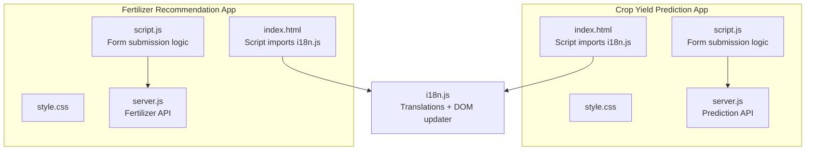
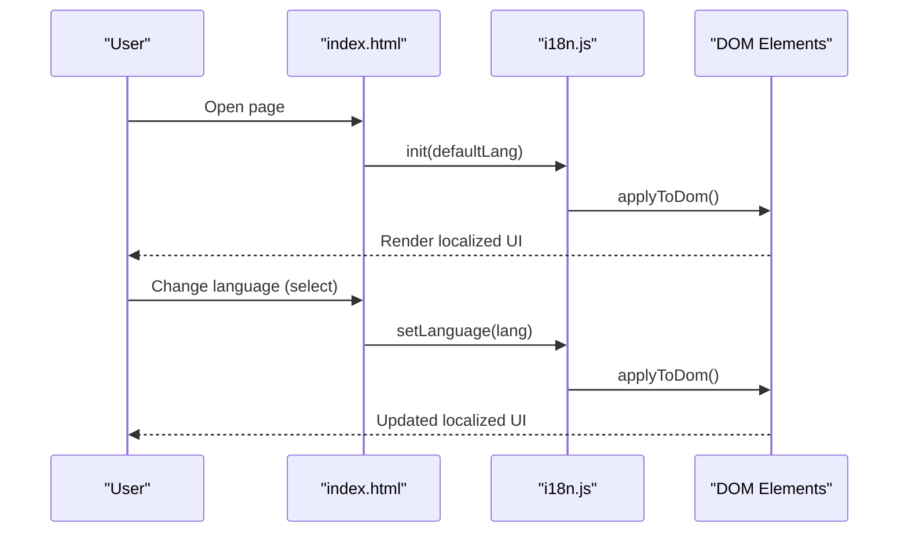
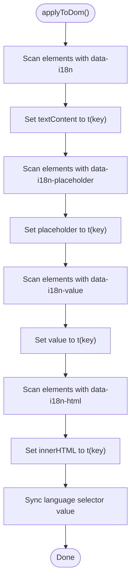
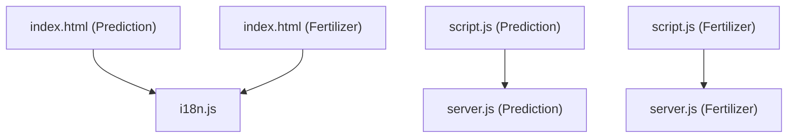
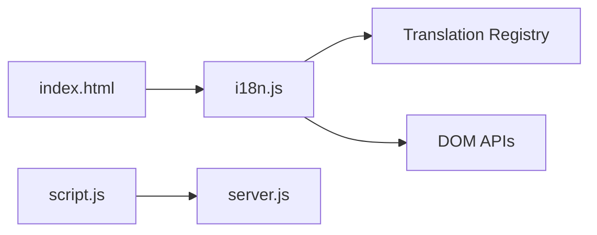

# Internationalization System

<cite>
**Referenced Files in This Document**
- [i18n.js](file://simple webpage/i18n.js)
- [index.html](file://simple webpage/index.html)
- [script.js](file://simple webpage/script.js)
- [server.js](file://simple webpage/server.js)
- [style.css](file://simple webpage/style.css)
- [package.json](file://simple webpage/package.json)
- [i18n.js](file://simple webpage reverse/i18n.js)
- [index.html](file://simple webpage reverse/index.html)
- [script.js](file://simple webpage reverse/script.js)
- [server.js](file://simple webpage reverse/server.js)
</cite>

## Table of Contents
1. [Introduction](#introduction)
2. [Project Structure](#project-structure)
3. [Core Components](#core-components)
4. [Architecture Overview](#architecture-overview)
5. [Detailed Component Analysis](#detailed-component-analysis)
6. [Dependency Analysis](#dependency-analysis)
7. [Performance Considerations](#performance-considerations)
8. [Troubleshooting Guide](#troubleshooting-guide)
9. [Conclusion](#conclusion)
10. [Appendices](#appendices)

## Introduction
This document explains the internationalization (i18n) system implemented in the project. It covers the translation management architecture, language file structure, dynamic content loading, DOM manipulation techniques for updating UI elements, language switching, and integration with the application’s frontend and backend. It also provides guidance on managing translation keys, pluralization, locale-specific formatting, and best practices for maintaining translation consistency and adding new languages.

## Project Structure
The project consists of two related single-page applications:
- Crop Yield Prediction app: renders a form, displays status and results, and communicates with a prediction backend.
- Fertilizer Recommendation app: renders a form, displays fertilizer recommendations, and communicates with a fertilizer backend.

Both apps share a common i18n module that manages translations and applies them to the DOM via data attributes.

**Diagram sources**
- [index.html:101-113](file://simple webpage/index.html#L101-L113)
- [script.js:1-73](file://simple webpage/script.js#L1-L73)
- [server.js:44-64](file://simple webpage/server.js#L44-L64)
- [index.html:82-95](file://simple webpage reverse/index.html#L82-L95)
- [script.js:1-64](file://simple webpage reverse/script.js#L1-L64)
- [server.js:41-61](file://simple webpage reverse/server.js#L41-L61)
- [i18n.js:103-122](file://simple webpage/i18n.js#L103-L122)

**Section sources**
- [index.html:1-116](file://simple webpage/index.html#L1-L116)
- [index.html:1-98](file://simple webpage reverse/index.html#L1-L98)
- [i18n.js:1-122](file://simple webpage/i18n.js#L1-L122)
- [i18n.js:1-122](file://simple webpage reverse/i18n.js#L1-L122)

## Core Components
- Translation registry: A centralized object containing translation keys grouped by language.
- Translation function: Resolves a translation key to localized text, with fallback to English and variable substitution.
- DOM updater: Scans the DOM for elements marked with data attributes and updates their content or attributes.
- Language switcher: A select element that triggers language changes and re-applies translations.
- Initialization routine: Sets up event listeners and applies translations on load.

Key responsibilities:
- Manage translation keys and values.
- Apply translations to labels, placeholders, button text, and HTML content.
- Persist selected language and synchronize the language selector.
- Provide a simple API for other modules to initialize and switch languages.

**Section sources**
- [i18n.js:1-122](file://simple webpage/i18n.js#L1-L122)
- [i18n.js:1-122](file://simple webpage reverse/i18n.js#L1-L122)

## Architecture Overview
The i18n system is designed as a small, self-contained module that integrates with the HTML via data attributes. On initialization, it scans the DOM for elements with specific attributes and replaces their content with localized strings. Users can switch languages via a dropdown, which triggers a re-application of translations.

**Diagram sources**
- [index.html:29-32](file://simple webpage/index.html#L29-L32)
- [i18n.js:103-122](file://simple webpage/i18n.js#L103-L122)
- [i18n.js:75-98](file://simple webpage/i18n.js#L75-L98)

## Detailed Component Analysis

### Translation Registry and Keys
- The translation registry is a flat object keyed by language codes (for example, English and Hindi).
- Each language contains key-value pairs where keys are semantic identifiers and values are localized strings.
- Keys are intentionally short and descriptive to minimize ambiguity and improve maintainability.

Examples of keys present in the registry:
- Titles and headings: title_predict, title_fert
- Form labels and placeholders: cropType, soilType, nLabel, pLabel, kLabel, locationLabel
- Buttons and links: predictButton, fert_button, link_fertiliser, go_to_predict
- Status and error messages: status_default, processing, fill_error, weather_note_default, rec_received, rec_backend_error, request_failed

Best practices for key management:
- Use hierarchical or descriptive keys to avoid collisions across pages.
- Keep keys stable across releases to prevent broken references.
- Group keys by functional area (for example, forms, errors, navigation) to simplify maintenance.

**Section sources**
- [i18n.js:1-52](file://simple webpage/i18n.js#L1-L52)
- [i18n.js:1-52](file://simple webpage reverse/i18n.js#L1-L52)

### Translation Function and Variable Substitution
- The translation function resolves a key to a localized string using the current language.
- If a key is missing for the current language, it falls back to English.
- If still missing, it returns the key itself.
- The function supports simple variable substitution using placeholders in the form {varName}.

Variable substitution flow:
- The function receives a key and an object of variables.
- It replaces placeholders in the localized string with provided values or leaves them unchanged if not provided.

Complexity:
- Lookup is O(1) for accessing the current language dictionary.
- Replacement is linear in the length of the string.

**Section sources**
- [i18n.js:56-62](file://simple webpage/i18n.js#L56-L62)

### DOM Manipulation and Data Attributes
The DOM updater targets elements using data attributes to decide what to update and how:
- data-i18n: Updates the element’s textContent.
- data-i18n-placeholder: Updates the element’s placeholder attribute.
- data-i18n-value: Updates the element’s value property.
- data-i18n-html: Updates the element’s innerHTML.

Behavior:
- The updater iterates over all matching elements and applies the translation.
- It also synchronizes the language selector’s value to reflect the current language.

**Diagram sources**
- [i18n.js:75-98](file://simple webpage/i18n.js#L75-L98)

**Section sources**
- [i18n.js:75-98](file://simple webpage/i18n.js#L75-L98)

### Language Switching Mechanism
- The language selector is a select element with options for each supported language.
- On change, the selected value is passed to the language setter.
- The setter validates the language against the registry, updates the current language, and re-applies translations to the DOM.

Integration points:
- The select element is synchronized with the current language during initialization and after switching.
- The setter triggers the DOM update automatically.

**Section sources**
- [index.html:29-32](file://simple webpage/index.html#L29-L32)
- [i18n.js:64-69](file://simple webpage/i18n.js#L64-L69)
- [i18n.js:96-98](file://simple webpage/i18n.js#L96-L98)

### Dynamic Content Loading and Contextual Translations
- The system does not load translations asynchronously; translations are bundled statically.
- Contextual translations are handled by choosing appropriate keys for different UI contexts (for example, form labels vs. status messages).
- Variable substitution allows dynamic parts of strings to be inserted at runtime.

Example contexts:
- Form labels and placeholders are updated via data-i18n and data-i18n-placeholder.
- Button text is updated via data-i18n on the button element.
- Status and error messages are updated via data-i18n on dedicated elements.

**Section sources**
- [index.html:38-77](file://simple webpage/index.html#L38-L77)
- [i18n.js:75-98](file://simple webpage/i18n.js#L75-L98)

### Pluralization Handling
- The current implementation does not include explicit pluralization logic.
- For scenarios requiring pluralization, consider extending the translation function to accept a count and choose among multiple forms, or introduce a separate pluralization helper.

[No sources needed since this section provides general guidance]

### Locale-Specific Formatting
- The current implementation does not include locale-aware number, date, or currency formatting.
- For numeric values in results, consider using Intl.NumberFormat for locale-appropriate formatting.

[No sources needed since this section provides general guidance]

### Integration with Application Architecture
- Frontend integration: The i18n module is imported and initialized in each page’s script tag. Initialization sets up the language selector and applies translations immediately.
- Backend integration: The apps communicate with separate Express servers for prediction and fertilizer recommendation. The i18n module is independent of backend logic and focuses solely on UI localization.

**Diagram sources**
- [index.html:101-113](file://simple webpage/index.html#L101-L113)
- [index.html:82-95](file://simple webpage reverse/index.html#L82-L95)
- [script.js:1-73](file://simple webpage/script.js#L1-L73)
- [script.js:1-64](file://simple webpage reverse/script.js#L1-L64)
- [server.js:44-64](file://simple webpage/server.js#L44-L64)
- [server.js:41-61](file://simple webpage reverse/server.js#L41-L61)

**Section sources**
- [index.html:101-113](file://simple webpage/index.html#L101-L113)
- [index.html:82-95](file://simple webpage reverse/index.html#L82-L95)
- [script.js:1-73](file://simple webpage/script.js#L1-L73)
- [script.js:1-64](file://simple webpage reverse/script.js#L1-L64)
- [server.js:44-64](file://simple webpage/server.js#L44-L64)
- [server.js:41-61](file://simple webpage reverse/server.js#L41-L61)

## Dependency Analysis
- The i18n module depends on:
  - The translation registry (flat object).
  - The DOM APIs for querying and updating elements.
  - The global document object for initialization and event handling.
- HTML pages depend on:
  - The i18n module for initialization and DOM updates.
  - The language selector for user-driven language switching.
- Backend servers depend on:
  - The frontend scripts sending requests with form data.
  - The i18n module remaining independent of backend concerns.

**Diagram sources**
- [i18n.js:1-122](file://simple webpage/i18n.js#L1-L122)
- [index.html:29-32](file://simple webpage/index.html#L29-L32)
- [script.js:1-73](file://simple webpage/script.js#L1-L73)
- [server.js:44-64](file://simple webpage/server.js#L44-L64)

**Section sources**
- [i18n.js:1-122](file://simple webpage/i18n.js#L1-L122)
- [index.html:29-32](file://simple webpage/index.html#L29-L32)
- [script.js:1-73](file://simple webpage/script.js#L1-L73)
- [server.js:44-64](file://simple webpage/server.js#L44-L64)

## Performance Considerations
- Static translation lookup is O(1) per key.
- DOM scanning occurs on initialization and on language switches; the cost scales with the number of elements using data attributes.
- Minimizing the number of elements with data attributes reduces unnecessary DOM updates.
- Avoid frequent re-initializations; reuse the existing initialization pattern.

[No sources needed since this section provides general guidance]

## Troubleshooting Guide
Common issues and resolutions:
- Missing translations:
  - Symptom: Keys appear in place of localized text.
  - Cause: Key missing in the current language or English fallback.
  - Resolution: Add the key to the translation registry for the current language and English.
- Incorrect language selection:
  - Symptom: Language selector does not reflect the current language.
  - Cause: Selector synchronization not triggered.
  - Resolution: Ensure the selector is present and the DOM updater runs after initialization.
- Placeholder or value not updating:
  - Symptom: Placeholders or input values remain unchanged.
  - Cause: Missing data-i18n-placeholder or data-i18n-value attributes.
  - Resolution: Add the appropriate data attribute to the element.
- Variable substitution not working:
  - Symptom: Placeholders like {varName} remain literal.
  - Cause: Variables not passed to the translation function or mismatched names.
  - Resolution: Pass a variables object with matching keys to the translation function.

**Section sources**
- [i18n.js:56-62](file://simple webpage/i18n.js#L56-L62)
- [i18n.js:75-98](file://simple webpage/i18n.js#L75-L98)
- [index.html:29-32](file://simple webpage/index.html#L29-L32)

## Conclusion
The i18n system provides a lightweight, declarative approach to localization using data attributes and a simple translation function. It enables dynamic UI updates without complex frameworks, supports multiple languages, and integrates cleanly with the application’s frontend and backend. By following the best practices outlined here—maintaining stable keys, grouping by context, and leveraging variable substitution—you can extend the system to support additional languages and more advanced features like pluralization and locale-specific formatting.

[No sources needed since this section summarizes without analyzing specific files]

## Appendices

### Adding a New Language
Steps to add a new language:
1. Extend the translation registry with a new language object and include all required keys.
2. Add an option for the new language in the language selector.
3. Initialize the i18n module with the new language as default if desired.
4. Verify that all data attributes are present and that the DOM updater applies translations correctly.

**Section sources**
- [i18n.js:1-52](file://simple webpage/i18n.js#L1-L52)
- [i18n.js:103-122](file://simple webpage/i18n.js#L103-L122)
- [index.html:29-32](file://simple webpage/index.html#L29-L32)

### Best Practices for Translation Consistency
- Use consistent key naming conventions across pages.
- Keep translation files organized by functional areas.
- Avoid embedding dynamic content directly in translation strings; pass values as variables.
- Regularly audit missing keys and remove unused ones.
- Test language switching thoroughly across all pages and UI components.

[No sources needed since this section provides general guidance]