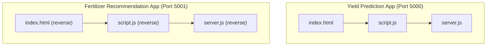
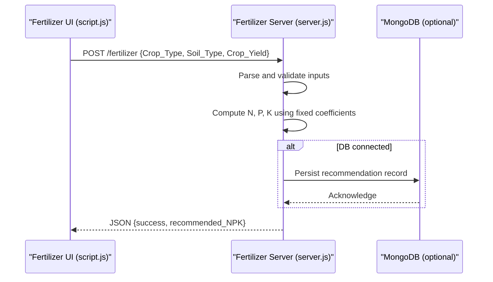
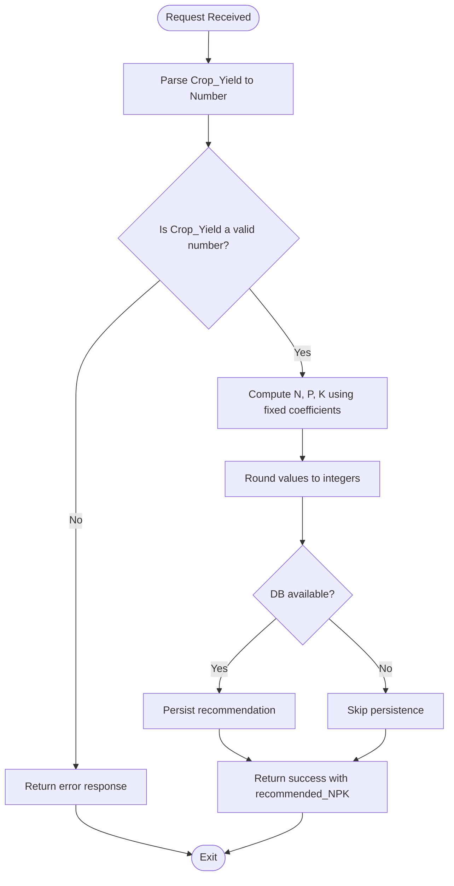
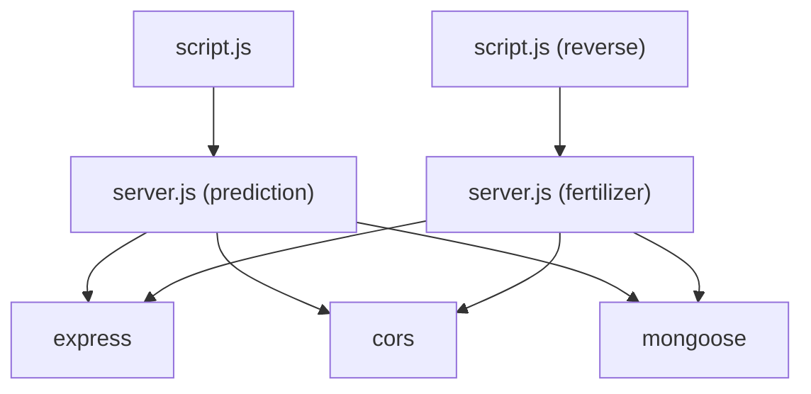

# Recommendation Engine

<cite>
**Referenced Files in This Document**
- [index.html](file://simple webpage/index.html)
- [script.js](file://simple webpage/script.js)
- [server.js](file://simple webpage/server.js)
- [index.html (reverse)](file://simple webpage reverse/index.html)
- [script.js (reverse)](file://simple webpage reverse/script.js)
- [server.js (reverse)](file://simple webpage reverse/server.js)
- [i18n.js](file://simple webpage/i18n.js)
- [style.css](file://simple webpage/style.css)
- [package.json](file://simple webpage/package.json)
</cite>

## Table of Contents
1. [Introduction](#introduction)
2. [Project Structure](#project-structure)
3. [Core Components](#core-components)
4. [Architecture Overview](#architecture-overview)
5. [Detailed Component Analysis](#detailed-component-analysis)
6. [Dependency Analysis](#dependency-analysis)
7. [Performance Considerations](#performance-considerations)
8. [Troubleshooting Guide](#troubleshooting-guide)
9. [Conclusion](#conclusion)

## Introduction
This document describes the fertilizer recommendation engine component of the YieldSmart application. It focuses on the backend recommendation service that calculates nitrogen (N), phosphorus (P), and potassium (K) requirements based on target crop yield. The documentation explains the calculation methodology, input validation, error handling, and the relationship between soil types and NPK ratios. It also provides concrete examples from the codebase and illustrates the end-to-end workflow using sequence diagrams.

## Project Structure
The project consists of two primary web applications:
- Crop yield prediction app (runs on port 5000)
- Fertilizer recommendation app (runs on port 5001)

Each app includes:
- An HTML form for collecting inputs
- A client-side script that posts data to the backend
- A Node.js/Express server implementing the recommendation endpoint
- Optional MongoDB persistence for storing recommendations
- Internationalization support and shared styles

**Diagram sources**
- [index.html:1-116](file://simple webpage/index.html#L1-L116)
- [script.js:1-73](file://simple webpage/script.js#L1-L73)
- [server.js:1-68](file://simple webpage/server.js#L1-L68)
- [index.html (reverse):1-98](file://simple webpage reverse/index.html#L1-L98)
- [script.js (reverse):1-64](file://simple webpage reverse/script.js#L1-L64)
- [server.js (reverse):1-65](file://simple webpage reverse/server.js#L1-L65)

**Section sources**
- [index.html:1-116](file://simple webpage/index.html#L1-L116)
- [index.html (reverse):1-98](file://simple webpage reverse/index.html#L1-L98)
- [script.js:1-73](file://simple webpage/script.js#L1-L73)
- [script.js (reverse):1-64](file://simple webpage reverse/script.js#L1-L64)
- [server.js:1-68](file://simple webpage/server.js#L1-L68)
- [server.js (reverse):1-65](file://simple webpage reverse/server.js#L1-L65)
- [i18n.js:1-122](file://simple webpage/i18n.js#L1-L122)
- [style.css:1-173](file://simple webpage/style.css#L1-L173)
- [package.json:1-15](file://simple webpage/package.json#L1-L15)

## Core Components
- Fertilizer recommendation endpoint: Computes N, P, K from target crop yield using fixed coefficients and rounds to integers.
- Input collection forms: Provide fields for crop type, soil type, and target yield.
- Client scripts: Serialize form data and post to the recommendation endpoint.
- Optional persistence: Stores recommendation records in MongoDB when available.
- Internationalization: Provides English and Hindi translations for UI labels.

Key calculation:
- N = round(Crop_Yield × 0.8)
- P = round(Crop_Yield × 0.5)
- K = round(Crop_Yield × 0.6)

Note: The current implementation does not adjust NPK ratios based on soil type. The relationship between soil types and NPK ratios is not implemented in the recommendation logic.

**Section sources**
- [server.js (reverse):42-61](file://simple webpage reverse/server.js#L42-L61)
- [index.html (reverse):33-66](file://simple webpage reverse/index.html#L33-L66)
- [script.js (reverse):12-64](file://simple webpage reverse/script.js#L12-L64)
- [server.js:45-64](file://simple webpage/server.js#L45-L64)

## Architecture Overview
The recommendation engine is a standalone microservice that:
- Receives a request containing crop type, soil type, and target crop yield
- Validates numeric inputs
- Computes N, P, K using fixed coefficients
- Optionally persists the recommendation to MongoDB
- Returns a JSON response with the calculated NPK values

**Diagram sources**
- [script.js (reverse):18-64](file://simple webpage reverse/script.js#L18-L64)
- [server.js (reverse):42-61](file://simple webpage reverse/server.js#L42-L61)

## Detailed Component Analysis

### Fertilizer Recommendation Endpoint
- Endpoint: POST /fertilizer
- Inputs: Crop_Type (string), Soil_Type (string), Crop_Yield (number)
- Processing:
  - Parses and converts Crop_Yield to a number
  - Computes N, P, K using fixed multipliers and rounds to integers
  - Optionally persists the recommendation to MongoDB
- Output: JSON object with success flag and recommended_NPK

**Diagram sources**
- [server.js (reverse):42-61](file://simple webpage reverse/server.js#L42-L61)

**Section sources**
- [server.js (reverse):42-61](file://simple webpage reverse/server.js#L42-L61)

### Frontend Integration
- The fertilizer recommendation app presents a form with fields for location, crop type, soil type, and target yield.
- On submission, the client script serializes form data and posts to the recommendation endpoint.
- Results are displayed in a formatted HTML element.

Concrete example paths:
- Form definition: [index.html (reverse):33-66](file://simple webpage reverse/index.html#L33-L66)
- Submission handler: [script.js (reverse):12-64](file://simple webpage reverse/script.js#L12-L64)

**Section sources**
- [index.html (reverse):33-66](file://simple webpage reverse/index.html#L33-L66)
- [script.js (reverse):12-64](file://simple webpage reverse/script.js#L12-L64)

### Input Validation and Edge Cases
- Numeric conversion: Crop_Yield is converted to a number before computation.
- Missing or invalid inputs: If conversion fails, the request should be rejected by the client or result in an error response.
- Rounding: N, P, K values are rounded to integers, ensuring whole-number application rates.
- Persistence failures: If MongoDB is unavailable or saving fails, the service logs a warning and continues without persistence.

Concrete example paths:
- Numeric parsing and rounding: [server.js (reverse):45-50](file://simple webpage reverse/server.js#L45-L50)
- Error handling on client: [script.js (reverse):36-56](file://simple webpage reverse/script.js#L36-L56)

**Section sources**
- [server.js (reverse):45-50](file://simple webpage reverse/server.js#L45-L50)
- [script.js (reverse):36-56](file://simple webpage reverse/script.js#L36-L56)

### Relationship Between Soil Types and NPK Ratios
- Current implementation: The recommendation endpoint does not adjust NPK ratios based on soil type.
- Available soil types in forms: Peaty, Loamy, Sandy, Saline, Clay.
- Future enhancement suggestion: Introduce soil-specific adjustment factors to modify the fixed coefficients for N, P, K.

Concrete example paths:
- Soil type options in forms: [index.html:45-53](file://simple webpage/index.html#L45-L53), [index.html (reverse):47-54](file://simple webpage reverse/index.html#L47-L54)

**Section sources**
- [index.html:45-53](file://simple webpage/index.html#L45-L53)
- [index.html (reverse):47-54](file://simple webpage reverse/index.html#L47-L54)

### Mathematical Algorithm Implementation
- Inputs: Crop_Yield (kg/ha)
- Coefficients: N = 0.8, P = 0.5, K = 0.6
- Formula:
  - N = round(Crop_Yield × 0.8)
  - P = round(Crop_Yield × 0.5)
  - K = round(Crop_Yield × 0.6)

Concrete example paths:
- Calculation logic: [server.js (reverse):48-50](file://simple webpage reverse/server.js#L48-L50)

**Section sources**
- [server.js (reverse):48-50](file://simple webpage reverse/server.js#L48-L50)

### Result Formatting and Presentation
- Backend response: JSON object with success flag and recommended_NPK (N, P, K).
- Frontend rendering: Displays N, P, K values in a centered HTML block.

Concrete example paths:
- Response structure: [server.js (reverse)](file://simple webpage reverse/server.js#L60)
- Frontend display: [script.js (reverse):46-53](file://simple webpage reverse/script.js#L46-L53)

**Section sources**
- [server.js (reverse)](file://simple webpage reverse/server.js#L60)
- [script.js (reverse):46-53](file://simple webpage reverse/script.js#L46-L53)

## Dependency Analysis
- Express: Web framework for both apps
- CORS: Cross-origin allowance for cross-port communication
- Mongoose: Optional MongoDB ODM for persistence
- Frontend dependencies: Managed via CDN links in HTML

**Diagram sources**
- [server.js:1-13](file://simple webpage/server.js#L1-L13)
- [server.js (reverse):1-13](file://simple webpage reverse/server.js#L1-L13)
- [package.json:10-14](file://simple webpage/package.json#L10-L14)

**Section sources**
- [package.json:10-14](file://simple webpage/package.json#L10-L14)
- [server.js:1-13](file://simple webpage/server.js#L1-L13)
- [server.js (reverse):1-13](file://simple webpage reverse/server.js#L1-L13)

## Performance Considerations
- Computation cost: Constant-time arithmetic operations with minimal overhead.
- Network latency: Client-server requests occur synchronously; consider adding loading indicators and retry logic for resilience.
- Persistence: Optional MongoDB writes are asynchronous and logged if they fail; no impact on recommendation delivery.
- Scaling: The recommendation endpoint is stateless and can be replicated behind a load balancer.

[No sources needed since this section provides general guidance]

## Troubleshooting Guide
Common issues and resolutions:
- Backend not reachable:
  - Verify the fertilizer server is running on port 5001.
  - Check network connectivity and CORS configuration.
- Invalid response:
  - Ensure the client receives a JSON object with success and recommended_NPK.
  - Inspect browser console for errors during fetch.
- Persistence failures:
  - Confirm MongoDB is running and accessible.
  - Review server logs for warnings about DB save failures.
- Input validation:
  - Ensure Crop_Yield is a positive number.
  - Confirm required fields are filled in the form.

Concrete example paths:
- Client error handling: [script.js (reverse):58-61](file://simple webpage reverse/script.js#L58-L61)
- Server-side persistence guard: [server.js (reverse):52-58](file://simple webpage reverse/server.js#L52-L58)

**Section sources**
- [script.js (reverse):58-61](file://simple webpage reverse/script.js#L58-L61)
- [server.js (reverse):52-58](file://simple webpage reverse/server.js#L52-L58)

## Conclusion
The fertilizer recommendation engine implements a straightforward, scalable approach to calculating N, P, and K requirements from target crop yield. While the current implementation does not incorporate soil type into the NPK ratio, it provides a robust foundation for future enhancements. The modular architecture supports easy extension, including soil-specific adjustments, improved validation, and enhanced persistence strategies.