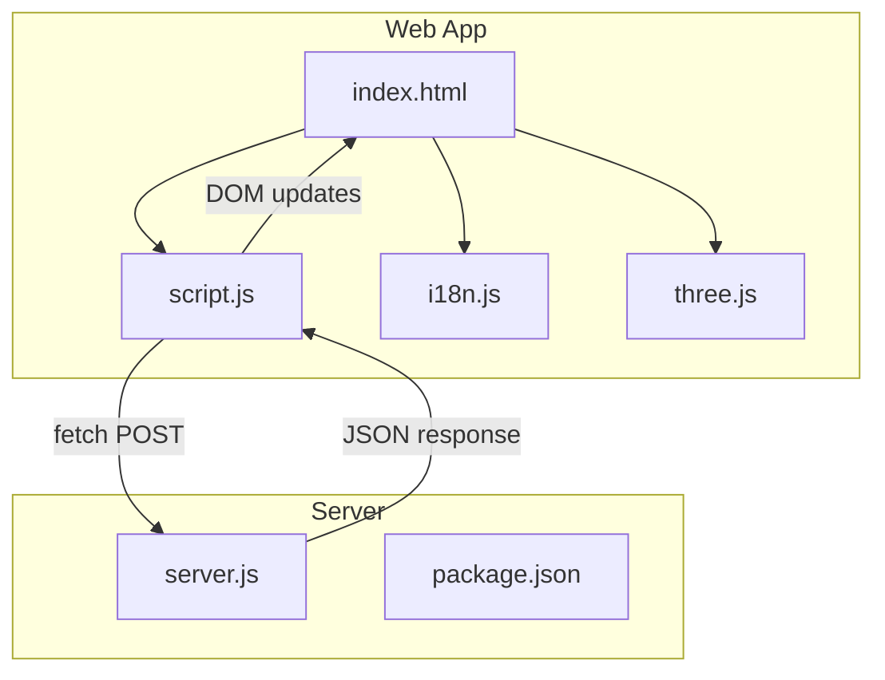
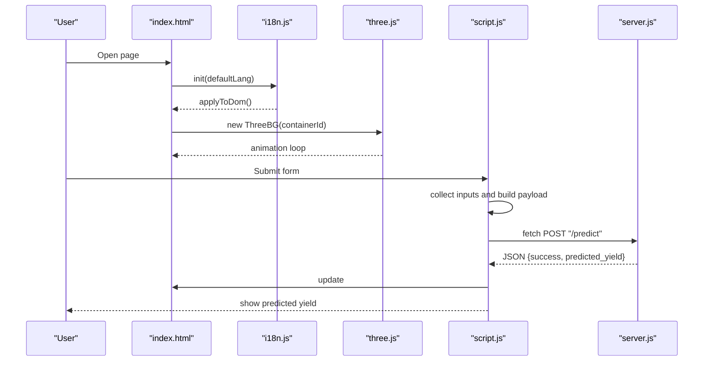
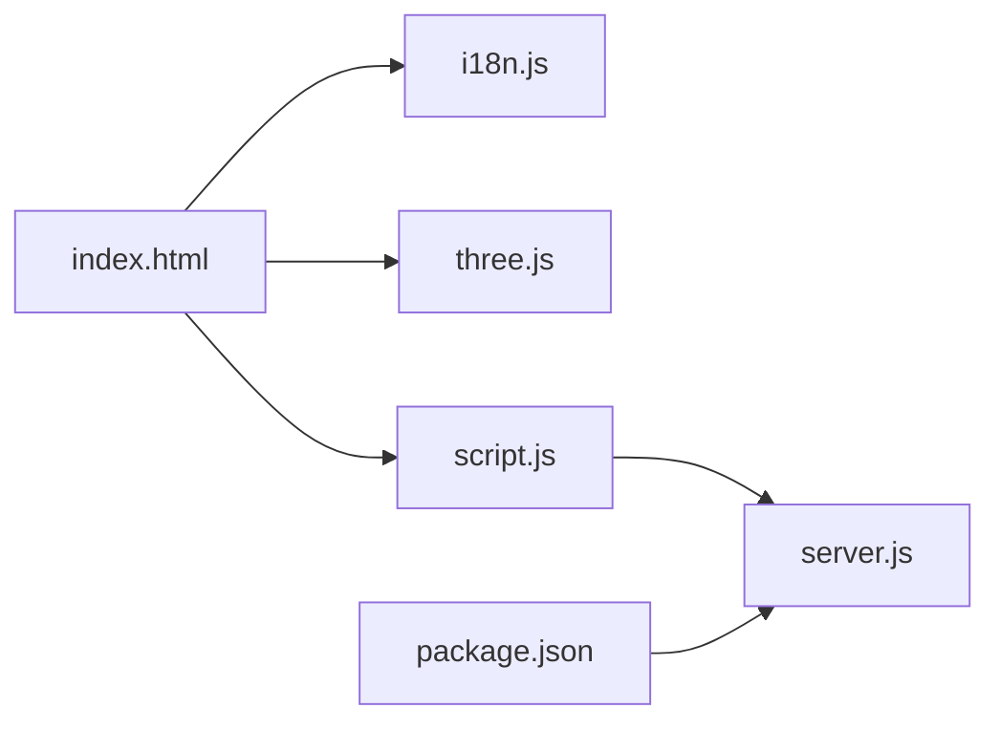

# Component Structure

<cite>
**Referenced Files in This Document**
- [index.html](file://simple webpage/index.html)
- [script.js](file://simple webpage/script.js)
- [i18n.js](file://simple webpage/i18n.js)
- [three.js](file://simple webpage/three.js)
- [server.js](file://simple webpage/server.js)
- [package.json](file://simple webpage/package.json)
</cite>

## Table of Contents
1. [Introduction](#introduction)
2. [Project Structure](#project-structure)
3. [Core Components](#core-components)
4. [Architecture Overview](#architecture-overview)
5. [Detailed Component Analysis](#detailed-component-analysis)
6. [Dependency Analysis](#dependency-analysis)
7. [Performance Considerations](#performance-considerations)
8. [Troubleshooting Guide](#troubleshooting-guide)
9. [Conclusion](#conclusion)

## Introduction
This document explains the frontend component structure and module organization for the two web applications. It focuses on how ES6 modules are used for internationalization, interactive UI, and background rendering, along with the separation of concerns between form handling, API communication, and UI updates. It also documents lifecycle and initialization sequences, event handling patterns, and module boundaries that support maintainability and scalability.

## Project Structure
Each application consists of:
- An HTML entry point that declares UI, data attributes for internationalization, and script loading.
- A client-side script that orchestrates form submission, API calls, and UI updates.
- An internationalization module that centralizes text and DOM updates.
- A background rendering module using Three.js for an animated scene.
- A Node.js server that serves static assets and exposes a prediction endpoint.

**Diagram sources**
- [index.html](file://simple webpage/index.html)
- [script.js](file://simple webpage/script.js)
- [i18n.js](file://simple webpage/i18n.js)
- [three.js](file://simple webpage/three.js)
- [server.js](file://simple webpage/server.js)
- [package.json](file://simple webpage/package.json)

**Section sources**
- [index.html](file://simple webpage/index.html)
- [script.js](file://simple webpage/script.js)
- [i18n.js](file://simple webpage/i18n.js)
- [three.js](file://simple webpage/three.js)
- [server.js](file://simple webpage/server.js)
- [package.json](file://simple webpage/package.json)

## Core Components
- Internationalization module (i18n.js): Provides translation keys, language switching, and DOM synchronization via data attributes.
- UI orchestration (script.js): Handles form submission, collects inputs, performs async fetch to the server, and updates the UI with results and status.
- Background renderer (three.js): Creates and animates a Three.js scene with particles and crop-like elements.
- HTML entry point (index.html): Declares the form, status/result areas, and loads modules via ES modules.
- Server (server.js): Serves static files and exposes a prediction endpoint that computes a yield estimate.

Key module boundaries:
- i18n.js is imported by index.html and initialized once; it manages DOM text/placeholder/value/html updates.
- script.js is dynamically imported after DOM readiness and handles user interactions and network requests.
- three.js is instantiated after load and listens to resize events.
- server.js runs independently and serves static assets and responds to prediction requests.

**Section sources**
- [i18n.js](file://simple webpage/i18n.js)
- [script.js](file://simple webpage/script.js)
- [three.js](file://simple webpage/three.js)
- [index.html](file://simple webpage/index.html)
- [server.js](file://simple webpage/server.js)

## Architecture Overview
The runtime flow connects user actions to server computation and UI updates:

**Diagram sources**
- [index.html](file://simple webpage/index.html)
- [i18n.js](file://simple webpage/i18n.js)
- [three.js](file://simple webpage/three.js)
- [script.js](file://simple webpage/script.js)
- [server.js](file://simple webpage/server.js)

## Detailed Component Analysis

### Internationalization Module (i18n.js)
Responsibilities:
- Centralized translation dictionary keyed by language and message keys.
- Dynamic DOM updates using data-i18n attributes for text, placeholder, value, and innerHTML.
- Language selection via a dropdown and persistence of the current language.
- Initialization routine that applies translations on DOM ready and wires change events.

Design principles:
- Exported functions encapsulate state (current language) and behavior (applyToDom, setLanguage, t).
- Uses attribute selectors to minimize imperative DOM manipulation in other modules.
- Supports variable substitution in translated strings.

Module boundaries:
- Consumed by index.html during initialization.
- Does not depend on script.js or three.js, keeping cross-cutting concerns separate.

**Section sources**
- [i18n.js](file://simple webpage/i18n.js)
- [index.html](file://simple webpage/index.html)

### UI Orchestration (script.js)
Responsibilities:
- Captures form submission, prevents default navigation, and coordinates loader visibility.
- Gathers inputs, constructs a payload, and performs an async fetch to the prediction endpoint.
- Parses the response, updates status and result areas, and handles errors gracefully.
- Ensures loader is hidden in all cases via finally.

Event handling:
- Listens to the form’s submit event.
- Uses async/await for readable request/response handling.

Separation of concerns:
- Form handling: input collection and payload construction.
- API communication: fetch call and response parsing.
- UI updates: status and result DOM updates.

Lifecycle:
- Runs after dynamic import from index.html.
- No explicit teardown; relies on browser lifecycle for resource cleanup.

**Section sources**
- [script.js](file://simple webpage/script.js)
- [index.html](file://simple webpage/index.html)

### Background Renderer (three.js)
Responsibilities:
- Initializes a Three.js scene, camera, and WebGL renderer.
- Creates particle systems and crop-like elements with simple animations.
- Animates scene elements in a continuous loop.
- Handles window resize to adjust aspect ratio and renderer size.

Module boundaries:
- Exports a class that encapsulates scene setup and animation.
- Does not depend on i18n.js or script.js; instantiated by index.html.

**Section sources**
- [three.js](file://simple webpage/three.js)
- [index.html](file://simple webpage/index.html)

### HTML Entry Point (index.html)
Responsibilities:
- Declares the form fields, status/result containers, and language selector.
- Loads i18n.js and three.js as ES modules.
- Dynamically imports script.js after initialization.

Patterns:
- Uses data-i18n attributes to delegate text management to i18n.js.
- Defer script loading until after DOM and i18n initialization.

**Section sources**
- [index.html](file://simple webpage/index.html)

### Server (server.js)
Responsibilities:
- Serves static files from the project root.
- Defines a POST /predict endpoint that computes a yield approximation from input nutrients and weather.
- Optionally persists predictions to MongoDB if available.

Integration:
- Consumed by script.js via fetch POST.
- Returns JSON with a success flag and predicted_yield.

**Section sources**
- [server.js](file://simple webpage/server.js)
- [script.js](file://simple webpage/script.js)

## Dependency Analysis
Module import/export patterns:
- index.html imports i18n.js and three.js synchronously and script.js dynamically.
- script.js depends on DOM elements declared in index.html and on server.js for predictions.
- i18n.js is self-contained and does not import other modules.
- three.js depends on Three.js from a CDN via ES modules.

External dependencies:
- Express and CORS for the server.
- Mongoose for optional persistence.
- Three.js via CDN for rendering.

**Diagram sources**
- [index.html](file://simple webpage/index.html)
- [i18n.js](file://simple webpage/i18n.js)
- [three.js](file://simple webpage/three.js)
- [script.js](file://simple webpage/script.js)
- [server.js](file://simple webpage/server.js)
- [package.json](file://simple webpage/package.json)

**Section sources**
- [index.html](file://simple webpage/index.html)
- [i18n.js](file://simple webpage/i18n.js)
- [three.js](file://simple webpage/three.js)
- [script.js](file://simple webpage/script.js)
- [server.js](file://simple webpage/server.js)
- [package.json](file://simple webpage/package.json)

## Performance Considerations
- Network requests: The prediction endpoint is lightweight; avoid unnecessary retries and ensure the loader hides after completion.
- Rendering: The Three.js scene is minimal; keep animation loops efficient and throttle resize handlers if needed.
- DOM updates: i18n.js batches DOM updates via attribute selectors; avoid frequent reflows by minimizing direct DOM writes outside this module.
- Static serving: Ensure the server serves compressed assets if scaling.

## Troubleshooting Guide
Common issues and remedies:
- Internationalization not applied:
  - Verify the language selector exists and the init call occurs after DOM ready.
  - Confirm data-i18n attributes match keys in the translation dictionary.
- Form submission not working:
  - Ensure the form and input names match the collector logic.
  - Check that the server is running and reachable at the configured endpoint.
- Three.js background not visible:
  - Confirm the container element exists and the class is instantiated after load.
  - Check browser console for errors related to the CDN import or missing container.
- Server errors:
  - Review server logs for CORS or database connection warnings.
  - Validate the request payload matches expected field names.

**Section sources**
- [i18n.js](file://simple webpage/i18n.js)
- [script.js](file://simple webpage/script.js)
- [three.js](file://simple webpage/three.js)
- [server.js](file://simple webpage/server.js)

## Conclusion
The applications demonstrate a clean separation of concerns:
- i18n.js centralizes text and DOM updates.
- script.js coordinates user interactions, API calls, and UI feedback.
- three.js encapsulates rendering and animation.
- index.html defines the UI and loads modules with ES6 patterns.
- server.js provides a simple prediction service and optional persistence.

This modular structure supports maintainability and scalability by keeping responsibilities localized, using clear module boundaries, and leveraging async/await for readable asynchronous flows.