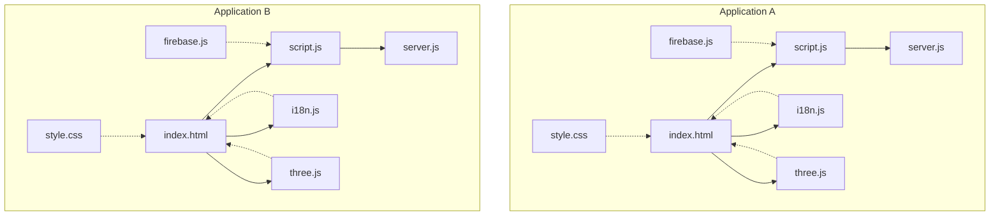
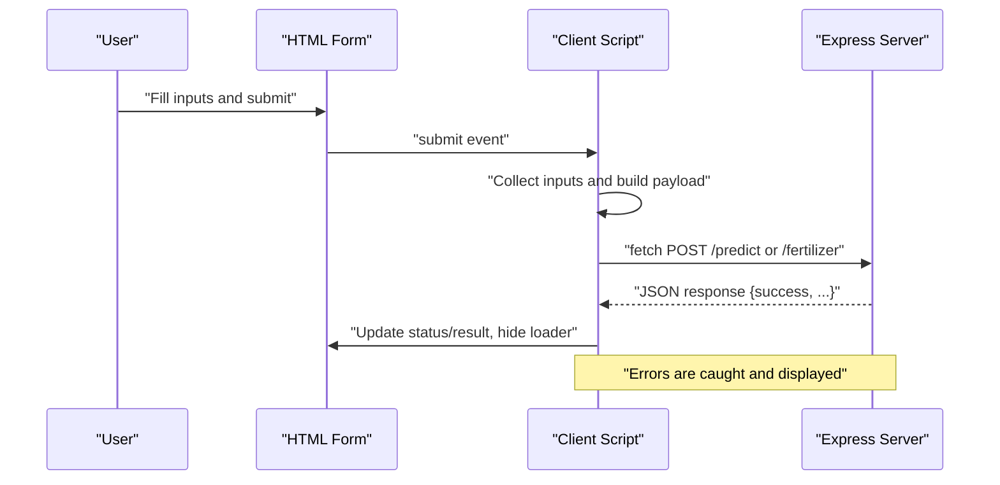
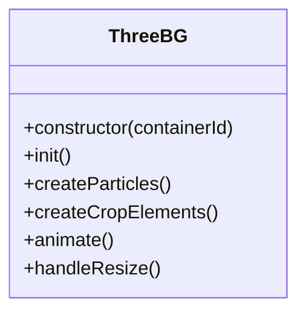
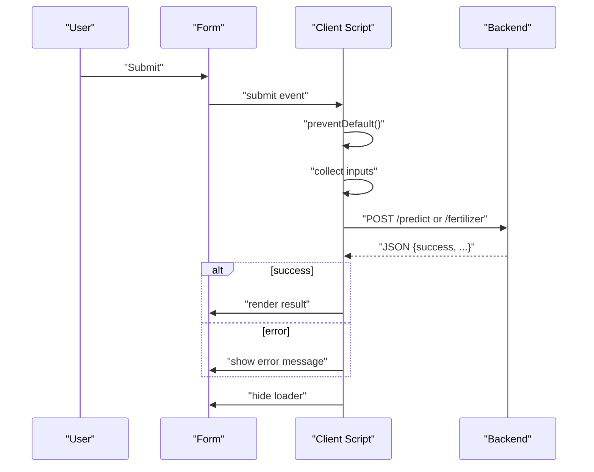
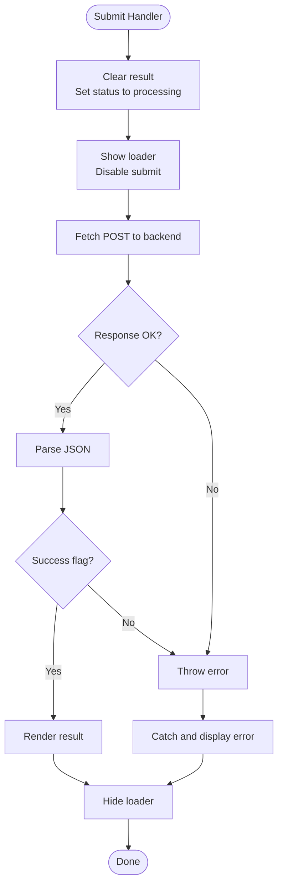
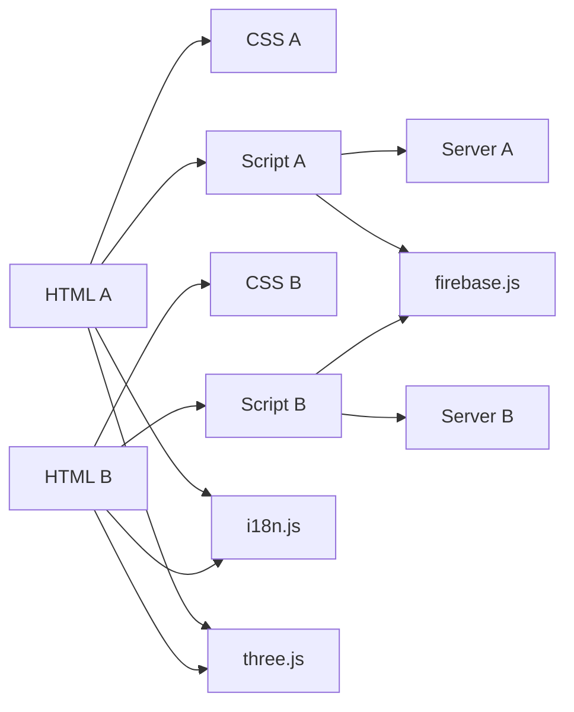

# Frontend Architecture

<cite>
**Referenced Files in This Document**
- [index.html](file://simple webpage/index.html)
- [script.js](file://simple webpage/script.js)
- [style.css](file://simple webpage/style.css)
- [i18n.js](file://simple webpage/i18n.js)
- [firebase.js](file://simple webpage/firebase.js)
- [server.js](file://simple webpage/server.js)
- [three.js](file://simple webpage/three.js)
- [package.json](file://simple webpage/package.json)
- [index.html](file://simple webpage reverse/index.html)
- [script.js](file://simple webpage reverse/script.js)
- [style.css](file://simple webpage reverse/style.css)
- [i18n.js](file://simple webpage reverse/i18n.js)
- [firebase.js](file://simple webpage reverse/firebase.js)
- [server.js](file://simple webpage reverse/server.js)
- [three.js](file://simple webpage reverse/three.js)
- [package.json](file://simple webpage reverse/package.json)
</cite>

## Table of Contents
1. [Introduction](#introduction)
2. [Project Structure](#project-structure)
3. [Core Components](#core-components)
4. [Architecture Overview](#architecture-overview)
5. [Detailed Component Analysis](#detailed-component-analysis)
6. [Dependency Analysis](#dependency-analysis)
7. [Performance Considerations](#performance-considerations)
8. [Troubleshooting Guide](#troubleshooting-guide)
9. [Conclusion](#conclusion)

## Introduction
This document describes the frontend architecture and component structure for two related single-page applications embedded in the repository. Both applications share a cohesive design system and modular ES6 JavaScript organization, with async/await patterns for network requests, event-driven UI updates, and a consistent internationalization strategy. They also implement a shared 3D animated background via Three.js, responsive styling, and a loader pattern for asynchronous operations. The document explains how forms are structured, how state is handled locally in the DOM, how animations and transitions are implemented, and how the apps integrate with backend services.

## Project Structure
Each application consists of:
- A static HTML entry point that defines the UI layout and includes the stylesheet and scripts.
- A client-side script that orchestrates form submission, async communication with the backend, and UI updates.
- A stylesheet that defines responsive layouts, animations, and component-level styles.
- An internationalization module that manages localized text and placeholders.
- A Three.js module that creates an animated 3D background.
- Optional Firebase integration for real-time database usage.
- A Node.js Express server that serves static assets and exposes prediction APIs.

**Diagram sources**
- [index.html](file://simple webpage/index.html)
- [script.js](file://simple webpage/script.js)
- [style.css](file://simple webpage/style.css)
- [i18n.js](file://simple webpage/i18n.js)
- [three.js](file://simple webpage/three.js)
- [firebase.js](file://simple webpage/firebase.js)
- [server.js](file://simple webpage/server.js)
- [index.html](file://simple webpage reverse/index.html)
- [script.js](file://simple webpage reverse/script.js)
- [style.css](file://simple webpage reverse/style.css)
- [i18n.js](file://simple webpage reverse/i18n.js)
- [three.js](file://simple webpage reverse/three.js)
- [firebase.js](file://simple webpage reverse/firebase.js)
- [server.js](file://simple webpage reverse/server.js)

**Section sources**
- [index.html](file://simple webpage/index.html)
- [script.js](file://simple webpage/script.js)
- [style.css](file://simple webpage/style.css)
- [i18n.js](file://simple webpage/i18n.js)
- [three.js](file://simple webpage/three.js)
- [firebase.js](file://simple webpage/firebase.js)
- [server.js](file://simple webpage/server.js)
- [index.html](file://simple webpage reverse/index.html)
- [script.js](file://simple webpage reverse/script.js)
- [style.css](file://simple webpage reverse/style.css)
- [i18n.js](file://simple webpage reverse/i18n.js)
- [three.js](file://simple webpage reverse/three.js)
- [firebase.js](file://simple webpage reverse/firebase.js)
- [server.js](file://simple webpage reverse/server.js)

## Core Components
- HTML entry points define the UI shell, including the form, status area, loader, and links to the other app. They load the i18n initializer and Three.js background, then dynamically import the application script.
- Client scripts manage form submission, collect inputs, build payloads, and perform async fetch calls to backend endpoints. They update the DOM with status messages and results, and toggle a loader during requests.
- Stylesheets implement a layered overlay design with a backdrop filter and blur effect, responsive containers, and consistent button and input styling. Animations include a spinning loader and interactive hover effects.
- Internationalization modules provide translation lookup and DOM application for labels, placeholders, and values, driven by a language selector.
- Three.js modules encapsulate scene initialization, lighting, particle systems, and animation loops, with resize handling.
- Optional Firebase modules initialize the SDK and expose a database handle for potential future integrations.
- Servers serve static assets and expose endpoints for predictions and fertilizer recommendations.

Key implementation patterns:
- Modular ES6 with dynamic imports and named exports.
- Async/await for network operations and centralized error handling.
- Event-driven UI updates via DOM manipulation.
- Shared styling conventions and responsive breakpoints.
- Loader toggling to manage user feedback during async operations.

**Section sources**
- [index.html](file://simple webpage/index.html)
- [script.js](file://simple webpage/script.js)
- [style.css](file://simple webpage/style.css)
- [i18n.js](file://simple webpage/i18n.js)
- [three.js](file://simple webpage/three.js)
- [firebase.js](file://simple webpage/firebase.js)
- [server.js](file://simple webpage/server.js)
- [index.html](file://simple webpage reverse/index.html)
- [script.js](file://simple webpage reverse/script.js)
- [style.css](file://simple webpage reverse/style.css)
- [i18n.js](file://simple webpage reverse/i18n.js)
- [three.js](file://simple webpage reverse/three.js)
- [firebase.js](file://simple webpage reverse/firebase.js)
- [server.js](file://simple webpage reverse/server.js)

## Architecture Overview
The applications follow a unidirectional data flow:
- User interacts with the form.
- The client script prevents default submission, collects inputs, and dispatches an async request to the backend.
- On success, the client renders the result; on failure, it displays an error message.
- The Three.js background runs independently and responds to window resize events.

**Diagram sources**
- [script.js](file://simple webpage/script.js)
- [server.js](file://simple webpage/server.js)
- [script.js](file://simple webpage reverse/script.js)
- [server.js](file://simple webpage reverse/server.js)

## Detailed Component Analysis

### HTML Entry Points and Layout
- Both applications define a container with a content overlay and a form. They include a status area and a loader element. Links connect the two apps.
- The HTML loads the stylesheet and initializes i18n and Three.js via a module script tag. It dynamically imports the application script to keep the main thread unblocked.

Responsibilities:
- Provide semantic markup for labels and inputs.
- Host the form and result areas.
- Load and initialize internationalization and background animation.

Accessibility considerations:
- Labels wrap inputs for improved screen reader support.
- ARIA attributes are present on the language selector.
- Focus order follows the visual layout.

**Section sources**
- [index.html](file://simple webpage/index.html)
- [index.html](file://simple webpage reverse/index.html)

### Client Script: Event Handling and Async Patterns
- Submits are intercepted to prevent navigation.
- Payloads are constructed from form inputs.
- Async fetch calls are awaited; errors are caught and surfaced to the user.
- A loader toggler disables the submit button and shows a spinner during requests.

State handling:
- Local DOM state for result display and status text.
- No external state library; updates are imperative and scoped to the form’s elements.

Validation:
- HTML5 required attributes enforce presence.
- Numeric inputs use number types and step attributes.
- Additional client-side validation is not implemented; backend responses drive user feedback.

User interaction patterns:
- Hover effects on buttons and links.
- Immediate visual feedback via loader and status text.

**Section sources**
- [script.js](file://simple webpage/script.js)
- [script.js](file://simple webpage reverse/script.js)

### CSS Architecture and Responsive Design
- Typography uses a consistent font stack.
- Container sizing and shadows provide depth; overlay uses backdrop blur and semi-transparent backgrounds for readability.
- Buttons and inputs are styled consistently across both apps with rounded corners, padding, and hover scaling.
- Loader animation is implemented with a CSS keyframes spin.
- Language selector is compact and aligned with the header.

Responsive patterns:
- Flexible widths and padding adapt to viewport.
- Centered containers with max-width constraints.
- Backdrop and background image fallbacks coexist with the 3D canvas.

Styling conventions:
- Consistent color palette and gradient accents.
- Hover states unify interactive elements.
- Minimal use of absolute positioning; most layout is fluid.

**Section sources**
- [style.css](file://simple webpage/style.css)
- [style.css](file://simple webpage reverse/style.css)

### Internationalization Module
- Provides translation keys for both apps.
- Applies text content, placeholders, values, and inner HTML based on data-i18n attributes.
- Initializes language selection and binds change events to switch languages.

Integration:
- Called once per app during module initialization.
- Keeps UI text synchronized with the selected locale.

**Section sources**
- [i18n.js](file://simple webpage/i18n.js)
- [i18n.js](file://simple webpage reverse/i18n.js)
- [index.html](file://simple webpage/index.html)
- [index.html](file://simple webpage reverse/index.html)

### Three.js Background Animation
- Initializes a WebGL scene with camera and lights.
- Creates particle systems and animated crop/molecule elements.
- Animates rotation and floating motions; renders continuously.
- Handles window resize to adjust aspect ratio and renderer size.

Application-specific variations:
- Application A: Particles and crop-like elements.
- Application B: NPK-colored particles and floating molecules.

**Section sources**
- [three.js](file://simple webpage/three.js)
- [three.js](file://simple webpage reverse/three.js)
- [index.html](file://simple webpage/index.html)
- [index.html](file://simple webpage reverse/index.html)

### Firebase Integration
- Initializes Firebase SDK and exposes a database handle.
- Present in both apps but not actively used in the current client scripts.

**Section sources**
- [firebase.js](file://simple webpage/firebase.js)
- [firebase.js](file://simple webpage reverse/firebase.js)

### Backend Integration
- Application A posts to /predict with N, P, K, and fixed weather values; expects predicted_yield.
- Application B posts to /fertilizer with Crop_Type, Soil_Type, and Crop_Yield; expects recommended_NPK.
- Servers serve static assets and log endpoint hits.

**Section sources**
- [script.js](file://simple webpage/script.js)
- [server.js](file://simple webpage/server.js)
- [script.js](file://simple webpage reverse/script.js)
- [server.js](file://simple webpage reverse/server.js)

### Class Diagram: Three.js Background Components

**Diagram sources**
- [three.js](file://simple webpage/three.js)

### Sequence Diagram: Form Submission Flow

**Diagram sources**
- [script.js](file://simple webpage/script.js)
- [script.js](file://simple webpage reverse/script.js)
- [server.js](file://simple webpage/server.js)
- [server.js](file://simple webpage reverse/server.js)

### Flowchart: Loader Control Logic

**Diagram sources**
- [script.js](file://simple webpage/script.js)
- [script.js](file://simple webpage reverse/script.js)

## Dependency Analysis
- HTML depends on CSS and script modules.
- Client scripts depend on the backend endpoints and DOM elements.
- i18n module depends on translation keys and DOM attributes.
- Three.js module depends on the Three.js library and DOM container.
- Package configurations enable ES modules and Node server startup.

**Diagram sources**
- [index.html](file://simple webpage/index.html)
- [script.js](file://simple webpage/script.js)
- [style.css](file://simple webpage/style.css)
- [i18n.js](file://simple webpage/i18n.js)
- [three.js](file://simple webpage/three.js)
- [firebase.js](file://simple webpage/firebase.js)
- [server.js](file://simple webpage/server.js)
- [index.html](file://simple webpage reverse/index.html)
- [script.js](file://simple webpage reverse/script.js)
- [style.css](file://simple webpage reverse/style.css)
- [i18n.js](file://simple webpage reverse/i18n.js)
- [three.js](file://simple webpage reverse/three.js)
- [firebase.js](file://simple webpage reverse/firebase.js)
- [server.js](file://simple webpage reverse/server.js)

**Section sources**
- [package.json](file://simple webpage/package.json)
- [package.json](file://simple webpage reverse/package.json)

## Performance Considerations
- Asynchronous rendering: The loader prevents repeated submissions and reduces perceived latency.
- Lightweight DOM updates: Results are inserted as innerHTML; consider templating for larger datasets.
- Animation efficiency: Three.js uses buffer geometries and requestAnimationFrame; keep particle counts reasonable.
- Static asset serving: Express serves static files directly, minimizing overhead.
- Network efficiency: JSON payloads are small; avoid unnecessary headers or body transformations.
- Memory management: Avoid accumulating DOM nodes or listeners; clean up event listeners if the page is reloaded via SPA patterns.

[No sources needed since this section provides general guidance]

## Troubleshooting Guide
Common issues and remedies:
- Backend connectivity failures: The client catches and logs errors; ensure servers are running on the expected ports and CORS is enabled.
- Missing DOM elements: The Three.js class warns if the container is absent; verify the container ID matches the HTML.
- Translation not applied: Confirm the i18n init is called and the language selector is bound to change events.
- Loader stuck: Ensure the loader is hidden in both success and error branches.
- Animation not resizing: Confirm the resize handler is attached after initialization.

**Section sources**
- [script.js](file://simple webpage/script.js)
- [script.js](file://simple webpage reverse/script.js)
- [i18n.js](file://simple webpage/i18n.js)
- [three.js](file://simple webpage/three.js)

## Conclusion
The frontend architecture demonstrates a clean separation of concerns: HTML provides structure, CSS delivers responsive styling and animations, i18n manages localization, and client scripts orchestrate async interactions with backend services. The Three.js background adds immersive visuals without interfering with usability. While the current implementation relies on imperative DOM updates and minimal client-side state, the modular structure supports incremental enhancements such as reusable components, state libraries, and advanced validation strategies.

[No sources needed since this section summarizes without analyzing specific files]