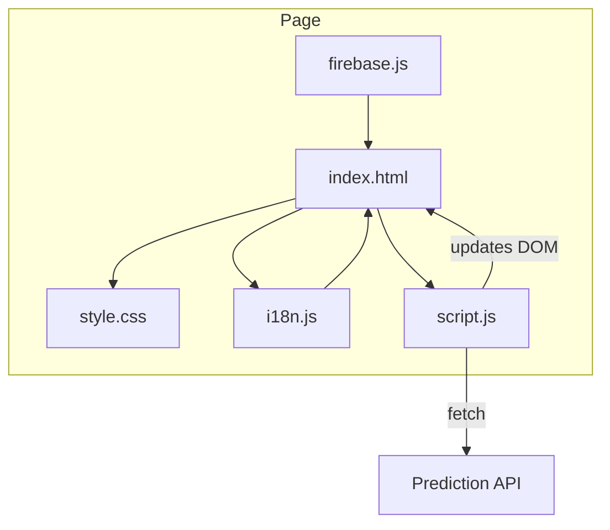
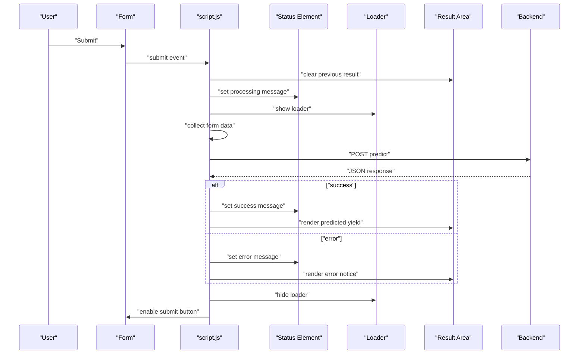
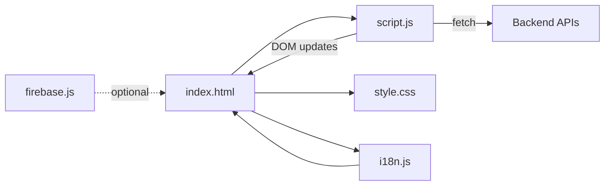

# State Management

<cite>
**Referenced Files in This Document**
- [index.html](file://simple webpage/index.html)
- [script.js](file://simple webpage/script.js)
- [style.css](file://simple webpage/style.css)
- [i18n.js](file://simple webpage/i18n.js)
- [firebase.js](file://simple webpage/firebase.js)
</cite>

## Table of Contents
1. [Introduction](#introduction)
2. [Project Structure](#project-structure)
3. [Core Components](#core-components)
4. [Architecture Overview](#architecture-overview)
5. [Detailed Component Analysis](#detailed-component-analysis)
6. [Dependency Analysis](#dependency-analysis)
7. [Performance Considerations](#performance-considerations)
8. [Troubleshooting Guide](#troubleshooting-guide)
9. [Conclusion](#conclusion)

## Introduction
This document explains client-side state management and user interaction handling for the YieldSmart web application. It focuses on how form state is collected, validated, and coordinated with loading and status indicators; how UI updates occur via DOM manipulation; and how errors and success states are presented. It also covers memory management, event listener cleanup, and performance optimization techniques for state-heavy applications.

## Project Structure
The application consists of a single-page interface with a prediction form, status and result areas, and a loader. JavaScript handles form submission, fetch requests, and UI updates. Internationalization is handled by a dedicated module, and a background scene is managed separately. Firebase is imported for potential future use.

**Diagram sources**
- [index.html](file://simple webpage/index.html)
- [script.js](file://simple webpage/script.js)
- [style.css](file://simple webpage/style.css)
- [i18n.js](file://simple webpage/i18n.js)
- [firebase.js](file://simple webpage/firebase.js)

**Section sources**
- [index.html](file://simple webpage/index.html)
- [script.js](file://simple webpage/script.js)
- [style.css](file://simple webpage/style.css)
- [i18n.js](file://simple webpage/i18n.js)
- [firebase.js](file://simple webpage/firebase.js)

## Core Components
- Form element and inputs: The prediction form collects crop type, soil type, and macronutrients (N, P, K), along with a city for location. Inputs are marked required to support basic client-side validation.
- Status area: A dedicated element displays transient messages (processing, errors).
- Result area: A container for displaying predictions or recommendations.
- Loader: A spinner element synchronized with submission state.
- Submit button: Disabled during network activity to prevent duplicate submissions.
- Event handling: A submit handler coordinates state transitions and UI updates.

Key state elements:
- Submission state: Tracks whether a request is in progress.
- Validation state: Basic presence checks via required attributes.
- Response state: Success or error outcomes parsed from the API.
- UI visibility state: Loader visibility and button enabled/disabled toggles.

**Section sources**
- [index.html](file://simple webpage/index.html)
- [script.js](file://simple webpage/script.js)
- [style.css](file://simple webpage/style.css)

## Architecture Overview
The client orchestrates a predictable flow: on submit, it clears previous results, sets a processing status, shows the loader, disables the submit button, collects form data, posts to the backend, and renders either success or error results. Finally, it hides the loader and re-enables the button.

**Diagram sources**
- [script.js](file://simple webpage/script.js)
- [index.html](file://simple webpage/index.html)

## Detailed Component Analysis

### Form State Collection and Validation
- Data collection: The handler gathers values from named inputs and constructs a payload. Numeric fields are converted to numbers for downstream processing.
- Validation: Required attributes on inputs provide baseline validation. Additional numeric parsing ensures number fields are valid.
- Real-time feedback: There is no explicit real-time validation in the current implementation; feedback is provided after submission.

State transitions:
- Before submit: idle state with initial status text.
- During submit: processing state with loader visible and button disabled.
- After response: success or error state with appropriate UI updates.

Conditional rendering:
- Success: The result area displays a formatted predicted yield.
- Error: The result area displays an error message; the status area also reflects an error state.

**Section sources**
- [script.js](file://simple webpage/script.js)
- [index.html](file://simple webpage/index.html)

### Status Indicator System and Error Handling
- Status element: Updated with contextual messages (“Processing…” and “Error”) to inform the user of current state.
- Error handling: Try/catch captures network or response errors, logs to console, and displays a user-friendly message.
- Success state: On successful response, the status area reflects success and the result area shows the computed value.

UI coordination:
- The loader and submit button are controlled by a shared helper that toggles visibility and enables/disables the button.
- The result area is cleared before each new request to avoid stale content.

**Section sources**
- [script.js](file://simple webpage/script.js)
- [index.html](file://simple webpage/index.html)
- [style.css](file://simple webpage/style.css)

### DOM Manipulation Patterns
- Visibility control: The loader’s display property is toggled to show/hide the spinner.
- Interaction locking: The submit button is disabled while a request is in progress to prevent concurrent submissions.
- Content updates: InnerHTML is used to render dynamic content in the result area; textContent is used for status messages.
- Styling: CSS manages visual states (e.g., loader animation), while JavaScript controls visibility and interactivity.

Animation and visual feedback:
- The loader uses a CSS keyframe animation for smooth rotation.
- Buttons include hover effects for enhanced feedback.

**Section sources**
- [script.js](file://simple webpage/script.js)
- [style.css](file://simple webpage/style.css)

### Relationship Between Form Inputs, API Responses, and UI Updates
- Inputs drive payload construction; numeric conversion ensures downstream compatibility.
- API responses determine UI branch: success updates the result area with a formatted value; errors update the status and result areas with error messages.
- The loader and button states are coordinated to reflect request lifecycle.

**Section sources**
- [script.js](file://simple webpage/script.js)
- [index.html](file://simple webpage/index.html)

### Memory Management, Event Listener Cleanup, and Performance
- Event listeners: The submit handler is attached once on load. No explicit removal is performed; however, since the page is single-page and the handler is scoped to the form, the risk is minimal. For long-lived apps, detach listeners on unmount or route changes.
- DOM updates: Repeated innerHTML updates are straightforward; for very frequent updates, consider batching or virtual DOM techniques if scaling up.
- Fetch lifecycle: The loader and button state are consistently toggled in finally blocks to ensure cleanup even on errors.
- Internationalization: The i18n module applies translations on initialization and language change; it does not introduce memory leaks.

Recommendations:
- Use IntersectionObserver or requestAnimationFrame for heavy UI updates.
- Debounce rapid input changes if adding real-time validation later.
- Consider WeakRef or manual cleanup for dynamically created nodes.

**Section sources**
- [script.js](file://simple webpage/script.js)
- [i18n.js](file://simple webpage/i18n.js)

## Dependency Analysis
The client-side flow depends on:
- index.html for DOM structure and element IDs.
- script.js for event handling, state transitions, and UI updates.
- style.css for loader animation and visual feedback.
- i18n.js for localized text updates.
- firebase.js for potential future integration.

**Diagram sources**
- [index.html](file://simple webpage/index.html)
- [script.js](file://simple webpage/script.js)
- [style.css](file://simple webpage/style.css)
- [i18n.js](file://simple webpage/i18n.js)
- [firebase.js](file://simple webpage/firebase.js)

**Section sources**
- [index.html](file://simple webpage/index.html)
- [script.js](file://simple webpage/script.js)
- [style.css](file://simple webpage/style.css)
- [i18n.js](file://simple webpage/i18n.js)
- [firebase.js](file://simple webpage/firebase.js)

## Performance Considerations
- Minimize DOM reads/writes: Batch updates by setting innerHTML once per outcome.
- Avoid layout thrashing: Group style changes and DOM mutations together.
- Network efficiency: Ensure payloads are minimal and only include necessary fields.
- Rendering cost: For large lists or frequent updates, consider virtualization or memoization.
- Event throttling: If adding live input validation, throttle handlers to reduce CPU usage.

## Troubleshooting Guide
Common issues and resolutions:
- Loader remains visible: Verify the finally block executes and the loader helper is called to hide the spinner.
- Button stays disabled: Confirm the submit button is re-enabled in the finally block.
- Empty or incorrect results: Check that the response contains the expected fields and that numeric conversions succeed.
- CORS or network errors: Inspect browser dev tools for network failures and ensure the backend endpoint is reachable.
- Internationalization not applied: Ensure the i18n init function runs and language selector triggers translation updates.

**Section sources**
- [script.js](file://simple webpage/script.js)
- [i18n.js](file://simple webpage/i18n.js)

## Conclusion
The client-side state model centers on a simple, predictable flow: collect inputs, show a loader, disable interactions, post to the backend, and render outcomes. The design cleanly separates concerns across DOM, styles, and scripts, with i18n supporting multilingual content. For larger applications, consider formalizing state machines, adding real-time validation, and implementing robust cleanup and performance safeguards.