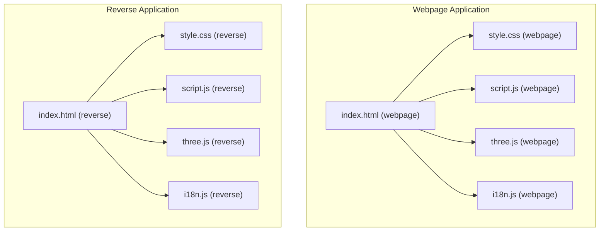
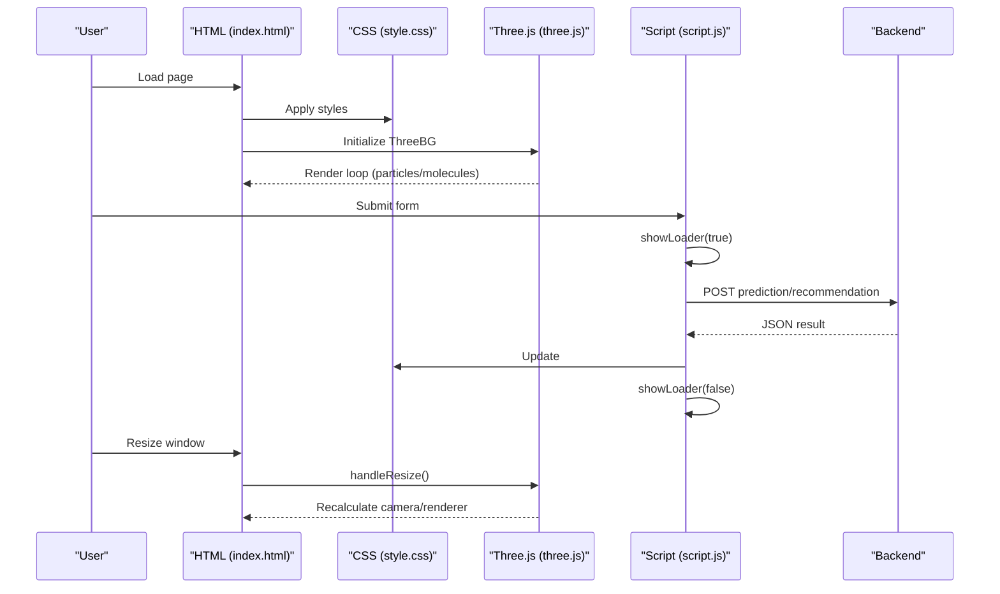
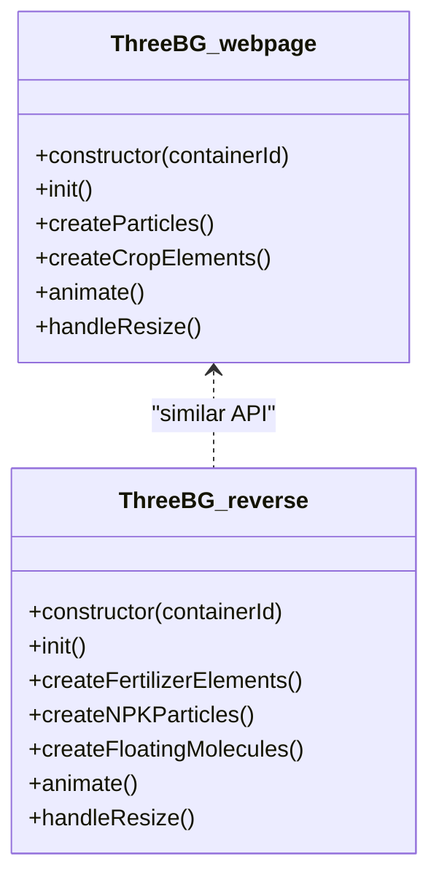
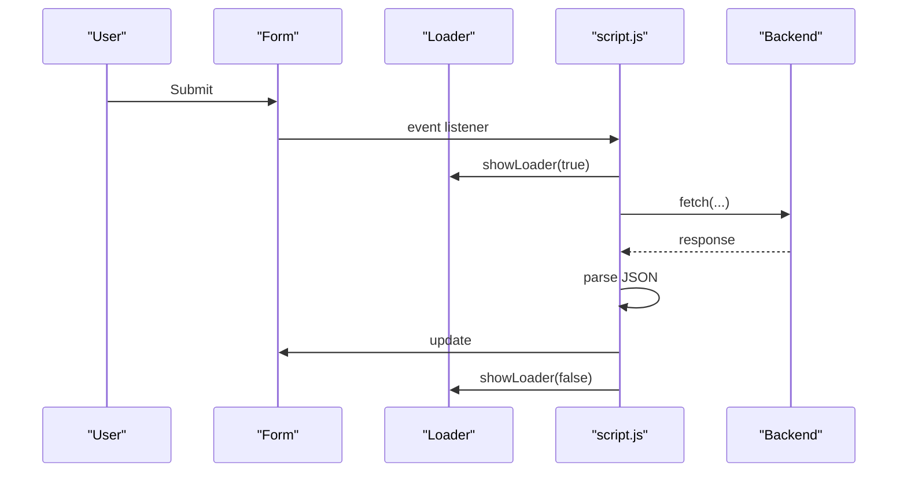
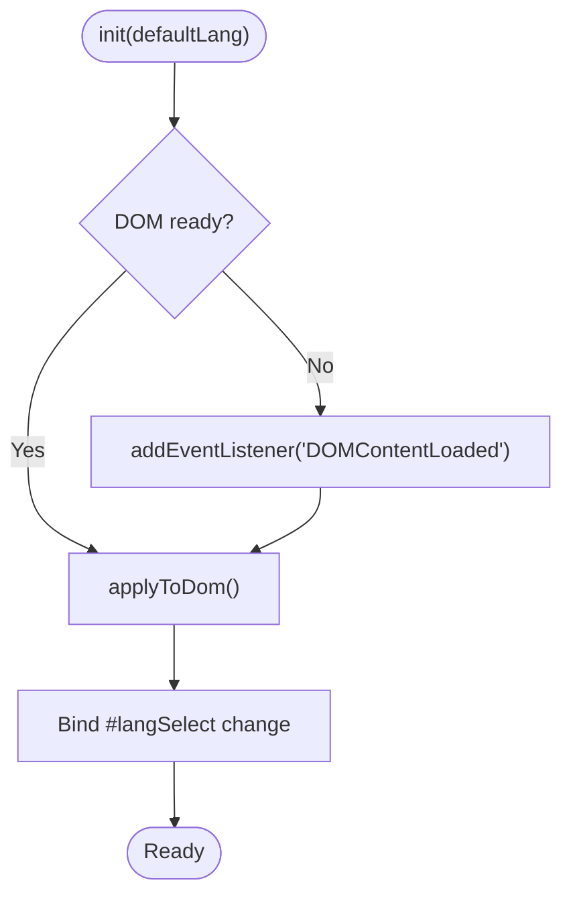
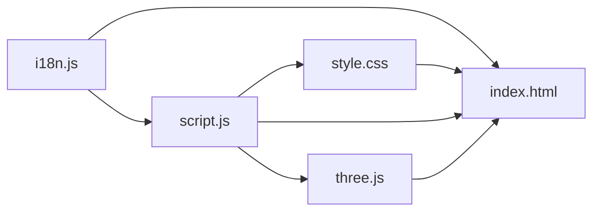

# Styling Architecture

<cite>
**Referenced Files in This Document**
- [style.css (webpage)](file://simple webpage/style.css)
- [style.css (reverse)](file://simple webpage reverse/style.css)
- [index.html (webpage)](file://simple webpage/index.html)
- [index.html (reverse)](file://simple webpage reverse/index.html)
- [script.js (webpage)](file://simple webpage/script.js)
- [script.js (reverse)](file://simple webpage reverse/script.js)
- [three.js (webpage)](file://simple webpage/three.js)
- [three.js (reverse)](file://simple webpage reverse/three.js)
- [i18n.js (webpage)](file://simple webpage/i18n.js)
- [i18n.js (reverse)](file://simple webpage reverse/i18n.js)
- [package.json (webpage)](file://simple webpage/package.json)
- [package.json (reverse)](file://simple webpage reverse/package.json)
</cite>

## Table of Contents
1. [Introduction](#introduction)
2. [Project Structure](#project-structure)
3. [Core Components](#core-components)
4. [Architecture Overview](#architecture-overview)
5. [Detailed Component Analysis](#detailed-component-analysis)
6. [Dependency Analysis](#dependency-analysis)
7. [Performance Considerations](#performance-considerations)
8. [Troubleshooting Guide](#troubleshooting-guide)
9. [Conclusion](#conclusion)

## Introduction
This document describes the CSS architecture and styling patterns shared across two related web applications. It explains how static styles integrate with dynamic Three.js background rendering, how forms and interactive components are styled, and how responsive design and accessibility are approached. It also covers animation timing, performance optimization strategies, and cross-browser compatibility considerations grounded in the repository’s implementation.

## Project Structure
Each application consists of:
- An HTML entry point that loads a stylesheet and initializes scripts
- A single CSS file defining layout, typography, components, and animations
- A JavaScript module that orchestrates form submission, UI updates, and Three.js integration
- A Three.js module that renders a WebGL background scene
- An internationalization module for localized text

**Diagram sources**
- [index.html (webpage)](file://simple webpage/index.html)
- [style.css (webpage)](file://simple webpage/style.css)
- [script.js (webpage)](file://simple webpage/script.js)
- [three.js (webpage)](file://simple webpage/three.js)
- [i18n.js (webpage)](file://simple webpage/i18n.js)
- [index.html (reverse)](file://simple webpage reverse/index.html)
- [style.css (reverse)](file://simple webpage reverse/style.css)
- [script.js (reverse)](file://simple webpage reverse/script.js)
- [three.js (reverse)](file://simple webpage reverse/three.js)
- [i18n.js (reverse)](file://simple webpage reverse/i18n.js)

**Section sources**
- [index.html (webpage)](file://simple webpage/index.html)
- [index.html (reverse)](file://simple webpage reverse/index.html)
- [style.css (webpage)](file://simple webpage/style.css)
- [style.css (reverse)](file://simple webpage reverse/style.css)
- [script.js (webpage)](file://simple webpage/script.js)
- [script.js (reverse)](file://simple webpage reverse/script.js)
- [three.js (webpage)](file://simple webpage/three.js)
- [three.js (reverse)](file://simple webpage reverse/three.js)
- [i18n.js (webpage)](file://simple webpage/i18n.js)
- [i18n.js (reverse)](file://simple webpage reverse/i18n.js)

## Core Components
- Static styles define:
  - Global typography and fonts
  - Layout containers and overlays
  - Form controls and interactive elements
  - Status/result areas and loading indicators
  - Animations and transitions
- Dynamic 3D background:
  - A full-screen Three.js canvas rendered behind content
  - Responsive resize handling
  - Particle systems and subtle animations
- Script orchestration:
  - Form submission handlers
  - Loader toggling and UI feedback
  - Cross-origin backend communication
- Internationalization:
  - Localized strings applied via DOM attributes

Key styling conventions observed:
- Fixed-position background layers with z-index stacking to ensure proper layering under content
- Backdrop blur and semi-transparent backgrounds for readability over animated scenes
- Consistent button and input styles with hover and focus affordances
- Shared loader animation using CSS keyframes
- Flexbox-based header layout for language selector alignment

**Section sources**
- [style.css (webpage)](file://simple webpage/style.css)
- [style.css (reverse)](file://simple webpage reverse/style.css)
- [three.js (webpage)](file://simple webpage/three.js)
- [three.js (reverse)](file://simple webpage reverse/three.js)
- [script.js (webpage)](file://simple webpage/script.js)
- [script.js (reverse)](file://simple webpage reverse/script.js)
- [i18n.js (webpage)](file://simple webpage/i18n.js)
- [i18n.js (reverse)](file://simple webpage reverse/i18n.js)

## Architecture Overview
The runtime styling architecture integrates static CSS with a dynamic WebGL background and modular JavaScript:

**Diagram sources**
- [index.html (webpage)](file://simple webpage/index.html)
- [index.html (reverse)](file://simple webpage reverse/index.html)
- [style.css (webpage)](file://simple webpage/style.css)
- [style.css (reverse)](file://simple webpage reverse/style.css)
- [three.js (webpage)](file://simple webpage/three.js)
- [three.js (reverse)](file://simple webpage reverse/three.js)
- [script.js (webpage)](file://simple webpage/script.js)
- [script.js (reverse)](file://simple webpage reverse/script.js)

## Detailed Component Analysis

### Static Styles Layer
- Typography and fonts:
  - Uses a consistent font stack across both apps for headings and form controls.
- Containers and overlay:
  - A main container with rounded corners and shadow sits above a content overlay with backdrop blur and increased opacity for readability.
- Forms and inputs:
  - Labels and inputs are styled consistently; selects are constrained to a compact width for the language selector.
- Buttons and links:
  - Buttons and anchor-based buttons share gradient backgrounds and hover scaling effects.
- Status and results:
  - Status messages and result boxes use consistent spacing, colors, and typography.
- Loader:
  - A CSS-only spinner animation keyed by a named animation.

Responsive and layout patterns:
- Mobile-first viewport meta tag ensures device-width scaling.
- Flexbox is used in both apps to align the title and language selector.
- Container widths and paddings adapt to small screens while maintaining readability.

Accessibility and cross-browser notes:
- Focusable interactive elements are styled for hover and active states.
- No explicit ARIA roles are defined in the HTML; consider adding roles for complex widgets if needed.
- CSS transitions and transforms are widely used; ensure vendor prefixes are not required for modern browsers given the module script usage.

**Section sources**
- [style.css (webpage)](file://simple webpage/style.css)
- [style.css (reverse)](file://simple webpage reverse/style.css)
- [index.html (webpage)](file://simple webpage/index.html)
- [index.html (reverse)](file://simple webpage reverse/index.html)

### Three.js Background Integration
- Layering:
  - A full-screen Three.js canvas is placed behind the content using negative z-index and pointer-events disabled to avoid blocking interactions.
  - A fallback background image is layered beneath the canvas and reduced in opacity when the 3D scene is active.
- Scene composition:
  - Ambient and directional lighting provide depth to animated geometry.
  - Particles and simple geometric shapes represent thematic content (crops or N/P/K).
- Animation loop:
  - Rotation and gentle vertical oscillation create a calming, non-distracting effect.
- Resize handling:
  - Camera aspect ratio and renderer size update on window resize events.

**Diagram sources**
- [three.js (webpage)](file://simple webpage/three.js)
- [three.js (reverse)](file://simple webpage reverse/three.js)

**Section sources**
- [three.js (webpage)](file://simple webpage/three.js)
- [three.js (reverse)](file://simple webpage reverse/three.js)
- [style.css (webpage)](file://simple webpage/style.css)
- [style.css (reverse)](file://simple webpage reverse/style.css)

### Form Handling and Interactive Feedback
- Submission flow:
  - Prevents default form submission, shows a loader, disables the submit button, posts to a backend endpoint, and updates status/result areas.
- Result presentation:
  - Results are injected as inner HTML with centered, readable formatting.
- Loader control:
  - A shared loader element toggles visibility and interacts with button state.

**Diagram sources**
- [script.js (webpage)](file://simple webpage/script.js)
- [script.js (reverse)](file://simple webpage reverse/script.js)
- [index.html (webpage)](file://simple webpage/index.html)
- [index.html (reverse)](file://simple webpage reverse/index.html)

**Section sources**
- [script.js (webpage)](file://simple webpage/script.js)
- [script.js (reverse)](file://simple webpage reverse/script.js)
- [index.html (webpage)](file://simple webpage/index.html)
- [index.html (reverse)](file://simple webpage reverse/index.html)

### Internationalization and Text Content
- Localization keys are stored centrally and applied to DOM nodes via data attributes.
- Initialization binds language selection to updates across the page.

**Diagram sources**
- [i18n.js (webpage)](file://simple webpage/i18n.js)
- [i18n.js (reverse)](file://simple webpage reverse/i18n.js)
- [index.html (webpage)](file://simple webpage/index.html)
- [index.html (reverse)](file://simple webpage reverse/index.html)

**Section sources**
- [i18n.js (webpage)](file://simple webpage/i18n.js)
- [i18n.js (reverse)](file://simple webpage reverse/i18n.js)
- [index.html (webpage)](file://simple webpage/index.html)
- [index.html (reverse)](file://simple webpage reverse/index.html)

## Dependency Analysis
- CSS depends on:
  - HTML structure and class names for selectors
  - Inline flex styles for header layout
  - Named animations for loaders
- JavaScript depends on:
  - CSS classes for UI updates (#result, #status, #loader)
  - Three.js module for background rendering
  - i18n module for localized text
- Three.js depends on:
  - Renderer sizing and camera aspect updates
  - Scene geometry and materials

**Diagram sources**
- [style.css (webpage)](file://simple webpage/style.css)
- [style.css (reverse)](file://simple webpage reverse/style.css)
- [index.html (webpage)](file://simple webpage/index.html)
- [index.html (reverse)](file://simple webpage reverse/index.html)
- [script.js (webpage)](file://simple webpage/script.js)
- [script.js (reverse)](file://simple webpage reverse/script.js)
- [three.js (webpage)](file://simple webpage/three.js)
- [three.js (reverse)](file://simple webpage reverse/three.js)
- [i18n.js (webpage)](file://simple webpage/i18n.js)
- [i18n.js (reverse)](file://simple webpage reverse/i18n.js)

**Section sources**
- [style.css (webpage)](file://simple webpage/style.css)
- [style.css (reverse)](file://simple webpage reverse/style.css)
- [script.js (webpage)](file://simple webpage/script.js)
- [script.js (reverse)](file://simple webpage reverse/script.js)
- [three.js (webpage)](file://simple webpage/three.js)
- [three.js (reverse)](file://simple webpage reverse/three.js)
- [i18n.js (webpage)](file://simple webpage/i18n.js)
- [i18n.js (reverse)](file://simple webpage reverse/i18n.js)
- [index.html (webpage)](file://simple webpage/index.html)
- [index.html (reverse)](file://simple webpage reverse/index.html)

## Performance Considerations
- Critical rendering path:
  - Stylesheet is linked in the document head; ensure above-the-fold content remains minimal to reduce CLS.
- Animation smoothness:
  - Prefer transform and opacity for animations; both CSS and Three.js implementations use these properties.
  - Keep particle counts moderate; both apps use small counts suitable for real-time rendering.
- Rendering pipeline:
  - Three.js renderer configured with transparency and antialiasing; maintain reasonable frame rates by avoiding heavy geometry.
- Network and responsiveness:
  - Loader toggling prevents user confusion during fetch latency; ensure backend endpoints remain responsive.
- Minification and bundling:
  - Current setup serves individual CSS and JS; consider minification and bundling for production deployments.

[No sources needed since this section provides general guidance]

## Troubleshooting Guide
- Three.js container not found:
  - The Three.js class logs a warning when the container element is missing; verify the container ID in the HTML matches the initialization call.
- Background not visible:
  - Confirm z-index stacking and pointer-events settings; ensure the fallback background image path is correct.
- Loader not hiding:
  - Ensure the loader element exists and the showLoader function is called after fetch completion.
- Form submission errors:
  - Inspect network tab for backend errors; confirm CORS and endpoint availability.
- Internationalization not applying:
  - Verify data-i18n attributes and that the i18n module is initialized before DOMContentLoaded.

**Section sources**
- [three.js (webpage)](file://simple webpage/three.js)
- [three.js (reverse)](file://simple webpage reverse/three.js)
- [style.css (webpage)](file://simple webpage/style.css)
- [style.css (reverse)](file://simple webpage reverse/style.css)
- [script.js (webpage)](file://simple webpage/script.js)
- [script.js (reverse)](file://simple webpage reverse/script.js)
- [i18n.js (webpage)](file://simple webpage/i18n.js)
- [i18n.js (reverse)](file://simple webpage reverse/i18n.js)

## Conclusion
The styling architecture combines a clean, mobile-first CSS layer with a lightweight Three.js background to deliver an immersive yet accessible interface. Consistent form styling, loader animations, and responsive layout ensure usability across devices. The separation of concerns—static styles, dynamic background, and modular scripts—supports maintainability and performance. For production, consider minification, critical CSS extraction, and robust error handling around network requests and internationalization.