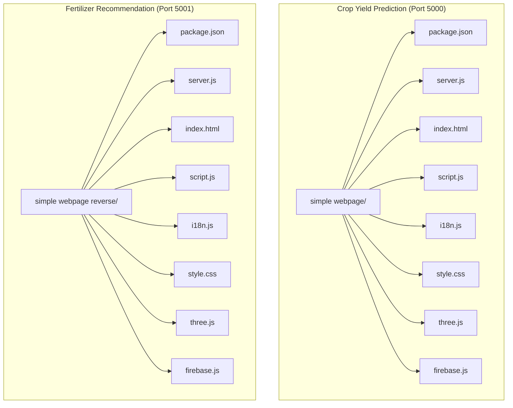

# Getting Started

<cite>
**Referenced Files in This Document**
- [package.json](file://simple webpage/package.json)
- [server.js](file://simple webpage/server.js)
- [index.html](file://simple webpage/index.html)
- [script.js](file://simple webpage/script.js)
- [i18n.js](file://simple webpage/i18n.js)
- [style.css](file://simple webpage/style.css)
- [three.js](file://simple webpage/three.js)
- [firebase.js](file://simple webpage/firebase.js)
- [package.json](file://simple webpage reverse/package.json)
- [server.js](file://simple webpage reverse/server.js)
- [index.html](file://simple webpage reverse/index.html)
- [script.js](file://simple webpage reverse/script.js)
- [i18n.js](file://simple webpage reverse/i18n.js)
- [style.css](file://simple webpage reverse/style.css)
- [three.js](file://simple webpage reverse/three.js)
- [firebase.js](file://simple webpage reverse/firebase.js)
</cite>

## Table of Contents
1. [Introduction](#introduction)
2. [Project Structure](#project-structure)
3. [Prerequisites](#prerequisites)
4. [Installation](#installation)
5. [Running the Applications](#running-the-applications)
6. [Basic Usage](#basic-usage)
7. [Environment Variables and Configuration](#environment-variables-and-configuration)
8. [Initial Setup Verification](#initial-setup-verification)
9. [Quick Start Examples](#quick-start-examples)
10. [Troubleshooting](#troubleshooting)
11. [Conclusion](#conclusion)

## Introduction
This guide helps you quickly set up and run the dual agricultural decision-support system consisting of:
- Crop Yield Prediction application (runs on port 5000)
- Fertilizer Recommendation application (runs on port 5001)

Both applications are built with modern web technologies and share similar frontend patterns (HTML, CSS, JavaScript modules, internationalization, and animated backgrounds). They communicate via local HTTP APIs and optionally persist data to MongoDB.

## Project Structure
The repository contains two independent application folders:
- simple webpage: Crop Yield Prediction application
- simple webpage reverse: Fertilizer Recommendation application

Each folder includes:
- Frontend assets: HTML, CSS, modular JavaScript, and 3D background scripts
- Backend server: Express server with CORS support and optional MongoDB integration
- Dependencies: Express, CORS, and Mongoose declared in package.json

**Diagram sources**
- [server.js:1-68](file://simple webpage/server.js#L1-L68)
- [server.js:1-65](file://simple webpage reverse/server.js#L1-L65)
- [index.html:1-116](file://simple webpage/index.html#L1-L116)
- [index.html:1-98](file://simple webpage reverse/index.html#L1-L98)
- [script.js:1-73](file://simple webpage/script.js#L1-L73)
- [script.js:1-64](file://simple webpage reverse/script.js#L1-L64)
- [i18n.js:1-122](file://simple webpage/i18n.js#L1-L122)
- [i18n.js:1-122](file://simple webpage reverse/i18n.js#L1-L122)
- [style.css:1-173](file://simple webpage/style.css#L1-L173)
- [style.css:1-194](file://simple webpage reverse/style.css#L1-L194)
- [three.js:1-107](file://simple webpage/three.js#L1-L107)
- [three.js:1-136](file://simple webpage reverse/three.js#L1-L136)
- [firebase.js:1-22](file://simple webpage/firebase.js#L1-L22)
- [firebase.js:1-22](file://simple webpage reverse/firebase.js#L1-L22)

**Section sources**
- [server.js:1-68](file://simple webpage/server.js#L1-L68)
- [server.js:1-65](file://simple webpage reverse/server.js#L1-L65)
- [index.html:1-116](file://simple webpage/index.html#L1-L116)
- [index.html:1-98](file://simple webpage reverse/index.html#L1-L98)

## Prerequisites
Before installing and running the applications, ensure you have:
- Node.js installed on your machine
- MongoDB installed and running locally on the default port (27017)
- A modern web browser to access the applications

Notes:
- The applications attempt to connect to MongoDB automatically. If MongoDB is unavailable, the apps continue to serve the frontend and accept API requests but will log a warning and skip persistence to the database.

**Section sources**
- [server.js:18-28](file://simple webpage/server.js#L18-L28)
- [server.js:18-28](file://simple webpage reverse/server.js#L18-L28)

## Installation
Follow these steps for each application:

1. Open a terminal in the application folder:
   - For Crop Yield Prediction: navigate to the simple webpage directory
   - For Fertilizer Recommendation: navigate to the simple webpage reverse directory

2. Install dependencies using npm:
   - Run the command to install all required packages declared in package.json

3. Verify installation:
   - Confirm that node_modules exists after installation
   - Confirm that package-lock.json is present

Key dependencies:
- Express: Web framework for serving static files and handling API routes
- CORS: Enables cross-origin requests for local development
- Mongoose: MongoDB ODM for optional persistence

**Section sources**
- [package.json:1-15](file://simple webpage/package.json#L1-L15)
- [package.json:1-19](file://simple webpage reverse/package.json#L1-L19)

## Running the Applications
Start both applications on different ports:

- Crop Yield Prediction (Port 5000):
  - From the simple webpage directory, run the start script defined in package.json

- Fertilizer Recommendation (Port 5001):
  - From the simple webpage reverse directory, run the start script defined in package.json

Ports:
- The Crop Yield Prediction server listens on port 5000
- The Fertilizer Recommendation server listens on port 5001

Optional MongoDB:
- Both servers attempt to connect to mongodb://127.0.0.1:27017/crop_yield
- If MongoDB is not available, the servers continue operating without persistence

**Section sources**
- [server.js:66-68](file://simple webpage/server.js#L66-L68)
- [server.js:63-65](file://simple webpage reverse/server.js#L63-L65)

## Basic Usage
Access each application in your browser:

- Crop Yield Prediction:
  - Open http://localhost:5000/
  - Fill in the form fields (Crop Type, Soil Type, N, P, K, Location)
  - Submit to receive a predicted yield value
  - Use the link to navigate to the Fertilizer Recommendation app

- Fertilizer Recommendation:
  - Open http://localhost:5001/
  - Fill in Location, Crop Type, Soil Type, and Crop Yield
  - Submit to receive recommended NPK values
  - Use the link to navigate back to the Crop Yield Prediction app

Note:
- The frontend scripts send requests to the respective backend endpoints:
  - http://localhost:5000/predict for yield prediction
  - http://localhost:5001/fertilizer for fertilizer recommendation

**Section sources**
- [index.html:93-95](file://simple webpage/index.html#L93-L95)
- [index.html:75-77](file://simple webpage reverse/index.html#L75-L77)
- [script.js:36-42](file://simple webpage/script.js#L36-L42)
- [script.js:28-34](file://simple webpage reverse/script.js#L28-L34)

## Environment Variables and Configuration
Configuration options:

- MongoDB connection:
  - Connection string: mongodb://127.0.0.1:27017/crop_yield
  - Database name: crop_yield
  - Collections:
    - Prediction (created when MongoDB is available in the Crop Yield app)
    - Fertilizer (created when MongoDB is available in the Fertilizer app)

- Ports:
  - Crop Yield Prediction: 5000
  - Fertilizer Recommendation: 5001

- Internationalization:
  - Language selector supports English and Hindi
  - Translations are applied dynamically on DOM elements marked with data-i18n attributes

- Static asset serving:
  - Both servers serve static files from their respective directories

- CORS:
  - Enabled for development convenience

- Firebase:
  - Firebase configuration is included in firebase.js for both apps
  - The apps import and initialize Firebase; however, the current server.js does not use the Firebase database in these repositories

**Section sources**
- [server.js:22-42](file://simple webpage/server.js#L22-L42)
- [server.js:22-39](file://simple webpage reverse/server.js#L22-L39)
- [i18n.js:1-122](file://simple webpage/i18n.js#L1-L122)
- [i18n.js:1-122](file://simple webpage reverse/i18n.js#L1-L122)
- [firebase.js:1-22](file://simple webpage/firebase.js#L1-L22)
- [firebase.js:1-22](file://simple webpage reverse/firebase.js#L1-L22)

## Initial Setup Verification
After starting both servers:

- Confirm server logs:
  - Crop Yield server prints a message indicating it is running on port 5000
  - Fertilizer server prints a message indicating it is running on port 5001

- Test API endpoints:
  - Yield Prediction endpoint: POST http://localhost:5000/predict with a JSON payload containing N, P, K, and other fields
  - Fertilizer endpoint: POST http://localhost:5001/fertilizer with a JSON payload containing Crop_Type, Soil_Type, and Crop_Yield

- Optional MongoDB verification:
  - If MongoDB is running, confirm collections are created on demand
  - If MongoDB is not available, verify that the apps still respond to requests and log warnings about persistence

- Browser checks:
  - Load http://localhost:5000/ and http://localhost:5001/
  - Ensure forms render correctly and language switching works

**Section sources**
- [server.js:66-68](file://simple webpage/server.js#L66-L68)
- [server.js:63-65](file://simple webpage reverse/server.js#L63-L65)
- [script.js:36-42](file://simple webpage/script.js#L36-L42)
- [script.js:28-34](file://simple webpage reverse/script.js#L28-L34)

## Quick Start Examples
Below are practical examples for both applications:

- Crop Yield Prediction:
  - Open http://localhost:5000/
  - Enter values for Crop Type, Soil Type, N, P, K, and Location
  - Click Predict Yield
  - View the predicted yield result
  - Navigate to Fertilizer Recommendation using the provided link

- Fertilizer Recommendation:
  - Open http://localhost:5001/
  - Enter Location, Crop Type, Soil Type, and Crop Yield
  - Click Get Recommendation
  - View the recommended NPK values
  - Navigate back to Crop Yield Prediction using the provided link

These examples demonstrate end-to-end usage of the dual system.

**Section sources**
- [index.html:93-95](file://simple webpage/index.html#L93-L95)
- [index.html:75-77](file://simple webpage reverse/index.html#L75-L77)
- [script.js:13-73](file://simple webpage/script.js#L13-L73)
- [script.js:12-64](file://simple webpage reverse/script.js#L12-L64)

## Troubleshooting
Common issues and resolutions:

- MongoDB not available:
  - Symptom: Warning logs about MongoDB not being available; requests succeed but data is not persisted
  - Resolution: Ensure MongoDB is installed and running on the default port (27017). Alternatively, continue using the apps without persistence

- Port conflicts:
  - Symptom: Cannot start a server because the port is already in use
  - Resolution: Stop the conflicting process or adjust the port in the server.js file for either application

- CORS errors in browser:
  - Symptom: Fetch requests fail due to CORS policy
  - Resolution: CORS is enabled in both servers; ensure requests originate from the same host/port during local development

- Frontend not loading assets:
  - Symptom: Styles or scripts appear missing
  - Resolution: Verify static file serving is enabled and that the server runs from the correct directory

- Internationalization not applying:
  - Symptom: Text remains in default language
  - Resolution: Ensure the language selector triggers the i18n initialization and that elements have proper data-i18n attributes

- Firebase configuration concerns:
  - Symptom: Firebase-related errors
  - Resolution: The firebase.js files are present and initialized; however, the current server.js does not use Firebase. If you intend to integrate Firebase, update the server logic accordingly

**Section sources**
- [server.js:18-28](file://simple webpage/server.js#L18-L28)
- [server.js:18-28](file://simple webpage reverse/server.js#L18-L28)
- [i18n.js:103-122](file://simple webpage/i18n.js#L103-L122)
- [i18n.js:103-122](file://simple webpage reverse/i18n.js#L103-L122)
- [firebase.js:1-22](file://simple webpage/firebase.js#L1-L22)
- [firebase.js:1-22](file://simple webpage reverse/firebase.js#L1-L22)

## Conclusion
You now have the dual agricultural decision-support system running locally:
- Crop Yield Prediction on port 5000
- Fertilizer Recommendation on port 5001

Both applications are ready for use, with optional MongoDB persistence and a responsive, multilingual frontend. For further customization, adjust the server.js configurations, extend the API endpoints, or integrate additional features such as Firebase as needed.