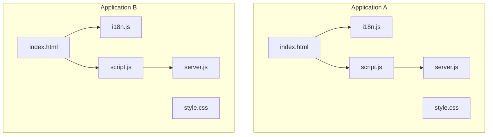
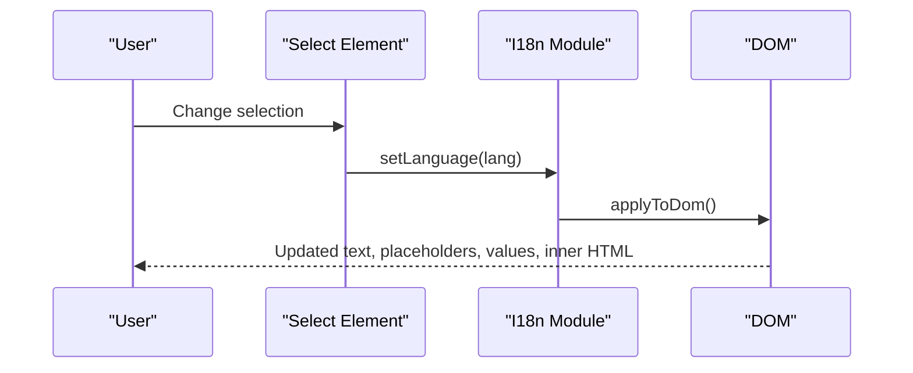
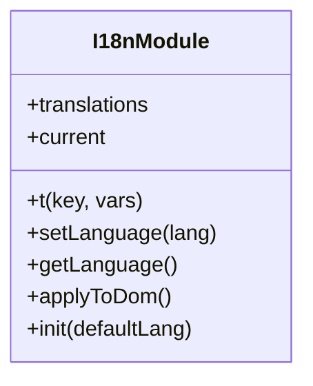
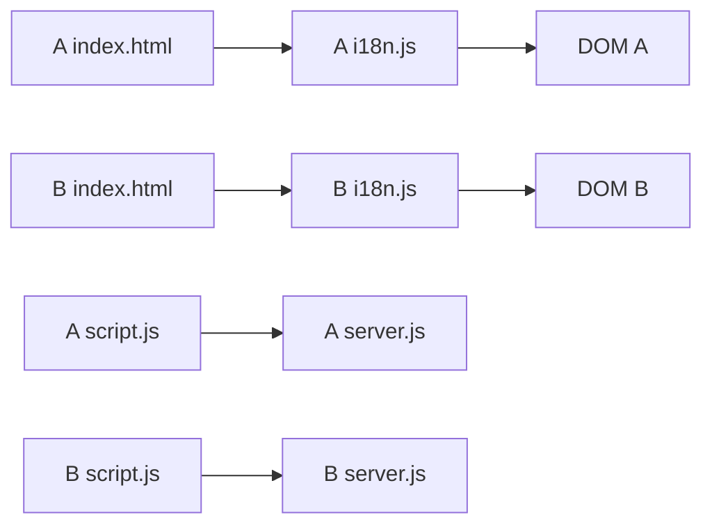

# Internationalization System

<cite>
**Referenced Files in This Document**
- [i18n.js](file://simple webpage/i18n.js)
- [index.html](file://simple webpage/index.html)
- [script.js](file://simple webpage/script.js)
- [style.css](file://simple webpage/style.css)
- [server.js](file://simple webpage/server.js)
- [i18n.js](file://simple webpage reverse/i18n.js)
- [index.html](file://simple webpage reverse/index.html)
- [script.js](file://simple webpage reverse/script.js)
- [style.css](file://simple webpage reverse/style.css)
- [server.js](file://simple webpage reverse/server.js)
</cite>

## Table of Contents
1. [Introduction](#introduction)
2. [Project Structure](#project-structure)
3. [Core Components](#core-components)
4. [Architecture Overview](#architecture-overview)
5. [Detailed Component Analysis](#detailed-component-analysis)
6. [Dependency Analysis](#dependency-analysis)
7. [Performance Considerations](#performance-considerations)
8. [Troubleshooting Guide](#troubleshooting-guide)
9. [Conclusion](#conclusion)
10. [Appendices](#appendices)

## Introduction
This document explains the multi-language support system implemented across two web applications. It covers the I18nSystem design, translation file structure, dynamic DOM updates, language switching, and how interface text, placeholders, values, and HTML content are localized. It also documents best practices for adding new languages, managing translation keys, and ensuring consistency across both applications.

## Project Structure
Each application consists of:
- An HTML page with translatable attributes on elements
- A shared internationalization module that manages translations and DOM updates
- A client script that handles form submission and runtime UI feedback
- A static server for local development
- Shared stylesheets for consistent presentation

**Diagram sources**
- [index.html](file://simple webpage/index.html)
- [i18n.js](file://simple webpage/i18n.js)
- [script.js](file://simple webpage/script.js)
- [server.js](file://simple webpage/server.js)
- [index.html](file://simple webpage reverse/index.html)
- [i18n.js](file://simple webpage reverse/i18n.js)
- [script.js](file://simple webpage reverse/script.js)
- [server.js](file://simple webpage reverse/server.js)

**Section sources**
- [index.html](file://simple webpage/index.html)
- [i18n.js](file://simple webpage/i18n.js)
- [script.js](file://simple webpage/script.js)
- [style.css](file://simple webpage/style.css)
- [server.js](file://simple webpage/server.js)
- [index.html](file://simple webpage reverse/index.html)
- [i18n.js](file://simple webpage reverse/i18n.js)
- [script.js](file://simple webpage reverse/script.js)
- [style.css](file://simple webpage reverse/style.css)
- [server.js](file://simple webpage reverse/server.js)

## Core Components
- Translation registry: centralized storage of language-specific strings keyed by semantic keys
- Translator function: resolves a key to the current language’s string, with fallback to English and variable interpolation
- DOM updater: scans the page for elements with data-i18n attributes and updates text, placeholders, values, and inner HTML
- Initialization routine: sets the default language, applies translations on load, and wires up the language selector

Key responsibilities:
- Provide a single source of truth for all translatable strings
- Allow seamless language switching without reloading the page
- Support placeholders, values, and inner HTML localization
- Maintain backward compatibility via fallback resolution

**Section sources**
- [i18n.js](file://simple webpage/i18n.js)
- [i18n.js](file://simple webpage reverse/i18n.js)

## Architecture Overview
The internationalization pipeline connects user actions (language selection) to DOM updates and runtime messages.

**Diagram sources**
- [i18n.js](file://simple webpage/i18n.js)
- [i18n.js](file://simple webpage reverse/i18n.js)
- [index.html](file://simple webpage/index.html)
- [index.html](file://simple webpage reverse/index.html)

## Detailed Component Analysis

### I18nSystem Implementation
The I18nSystem is implemented as a reusable ES module exporting:
- A translations registry per application
- A translator function resolving keys to localized strings
- A language setter that triggers DOM updates
- A DOM updater supporting multiple attribute targets
- An initialization routine binding the language selector

Behavior highlights:
- Translation lookup order: current language → English fallback → key unchanged
- Variable interpolation supports dynamic values inside translations
- DOM update targets:
  - data-i18n: textContent
  - data-i18n-placeholder: placeholder
  - data-i18n-value: value
  - data-i18n-html: innerHTML
- Language selector synchronization

**Diagram sources**
- [i18n.js](file://simple webpage/i18n.js)
- [i18n.js](file://simple webpage reverse/i18n.js)

**Section sources**
- [i18n.js](file://simple webpage/i18n.js)
- [i18n.js](file://simple webpage reverse/i18n.js)

### Translation File Structure
Each application defines a translations object containing:
- Keys representing UI semantics (e.g., form labels, buttons, status messages)
- Values for supported languages (e.g., English and Hindi)

Examples of keys include:
- Titles and headings
- Form field labels and placeholders
- Buttons and links
- Status messages and error indicators

Best practices:
- Use descriptive keys that convey meaning outside of any language
- Keep keys stable across releases to avoid breaking existing references
- Avoid embedding variables directly in translation strings; use placeholders and pass values via the translator function

**Section sources**
- [i18n.js](file://simple webpage/i18n.js)
- [i18n.js](file://simple webpage reverse/i18n.js)

### Dynamic Content Loading Mechanisms
Dynamic content (e.g., API responses) is not managed by the I18nSystem. Instead, the client scripts:
- Prepare payloads from form inputs
- Fetch results from backend servers
- Render results into the DOM

Localization of dynamic content should be handled by:
- Returning localized strings from backend APIs
- Using the translator function to render localized messages alongside dynamic content

**Section sources**
- [script.js](file://simple webpage/script.js)
- [script.js](file://simple webpage reverse/script.js)
- [server.js](file://simple webpage/server.js)
- [server.js](file://simple webpage reverse/server.js)

### Language Switching Functionality
Language switching is achieved by:
- Updating the current language in the I18n module
- Triggering a DOM refresh to apply new translations
- Synchronizing the language selector value

Integration points:
- HTML select element with options for available languages
- Event listener on the select element invoking the language setter

**Section sources**
- [i18n.js](file://simple webpage/i18n.js)
- [index.html](file://simple webpage/index.html)
- [i18n.js](file://simple webpage reverse/i18n.js)
- [index.html](file://simple webpage reverse/index.html)

### DOM Manipulation Techniques
The DOM updater targets four attribute types:
- data-i18n: updates visible text
- data-i18n-placeholder: updates input placeholders
- data-i18n-value: updates input values
- data-i18n-html: updates inner HTML

These attributes are placed on elements whose content should be localized. The updater runs during initialization and after language changes.

**Section sources**
- [i18n.js](file://simple webpage/i18n.js)
- [i18n.js](file://simple webpage reverse/i18n.js)

### Contextual Translation Handling
Contextual translations are supported via:
- Semantic keys that describe intended meaning
- Optional variable interpolation in translation strings
- Consistent key naming to avoid ambiguity across contexts

Recommendations:
- Prefer keys that describe intent and context (e.g., “status_default”, “processing”)
- Use placeholders for values that vary by context (e.g., predicted yield)

**Section sources**
- [i18n.js](file://simple webpage/i18n.js)
- [i18n.js](file://simple webpage reverse/i18n.js)

### Form Field Translations
Form fields are localized using:
- Labels with data-i18n
- Placeholders with data-i18n-placeholder
- Buttons with data-i18n

This ensures that labels, hints, and actions adapt to the selected language.

**Section sources**
- [index.html](file://simple webpage/index.html)
- [index.html](file://simple webpage reverse/index.html)
- [i18n.js](file://simple webpage/i18n.js)
- [i18n.js](file://simple webpage reverse/i18n.js)

### Error Message Localization
Error messages are stored as translation keys and rendered via the DOM updater. For dynamic errors (e.g., network failures), the client scripts:
- Catch exceptions
- Set status/result areas to localized messages
- Optionally augment with backend-provided details

**Section sources**
- [script.js](file://simple webpage/script.js)
- [script.js](file://simple webpage reverse/script.js)
- [i18n.js](file://simple webpage/i18n.js)
- [i18n.js](file://simple webpage reverse/i18n.js)

### Menu Item Internationalization
Menu items are represented by anchor elements and buttons with data-i18n attributes. Links to other applications are also localized.

**Section sources**
- [index.html](file://simple webpage/index.html)
- [index.html](file://simple webpage reverse/index.html)
- [i18n.js](file://simple webpage/i18n.js)
- [i18n.js](file://simple webpage reverse/i18n.js)

### Adding New Languages
Steps to add a new language:
1. Extend the translations registry with a new language branch
2. Populate translation values for all existing keys
3. Add an option in the language selector
4. Verify DOM updates apply correctly after switching

Guidelines:
- Mirror all keys across languages
- Keep keys consistent across both applications
- Test placeholders and values for correctness

**Section sources**
- [i18n.js](file://simple webpage/i18n.js)
- [index.html](file://simple webpage/index.html)
- [i18n.js](file://simple webpage reverse/i18n.js)
- [index.html](file://simple webpage reverse/index.html)

### Managing Translation Keys
Best practices:
- Use short, descriptive keys that reflect UI semantics
- Avoid hardcoding strings in JavaScript; always reference translation keys
- Centralize keys to minimize duplication and improve maintainability
- Review keys periodically to remove unused entries

**Section sources**
- [i18n.js](file://simple webpage/i18n.js)
- [i18n.js](file://simple webpage reverse/i18n.js)

### Implementing Context-Aware Translations
Approach:
- Use semantic keys to represent intended meaning
- Employ variable interpolation for values that change by context
- Keep related keys grouped conceptually (e.g., status, processing, errors)

**Section sources**
- [i18n.js](file://simple webpage/i18n.js)
- [i18n.js](file://simple webpage reverse/i18n.js)

### Relationship Between Language Selection and User Preferences
- The language selector reflects and controls the current language
- On initialization, the selector is synchronized with the active language
- No persistent preference persistence is implemented in the current code; future enhancements could persist the choice in storage

**Section sources**
- [i18n.js](file://simple webpage/i18n.js)
- [index.html](file://simple webpage/index.html)
- [i18n.js](file://simple webpage reverse/i18n.js)
- [index.html](file://simple webpage reverse/index.html)

### Browser Language Detection and Fallback Mechanisms
- The system does not implement automatic browser language detection
- Initialization accepts a default language parameter
- Fallback mechanism: current language → English → key unchanged

Recommendations:
- Detect browser language and pass it to initialization
- Provide a robust English fallback for all keys

**Section sources**
- [i18n.js](file://simple webpage/i18n.js)
- [i18n.js](file://simple webpage reverse/i18n.js)

### Extending the System for Additional Languages
- Add new branches to the translations registry
- Expand the language selector options
- Ensure all pages and components use data-i18n attributes consistently
- Maintain parity of keys across applications

**Section sources**
- [i18n.js](file://simple webpage/i18n.js)
- [index.html](file://simple webpage/index.html)
- [i18n.js](file://simple webpage reverse/i18n.js)
- [index.html](file://simple webpage reverse/index.html)

## Dependency Analysis
The applications share identical internationalization logic across both directories. The dependency graph shows how HTML, i18n, and scripts interact.

**Diagram sources**
- [index.html](file://simple webpage/index.html)
- [i18n.js](file://simple webpage/i18n.js)
- [script.js](file://simple webpage/script.js)
- [server.js](file://simple webpage/server.js)
- [index.html](file://simple webpage reverse/index.html)
- [i18n.js](file://simple webpage reverse/i18n.js)
- [script.js](file://simple webpage reverse/script.js)
- [server.js](file://simple webpage reverse/server.js)

**Section sources**
- [index.html](file://simple webpage/index.html)
- [i18n.js](file://simple webpage/i18n.js)
- [script.js](file://simple webpage/script.js)
- [server.js](file://simple webpage/server.js)
- [index.html](file://simple webpage reverse/index.html)
- [i18n.js](file://simple webpage reverse/i18n.js)
- [script.js](file://simple webpage reverse/script.js)
- [server.js](file://simple webpage reverse/server.js)

## Performance Considerations
- DOM queries for applying translations occur on initialization and on language changes; keep the number of elements with data-i18n attributes reasonable
- Avoid excessive reflows by batching DOM updates (already handled by a single applyToDom pass)
- Minimize translation string sizes to reduce memory footprint
- Consider lazy-loading translation bundles if the number of languages grows substantially

## Troubleshooting Guide
Common issues and resolutions:
- Missing translations: If a key is absent, the key itself is returned; verify the key exists in all languages
- Selector not updating: Ensure the language selector element exists and is bound to the language setter
- Placeholder/value not changing: Confirm the element uses the correct data-i18n-* attribute
- Dynamic content not localized: Localize dynamic content by returning localized strings from the backend or by rendering localized messages alongside dynamic content

**Section sources**
- [i18n.js](file://simple webpage/i18n.js)
- [i18n.js](file://simple webpage reverse/i18n.js)
- [script.js](file://simple webpage/script.js)
- [script.js](file://simple webpage reverse/script.js)

## Conclusion
The internationalization system provides a clean, modular approach to multi-language support. By centralizing translations, using semantic keys, and leveraging DOM attributes, the system enables easy maintenance and extension. Future enhancements can include browser language detection, persisted user preferences, and automated translation validation.

## Appendices

### Best Practices Checklist
- Use semantic keys and avoid hardcoded strings
- Keep translations synchronized across applications
- Test all data-i18n-* attributes after adding new languages
- Provide English fallback for all keys
- Avoid embedding variables directly in translation strings

### Example Key Categories
- Titles and headings
- Form labels and placeholders
- Buttons and links
- Status messages and error indicators
- Dynamic content messages