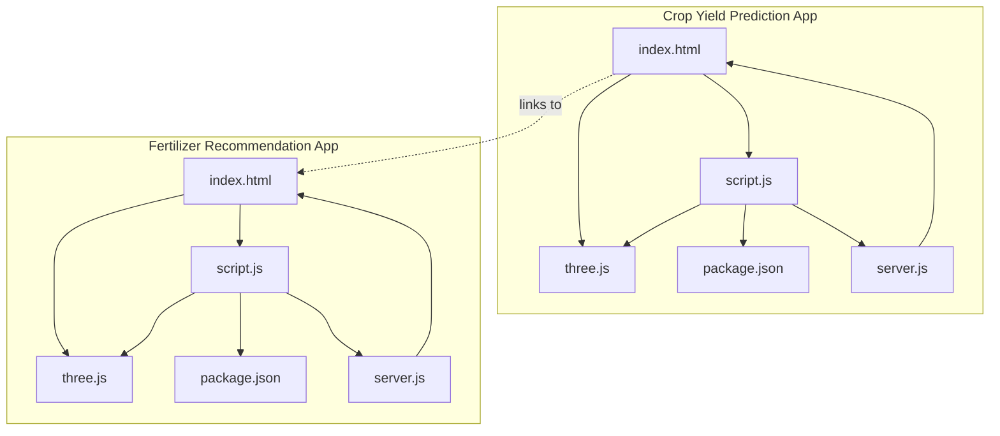
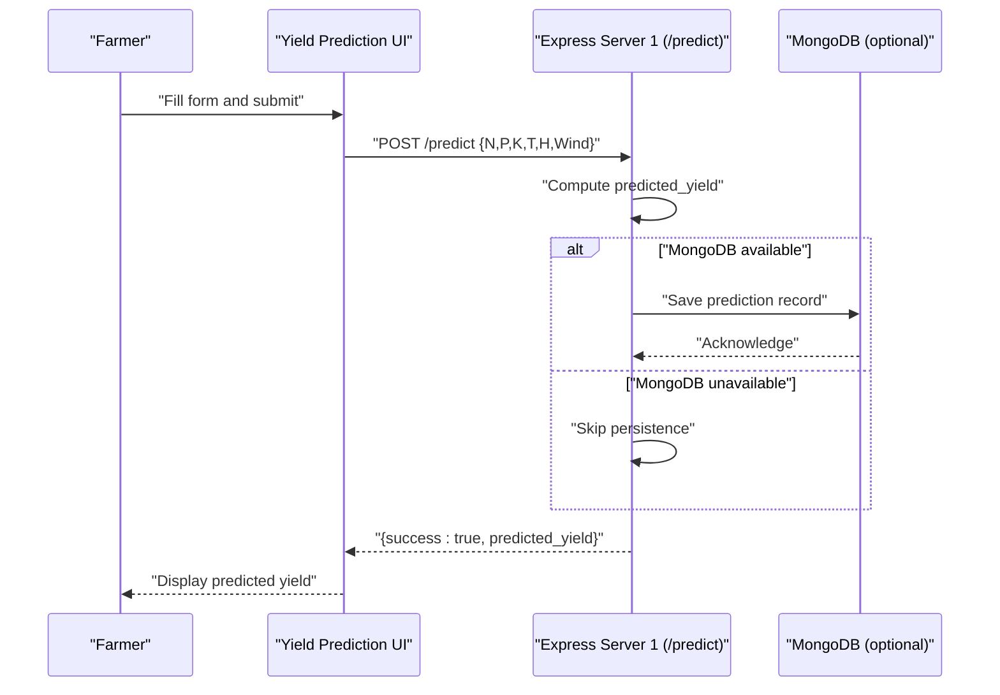
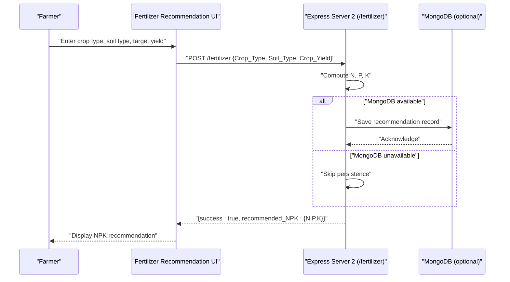
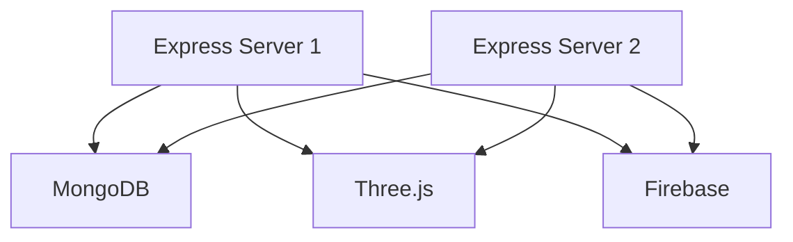
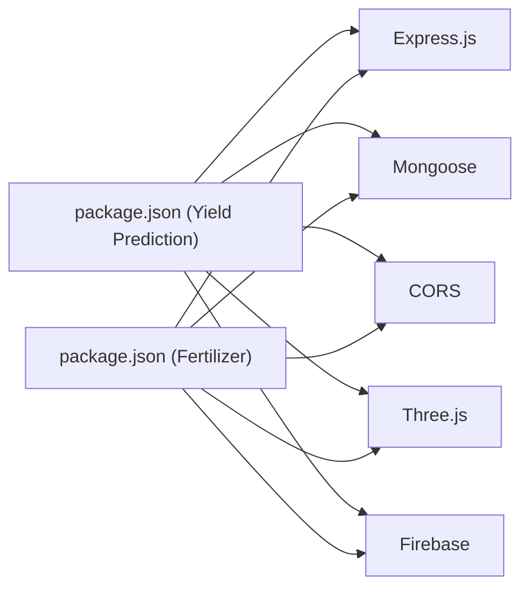

# Project Overview

<cite>
**Referenced Files in This Document**
- [server.js](file://simple webpage/server.js)
- [server.js](file://simple webpage reverse/server.js)
- [package.json](file://simple webpage/package.json)
- [package.json](file://simple webpage reverse/package.json)
- [index.html](file://simple webpage/index.html)
- [script.js](file://simple webpage/script.js)
- [i18n.js](file://simple webpage/i18n.js)
- [three.js](file://simple webpage/three.js)
- [firebase.js](file://simple webpage/firebase.js)
</cite>

## Table of Contents
1. [Introduction](#introduction)
2. [Project Structure](#project-structure)
3. [Core Components](#core-components)
4. [Architecture Overview](#architecture-overview)
5. [Detailed Component Analysis](#detailed-component-analysis)
6. [Dependency Analysis](#dependency-analysis)
7. [Performance Considerations](#performance-considerations)
8. [Troubleshooting Guide](#troubleshooting-guide)
9. [Conclusion](#conclusion)
10. [Appendices](#appendices)

## Introduction
This project delivers a dual agricultural decision-support system designed to empower farmers with actionable insights. It consists of two independent web applications:
- Crop Yield Prediction application: estimates crop yield (kg/ha) based on inputs such as crop type, soil type, macronutrients (N, P, K), and weather conditions.
- Fertilizer Recommendation application: computes recommended NPK doses tailored to a given target yield.

Both applications share a common technology stack and provide complementary value:
- Crop Yield Prediction helps farmers plan production expectations and resource allocation.
- Fertilizer Recommendation supports precision agriculture by guiding optimal nutrient application.

The system emphasizes simplicity, offline-friendly operation (MongoDB optional), and a responsive user interface with multilingual support and an immersive background visualization.

## Project Structure
The repository contains two identical application setups under separate directories:
- simple webpage: Hosts the Crop Yield Prediction application.
- simple webpage reverse: Hosts the Fertilizer Recommendation application.

Each application includes:
- A static HTML page with forms and UI elements.
- Client-side JavaScript for form handling, API communication, internationalization, and background rendering.
- A Node.js/Express server exposing REST endpoints for predictions and recommendations.
- Optional MongoDB persistence via Mongoose.
- Firebase client initialization for potential real-time data integration.



**Diagram sources**
- [index.html:1-116](file://simple webpage/index.html#L1-L116)
- [script.js:1-73](file://simple webpage/script.js#L1-L73)
- [three.js:1-107](file://simple webpage/three.js#L1-L107)
- [package.json:1-15](file://simple webpage/package.json#L1-L15)
- [server.js:1-68](file://simple webpage/server.js#L1-L68)
- [index.html:1-116](file://simple webpage reverse/index.html#L1-L116)
- [script.js:1-73](file://simple webpage reverse/script.js#L1-L73)
- [three.js:1-107](file://simple webpage reverse/three.js#L1-L107)
- [package.json:1-19](file://simple webpage reverse/package.json#L1-L19)
- [server.js:1-65](file://simple webpage reverse/server.js#L1-L65)

**Section sources**
- [index.html:1-116](file://simple webpage/index.html#L1-L116)
- [server.js:1-68](file://simple webpage/server.js#L1-L68)
- [package.json:1-15](file://simple webpage/package.json#L1-L15)
- [index.html:1-116](file://simple webpage reverse/index.html#L1-L116)
- [server.js:1-65](file://simple webpage reverse/server.js#L1-L65)
- [package.json:1-19](file://simple webpage reverse/package.json#L1-L19)

## Core Components
- Crop Yield Prediction Application
  - Purpose: Accepts crop type, soil type, N, P, K, and weather parameters; returns predicted yield (kg/ha).
  - Endpoint: POST /predict
  - Persistence: Optional MongoDB model for storing prediction requests and results.
- Fertilizer Recommendation Application
  - Purpose: Accepts crop type, soil type, and target crop yield; returns recommended NPK doses.
  - Endpoint: POST /fertilizer
  - Persistence: Optional MongoDB model for storing fertilizer recommendation requests and results.
- Shared Technologies
  - Frontend: HTML, CSS, vanilla JavaScript modules, internationalization, and Three.js background.
  - Backend: Express.js, CORS, Mongoose (optional), and static file serving.
  - Optional Real-time: Firebase client initialization included for future integration.

Practical examples:
- A farmer inputs crop type, soil type, measured N/P/K, and selects a city to fetch weather defaults. The system predicts yield and displays it prominently.
- After reviewing the predicted yield, the farmer clicks a link to compute fertilizer recommendations for that yield, receiving NPK doses tailored to maximize productivity while minimizing waste.

**Section sources**
- [server.js:44-64](file://simple webpage/server.js#L44-L64)
- [server.js:41-61](file://simple webpage reverse/server.js#L41-L61)
- [index.html:35-95](file://simple webpage/index.html#L35-L95)
- [script.js:13-73](file://simple webpage/script.js#L13-L73)
- [i18n.js:1-122](file://simple webpage/i18n.js#L1-L122)
- [three.js:1-107](file://simple webpage/three.js#L1-L107)
- [firebase.js:1-22](file://simple webpage/firebase.js#L1-L22)

## Architecture Overview
The system comprises two independent Express servers, each hosting a dedicated frontend. They communicate with optional MongoDB for persistence and share common client-side libraries for UI and visualization.

```mermaid
graph TB
subgraph "Client Layer"
U1["User Browser<br/>Crop Yield Prediction UI"]
U2["User Browser<br/>Fertilizer Recommendation UI"]
end
subgraph "Backend Layer"
S1["Express Server 1<br/>Port 5000<br/>/predict"]
S2["Express Server 2<br/>Port 5001<br/>/fertilizer"]
end
subgraph "Data Layer"
M["MongoDB (Optional)<br/>Collections: Predictions, Fertilizer"]
end
U1 --> |HTTP POST /predict| S1
U2 --> |HTTP POST /fertilizer| S2
S1 --> |Persist (optional)| M
S2 --> |Persist (optional)| M
```

**Diagram sources**
- [server.js:1-68](file://simple webpage/server.js#L1-L68)
- [server.js:1-65](file://simple webpage reverse/server.js#L1-L65)

## Detailed Component Analysis

### Crop Yield Prediction Application
- Frontend
  - HTML form collects crop type, soil type, N, P, K, and location. It submits to the backend and displays results with status and loader feedback.
  - Internationalization module translates UI elements dynamically.
  - Three.js creates an animated background with floating crop-like elements.
- Backend
  - Express server exposes POST /predict endpoint.
  - Computes predicted yield using a weighted combination of inputs.
  - Optionally persists the request and result to MongoDB.
- Technology Stack
  - Frontend: HTML, CSS, vanilla JavaScript modules, Three.js, i18n.
  - Backend: Express.js, CORS, Mongoose (optional), static file serving.



**Diagram sources**
- [script.js:13-73](file://simple webpage/script.js#L13-L73)
- [server.js:44-64](file://simple webpage/server.js#L44-L64)

**Section sources**
- [index.html:35-95](file://simple webpage/index.html#L35-L95)
- [script.js:1-73](file://simple webpage/script.js#L1-L73)
- [i18n.js:1-122](file://simple webpage/i18n.js#L1-L122)
- [three.js:1-107](file://simple webpage/three.js#L1-L107)
- [server.js:18-42](file://simple webpage/server.js#L18-L42)
- [server.js:44-64](file://simple webpage/server.js#L44-L64)

### Fertilizer Recommendation Application
- Frontend
  - HTML form collects crop type, soil type, and target crop yield. It submits to the backend and displays recommended NPK doses.
  - Links back to the Crop Yield Prediction application for seamless navigation.
- Backend
  - Express server exposes POST /fertilizer endpoint.
  - Computes N, P, K based on the target yield using simple scaling factors.
  - Optionally persists the request and result to MongoDB.
- Technology Stack
  - Frontend: HTML, CSS, vanilla JavaScript modules, Three.js, i18n.
  - Backend: Express.js, CORS, Mongoose (optional), static file serving.



**Diagram sources**
- [script.js:1-73](file://simple webpage reverse/script.js#L1-L73)
- [server.js:41-61](file://simple webpage reverse/server.js#L41-L61)

**Section sources**
- [index.html:1-116](file://simple webpage reverse/index.html#L1-L116)
- [script.js:1-73](file://simple webpage reverse/script.js#L1-L73)
- [server.js:18-39](file://simple webpage reverse/server.js#L18-L39)
- [server.js:41-61](file://simple webpage reverse/server.js#L41-L61)

### Shared Technologies and Integration Points
- Express.js
  - Provides lightweight HTTP servers for both applications.
  - Enables CORS and JSON parsing for cross-origin requests.
- MongoDB and Mongoose
  - Optional persistence for prediction and recommendation records.
  - Graceful fallback when the database is unreachable.
- Three.js
  - Renders an animated, crop-themed background for both apps.
- Firebase
  - Firebase client initialization is present for potential real-time features (e.g., live updates, synchronized sessions).



**Diagram sources**
- [server.js:1-68](file://simple webpage/server.js#L1-L68)
- [server.js:1-65](file://simple webpage reverse/server.js#L1-L65)
- [three.js:1-107](file://simple webpage/three.js#L1-L107)
- [firebase.js:1-22](file://simple webpage/firebase.js#L1-L22)

**Section sources**
- [package.json:10-14](file://simple webpage/package.json#L10-L14)
- [package.json:14-18](file://simple webpage reverse/package.json#L14-L18)
- [server.js:18-28](file://simple webpage/server.js#L18-L28)
- [server.js:18-28](file://simple webpage reverse/server.js#L18-L28)
- [three.js:1-107](file://simple webpage/three.js#L1-L107)
- [firebase.js:1-22](file://simple webpage/firebase.js#L1-L22)

## Dependency Analysis
- Internal Coupling
  - Applications are decoupled: each runs on a separate port and serves distinct endpoints.
  - Cross-linking exists via the Crop Yield Prediction UI linking to the Fertilizer Recommendation app.
- External Dependencies
  - Express.js: Core HTTP server framework.
  - Mongoose: Optional ODM for MongoDB.
  - CORS: Enables browser-to-server communication.
  - Three.js: Client-side 3D visualization library.
  - Firebase: Client SDK initialization included for future integration.



**Diagram sources**
- [package.json:10-14](file://simple webpage/package.json#L10-L14)
- [package.json:14-18](file://simple webpage reverse/package.json#L14-L18)

**Section sources**
- [package.json:10-14](file://simple webpage/package.json#L10-L14)
- [package.json:14-18](file://simple webpage reverse/package.json#L14-L18)

## Performance Considerations
- Optional MongoDB
  - Both servers attempt to connect to MongoDB at startup. If unavailable, they continue operating without persistence, ensuring resilience.
- Lightweight Algorithms
  - Predictions and recommendations use simple arithmetic, minimizing computational overhead.
- Static Asset Serving
  - Express serves static assets efficiently; ensure production deployment uses appropriate caching headers.
- Client-Side Rendering
  - Three.js animations run in the browser; keep particle counts and animation rates balanced for smooth performance across devices.

[No sources needed since this section provides general guidance]

## Troubleshooting Guide
- MongoDB Not Running
  - Symptom: Warning logs indicating MongoDB not available; persistence skipped.
  - Action: Start MongoDB locally or remove the connection block to run fully offline.
- Port Conflicts
  - Symptom: Port 5000 or 5001 already in use.
  - Action: Change server ports in the respective server.js files or stop conflicting services.
- CORS Errors
  - Symptom: Browser blocks cross-origin requests.
  - Action: Confirm CORS middleware is enabled and origin matches the client domain.
- Firebase Initialization
  - Symptom: Real-time features not functioning.
  - Action: Verify Firebase configuration and ensure the client SDK is imported in the intended UI module.

**Section sources**
- [server.js:18-28](file://simple webpage/server.js#L18-L28)
- [server.js:18-28](file://simple webpage reverse/server.js#L18-L28)
- [server.js:66-68](file://simple webpage/server.js#L66-L68)
- [server.js:63-65](file://simple webpage reverse/server.js#L63-L65)
- [firebase.js:1-22](file://simple webpage/firebase.js#L1-L22)

## Conclusion
This dual agricultural decision-support system offers a practical, modular solution for farmers:
- Crop Yield Prediction enables informed planning by estimating yield outcomes.
- Fertilizer Recommendation supports precise nutrient management aligned with target yields.
- The architecture’s independence, optional persistence, and shared technologies make it easy to deploy, maintain, and extend.

[No sources needed since this section summarizes without analyzing specific files]

## Appendices
- Practical Example Scenarios
  - Scenario 1: A farmer inputs crop type, soil type, and measured N/P/K, selects a city, and receives a predicted yield. They then navigate to the fertilizer recommendation page to compute NPK doses for that yield.
  - Scenario 2: A farmer targets a specific yield, enters crop type, soil type, and the desired yield, and receives NPK recommendations. They can return to the prediction app to validate whether the target is achievable with their inputs.

[No sources needed since this section provides general guidance]